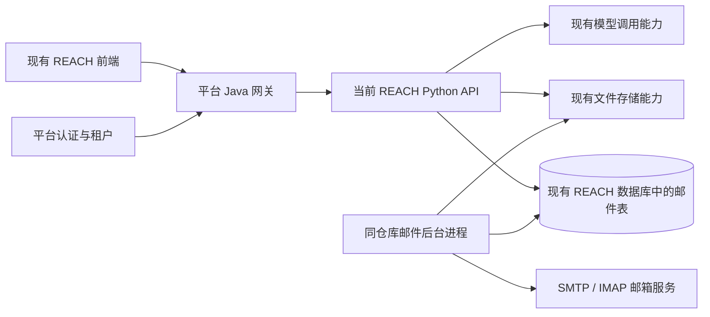

# REACH 邮件模块设计

日期：2026-09-16。状态：已按确认范围进入实施；代码与验证进展见 [实施记录](implementation.md)，真实收发及平台验收尚未完成。

本文整理本会话确认的产品要求、Sales 代码参考点及建议实现方案。标为“建议”的状态、表名、接口和技术细节需要在实施前评审；它们不是当前仓库已有能力。本文不代表已完成邮件收发或平台联调验收。

## 1. 目标与开发位置

在当前 REACH 项目增加邮件任务、发送记录和线索管理，将 Java Sales 已有的邮箱池、发送队列、收信和自动跟进能力迁为 Python 实现。邮件业务运行不依赖 Java Sales，但继续接入平台登录、租户、网关和适用的公共资源服务。邮件及邮件 AI 的平台计费延期讨论，不纳入本期范围。

| 职责 | 当前仓库 | 本轮范围 |
| --- | --- | --- |
| REACH 后端 | `/Users/liuhongli/Desktop/lingchen/project/ai-call` | 实现 Python 邮件业务及验证 |
| REACH 前端 | `/Users/liuhongli/Desktop/lingchen/project/lingchen-platform-web` | 实现 REACH 邮件产品页面及必要入口 |
| Java 参考代码 | `/Users/liuhongli/Desktop/lingchen/project/lingchen-platform` | 只读参考 Sales 邮件实现 |
| Sales Python 参考代码 | `/Users/liuhongli/Desktop/lingchen/project/lingchen-sales` | 只读参考内容生成、修改、翻译和版本恢复 |
| 本地启动编排 | `/Users/liuhongli/Desktop/lingchen/project/lingchen-release` | 延续现有启动方式，实施阶段核对实际服务映射 |

按用户最新决定，不使用 `~/.codex/worktrees/reach-email/` 下的前后端副本。用户已授权在当前前后端实施；保留仓库原有修改，不修改公共 Java，不推送远程。

## 2. 已确认的产品范围

| 项目 | 已确认规则 |
| --- | --- |
| 页面组织 | 合并创建入口与任务列表；不保留“新建任务”独立 tab；历史页面名称为“发送记录” |
| 创建任务 | 列表按钮打开弹窗；填写任务名称、上传名单、进入邮件设置 |
| 执行时间 | 创建时不选；点击任务的执行操作，再选择立即执行或定时执行 |
| 定时撤回 | 尚未开始的定时任务可撤回，之后可编辑名称、名单等内容 |
| 停止任务 | 支持取消尚未发送的内容及未来自动跟进；不能撤回已发邮件 |
| 任务状态与重跑 | 未启动、待执行、执行中、已结束；结束时区分正常完成、手动停止、任务级失败；第一版不重跑已执行结束的原任务，再次发送需新建任务 |
| 邮件设置 | 创建入口和列表入口复用同一个设置弹窗，允许两层弹窗 |
| 邮箱池 | 用户私有、租户隔离；按邮箱池分配发件邮箱，不在任务中选择单个发件邮箱 |
| 发送限额 | 每任务独立配置上限，同时遵守单邮箱限制；不增加用户级邮箱池总上限 |
| 自动跟进 | 复用首封正文和附件，关联首封邮件，保持同一发件邮箱 |
| 线索分类 | 初始进入“持续跟进”，支持人工划转；第一版不加入 AI 意向分类 |
| 低价值线索 | 人工移入低价值后仍可自动跟进，分类不等于停止发送 |
| AI 内容能力 | 包含生成、修改、中文审阅翻译、版本恢复 |
| 邮件模型配置 | 单独增加 DeepSeek 配置，用于中文审阅翻译和编辑邮件的“AI 一键生成”；API Key 由用户提供，不修改现有通话及其他模型配置 |
| 数据存储 | 与通话使用同一个 REACH 数据库，新建 `reach_email_*` 邮件表；不改变原通话业务表，邮件后台独立运行 |
| 数据保留 | 第一版不自动清理已保存的邮件业务数据、往来记录和关联附件，保留期限及清理策略后续确定；未被任务使用的临时上传仍按临时文件规则处理 |
| 暂不纳入 | 历史邮件/签名模板复用、跨任务模板库 |
| 延期讨论 | 邮件发送与邮件 AI 的平台计费；不作为本期开发、联调和验收前置条件 |

以下作为评审建议：三个 tab 使用“邮件任务 / 发送记录 / 线索管理”；不增加草稿、暂停和恢复概念；任务签名为任务私有内容。已确认的第一版功能不因实施分阶段而被移出范围。

## 3. 现有能力与迁移边界

### 3.1 代码核对结论

- Sales 前端位于统一前端仓库。邮箱授权、权重、触达设置、内容编辑与往来界面均有可参考实现。
- 邮箱授权、队列、收信、发送限额和自动跟进主要由 Java Sales 实现；公司介绍、内容生成/修改/翻译/恢复还涉及 Sales Python，经 Java 代理访问。
- 公共 `RemoteMailService` 的简单发信能力不等于完整的公共邮箱池服务。不能把 Sales 私有接口直接认作 REACH 可用接口。
- 共用 `TemplateEditor` 已有变量能力，Recov 启用变量；Sales 当前邮件编辑入口关闭变量功能。REACH 可复用编辑器，但仍需后端变量校验与替换。
- Java Sales 自动跟进复用正文，但当前不带附件。REACH 必须按本次确认规则改为携带首封附件，不能照搬该行为。
- Sales 邮件分类器处理退信、自动回复等规则，不等于 AI 意向分类。

### 3.2 迁移清单

| 能力 | 主要参考 | REACH 处理 |
| --- | --- | --- |
| 邮箱授权与连接测试 | `SalesEmailAccountServiceImpl`、`SmtpImapSalesEmailProvider` | Python SMTP/IMAP、加密凭据、账号可用状态 |
| 权重与资格筛选 | `SalesEmailPoolPolicy` | 保留权重和限额约束，首封选择邮箱，后续固定邮箱 |
| 发送与重试 | `SalesEmailDispatchWorker` | 持久队列、原子领取、失败分类、不确定结果核对 |
| MIME、附件与收件人处理 | `SalesEmailMimeSupport`、`SalesEmailAttachmentSupport` 等 | 使用标准库及现有附件存储，保持安全校验 |
| 收信与往来关联 | 账号同步、消息及 inbound 相关服务 | 增量同步、去重、首封/回复关联、租户和用户隔离 |
| 自动跟进 | `SalesEmailTouchWorker`、`SalesEmailTouchLifecycle` | 保留同步后判断、间隔和次数；补齐附件复用 |
| 跟进设置与人工分类 | `SalesEmailTouchService` | 改为任务级规则和发送上限，不迁移 Sales 用户级总上限；单邮箱限制独立保留 |
| AI 与内容版本 | Sales Python `app/contacts` | 复用工作流程，移除 Sales 企业/联系人/线索筛选依赖 |
| 内容编辑 | `TemplateEditor`、`OutreachSelectionPanel` | 复用组件与交互，替换为 REACH 数据和接口 |

不迁移 Sales 的真实邮箱密码、客户数据、历史邮件、公司画像和业务关联表。第一版通过 REACH 重新授权邮箱。不是按 Java 类逐一翻译，也不新增通用邮件微服务框架。

## 4. 运行结构

API 负责权限、设置、任务与查询；后台进程负责发送、收信、到期跟进和异步内容作业。阻塞 SMTP/IMAP 操作不能占用 API 事件循环。队列存放在现有 REACH 数据库的新邮件表中，复用现有数据库访问技术和后台进程管理方式，不引入新的队列产品。邮件后台独立运行，控制并发和数据库连接数量，减少对通话业务的影响；同库分表不等于资源完全隔离。

后台进程的入口和角色是待实现项；不能假设当前已存在邮件 worker 命令。复用本仓进程生命周期管理，但不得把邮件循环重复挂到每个 API 实例或通话 worker。

## 5. 页面与交互

### 5.1 创建任务

建议弹窗内容依次为任务名称、收件名单、邮件设置入口，底部“取消 / 创建任务”。创建只保存任务，不立即发送。

名单上传参照现有外呼任务：右上角下载模板，中央拖拽/选择文件；仅支持单个 `.xlsx` 文件，不超过 10 MB，不支持 CSV 上传；下载模板也提供真正的 XLSX 文件，不通过修改 CSV 扩展名生成。按用户提供的样例，模板列顺序为“客户姓名、邮箱、企业名称、职务、需求描述”；邮箱必填，其余四项按选填处理。需求描述随名单解析并保存，暂不提供变量插入按钮；手动使用对应变量时按名单列匹配规则校验。上传后展示文件名、有效条数、重复和错误条数，支持移除和重新上传。

名单校验与反馈规则已确认如下，后端是最终判断依据：

| 校验 | 前端职责 | 后端职责 |
| --- | --- | --- |
| 单个文件、扩展名、10 MB 上限 | 选择文件时立即提示 | 再次校验，防止绕过 |
| 真实格式、文件损坏、解压后大小、行数上限 | 展示错误信息 | 解析并校验；行数上限按实际负载确定后写入契约 |
| 必填列、邮箱格式、重复邮箱 | 展示校验报告，不维护第二套解析规则 | 统一校验，返回汇总、行号和原因 |
| 是否允许创建 | 根据结果控制按钮 | 提交时再次核对校验状态与名单归属 |

校验结果直接展示在创建弹窗的上传区域下方，不增加弹窗层级：

- 文件格式错误、超限或损坏：显示红色提示及重新上传入口。例如“文件无法读取，请使用下载的名单模板填写后重新上传”。
- 内容有错误：保留文件展示，显示“校验未通过”及总行数、有效、重复、错误数量；下方表格列出 Excel 行号、邮箱和问题。行号与原文件一致，包含表头；例如“第 12 行 / zhangsan@ / 邮箱格式不正确”。
- 明细较多时使用固定高度滚动区域，提供“下载校验报告”；报告包含错误和重复记录，重复记录注明保留行与被忽略行，便于核对客户姓名。
- 同一名单相同邮箱仅保留第一次出现的行。只有重复行时显示黄色“重复邮箱已去重”提示，可以创建；不得静默丢弃错误客户。
- 全部通过时显示绿色“校验通过，共导入 N 位收件人”。存在错误行或没有有效收件人时禁止创建，修正后重新上传。
- 重新上传保留任务名称和邮件设置；新文件校验完成前不能使用旧文件的通过结果创建任务。前端禁用按钮不替代后端校验。

汇总示例：“共 100 行：有效 95 行，重复 3 行，错误 2 行。重复邮箱将自动去重；请修正错误行后重新上传。”汇总行数指数据行，不包含表头；有效数量指去重后可导入的收件人数。

创建阶段不做历史邮件或签名复用，不嵌入完整正文编辑器。创建后通过任务操作编辑邮件和签名。没有正文或没有可用邮箱时仍可保存任务，但应显示“待完善”提示并阻止启动；这不是独立的草稿状态。

### 5.2 共用邮件设置弹窗

建议分为发件公司信息、自动跟进规则两组，沿用 Sales 的字段组织和帮助说明。

- 公司信息：名称、官网、简介；用于内容生成和发送上下文，按任务保存快照。
- 自动跟进：是否启用、跟进间隔、追加跟进次数。首封在任务启动后进入发送队列，不等待跟进间隔。
- 任务发送上限：在邮件设置中独立配置当前任务的 24 小时发送上限，不修改其他任务或单邮箱配置。
- 邮箱池：显示可用数量与账号授权入口；不放单邮箱选择框，也不设置或展示用户级邮箱池总额度。
- 单邮箱每小时/24 小时上限和发送间隔在账号授权中维护，同一邮箱被多个任务使用时共享这些限制。

邮箱池展示方式已确认：默认显示“可用邮箱 X / Y 个”，点击“查看邮箱”在当前区域展开列表，不增加弹窗。数量和状态均由后端计算，列表仅包含当前用户有权管理的邮箱。任务的限额及使用情况与邮箱池可用数量分开展示，不将单邮箱额度相加作为可承诺的邮箱池总额度。

| 列 | 展示内容 |
| --- | --- |
| 邮箱 | 邮箱地址 |
| 当前状态 | 可用，或具体不可用原因，例如已达发送上限、授权失效、连接失败、已停用、等待发送间隔 |
| 权重 | 当前配置值，只读展示 |

列表供查看，不提供邮箱勾选或行内权重编辑。“管理邮箱账号”复用底部 admin →“账号授权”的管理入口，统一维护账号、权重、启停及连接测试。进入管理时保留并暂时隐藏当前任务和设置表单，避免第三层弹窗；返回后恢复输入并刷新邮箱池摘要和列表。

未配置邮箱时显示“暂未配置发件邮箱，请先添加并完成连接测试”和“添加邮箱”入口；仍允许保存任务，但不能启动。任务额度尚有剩余不代表可以立即发送，仍受单邮箱限额和发送间隔约束。

信息区明确提示：“首封按邮箱权重从可用账号中分配；已有会话的跟进固定使用原发件邮箱，原邮箱暂不可用时等待处理，不自动换邮箱。”展示状态仅为查询时快照，实际发送前后端仍需重新检查账号资格和额度。

新建和编辑任务在同一弹窗内填写任务信息、收件名单和邮件设置，统一校验后创建或保存；任务详情以文字展示任务名称、公司信息和发送规则，官网可点击、简介保留换行，不展示禁用输入框、必填星号和字数统计，并支持查看邮箱池、下载名单。独立邮件设置弹窗的查看态采用相同展示方式，编辑态保留表单和校验规则。名单上传期间显示上传状态，不显示名单必填提示，并禁止提交。管理邮箱弹窗叠加时保留原表单输入；Esc 只关闭顶层，有未保存修改时提示。

新建、编辑、邮件设置与执行前检查共用公司资料和发送规则校验；公司官网须为包含完整域名的 `http://` 或 `https://` 地址，支持子域名、中文域名和路径，不接受单段主机名或 IP 地址；格式校验不代表网站可访问。后端对请求参数及历史任务数据的校验失败均返回具体中文字段原因，不回显输入内容或内部异常。发送服务状态查询失败时展示可诊断的错误类别并允许重试，查询失败与发送进程离线分别提示。

### 5.3 任务状态和操作

任务列表顺序为：任务名称、邮件设置、状态、收件人数、创建时间、定时执行时间、最近一次更新、邮件模板、邮件签名、操作。任务名称固定在左侧，邮件模板、邮件签名、操作固定在右侧。邮件设置在未启动、待执行、执行中可编辑，已结束只读；邮件模板和签名仅未启动时可编辑，撤回定时后恢复编辑。名称与名单在任务详情中修改。操作列按状态显示编辑任务/执行/删除、撤回、停止或无操作；未启动任务可直接通过“编辑任务”修改任务名称和收件名单。

已确认采用以下四个展示状态，结束时展示原因，第一版不重跑已执行结束的原任务。

| 展示状态 | 含义 | 主要操作 |
| --- | --- | --- |
| 未启动 | 已保存，未安排发送；可有待完善项 | 编辑名称/名单/邮件/签名/设置、启动、删除 |
| 待执行 | 已安排未来执行时间 | 修改邮件设置、查看、撤回定时 |
| 执行中 | 首封或后续跟进尚未结束 | 修改邮件设置、查看进度、停止任务 |
| 已结束 | 所有发送完成、主动停止或任务级失败 | 查看结果、结束原因 |

状态旁显示结束原因（正常完成、手动停止或任务级失败）和成功/失败数量，不为每种消息错误增加任务状态。单封失败不意味着整个任务失败。存在未来自动跟进时任务仍处于执行中；迟到回复仍接收并显示。

启动弹窗选择立即/定时执行，展示时区，后端保存 UTC。启动时校验名单、正文、变量、附件、可用邮箱及必要平台权限，冻结本次执行内容。

撤回与到期领取必须原子竞争；后台已领取启动则撤回失败并返回最新状态。撤回成功后重新开放编辑，再次启动使用新的执行版本。第一版不提供已执行结束后重新运行原任务，需要再次发送时新建任务，避免复用旧发送记录引发重复发送。尚未开始的定时任务撤回后修改、重新安排执行不属于重跑。

停止后不再领取未发消息，取消未来跟进；已进入 SMTP 发送的请求可能仍完成，界面应说明并持续核对结果。不能把在途消息直接标为“未发送”。保留有发送历史的任务，不提供连带删除历史记录的操作。

停止请求先读取加锁后的实际状态：后台已结束时，即使页面版本较旧也返回既有结束原因，不将正常完成改为手动停止。任务仍在运行或待执行但版本变化时，提示“任务状态或设置已更新，请刷新后重新停止”。撤回遇已开始或已结束时明确说明原因；待执行但版本变化时要求刷新后重新撤回。前端刷新列表，不自动换用新版本重试原操作。

### 5.4 邮件编辑与 AI

参照 Sales 编辑弹窗：主题（上限 512）、富文本正文、附件、AI 修改、中文审阅翻译、版本记录。任务模板不放单一收件邮箱选择器；收件人来自名单。签名在单独编辑入口维护，执行时合并到正文快照。

启用 `TemplateEditor` 变量能力。第一版插入菜单提供“邮箱、客户姓名、企业名称、职务”；菜单选项不作为后端可替换字段的固定白名单。模板使用的变量能匹配当前任务上传名单中实际存在且已解析保存的列时，允许替换。例如手动写入 `{{需求描述}}` 且名单包含“需求描述”列时可以使用，编辑器暂不提供其插入按钮。新增字段不代表自动增加列表展示列，列表仍以原型为准。

已确认按以下规则校验主题、正文和签名中的实际使用变量，后端在启动时做最终校验：

| 情况 | 处理 |
| --- | --- |
| 变量匹配名单中实际存在且已保存的列 | 允许替换，不因缺少插入菜单选项而拒绝 |
| 邮件使用了变量，但名单缺少对应整列 | 阻止发送，提示变量名，要求补充该列或删除变量 |
| 对应列存在，但某位收件人的选填值为空 | 替换为空字符串，发送前提示受影响的收件人及变量，不阻止发送 |
| 邮件未使用某个选填字段 | 不因名单缺少该列而阻止发送 |
| 缺少邮箱列，或邮箱值为空/格式错误 | 名单校验不通过，不能创建任务 |

上传解析须保存实际列名及对应值，区分“整列缺失”和“列存在但值为空”，不能因数据库字段有默认空值就认定上传包含该列。模板变量仅用于查找已保存的名单字段，不执行表达式或代码；替换时按文本/HTML 上下文安全处理，不递归解析单元格内容为新变量。不由 AI 编造缺失信息，不将未替换的占位符发送出去。

出站邮件附件最多 5 个，单个及原始文件合计均不超过 15 MB，支持 PDF、Office 文档和图片（PNG、JPG、JPEG、GIF、WEBP）；前后端同时校验，分别提示数量、重复、单文件大小、合计大小、空文件、扩展名和文件名长度错误。上传、任务保存、回复、执行及发送前使用同一限制，发送前再次核对文件可读取、摘要及归属。MIME 编码后的整封出站邮件上限为 25 MB，为正文、编码及邮件头留出空间。入站读取策略保持独立：整封邮件最多 16 MB，附件最多 5 个且合计不超过 8 MB。

AI 生成和修改返回待审阅内容，不直接触发发送。中文翻译只用于审阅，不替换发送原文。异步结果携带来源版本，用户已修改正文时不能被旧结果覆盖；恢复版本也创建新版本，保留审计记录。变量在 AI 调用后再次校验，不接受模型新增任意占位符。

中文审阅翻译已确认参考 Sales 的现有流程，迁入 REACH 自己的身份、内容作业和模型调用边界：

REACH 已有基础与待新增范围明确如下：

- 已有模型配置：`app/config/setting.py` 中的 `LLM_BASE_URL`、`LLM_API_KEY`、`LLM_MODEL` 等字段；提示词优化和知识抽取已有模型调用实现。邮件可参考现有调用基础，但按最新决定新增独立配置，不覆盖这些已有配置。
- 已有变量保护参考：`app/services/ai_call/prompt_optimization.py` 校验提示词优化结果不能新增未定义变量，也不能删除或修改原有变量。邮件翻译需按邮件模板变量契约接入相应校验，不能认为该保护已经自动覆盖邮件内容。
- 待新增：邮件翻译接口、异步作业、内容摘要去重、译文存储、前端审阅展示及翻译结果校验。复用模型接入基础，不代表已有现成邮件翻译接口。
- 当前确认的是代码能力；实际生效的模型配置和可调用性仍需在实施联调时验证，不读取或展示真实密钥作为文档内容。邮件 AI 的平台计费延期讨论。

1. 编辑器提供翻译开关。开启时读取当前主题和正文（包括尚未保存的编辑），先校验非空；关闭只隐藏译文，不修改原文。
2. 提交原文快照和来源版本。后端检查租户、所有者及版本冲突，按主题和正文的内容摘要去重：同一内容正在排队、翻译中或已有结果时复用，不重复调用模型。
3. 后台异步调用大模型。Sales 使用 `call_sales_llm_json_async`，不是独立翻译平台；REACH 翻译使用新增的邮件专用 DeepSeek 配置，不直接调用 Sales 服务或读取 Sales 凭据。
4. 翻译提示词参考 Sales：忠实翻译为简体中文，不增删事实、数字、称呼、承诺或行动建议；HTML 保留段落、换行、列表、强调与链接结构，不新增脚本、样式、图片或链接。返回结构化 `reviewSubject`、`reviewContent` 并校验结果；REACH 另须验证模板变量保持不变，展示前清洗 HTML。
5. 前端在排队/翻译中轮询结果，参考 Sales 的 1.5 秒间隔，成功或失败后停止轮询。成功后在审阅区展示中文主题和正文；结果只对应提交时的原文，当前原文已变化时不得当作最新译文展示，下次开启按新内容重新请求。
6. 失败显示提示并允许重试，不影响原文编辑与保存。译文不写回待发送正文、不触发发信；本期不接入邮件翻译的平台扣费流程。

参考实现位于 Sales 前端 `OutreachSelectionPanel.tsx` 的翻译开关/轮询，以及 Sales Python `app/contacts/outreach_generation.py` 的 `OutreachTranslationGenerator`、`repository.py` 的 `request_outreach_translation`。本次核对为本地代码流程，不代表当前线上模型或翻译服务已验证可用。

#### 邮件专用 DeepSeek 配置

用户已确认新增独立配置，用于中文审阅翻译和“AI 一键生成”。以下配置项名称为待实现设计，不代表当前代码已经支持：

| 配置项 | 设计值或用途 |
| --- | --- |
| `REACH_EMAIL_LLM_BASE_URL` | `https://api.deepseek.com`，按本次选择配置 |
| `REACH_EMAIL_LLM_MODEL` | `deepseek-v4-pro`，沿用本次选择的 Sales 默认模型名称；实际可用性待联调验证 |
| `REACH_EMAIL_LLM_API_KEY` | 默认空，由用户在本地/部署环境填写，不写入源码、文档或前端 |
| `REACH_EMAIL_LLM_API_KEY_FILE` | 可选密钥文件引用，需新增读取支持；与直接配置 API Key 互斥，同时配置时报错 |

邮件的地址、模型和密钥作为一套配置读取，缺少密钥时提示邮件 AI 尚未配置，不自动借用 Sales 密钥或回退到通话模型。手动编辑、保存邮件不依赖模型调用。实施时验证生成和翻译请求均选择邮件专用模型，且日志不输出凭据。

“AI 一键生成”产出待审阅的主题和正文，不直接发送；公司信息、任务上下文和允许的模板变量作为输入。AI 修改建议也使用这套配置，避免同一编辑器维护多套模型；版本恢复读取已保存内容，不调用模型。模型名称是用户选择的配置目标，不是已验证可调用的结论，实施联调需检查账户权限和接口兼容性。

### 5.5 发送记录与线索管理

已确认：发送记录和线索管理的列表展示字段以邮件模块原型为准，包括列名称、顺序及操作列。Sales 仅作为功能实现参考，不直接照搬其列字段，也不把本文此前建议的字段当作已确认的展示清单。实施前按原型逐列核对并记录字段映射；原型未明确的内容单独确认，不自行增加展示列。

发送记录的任务、收件人、时间及消息状态查询能力作为后端设计依据，具体筛选控件按原型核对。业务数据区分首封、自动跟进、人工回复，保留失败原因；这些数据需求不等于必须新增对应列表列。排队成功不显示为发送成功；SMTP 接受不等于收件箱送达，无最终送达证据时不显示“已送达”。

线索管理功能参考 Sales 触达管理，列表字段以及回复、查看往来的样式均以邮件模块原型为准，不默认增加 Sales 企业评分等字段。

初始“持续跟进”，可人工转入“有意向 / 低价值”；划转本身不停止跟进。收到真实回复、退信或退订等停止条件与人工分类独立。往来按会话展示收发邮件，正确标注时区、附件和发送结果。

对收到的邮件回复需引用对应 inbound；尚未收过回复时，操作应是主动跟进，不能伪造 inbound ID 调用回复接口。两者均排队发送并固定已有会话发件邮箱。

线索列表统一提供“回复”入口。无客户来信时打开可编辑的主动跟进草稿；有来信时回复选定客户来信。主题、正文和附件均可修改。首封状态为发件服务器已接受时允许提交，不要求确认送达；排队、发送中、等待重试、失败、取消、发送结果不确定分别提示并阻止提交。邮箱停用或禁止联系仍阻止发送。

回复编辑器支持空白一键生成、正文变量插入和中文审阅译文 AI 修改。生成结合发件公司、当前客户及往来记录；无来信时不得暗示客户已回复或表达兴趣。变量来自当前客户的名单字段，提交时安全替换；单人回复/主动跟进中的缺失变量值需补全或删除变量后再提交。中文译文修改仅调整审阅措辞，不替换发送原文。所有 AI 结果均是草稿，不自动发送，过期结果不得覆盖人工编辑。

回复弹窗复用邮件模板的 AI 生成区、正文工具栏和翻译栏；附件在翻译栏前，AI 修改右对齐，不设独立变量预览按钮，保留变量缺值提示。

## 6. 数据与接口设计建议

### 6.1 最小数据边界

按用户最新决定，邮件与通话使用同一个 REACH 数据库，新建 `reach_email_*` 邮件业务表，不新建逻辑数据库，也不改变原通话业务表。后端仍在当前 REACH 仓库，复用数据库访问技术、认证、模型调用及 OSS 存储能力。以下为逻辑实体，具体表名和字段遵循现有规范。

邮件 API、后台进程和迁移均使用现有 `DATABASE_*` 配置指向同一数据库，不增加 `REACH_EMAIL_DATABASE_*` 配置或第二套迁移管理系统。沿用本仓迁移机制，以单独的增量迁移文件创建邮件表，便于审查和追踪。后台进程自行管理其连接生命周期，控制连接总量和事务时长；网络收发不持有长事务。用户、租户 ID 仍来自平台认证上下文，同库不能替代租户与所有者鉴权，也不默认增加邮件与通话数据的业务关联。

| 实体 | 关键内容 |
| --- | --- |
| 邮箱账号 | 租户/用户、SMTP/IMAP 配置、加密凭据、权重、连接状态、限额、同步游标 |
| 邮件任务 | 名称、状态、定时时间、任务发送上限、公司/跟进设置、内容版本、结束原因、并发版本号 |
| 任务收件人 | 名单行、邮箱、客户姓名、企业名称、职务、需求描述、人工分类、所属会话；保留上传实际列名及对应值，支持变量匹配 |
| 内容版本 | 主题、正文、签名、附件引用、来源及创建人 |
| 会话 | 任务收件人、首封、固定发件账号、已跟进次数、下次跟进时间、停止原因 |
| 邮件消息 | 收/发方向、类型、内容快照、Message-ID/References、队列状态、幂等键 |
| 发送尝试 | 领取租约、开始/结束时间、结果、脱敏错误；支撑配额与问题核对 |
| 内容作业 | 生成/修改/翻译类型、来源版本、状态、结果和错误 |
| 禁止联系记录 | 租户/用户、邮箱、退订/永久退信等原因和时间 |

临时名单上传绑定当前租户/用户，创建任务时消费校验结果；清理未使用上传不影响已经绑定任务的文件。名单和邮件附件的归属、业务引用记录存入新增邮件表，通用文件元数据可复用本仓现有机制；文件本体复用现有 OSS，通过邮件独立路径存放并校验归属。消息冻结文件引用及内容摘要，不复制一套文件服务。历史邮件和未完成跟进引用的文件不能被任务编辑提前删除。

所有查询、后台领取、文件读取和写入均限定租户与所有者。租户来自验证后的平台身份；本仓存在旧数据租户映射，新邮件数据不能误用兼容映射把不同平台租户归到同一默认租户。需明确使用平台真实租户 ID，并添加跨租户及同租户不同用户隔离验证。

### 6.2 建议接口

外部前缀建议为 `/reach-api/v1/email`，内部按现有 REACH 路由挂载。以下是待实现契约，不是可直接调用的现有接口。

| 资源 | 操作 |
| --- | --- |
| `/accounts` | 列表、新增、更新、停用；独立连接测试与同步操作 |
| `/imports` | 上传并校验名单，返回校验结果及临时引用 |
| `/tasks`、`/tasks/{id}` | 分页查询、创建、详情、未启动时更新/删除 |
| `PUT /tasks/{id}/settings` | `{version, settings}`；更新未结束任务设置，返回完整任务及新版本，不接受名单、名称、邮件模板或签名字段 |
| `/tasks/{id}/start` | 立即或定时启动；幂等请求键和当前版本 |
| `/tasks/{id}/withdraw`、`/stop` | 撤回定时、停止任务 |
| `/tasks/{id}/content`、`/versions` | 编辑、版本列表、恢复指定版本 |
| `/tasks/{id}/ai-jobs` | 生成、修改、翻译；查询作业结果 |
| `/messages`、`/conversations/{id}` | 发送记录、往来明细 |
| `/leads`、`/leads/{id}/classification` | 筛选及人工划转 |
| `/conversations/{id}/reply`、`/follow-up` | 人工回复或主动跟进，返回排队结果 |

沿用现有响应包装和分页规范。异步操作返回可查询的任务标识；版本冲突返回冲突信息并要求刷新，不能覆盖他人/其他窗口的新内容。更新账号接口不回显凭据；空白凭据表示保留还是清除必须显式区分。启动和回复需要服务端幂等约束，按钮防连点不能替代它。

## 7. 发送、跟进与收信规则

### 7.1 邮箱池与限额

首封进入发送队列处理时，从当前租户、当前用户启用且 SMTP/IMAP 测试通过的账号中按平滑加权轮询分配（权重 1–100）。分配结果持久化到邮件和会话，再检查该邮箱的发送间隔及小时/24小时限额；冷却或达限只延后发送，不改变分配。账号池及权重稳定时，权重 1:2 的两个邮箱处理六封新会话首封分别分配两封、四封。只有首次分配推进权重游标；重复扫描、重试、人工回复和自动跟进固定原邮箱。已分配邮箱停用或连接失败时等待恢复，不自动改派；凭据无效时记录发送准备失败。

跟进和回复始终使用会话绑定账号；账号不可用时等待并提示处理，不改用另一个邮箱破坏会话。

REACH 不迁移 Sales 的用户级共享总上限，不增加邮箱池总限额配置、策略表或接口。首封、自动跟进和主动跟进受当前任务的 24 小时上限约束；人工回复豁免任务上限，也不占用任务额度。所有邮件仍受所选邮箱的每小时/24 小时上限及发送间隔约束。这些是发送数量限制，不是积分余额。

例如任务 A、B 各允许 80 封，但共同使用的邮箱限制为 24 小时 100 封，则该邮箱为两个任务合计最多发送 100 封；新建任务不能重置单邮箱已用额度。若使用不同邮箱，各邮箱分别计算自身额度，不额外施加用户级总上限。任务用量跨该任务使用的全部发件账号累计，切换账号不能绕过任务上限。

已确认按实际发送尝试占用任务和单邮箱额度，避免失败重试绕过限制；尚未尝试的取消记录释放预留。不确定结果保守占用，重试也计入尝试。检查与预留须原子完成，不能先查余额再无锁发送。不默认迁移额外的租户/目标域名限额。

已确认参考 Sales 的账号授权方式迁移，并采用下表中的 REACH 默认值及计数规则。Sales 一列为本地代码核对结果，不代表线上有效配置；REACH 一列为已确认的设计，尚未实施。

| 项目 | Sales 本地代码 | REACH 已确认规则 |
| --- | --- | --- |
| 单邮箱发送间隔 | 默认 60 秒 | 默认 60 秒 |
| 单邮箱小时上限 | 默认 50 次 | 默认 50 次 |
| 单邮箱 24 小时上限 | 默认 100 次 | 默认 100 次 |
| 时间窗口 | 当前时间向前滚动 1 小时/24 小时 | 沿用滚动窗口，不按零点清零 |
| 计数依据 | `sending` 事件，不按消息类型筛选 | 首封、自动跟进、主动跟进及实际重试计入任务和邮箱额度；人工回复及其重试只计入邮箱额度；仅排队未尝试的不计入 |
| 任务上限 | Sales `dailySendLimit` 默认 50，是用户级策略，不是任务级 | 每任务默认 50 次/滚动 24 小时；仅参考数值，不迁移用户级总上限 |

依据：`SalesEmailSendingProperties`、`SalesEmailTouchPolicy` 和 `SalesEmailDispatchWorker.quotaResumeAt/countAttempts`。Sales 还有硬上限等服务配置；本期不因参考上述默认值就自动照搬所有配置项。

账号授权先沿用 Sales 的 SMTP/IMAP 用户名加密码/授权码方式：保存服务器地址、端口及 TLS 设置，完成连接测试后使用。现有 `SmtpImapSalesEmailProvider` 通过用户名和凭据连接收发服务器；此链路没有 OAuth 授权登录流程。第一版不新增 OAuth；真实测试收发邮箱在实际联调前由用户指定，不阻塞当前设计整理。

### 7.2 队列与失败处理

使用数据库条件更新/行锁领取，记录租约和领取标识；网络 IO 在事务外进行，完成写回校验领取标识，防止过期 worker 覆盖新状态。发送前再次核查任务停止、账号和禁止联系状态。

明确区分：未发送、发送中、SMTP 已接受、可重试失败、永久失败、结果不确定。连接建立前失败与 SMTP DATA 提交后断连不能同样重试。进程崩溃或提交后超时的消息进入核对状态，优先查可用的发件箱/服务商证据，无法确认则提示人工处理；不能自动无限重发。稳定 Message-ID 有利于关联，但不能保证收件方去重。

单次发送与数据库提交无法形成一个原子事务，不承诺严格“恰好一次”。通过幂等排队、租约、发送快照和不确定结果核对降低重复风险。处于核对中的消息不能被算作已全部完成。

### 7.3 自动跟进

首封成功后计算下一次跟进时间；次数指追加邮件数量，不含首封。每次到期先同步邮箱，再判断是否已有真实回复；IMAP 失败不等于“没有回复”，应延后。

未结束任务保存邮件设置后，24 小时任务上限用于下一次领取判断；提高上限只唤醒因任务额度等待的消息，仍重新检查邮箱额度、冷却及实际失败退避。公司资料变化用于后续生成，不重写已经生成或冻结的邮件内容。

调整自动跟进开关、间隔或次数时，在同一事务内按每页 200 个会话更新未来排期：以最后一封 SMTP 已接受的自动邮件时间加新间隔计算，人工邮件不改变计算基准。关闭或减少次数取消尚未领取的自动跟进；重新开启或增加次数复用仅因设置取消的原队列记录和去重键，不复活永久失败、已回复、禁止联系等停止记录。重排与恢复均保留已发生 SMTP 失败的退避和累计尝试次数。人工邮件、已发邮件、在途邮件及结果待核对的邮件保持原记录；在途请求返回后，后续自动跟进或可重试失败按最新设置处理。保存设置、自动排期、领取和发送结果回写通过任务锁串行协调；SMTP 网络请求仍在事务外执行。

跟进复用首封实际发送的主题、正文（含签名）及附件快照，保持原发件账号，设置首封关联的 `In-Reply-To` 和 `References`。实际客户端是否聚合为同一线程仍需受控邮箱验证，不能仅凭设置邮件头承诺。

真实回复、永久退信、退订/禁止联系、任务停止、次数达到上限时停止相关自动跟进并取消尚未发送的队列项；自动回复不作为真实客户回复。低价值分类不在停止条件中。已进入 SMTP 的请求存在无法撤回的时间窗口，界面与审计如实记录。

### 7.4 收信与安全

IMAP 按账号、文件夹、UIDVALIDITY、UID 记录游标和唯一键，先持久化再推进游标；UIDVALIDITY 变化时重新同步并去重。按 References/In-Reply-To、账号归属和参与邮箱关联会话；不能只按主题串联，也不能跨用户搜索凑匹配。无法确定的来信保留为未匹配，不强行挂到任务。

为兼容缺少回复头的来信，发送阶段在主题末尾附加 `[REACH:会话编号]`；编号来自首封随机 Message-ID，自动跟进沿用首封编号。业务编辑主题仍保留原文，编号由发送端附加。仅当两个标准回复头均缺失且不是退信时，允许使用唯一完整编号补充关联；同时要求同租户、同用户、同发件账号、客户发件地址一致、来信收件地址包含该账号、被引用的原邮件状态为 SMTP 已接受，且唯一指向一个任务客户。标准回复头与编号冲突时不使用编号覆盖；多个不同编号、删除编号或旧邮件无编号时保留未匹配。编号不是身份认证凭据，不能替代平台权限和参与邮箱校验。

退信识别参考 Sales 规则并用样本验证，区分永久/临时错误；不能因为所有来信都带某个关键词就禁止联系。任务结束后仍处理迟到回复。

HTML 经清洗后展示，禁止脚本及危险 URL；外部追踪图片默认不自动加载。附件下载重新鉴权，校验类型、大小、文件名和归属。邮箱服务端地址作为外部输入，需要防止连接内网敏感端点；受控开发测试地址单独配置，不开放任意地址探测。

邮箱凭据保护按 Java Sales 现有规则迁移为 Python 实现，不另建密钥管理业务模块：

- 现有实现：Java `SalesEmailAccount` 的 `smtpAuthSecret`、`imapAuthSecret` 标注 `@EncryptField(algorithm = AlgorithmType.AES)`，由公共 `ruoyi-common-encrypt` 字段加密组件处理；其配置前缀为 `mybatis-encryptor`，密钥字段为 `password`。组件受 `enable=true` 控制，这是代码机制，不代表已验证某个运行环境实际启用了加密。
- 前端只得到 `smtpSecretConfigured` / `imapSecretConfigured` 等是否已配置标记，不返回授权码。编辑时未填写新授权码保留旧值；填写新值后对应连接测试状态重置，SMTP 凭据变更后暂停发送，重新测试连接。
- REACH 迁移上述保存、读取、不回显和更新规则，使用 Python 加密库实现凭据加解密。凭据加密后存放在新增邮件账号表，专用稳定密钥从部署配置读取；不复用平台 JWT 或计费密钥，也不在重启时重新生成。未配置密钥时明确报错，不退回明文保存。
- 第一版不额外建设密钥版本管理或轮换界面。由于不迁移 Sales 的历史账号和密文，不要求与 Java 密文格式兼容；Python 的具体加密格式在实施时确定并验证，不为兼容引入 Java 服务依赖。
- `*_FILE` 若采用须实现并验证读取规则，不能假设本仓已支持。日志仅记录账号 ID、消息 ID、阶段和脱敏错误，不记录密码、令牌、完整正文。验收应检查数据库中没有明文授权码、重启后仍可解密、接口和错误日志不泄露凭据。

## 8. 平台、启动与部署

### 8.1 保留哪些 Java 服务

继续由现有 Release 启动需要的平台网关、认证、系统及实际依赖的公共资源/计费服务。REACH 邮件发送、收信和跟进完成迁移后不调用 Java Sales 邮件业务接口；这不意味着整个 REACH 产品脱离平台 Java。

邮件模块沿用现有 REACH 菜单和权限机制，不重建权限系统，也不要求用户开通 Sales：

| 层次 | 当前机制 | 邮件模块接入方式 |
| --- | --- | --- |
| 前端页面路由 | `lingchen-platform-web/config/routes/reach.ts` 定义 `/reach/tasks` 等路径与页面组件 | 增加 REACH 邮件页面路由及组件 |
| 左侧菜单 | 前端请求 Java `/system/menu/getRouters`；Java 根据用户权限和当前产品的菜单分配筛选菜单 | 在平台登记邮件菜单并分配给 REACH 产品及相应角色，不复用 Sales 菜单授权 |
| 接口访问 | 网关按产品限制可访问服务；REACH Python 校验登录令牌及 `reach` 产品身份 | 邮件接口走 REACH Python，继续校验用户、租户和资源归属，不能把菜单隐藏当作接口鉴权 |

因此，Java 继续负责平台菜单和身份管理，Python 负责邮件业务。后续可能需要补充平台菜单数据，但不需要重写 Java 邮件服务；本轮只记录设计，不修改 Java 代码或菜单数据。参考 Java `SysMenuServiceImpl.selectMenuTreeByUserId`、前端 `src/app/menu/service.ts` 和本仓 `app/core/dependencies.py`。

现有网关产品路由隔离仍保留。按用户决定，邮件发送及邮件 AI 的平台计费延期讨论：本期不新增计费场景、定价、积分预扣/扣费接口或对应验收，不将计费契约作为邮件功能开发和联调的阻塞条件。不复用外呼计费场景，也不修改现有通话或其他产品的计费逻辑与开关。平台计费延期不代表模型供应商免收 API 调用费用。

### 8.2 当前前后端如何启动

不切换新目录，也不另起一套前端。实施后仍使用当前原始仓库：

1. Release 按现有服务配置启动公共 Java 依赖及 `web-reach`；前端对应本仓 `npm run dev:reach`。
2. REACH Python 按当前后端入口及本地配置启动。当前 CLI 入口为 `python main.py --env dev`，实际端口/数据库/运行角色须先核对当前环境，不复制旧快照。
3. 在现有 REACH 数据库执行新增邮件表的增量迁移。增加邮件后台进程的正式入口和关闭流程后，将它纳入本仓启动说明；后台进程与 API 使用同一份 REACH 代码和数据库配置，邮件使用新表，通话继续使用原有表。
4. 核对前端代理、网关到 Python 的路由、Nacos 注册实例及实际 PID/CWD，确认没有指向闲置 worktree。

Release 当前不代管本仓 Python 生命周期；邮件 worker 也不能仅凭勾选前端启动就认为运行。若后续扩展 Release 管理 Python，作为单独变更评审。本轮不运行以上命令。

邮件表沿用本仓增量迁移流程，迁移前核对服务器、目标库名、权限和备份；审查迁移仅涉及本次邮件功能，不修改通话业务表。回滚先停止邮件领取，再回退代码，保留邮件审计及已发记录。不能通过删库或删表回滚已发生的外部发送。不要重启无关 Java 或干扰 19011/19012 通话联调。

## 9. 实施顺序和验收

先完成设计评审，再分阶段迁移支撑当前功能的能力；不等“全部 Java 翻译完成”才接页面，也不先做没有真实后台的整套界面。

| 阶段 | 交付 | 可验证结果 |
| --- | --- | --- |
| 1. 基础 | 同库新增邮件表及增量迁移、租户/用户隔离、凭据加密、邮箱账号 API | 邮件业务写入新表，通话业务表不变；跨用户/跨租户访问拒绝，凭据不回显，加解密及连接失败路径可测 |
| 2. 首封闭环 | 邮箱池、限额、发送队列、最小任务和收信 | 使用模拟 SMTP/IMAP 跑通首封、配额竞争、去重、未知结果处理 |
| 3. 任务页面 | 上传、共用设置、编辑器、状态、定时撤回/停止 | 前后端联调；并发撤回与启动、停止与在途发送行为正确 |
| 4. 完整业务 | AI 四项能力、版本、自动跟进、往来、人工分类 | 跟进复用正文和附件且同账号；收信停止规则、低价值继续跟进符合约定 |
| 5. 平台验收 | 现有 Release 环境中的路由与认证、受控邮箱实测 | 网关/Nacos/有效租户身份闭环，受控发送/收信及附件线程证据 |

实施中的最低验证集：

- 邮件 API、后台进程及迁移指向现有同一 REACH 数据库，邮件业务写入新邮件表；通话业务表不变，邮件后台的连接和并发受控，并完成相关通话业务回归检查。
- XLSX 错误行、重复、超限及文件归属；未就绪任务禁止启动。
- 定时任务 UTC/本地时间转换、原子撤回、重复启动幂等。
- 多任务共享邮箱时不超过单邮箱限制，单任务跨邮箱发送不超过任务上限；不同任务不受额外用户级总上限约束。跟进不换账号，账号停用后不继续领取。
- SMTP 提交前失败、提交后断连、worker 崩溃恢复，不盲目重复发送。
- IMAP 重复同步、游标重置、真实回复/自动回复/退信、迟到回复及不匹配来信。
- 首封与跟进正文/附件快照一致；修改任务内容不污染已发送历史。
- 人工分类不修改发送状态；停止任务不再新增未发跟进，已发结果保留。
- AI 旧结果不覆盖新内容，变量安全替换、翻译不改原文、版本恢复可追溯。手动使用非菜单变量但有对应名单列时允许替换；实际使用变量缺列阻止发送，选填单元格空值仅提示，未使用的选填列缺失不阻止发送。
- 页面构建和关键交互验证；共用组件变更验证 Sales/Recov 原有入口不回归。
- 通过有效用户与租户访问网关认证接口；本期不包含邮件及邮件 AI 的平台计费验收。

真实邮件验证仅使用明确指定的受控收发邮箱，不向客户名单发信。当前未确认测试邮箱，文档阶段不构成实测授权。API 成功、队列入库、进程健康、SMTP 接受、最终收信分别记录证据，不用前者替代后者。

## 10. 评审时需要确定的少量事项

1. 数据保留规则已确认：第一版不自动清理已保存的邮件业务数据、往来记录和关联附件，后续再确定保留期限及清理策略。未使用的临时上传不属于已保存业务数据，仍按第 6.1 节处理。
2. 实施准备：按已确定方案配置并备份邮箱凭据加密密钥，用于加密保存邮箱密码/授权码、在收发时解密；不是模型 API Key。沿用现有本地 REACH 环境开展联调，受控测试收发邮箱在实际联调前提供。账号授权方式、限额默认值及计数规则已在第 7.1 节确认。
3. 邮件与邮件 AI 的平台计费另行讨论，不属于本期待确认前置事项。

这些事项不妨碍本设计形成，但未确定前不得把建议写成已经实现或已经验收的事实。

## 11. 代码参考索引

本索引定位的是参考代码，后续实施需重新核对当时版本。外部仓库链接为当前机器路径。

- [REACH 身份与租户上下文](../../app/core/dependencies.py)
- [REACH 运行角色](../../app/services/ai_call/runtime_control/roles.py)
- [Sales 邮件设置与编辑](../../../lingchen-platform-web/src/modules/sales/pages/email-outreach/OutreachSelectionPanel.tsx)
- [共用 TemplateEditor](../../../lingchen-platform-web/src/components/TemplateEditor/index.tsx)
- [Recov 变量编辑入口](../../../lingchen-platform-web/src/modules/recov/pages/deliveryStrategy/TemplatePanel.tsx)
- [Sales 前端接口](../../../lingchen-platform-web/src/modules/sales/services/sales.ts)
- [Sales 往来展示](../../../lingchen-platform-web/src/modules/sales/pages/customer-follow-up/EmailThreadContent.tsx)
- [Sales Python 内容接口](../../../lingchen-sales/app/contacts/controller.py)
- [Sales Python 内容生成](../../../lingchen-sales/app/contacts/outreach_generation.py)
- Java Sales：`lingchen-platform/ruoyi-modules/lingchen-sales/src/main/java/com/lingchen/ai/sales/` 下的 `service/impl/email` 和 `support/email`；以第 3 节类名定位。
- [Release 本地开发控制台说明](../../../lingchen-release/docs/本地开发控制台智能体操作指南.md)
