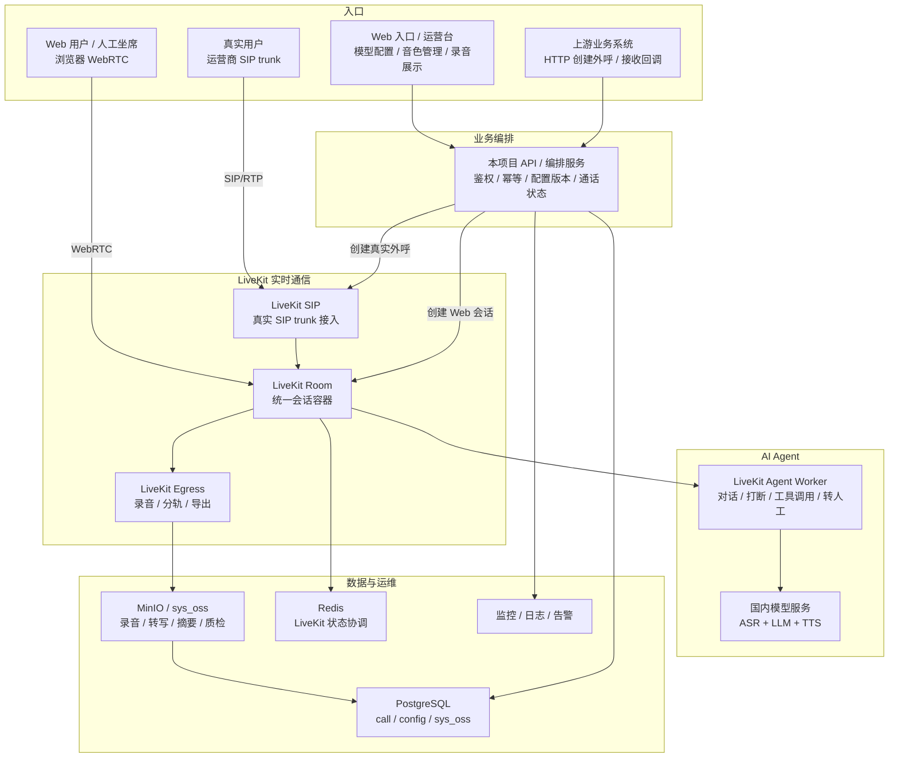
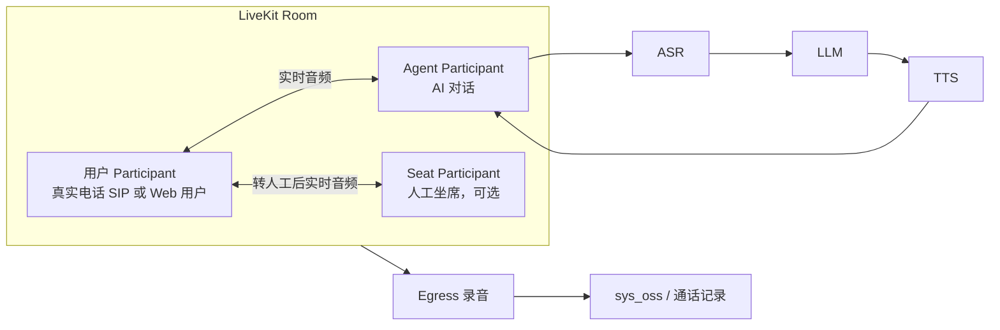

# 生产级智能外呼总体架构设计

最后更新：2026-06-09

## 1. 文档定位

本文档描述商业级 AI 智能外呼平台的目标架构、组件职责、关键设计边界和生产保障要求。

它回答的问题是：

1. 为什么选择 `LiveKit SIP + LiveKit Server + LiveKit Agent` 作为主方案。
2. 真实 SIP 外呼、Web 入口、AI Agent、录音、转人工和业务系统如何协作。
3. 哪些能力是生产级必须补齐的门禁。
4. 哪些能力当前阶段明确不做。

当前文档是架构 v0，不代表所有能力已经完成。已完成和未完成的事实以 [02-current-validation-report.md](02-current-validation-report.md) 为准。

独立模块的数据表结构、字段语义和枚举值说明见：[04-data-model.md](04-data-model.md)。

## 2. 设计目标

目标是建设一套可长期演进的 AI 智能外呼系统：

1. 支持国内运营商 SIP trunk。
2. 支持固定公网 IP 白名单接入。
3. 支持电话侧 `PCMU/8000`、`PCMA/8000` 等窄带音频。
4. 降低端到端语音大模型直连成本。
5. 避免自研 SIP/RTP 桥接层。
6. 支持 Web 版业务闭环、录音、转人工、监控、回调和合规审计。
7. 通过 `request_id`、`business_type`、`business_id` 与外部业务系统弱关联，保持模块独立运行。

## 3. 推荐主方案

推荐主链路：

```text
运营商 SIP trunk
  -> 自托管 LiveKit SIP
  -> LiveKit Server / Room
  -> LiveKit Agent Worker
  -> 国内 ASR / LLM / TTS
  -> 录音 / 转人工 / 业务回调 / 质检
```

这里的“自托管 LiveKit SIP”表示把 LiveKit SIP 部署在自有公网服务器上，让运营商 SIP trunk 白名单指向自有公网 IP 和端口。它不是自研 SIP/RTP 桥接层。

选择该方案的核心原因：

1. LiveKit 原生抽象了 Room、Participant 和 Track。
2. 电话用户可以作为 SIP Participant 进入 Room。
3. AI Agent 和 WebRTC 坐席可以作为其他 Participant 加入同一个 Room。
4. Egress 可以复用 Room 内媒体做录音和导出。
5. Web 用户和真实电话用户可以共用同一套 Agent、话术、模型和录音体系。

## 4. 总体架构



设计重点：

1. 真实线路入口：运营商 SIP trunk 进入 LiveKit SIP，再进入 LiveKit Room。
2. Web 入口：浏览器直接以 WebRTC Participant 进入 LiveKit Room，不发起真实 SIP 呼叫。
3. 业务系统和 Web 运营台都先进入本项目 API / 编排服务，再由编排服务创建真实外呼或 Web 会话。
4. 两条入口进入 Room 后复用同一套 Agent、模型配置、打断逻辑、录音、转写、摘要、质检和坐席接管能力。

## 5. 单通 Room 内关系



## 6. 组件职责

| 组件 | 生产职责 | 是否必需 |
|---|---|---:|
| LiveKit Server | Room、Participant、媒体路由、WebRTC 核心 | 是 |
| LiveKit SIP | SIP trunk 与 LiveKit Room 的桥接 | 是 |
| LiveKit Agent Worker | AI 对话控制、模型调用、打断、工具调用、转人工触发 | 是 |
| Redis | LiveKit 组件协调和状态依赖 | 是 |
| Egress | 通话录音、混音、分轨和导出 | 生产建议必需 |
| PostgreSQL | 通话记录、状态机、任务、回调、审计、`sys_oss` 文件记录 | 是 |
| `sys_oss` 文件体系 | 录音、转写文本、摘要、质检结果的文件索引和归档入口 | 是 |
| HTTP API / 状态查询 | 上游触发外呼、按 `call_id` 查询状态；webhook 后续再评估 | 是 |
| RocketMQ | 上游业务系统内部削峰和异步调度，本项目先不直连 | 上游已有，暂非必需 |
| Web 入口 / 运营台 | 非真实线路的 Web 业务闭环、模型配置、音色管理、坐席接听、录音展示 | 是 |
| 轻量坐席台 | 转人工接管、简单坐席状态、CRM 弹屏、结果回填 | 视业务必需 |
| 监控系统 | 指标、日志、链路追踪、告警 | 是 |

## 7. SIP 接入设计

生产主链路让运营商直接对接 LiveKit SIP：

```text
运营商 SIP trunk
  -> LiveKit SIP public IP:port
  -> LiveKit Room
```

生产环境必须固定：

```text
SIP signaling: UDP/TCP 指定端口
SIP RTP: UDP 指定范围
LiveKit API: 仅内网或受信 IP
WebRTC UDP/TCP: 仅按需要开放
Redis: 不暴露公网
```

当前线路服务商规则已确认需要绑定公网 IP 和 SIP signaling 端口。后续如果更换公网 IP、SIP 端口、主叫号或部署多节点，必须提前让服务商重新开放白名单并调整线路配置。

LiveKit SIP 在云服务器上必须显式配置公网 NAT 地址：

```text
nat_1_to_1_ip: 公网 IP
media_nat_1_to_1_ip: 公网 IP
```

否则 SDP 可能暴露内网地址，真实运营商无法回 RTP。

生产建议电话侧至少支持：

```text
PCMU/8000
PCMA/8000
telephone-event/8000
ptime=20
RTP/AVP
```

如果服务商只接受特定 codec 或特定 SIP header 行为，需要在真实线路联调阶段闭环。

## 8. SBC 边界判断

当前推荐不默认引入 SBC / Kamailio / OpenSIPS，但必须保留边界判断。

LiveKit SIP 直连适合：

1. 服务商 SIP 行为标准。
2. 只需要有限 trunk。
3. 不需要复杂 header 改写。
4. 安全组可以严格限制服务商 IP。
5. 失败码和路由逻辑可以在业务层处理。

需要评估引入 SBC 的信号：

1. 服务商要求复杂 From、Contact、Via、rport 或 SDP 改写。
2. 多服务商、多 trunk、多区域路由复杂。
3. 需要 OPTIONS 探活、线路熔断、失败码统一归一。
4. 需要更强的 SIP 防扫描、限频和黑名单。
5. LiveKit SIP 的 codec 或 header 行为无法满足服务商要求。

如果出现上述约束，优先评估轻量 SIP 边界层，而不是直接回到完整自研 RTP 桥接。

## 9. Web 入口和运营台

Web 入口不是替代真实线路，而是在不接真实 SIP 的情况下先完成商业闭环：

```text
浏览器模拟用户
  -> WebRTC 加入 LiveKit Room
  -> LiveKit Agent 使用同一套 ASR / LLM / TTS / 话术配置
  -> 启动 Egress 混音录音
  -> 录音进入 sys_oss / ai_call_recording
  -> 通话后语义分析进入 ai_call_analysis
  -> 必要时 WebRTC 坐席接管
```

Web 入口和运营台的目标态至少包括：

1. 模拟用户通话。
2. LLM / ASR / TTS 配置选择。
3. 话术配置和变量填充。
4. 音色配置、试听和自定义音色管理。
5. 坐席在线状态和接管入口。
6. 录音、转写、摘要、质检结果展示。
7. ASR partial/final、LLM 首 token、TTS 首包、打断事件和错误日志展示。

阶段边界：

1. Phase 00 只做 Web 版商业闭环，不做音色配置、选择、试听或自定义音色。
2. Phase 02 处理 ASR / LLM / TTS 模型、话术和通话后语义分析配置。
3. 音色配置与自定义音色作为独立阶段建设，避免把音色资产生命周期塞进普通模型配置字段。

Web 会话记录必须和真实外呼记录区分：

```text
ai_call_session.channel = web_call
ai_call_session.provider_call_id = null
ai_call_session.sip_call_id = null
ai_call_participant.participant_type = web_user
```

真实 SIP 外呼记录：

```text
ai_call_session.channel = sip_outbound
ai_call_session.sip_call_id = SIP 信令中的 Call-ID
ai_call_participant.participant_type = sip_user
```

## 10. AI Agent 和模型配置边界

生产建议使用 LiveKit Agent 作为主 Agent 框架：

```text
LiveKit Room audio
  -> Agent Worker
  -> VAD / turn detection
  -> Streaming ASR
  -> LLM / 对话策略
  -> Streaming TTS
  -> LiveKit Room audio
```

为了降低端到端 S2S 成本，生产建议拆成：

| 环节 | 推荐能力 |
|---|---|
| VAD | 本地 VAD 或模型侧 VAD |
| ASR | 国内流式 ASR，支持 8k 电话音频或 16k 上采样 |
| LLM | Qwen / DeepSeek / 豆包文本模型等流式输出 |
| TTS | 国内低延迟流式 TTS |
| 质检 | 通话后异步模型，不进实时链路 |

接入原则：

1. 国内 LLM 优先使用 OpenAI-compatible 接口，通过 `base_url` 和模型名接入。
2. ASR / TTS 如无现成 LiveKit 插件，则开发 provider adapter。
3. Adapter 负责把 LiveKit 音频帧、厂商 WebSocket / HTTP 协议、partial/final 文本事件和音频帧互相转换。
4. 质检、摘要、标签、承诺还款识别放到通话结束后异步执行。
5. Pipecat 只作为备选，不默认引入第二套 Agent 生命周期和事件语义。
6. 音色管理不放在 Phase 02 内实现；TTS adapter 先保证默认声音低延迟可用，自定义音色后续独立建设。

Agent 调度建议：

1. Telephony 场景优先使用 explicit agent dispatch。
2. 外呼时先 dispatch agent，再创建 SIP participant。
3. Agent 应等待被叫接听并加入 Room 后再开始会话，避免接听时只听到开场白尾音。
4. 每个 Agent job 必须携带 `call_id`、`request_id`、`business_type`、`business_id` 和本次执行配置快照。

## 11. 打断和播放控制

生产环境必须设计业务状态机：

1. AI 正在说话。
2. 用户开始说话。
3. TTS 是否可取消。
4. LLM 是否可取消。
5. 当前话术是否允许被打断。
6. 打断后是否保留上下文。
7. 尾音 drain 和音频清理。
8. 转人工、挂机、按键等高优先级事件是否能立即抢占。

旧系统中的 `playout_engine`、`playout_controller`、`voice_activity` 经验应迁移为 Agent 层状态机，而不是在 SIP/RTP 桥接层重写。

生产目标建议：

| 指标 | 目标 |
|---|---:|
| 用户说完到 ASR partial | 100-300 ms |
| 用户说完到 LLM 首 token | 300-800 ms |
| 用户说完到 TTS 首包 | 700-1500 ms |
| 打断停止播放 | 100-300 ms |
| 端到端主观响应 | 1.0-2.0 秒 |

这些目标必须按 p50、p95、p99 分开监控，不应只看单次体验。

## 12. 转人工设计

当前阶段优先采用轻量 WebRTC 坐席接管：

```text
用户电话作为 SIP Participant
AI Agent 作为 Agent Participant
人工坐席作为 WebRTC Participant

AI 识别转人工
  -> 通知指定坐席或当前在线坐席
  -> 坐席打开坐席台并加入同一个 LiveKit Room
  -> AI 静音或退出
  -> 坐席与用户通话
  -> 通话结束后坐席填写结果
```

当前阶段不做：

1. 排队。
2. 技能组。
3. 多坐席抢接。
4. 复杂坐席分配策略。
5. 传统 SIP 分机注册。
6. 咨询、保持、三方、监听、强插。
7. 完整呼叫中心报表。

如果后续业务要求人工必须接真实电话，再单独评估 SIP REFER、二次呼叫或外部呼叫中心集成。

## 13. 录音和质检

生产建议使用 LiveKit Egress：

```text
LiveKit Room
  -> Egress Worker
  -> WAV/MP3
  -> 后端任务复用 OssService.upload_service
  -> MinIO / sys_oss 写入文件索引
  -> ai_call_recording 关联 oss_id
```

录音策略：

1. 默认双向混音录音。
2. 必要时保留分轨录音，区分用户、AI、人工。
3. 录音开始/停止事件进入业务审计。
4. 转人工后继续录音。
5. 录音失败不应中断通话，但必须告警。

录音上传和播放边界：

1. 录音文件由服务端 Egress 或录音任务生成，不由浏览器上传。
2. 后端任务上传录音时复用基座 OSS 服务，成功后只把 `oss_id` 写入 `ai_call_recording`。
3. 页面播放录音时先查智能外呼录音接口，再由后端鉴权后按 `oss_id` 获取可播放地址。
4. 当前基座能力可按 `oss_id` 返回 `sys_oss.url`；如果生产存储桶是私有读，需要补充短期签名 URL 或后端代理流。

`sys_oss` 只做文件索引，通话记录或录音记录表还需要保存：

1. `call_id`、`request_id`、`business_type`、`business_id`。
2. 混音录音 `mixed_oss_id`。
3. 用户分轨 `user_track_oss_id`。
4. AI 分轨 `agent_track_oss_id`。
5. 人工分轨 `human_track_oss_id`。
6. 录音时长、采样率、声道、文件大小、hash。
7. 转写、摘要、质检状态和失败原因。

质检不要进入实时链路。通话结束后异步执行：

1. ASR 全量转写。
2. 对话摘要。
3. 用户意向识别。
4. 投诉/敏感词检测。
5. 承诺还款、转人工、拒绝沟通等标签。
6. 坐席服务质量评分。

## 14. 状态机和事件

建议统一通话状态：

```text
CREATED
QUEUED
DIALING
RINGING
ANSWERED
AI_TALKING
USER_TALKING
HUMAN_TRANSFER_REQUESTED
HUMAN_TRANSFER_RINGING
HUMAN_TRANSFER_CONNECTED
COMPLETED
FAILED
CANCELED
TIMEOUT
```

每通电话必须贯穿：

```text
request_id
business_type
business_id
call_id
channel
livekit_room_name
livekit_participant_id
sip_call_id
provider_call_id
participant_type
```

事件比单一状态更利于排障和审计。当前阶段通过状态查询和主动对账保证一致性。后续如果启用 webhook，也不能把 webhook 作为唯一事实来源，仍必须定时检查 Room、Participant、SIP call、Egress 和业务状态是否一致。

## 15. 高可用和容量

100 并发以内可以单机或双机起步，但必须具备健康检查、快速回滚、抓包和告警。

推荐生产拓扑：

```text
LiveKit SIP: 2 台，主备或按线路分流
LiveKit Server: 2-3 台
Redis: Sentinel / Cluster / 云 Redis
Agent Worker: N 台，按并发水平扩容
Egress Worker: 独立节点
业务 API: 2 台以上
业务库 PostgreSQL: 主从或云数据库，包含 sys_oss
文件归档: 复用现有 sys_oss 对应的存储后端
```

100 路并发电话的主要压力通常不在 LiveKit Server，而在：

1. ASR 并发。
2. TTS 并发。
3. LLM token 生成速度。
4. Agent Worker 内存和网络。
5. Egress 录音。
6. 运营商 CPS 和并发限制。

## 16. 安全和合规

网络安全必须执行：

1. SIP 端口只允许服务商 SBC IP 访问。
2. RTP 端口只允许服务商 SBC IP 访问。
3. LiveKit API 不开放公网，或仅允许受信 IP。
4. Redis 不开放公网。
5. Agent 管理 API 需要鉴权。
6. Web 入口、运营台和坐席台使用 HTTPS/TLS 正式证书。
7. 浏览器连接 LiveKit 的信令使用 WSS。
8. 浏览器 WebRTC 音频需要 TURN 作为 NAT / 防火墙场景下的中继兜底。
9. 禁止把 `.env`、录音、日志密钥提交仓库。

如果服务商支持 SIP TLS / SRTP，应优先验证；如果服务商只支持 UDP/RTP，则必须通过 IP 白名单、防火墙、限频和审计降低风险。

合规至少考虑：

1. 外呼时间窗口。
2. 黑名单和退订。
3. 录音告知。
4. 敏感信息脱敏。
5. 号码加密存储。
6. 通话日志权限控制。
7. 坐席访问审计。
8. 模型供应商数据合规。

## 17. 明确不做

当前阶段不做：

1. 不自研 SIP/RTP 桥接层。
2. 不把 Pipecat 作为默认主路线。
3. 不让 Python Agent 在第一阶段直接消费 RocketMQ。
4. 不建设完整 ACD 呼叫中心。
5. 不做排队、技能组、多坐席抢接、监听、强插和传统 SIP 分机注册。
6. 不把 Web 入口验证配置无审批地直接用于真实生产外呼。

## 18. 参考资料

1. LiveKit SIP self-hosting: https://docs.livekit.io/transport/self-hosting/sip-server/
2. LiveKit ports and firewall: https://docs.livekit.io/home/self-hosting/ports-firewall/
3. LiveKit SIP outbound calls: https://docs.livekit.io/sip/outbound-calls/
4. LiveKit SIP trunk setup: https://docs.livekit.io/sip/quickstarts/configuring-sip-trunk/
5. LiveKit Agents telephony integration: https://docs.livekit.io/frontends/telephony/agents/
6. LiveKit Egress overview: https://docs.livekit.io/server/egress/
7. LiveKit Webhooks and events: https://docs.livekit.io/intro/basics/rooms-participants-tracks/webhooks-events/
8. LiveKit distributed deployment: https://docs.livekit.io/transport/self-hosting/distributed/
