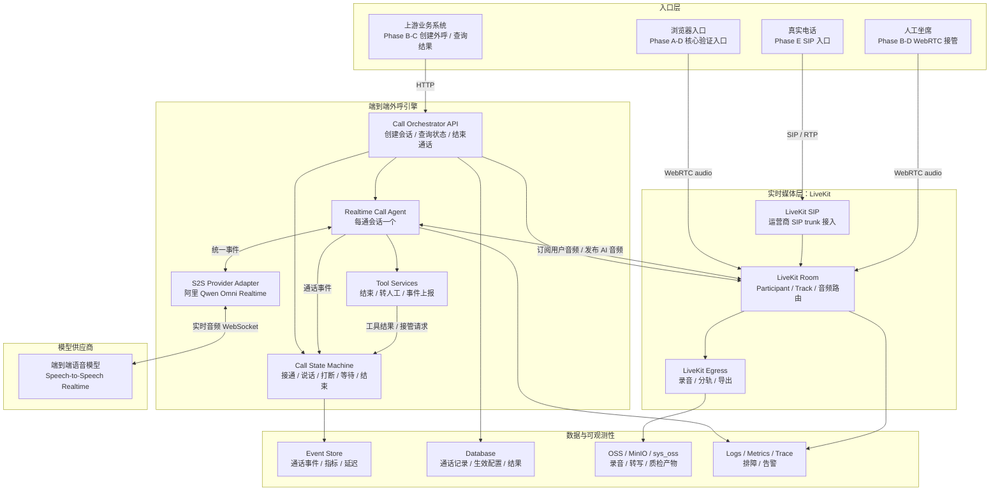

# 端到端 AI 外呼引擎总纲

最后更新：2026-06-15

## 1. 文档定位

本文档是 AI 智能体实现本系统前必须先读的总纲，只回答全局问题：

1. 要做什么系统。
2. 总体架构是什么。
3. 分哪些阶段。
4. 当前处于哪个阶段。
5. 当前阶段前后有哪些边界。

本文档不是完整实现规格，也不是所有阶段的细节冻结稿。接口路径、字段结构、状态枚举、测试脚本和供应商参数应写入当前阶段技术设计文档。后续阶段能力只代表目标方向，不代表已经设计完成。进入某个阶段前，必须先生成或更新该阶段技术设计文档，并以当时的代码事实、测试结果和外部依赖为准。

AI 实现前必须按顺序执行：

1. 先读本文档。
2. 再读当前阶段技术设计文档。
3. 最后检查当前代码和测试，不能只相信文档状态。

## 2. 当前状态

| 项 | 当前值 |
|---|---|
| 当前阶段 | Phase B：Web 商用闭环正式设计准备 |
| 最近收尾阶段 | Phase A：Web 端到端核心引擎实现已收尾，补证项见验收报告 |
| Phase A 设计文档 | [phases/phase-a-e2e-core-engine.md](phases/phase-a-e2e-core-engine.md) |
| Phase A 验收报告 | [phases/phase-a-acceptance-report.md](phases/phase-a-acceptance-report.md) |
| Phase B 当前文档 | [phases/phase-b-web-commercial-loop-pre-design.md](phases/phase-b-web-commercial-loop-pre-design.md)，正式设计待生成 |
| 当前入口 | 浏览器入口优先 |
| 当前模型 | 固定使用阿里百炼 `qwen3.5-omni-plus-realtime` |
| 当前音色策略 | 前端下拉选择阿里官方 `voice` 参数，默认 `Tina` |
| 真实 SIP | Phase E 最后接入 |
| 业务系统接入 | Phase B/C 逐步接入 |

阶段完成后必须更新本节。不能只更新阶段文档，不更新总纲当前状态。

## 3. 系统目标

目标是建设一个商业可用的端到端实时语音 AI 外呼引擎。

系统要解决的问题：

1. 用户接通电话后，可以和 AI 做自然的低延迟语音对话。
2. AI 可以被用户自然打断。
3. 系统能识别沉默、等待、重说、挂机、超时和单向音频等通用通话状态。
4. 前期以 Web 界面验证核心外呼能力，最后再接真实 SIP 外呼入口。
5. 每通电话可以按 `call_id` 复盘状态、事件、延迟和结果。

## 4. 商用项目约束

本项目定位是商用级 AI 外呼引擎，不是临时验证工程。

允许分阶段实现，允许 Phase A 先做最小闭环，但不能为了快速实现、方便调试或短期省事牺牲商用项目的基本定位。

任何阶段都必须遵守：

1. 安全边界不能破坏：浏览器或前端不能持有模型 API Key、LiveKit API Secret 或供应商密钥；浏览器只允许拿到服务端签发的短期 Room Token。
2. 模块边界不能破坏：通用外呼引擎、业务策略、模型适配和媒体层职责必须分离。
3. 可观测性不能省略：关键状态、事件、错误和延迟指标必须可复盘。
4. 长期演进不能堵死：前期实现可以 Web 优先，但抽象不能写死成浏览器专用，后续必须能接真实 SIP、录音、转人工和业务系统。
5. 接口响应不能分裂：HTTP JSON API 顶层统一为小写 `code`、`msg`、`data`；响应体 `code` 只使用成功 `200` 和失败 `500`；错误信息统一放在 `msg`，错误时 `data` 为空。

阶段设计可以控制范围，但必须保持正确方向。

## 5. 主链路和核心原则

主链路：

```text
用户语音
  -> LiveKit Room
  -> Realtime Call Agent
  -> 端到端 Speech-to-Speech 模型
  -> LiveKit Room
  -> 用户听到 AI
```

核心原则：

1. `LiveKit` 是实时媒体层。
2. 每通实时会话由一个 `Realtime Call Agent` 负责媒体、状态和模型会话控制。
3. `S2S Provider Adapter` 屏蔽模型供应商协议差异。
4. `Call State Machine` 管理通话生命周期。
5. 实时主链路采用端到端 S2S；三段式 `ASR -> LLM -> TTS` 仅用于通话后转写、质检、摘要、离线分析或兜底。

## 6. 总体架构图

下图描述目标架构，不代表当前代码已经全部实现。



图的正确理解：

1. 浏览器、真实电话、人工坐席都通过 LiveKit Room 进入实时通话，不直接连接模型。
2. 模型 API Key、LiveKit API Secret 和供应商密钥只在服务端或 Agent 侧使用，不能进入浏览器。
3. S2S 模型只负责实时语音理解和生成，不负责外呼状态、转人工、录音和业务结果。
4. Orchestrator 负责创建会话和调度 Agent；Agent 和工具把运行事件回写给状态机。
5. 真实 SIP 放在最后阶段接入；前面阶段先用 Web 入口验证核心引擎、商用闭环和生产能力。
6. 模型固定为 `qwen3.5-omni-plus-realtime`，后续阶段不再建设模型切换、模型路由或音色管理能力。

## 7. 分层职责

| 层 | 职责 | 不负责 |
|---|---|---|
| 浏览器入口 | Phase A-D 核心验证、人工测试、后续运营台入口 | 不直接连接模型，不持有模型 API Key、LiveKit API Secret 或供应商密钥 |
| LiveKit | Room、Participant、Track、WebRTC、SIP、Egress | 不做业务决策，不做模型供应商选择 |
| Realtime Call Agent | 单通实时控制、音频订阅发布、打断、事件上报 | 不承载复杂业务策略 |
| S2S Provider Adapter | 屏蔽模型协议，统一模型事件 | 不管理通话生命周期 |
| Call State Machine | 管理接通、说话、打断、等待、结束、失败 | 不生成业务话术 |
| Tool Services | 结束通话、请求转人工、事件上报 | 不做长耗时复杂业务流程 |
| 数据与可观测性 | 事件、指标、录音、生效配置、结果复盘 | 不影响实时首包链路 |

## 8. 阶段路线

| 阶段 | 状态 | 目标 | 完成定义 |
|---|---|---|---|
| Phase A：Web 端到端核心引擎 | 实现已收尾，仍有补证项 | 基于总纲方案从零实现可复用核心模块，保留浏览器入口 | 浏览器通过 LiveKit Room 与 Agent 完成端到端 S2S 对话，并具备事件、状态和延迟指标；补证项见验收报告 |
| Phase B：Web 商用闭环 | 正式设计准备中，已有预设计 | 在 Web 入口下补齐通话记录、生效配置、事件指标、结果查询，并按 Phase A 结果决定是否接入录音和最小转人工 | 每通 Web 会话可按 `call_id` 复盘状态、事件、指标和结果；录音、最小转人工按 Phase A 结果定稿 |
| Phase C：Web 并发压测与容量验证 | 未开始 | 在不接真实 SIP 的情况下验证模型、Agent、LiveKit、事件、录音和成本的容量边界 | 形成容量报告：在指定配置和场景下可支持的并发会话数、新建速率、首个瓶颈、扩容方式和超限策略 |
| Phase D：生产加固与运维兜底 | 未开始 | 监控、告警、回滚、限流、排障和故障兜底 | 有 SLO、告警、排障、压测复现和故障兜底 |
| Phase E：真实 SIP 入口 | 未开始 | 真实电话用户通过 LiveKit SIP 接入 Phase A-D 已验证链路 | 真实手机接听后可与 S2S Agent 对话，SIP/RTP/codec/挂机等问题可记录和处理 |

## 9. Phase A 实施边界

Phase A 只建立 Web 入口下的端到端核心通话链路，实施时按以下边界控制范围：

1. 实时主链路采用端到端 S2S。
2. 浏览器入口只用于验证核心通话链路，不能直接持有模型 API Key、LiveKit API Secret 或供应商密钥。
3. 每通实时会话由一个 Realtime Call Agent 负责媒体、状态和模型会话控制。
4. 业务策略不能硬编码进通用外呼引擎。
5. 本阶段不做真实 SIP、批量外呼、完整运营后台和完整坐席系统。
6. 模型和音色策略在 Phase A 定稿：模型固定在服务端配置；音色由前端下拉选择后透传给模型。
7. 阶段完成必须以代码、测试和可复盘指标为准，不能只改文档。

## 10. 阶段推进规则

1. 当前推进 Phase B 正式技术设计，不直接进入 Phase B 实现。
2. 任何阶段完成后，必须同步更新本文档的“当前状态”和“阶段路线”。
3. 进入新阶段前，必须先生成或更新该阶段技术设计文档。
4. Phase A 验收报告中的补证项必须在 Phase B 实现前关闭，或在 Phase B 正式设计中列为已接受风险。
5. 进入 Phase C 前，必须基于 Phase A/B 的真实实现生成并发压测技术设计文档；Phase C 的核心交付物是容量报告，不是新业务功能。
6. 真实 SIP 只在 Phase E 接入；前面阶段如果需要模拟电话侧能力，统一通过 WebRTC/浏览器入口验证。
