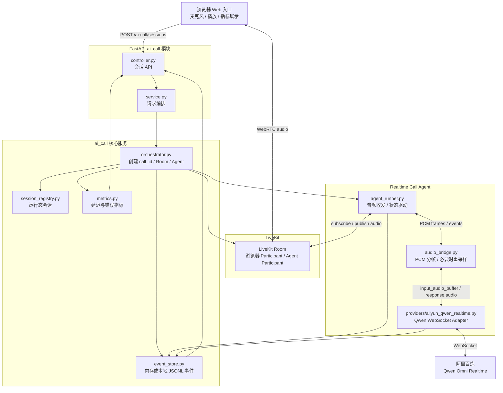
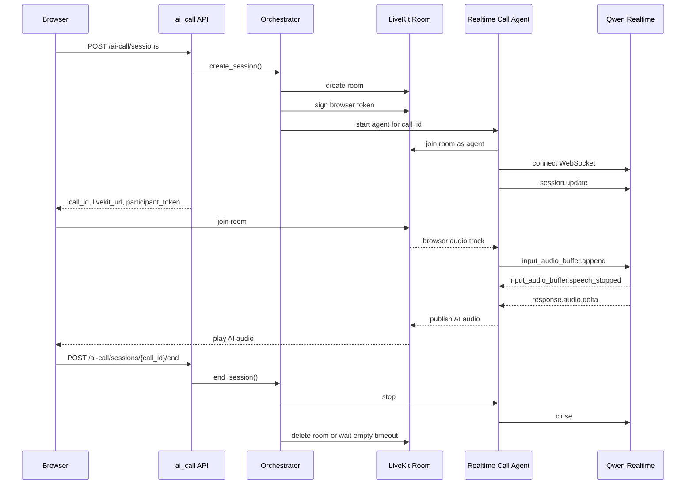

# Phase A：Web 端到端核心引擎详细设计

最后更新：2026-06-15

## 1. 文档定位

本文档用于指导 AI 智能体实现 Phase A。它只定义本阶段必须做对的工程契约，不展开后续 SIP、批量外呼、坐席系统、并发压测和生产运维细节。

收尾状态：Phase A 实现已收尾，验收结论和剩余补证项见 [phase-a-acceptance-report.md](phase-a-acceptance-report.md)。本文档保留为 Phase A 的设计基线，不继续追加 Phase B 实现细节。

实现前必须先读：

1. [../OUTLINE.md](../OUTLINE.md)
2. [../CALL_SCENARIOS.md](../CALL_SCENARIOS.md)
3. 当前代码中的 `app/api/v1/ai_call/`、`app/config/setting.py`、`app/plugin/init_app.py`

## 2. 目标、非目标、完成定义

### 2.1 目标

Phase A 要先通过浏览器入口实现端到端实时语音通话核心链路：

```text
Browser microphone
  -> LiveKit Room
  -> Realtime Call Agent
  -> Qwen Omni Realtime
  -> Realtime Call Agent
  -> LiveKit Room
  -> Browser speaker
```

必须做到：

1. 浏览器通过后端创建 Web 会话，并拿到 LiveKit Room 连接信息。
2. 后端创建 Room、签发浏览器 Room Token、启动一通会话一个 Realtime Call Agent。
3. Agent 连接阿里 Qwen Omni Realtime，并在 LiveKit 与模型之间转发实时音频。
4. 能记录会话状态、关键事件、首包延迟、打断延迟、错误原因。
5. 能覆盖正常对话、用户打断、误打断防护、沉默、重说、断连和模型超时。

### 2.2 非目标

本阶段不做：

1. 真实 SIP 外呼。
2. 批量外呼。
3. 正式业务系统接入。
4. 正式数据库表和迁移脚本。
5. 完整录音、质检、摘要、计费和运营后台。
6. 完整坐席系统。
7. 多供应商路由和模型自动切换。

### 2.3 完成定义

Phase A 完成必须同时满足：

1. 浏览器可完成至少 5 分钟多轮端到端 S2S 对话。
2. 短句 `user_speech_stopped -> browser_first_ai_audio` p50 <= 1000ms，p90 <= 1500ms。
3. 用户真实打断后，AI 停播延迟目标 100-300ms，旧音频队列不继续播放。
4. 背景噪声、短促附和、AI 回声不会频繁误打断。
5. 会话结束、浏览器断开、模型报错时，Room、Agent、模型连接都能释放。
6. 每通会话可通过 `call_id` 查询状态、事件和指标。
7. 自动化测试和手工验收记录完成，并更新总纲当前状态。

## 3. 本阶段架构图



图中没有真实 SIP、数据库和批量任务，这是 Phase A 的范围边界。

## 4. 核心时序



## 5. 技术选型与约束

| 项 | Phase A 选择 | 原因 |
|---|---|---|
| 实时媒体层 | LiveKit Room | 浏览器入口和后续 SIP 都能进入同一媒体房间 |
| 入口关系 | Web 入口先接入同一个 Call Session 核心 | 后续业务外呼入口只增加外呼任务、业务上下文和真实接入方式 |
| 浏览器鉴权 | 后端按会话状态签发短期 Room Token | Token 只用于加入或重连 Room，不负责控制通话时长 |
| Agent 形态 | 每通会话一个 Realtime Call Agent | 状态、音频、模型连接按 call_id 隔离 |
| 模型接入 | Qwen Omni Realtime WebSocket | 服务端集成更利于安全、状态机和指标采集 |
| 固定模型 | `qwen3.5-omni-plus-realtime` | 当前已确定使用该阿里系端到端 S2S 模型，后续阶段不做模型切换 |
| 音色策略 | 前端下拉选择阿里官方 `voice` 参数，默认 `Tina` | 后端不维护音色白名单，不做音色管理能力 |
| 开场白 | 配置文件固定开场白，由同一个 Realtime 模型生成 | 与后续对话使用同一音色和同一上下文，不单独接 TTS |
| 事件存储 | 内存为主，可选本地 JSONL | Phase A 不落正式表，只做延迟和稳定性验证 |
| 浏览器音频处理 | 通过配置启用 WebRTC 原生回声消除、降噪、自动增益 | 降低回声和背景噪声对打断判断的干扰，不作为请求参数 |
| VAD | 通过配置使用模型 `server_vad` | 少做自研音频判断，先用供应商 VAD 产生语音边界；打断确认由 Agent 根据有效转写控制，不作为请求参数 |

关键约束：

1. Qwen Realtime 官方 WebSocket 地址是 `wss://dashscope.aliyuncs.com/api-ws/v1/realtime?model=...`。
2. Qwen Realtime WebSocket 使用 `Authorization: Bearer DASHSCOPE_API_KEY`。
3. Qwen Realtime 输入音频为 16 kHz PCM，输出音频为 24 kHz PCM。
4. 当前 `app/config/setting.py` 里的 `DASHSCOPE_WEBSOCKET_URL` 默认值指向 `/api-ws/v1/inference`，Phase A 应新增或改用 `DASHSCOPE_REALTIME_URL`，避免和 TTS/推理接口混用。
5. 若实际 LiveKit 音频帧采样率与 Qwen 不一致，必须在 `audio_bridge.py` 中集中处理，不允许散落在 Provider 或 Controller 中。
6. VAD 参数和浏览器音频约束属于运行配置，放在 `app/config/setting.py` 和 `env/.env.*` 中，不允许作为创建会话请求参数。
7. Phase A 前端只使用浏览器或 LiveKit SDK 原生音频约束，不引入自研降噪 DSP、WASM 降噪或付费降噪插件；如原生能力不足，再作为后续优化项评估。
8. `voice` 是供应商参数，Phase A 只做前端下拉和后端透传；后端不校验音色合法性、不维护白名单、不纠正、不回退，非法音色由 Qwen 返回错误。
9. 开场白属于通话主链路的一部分，必须在 Phase A 实现；内容来自配置文件，不作为创建会话请求参数。

## 6. 模块设计

建议新增结构：

```text
app/api/v1/ai_call/
  __init__.py
  controller.py
  schema.py
  service.py

app/services/ai_call/
  orchestrator.py
  session_registry.py
  conversation_context.py
  event_store.py
  metrics.py
  livekit_room.py
  agent_runner.py
  audio_bridge.py
  providers/
    base.py
    aliyun_qwen_realtime.py
```

职责边界：

| 模块 | 职责 |
|---|---|
| `controller.py` | 暴露会话 API，不直接操作 LiveKit 或模型 |
| `service.py` | 参数校验、调用 orchestrator、组装响应 |
| `orchestrator.py` | 创建和结束会话，协调 Room、Agent、事件和指标 |
| `session_registry.py` | 保存运行态 session，不做持久化 |
| `conversation_context.py` | 保存单通会话的运行态上下文摘要和必要对话项，不做长期记忆 |
| `event_store.py` | 写入和查询当前进程内事件，可选追加 JSONL |
| `metrics.py` | 计算首包、打断、播放队列、错误指标 |
| `livekit_room.py` | 创建 Room、签发 Token、删除 Room |
| `agent_runner.py` | Agent 生命周期，连接 Room 和 Provider |
| `audio_bridge.py` | 音频帧切分、编码、采样率转换、播放队列 |
| `providers/base.py` | S2S Provider 抽象接口和统一事件 |
| `providers/aliyun_qwen_realtime.py` | Qwen Realtime WebSocket 协议适配 |

实现规则：

1. Controller 只处理 HTTP，不出现模型 API Key。
2. Provider 只处理模型协议，不直接修改 HTTP 响应。
3. Agent 是实时链路核心，不写业务话术判断。
4. 事件、状态和指标必须通过统一方法写入，不能只打日志。
5. 通话上下文必须绑定 `call_id` 和模型会话，不能使用全局变量或跨通电话共享。

## 7. API 契约

项目内部路由前缀为 `/ai-call`。若部署时启用 `ROOT_PATH=/ai-call-api/v1`，外部访问路径会带上该前缀。

本阶段暴露的是 Web 入口 API，但它必须调用同一个 Call Session 核心。后续业务外呼入口不应重写实时通话链路，只是在创建会话前多出外呼任务、被叫号码、业务生效配置和真实接入方式。

### 7.1 统一响应格式

所有 `/ai-call` HTTP JSON API 顶层统一使用小写三段式：

```json
{
  "code": 200,
  "msg": "操作成功",
  "data": {}
}
```

规则：

1. 成功响应统一使用 `SuccessResponse(data=..., msg=...)`。
2. 错误响应统一通过 `CustomException` 或全局异常处理进入 `ErrorResponse`。
3. Controller 不直接返回裸业务对象，不手写 `{ "callId": ... }` 这类无响应壳结构。
4. 响应体 `code` 只使用两种值：成功 `200`，失败 `500`。
5. `msg` 是前端可展示的成功或失败文案；所有对前端有意义的错误信息都放在 `msg`。
6. `data` 只放成功业务数据；失败时统一返回 `null`，不放错误对象、错误码、供应商原始错误或堆栈。
7. 错误分类、供应商原始错误、堆栈和排障细节只进入服务端日志、事件和指标，不进入 API `data`。
8. HTTP 状态码可按实际错误返回，用于网关、浏览器和监控判断；前端业务判断以响应体 `code` 为准。
9. 文件下载、流式响应、WebSocket 媒体流不适用本 JSON 响应壳。

错误示例：

```json
{
  "code": 500,
  "msg": "模型配置缺失",
  "data": null
}
```

### 7.2 创建 Web 会话

```http
POST /ai-call/sessions
```

请求：

```json
{
  "voice": "Tina",
  "prompt": "你是一个电话外呼助手，回答要简短自然。"
}
```

响应：

```json
{
  "code": 200,
  "msg": "创建成功",
  "data": {
    "callId": "call_20260614_xxxxxx",
    "roomName": "ai-call-call_20260614_xxxxxx",
    "livekitUrl": "wss://livekit.example.com",
    "participantToken": "redacted",
    "participantIdentity": "browser-call_20260614_xxxxxx",
    "status": "created",
    "effectiveConfig": {
      "model": "qwen3.5-omni-plus-realtime",
      "voice": "Tina",
      "promptHash": "sha256:xxxxxx",
      "openingMessageHash": "sha256:yyyyyy"
    }
  }
}
```

规则：

1. 请求体可以为空，不传时使用服务端默认 `voice` 和默认 `prompt`。
2. `voice` 可选，由前端下拉传入阿里官方 `voice` 参数；后端不校验音色合法性，不维护白名单，不纠正，不回退，直接透传给 Qwen。
3. `prompt` 可选，Phase A 用于验证话术风格对延迟、打断和自然度的影响；后续商用阶段应来自业务配置或话术模板。
4. `model` 不由请求传入，固定使用服务端配置 `qwen3.5-omni-plus-realtime`；后续阶段不做模型选择、模型切换或模型路由。
5. 服务端创建会话时生成生效配置 `effectiveConfig`，后续事件和指标按该配置复盘。
6. 生效配置可以记录 `promptHash`，不要在事件列表和日志里反复输出完整 prompt。
7. 开场白内容不由请求传入，使用服务端固定配置；生效配置可以记录 `openingMessageHash`。
8. `participantToken` 只用于加入或重连 LiveKit Room，不是模型 Token，也不负责控制通话时长。
9. Token 默认 TTL 为 5-10 分钟，过期只影响新的连接或重连，不应中断已建立的通话。

### 7.2.1 前端音色下拉

Phase A 前端直接提供音色下拉框，不需要后端提供音色列表 API。

默认选中 `Tina`。当前可内置的 Qwen3.5-Omni-Realtime 官方 `voice` 参数如下，实际实现前以阿里云官方音色文档复核一次：

```text
Tina, Cindy, Liora Mira, Sunnybobi, Raymond, Ethan, Theo Calm, Serena,
Harvey, Maia, Evan, Qiao, Momo, Wil, Angel, Li Cassian, Mia, Joyner,
Gold, Katerina, Ryan, Jennifer, Aiden, Mione, Sunny, Dylan, Eric,
Peter, Joseph Chen, Marcus, Li, Kiki, Rocky, Sohee, Lenn, Ono Anna,
Sonrisa, Bodega, Emilien, Andre, Radio Gol, Alek, Rizky, Roya, Arda,
Hana, Dolce, Jakub, Griet, Eliška, Marina, Siiri, Ingrid, Sigga, Bea,
Chloe
```

如果前端传入的 `voice` 已不被供应商支持，后端不做本地纠正，直接把 Qwen 返回的错误映射为明确的会话创建或模型会话错误。

### 7.2.2 开场白

Phase A 必须支持 AI 主动开场，因为外呼场景通常不是等用户先说话，而是 AI 接通后先说明身份并抛出第一个问题。

默认固定开场白建议为：

```text
您好，我是灵宸智能助手，请问现在方便简单沟通一下吗？
```

规则：

1. 开场白内容来自服务端配置 `AI_CALL_OPENING_MESSAGE`，默认启用，不作为创建会话请求参数。
2. 开场白必须由同一个 Qwen Realtime 会话生成音频，使用本通会话的 `voice`，不额外接三段式 TTS。
3. 开场白必须进入模型上下文。不能只播放一段音频却不让模型知道自己已经问过什么。
4. 触发时机是浏览器已加入 LiveKit Room、麦克风和播放权限已就绪、Agent 已连接 Qwen 会话之后。
5. 如果用户打断开场白，Agent 必须取消当前模型输出，清理播放队列，并让后续用户回答仍然能基于开场白问题理解。
6. 开场白相关事件至少包括 `opening_started`、`opening_audio_first_delta`、`opening_done`、`opening_interrupted`。
7. 开场白首包也要进入延迟统计，单独记录 `opening_first_audio_ms`，不能混进用户首轮回答后的模型首包。

上下文处理：

1. Provider 需要提供“生成开场白”的统一方法，由具体 Qwen 适配器按官方事件协议实现。
2. 生成开场白前，应把开场白要求作为本轮模型输出任务，而不是在浏览器侧播放静态文本。
3. 如果供应商协议要求显式写入对话项，必须把开场白文本作为 assistant 已说内容或等价上下文写入模型会话。
4. 后续用户第一句话通常是在回答开场白问题，模型必须能基于该问题理解“方便”“不方便”“你是谁”“什么事”等回答。

### 7.3 重新签发浏览器 Token

```http
POST /ai-call/sessions/{callId}/token
```

用途：

1. 浏览器刷新页面后重新进入同一 Room。
2. WebRTC 断线后重新连接。
3. 原 `participantToken` 过期后重新获取短期 Token。

响应：

```json
{
  "code": 200,
  "msg": "签发成功",
  "data": {
    "callId": "call_20260614_xxxxxx",
    "roomName": "ai-call-call_20260614_xxxxxx",
    "livekitUrl": "wss://livekit.example.com",
    "participantToken": "redacted",
    "participantIdentity": "browser-call_20260614_xxxxxx",
    "expiresInSeconds": 600
  }
}
```

规则：

1. 只有 `ready`、`connected`、`user_speaking`、`ai_thinking`、`ai_speaking`、`interrupted`、`waiting` 状态允许重新签发。
2. `ending`、`completed`、`failed` 状态必须拒绝签发，返回 `invalid_session_state` 或 `session_not_found`。
3. 挂断或结束会话后，后端必须停止 Agent、释放 Room，并拒绝后续 Token 签发。
4. 重新签发 Token 不创建新 call_id，不启动新 Agent，不重置事件和指标。

### 7.4 查询会话状态

```http
GET /ai-call/sessions/{callId}
```

响应：

```json
{
  "code": 200,
  "msg": "查询成功",
  "data": {
    "callId": "call_20260614_xxxxxx",
    "status": "ai_speaking",
    "roomName": "ai-call-call_20260614_xxxxxx",
    "effectiveConfig": {
      "model": "qwen3.5-omni-plus-realtime",
      "voice": "Tina"
    },
    "startedAt": "2026-06-14T10:00:00+08:00",
    "lastEventAt": "2026-06-14T10:00:05+08:00",
    "metrics": {
      "lastFirstAudioMs": 820,
      "lastInterruptStopMs": 180
    }
  }
}
```

### 7.5 查询事件

```http
GET /ai-call/sessions/{callId}/events
```

支持查询参数：

| 参数 | 说明 |
|---|---|
| `limit` | 默认 200，最大 1000 |
| `afterEventId` | 增量查询起点 |

响应：

```json
{
  "code": 200,
  "msg": "查询成功",
  "data": {
    "rows": [],
    "total": 0
  }
}
```

### 7.6 结束会话

```http
POST /ai-call/sessions/{callId}/end
```

结束必须触发：

1. 停止 Agent。
2. 关闭 Qwen WebSocket。
3. 释放播放队列。
4. 删除 Room 或等待 LiveKit empty timeout。
5. 标记 call_id 为不可继续。
6. 拒绝该 call_id 后续 Token 签发。
7. 写入 `session_completed` 或 `session_failed`。

响应：

```json
{
  "code": 200,
  "msg": "结束成功",
  "data": {
    "callId": "call_20260614_xxxxxx",
    "status": "completed"
  }
}
```

### 7.7 错误码

| 内部错误标识 | HTTP | code | msg |
|---|---:|---:|---|
| `missing_livekit_config` | 503 | 500 | LiveKit 配置缺失 |
| `missing_model_config` | 503 | 500 | 模型配置缺失 |
| `session_not_found` | 404 | 500 | 会话不存在 |
| `invalid_session_state` | 409 | 500 | 当前会话状态不允许该操作 |
| `token_issue_failed` | 502 | 500 | LiveKit Token 签发失败 |
| `room_create_failed` | 502 | 500 | LiveKit Room 创建失败 |
| `agent_start_failed` | 502 | 500 | Agent 启动失败 |
| `model_connect_failed` | 502 | 500 | 模型连接失败 |
| `model_provider_error` | 502 | 500 | 模型服务返回错误 |
| `model_timeout` | 504 | 500 | 模型响应超时 |

内部错误标识只用于日志、事件和指标，不进入 API `data`。供应商错误统一映射为响应壳，不直接透出原始密钥、完整请求体或不可控堆栈。

## 8. 状态机

Phase A 状态：

| 状态 | 说明 |
|---|---|
| `created` | 会话已创建 |
| `preparing` | Room、Token、Agent、模型会话准备中 |
| `ready` | 浏览器可以加入 |
| `connected` | 浏览器已加入 Room |
| `user_speaking` | 用户正在说话 |
| `ai_thinking` | 用户说完，等待模型首个音频包 |
| `ai_speaking` | AI 音频正在发布或播放 |
| `interrupted` | 用户真实打断，旧响应已取消 |
| `waiting` | 用户要求等待或沉默等待 |
| `ending` | 正在释放资源 |
| `completed` | 正常结束 |
| `failed` | 异常失败 |

关键转换：

```text
created -> preparing -> ready -> connected
connected -> user_speaking -> ai_thinking -> ai_speaking -> connected
ai_speaking -> interrupted -> user_speaking
connected/user_speaking/ai_speaking -> waiting
任意运行态 -> ending -> completed
任意运行态 -> failed
```

规则：

1. 状态转换必须由事件驱动。
2. 模型事件 `input_audio_buffer.speech_started` 可作为用户开始说话参考。
3. 模型事件 `input_audio_buffer.speech_stopped` 可作为用户说完参考。
4. 收到首个 `response.audio.delta` 时记录模型首包。
5. `response.audio.done` 或 `response.done` 后清理本轮播放状态。

## 9. Qwen Realtime Provider Adapter

Provider 对 Agent 暴露统一接口：

```text
connect(config)
update_session(config)
send_audio(pcm_frame)
cancel_response()
clear_input_audio()
receive_events()
close()
```

### 9.1 通话上下文记忆

Phase A 的上下文记忆只覆盖一通电话内的实时对话，不做跨通电话长期记忆。

实现原则：

1. 每个 `call_id` 只对应一个 Realtime Call Agent 和一个 Qwen Realtime 会话。
2. 通话中的主要上下文由 Qwen Realtime 会话维护，包括 `instructions`、开场白、用户语音输入和 AI 输出。
3. `conversation_context.py` 只保存运行态辅助信息，例如开场白是否已发出、最近一轮 AI 核心内容、最近用户转写摘要、当前轮次编号和打断状态。
4. `event_store.py` 只用于复盘、调试和指标查询，不作为模型实时上下文来源。
5. 浏览器重新签发 Room Token 或 WebRTC 重连时，不创建新 Agent、不重建 Qwen 会话，因此模型上下文应保持不变。
6. Phase A 不做模型 WebSocket 断线后的上下文重放。如果 Qwen 会话断开且不能恢复，应标记 `model_connect_failed` 或 `model_provider_error`，结束本通会话。
7. 如果后续阶段需要模型重连恢复，必须基于已确认的转写和 AI 输出重放最小上下文，不能直接把事件日志原样塞回模型。

开场白上下文：

1. 开场白由同一个 Qwen Realtime 会话生成，并作为本通电话的第一轮 AI 输出。
2. 如果供应商协议不会自动把生成内容纳入对话上下文，Provider 必须显式写入等价的 assistant 对话项。
3. 用户第一句话进入模型时，模型应该已经知道刚才问过开场白问题。

边界：

1. Phase A 不做用户画像记忆。
2. Phase A 不做跨通电话历史记忆。
3. Phase A 不做向量库、知识库或摘要记忆。
4. Phase A 不把通话后转写结果反向注入实时会话。

Qwen 客户端事件映射：

| Provider 方法 | Qwen 事件 |
|---|---|
| `update_session` | `session.update` |
| `send_audio` | `input_audio_buffer.append` |
| `cancel_response` | `response.cancel` |
| `clear_input_audio` | `input_audio_buffer.clear` |

Qwen 服务端事件映射：

| Qwen 事件 | 内部事件 |
|---|---|
| `session.created` | `model_session_started` |
| `session.updated` | `model_session_updated` |
| `conversation.item.created` | `conversation_item_created` |
| `input_audio_buffer.committed` | `input_audio_committed` |
| `input_audio_buffer.cleared` | `input_audio_cleared` |
| `input_audio_buffer.speech_started` | `user_speech_started` |
| `input_audio_buffer.speech_stopped` | `user_speech_stopped` |
| `conversation.item.input_audio_transcription.delta` | `user_transcript_delta` |
| `conversation.item.input_audio_transcription.completed` | `user_transcript_done` |
| `conversation.item.input_audio_transcription.failed` | `user_transcript_failed` |
| `response.created` | `model_response_started` |
| `response.audio.delta` | `model_audio_delta` |
| `response.audio.done` | `model_audio_done` |
| `response.audio_transcript.delta` | `ai_transcript_delta` |
| `response.audio_transcript.done` | `ai_transcript_done` |
| `response.done` | `model_response_done` |
| `error` | `model_error` |
| 未映射事件 | `provider_event_unmapped` |

`conversation.item.input_audio_transcription.delta` 使用阿里事件中的 `text + stash` 作为当前用户转写预览，不按传统增量字段追加。未知事件必须脱敏记录，便于判断供应商是否返回了未覆盖的提交、转写失败或协议事件。

默认 `session.update` 配置由服务端运行配置生成，不由前端请求传入：

```json
{
  "type": "session.update",
  "session": {
    "modalities": ["text", "audio"],
    "voice": "Tina",
    "input_audio_format": "pcm",
    "output_audio_format": "pcm",
    "input_audio_transcription": {
      "language": "zh"
    },
    "instructions": "你是一个电话外呼助手，回答要简短自然。",
    "turn_detection": {
      "type": "server_vad",
      "threshold": 0.5,
      "silence_duration_ms": 800,
      "create_response": false,
      "interrupt_response": false
    },
    "temperature": 0.7
  }
}
```

注意：

1. `semantic_vad` 和模型原生 `interrupt_response` 可作为后续生产级打断阶段的评估项，不作为当前 Phase A 基线。
2. `enable_search` 和工具调用默认关闭，避免影响延迟和可控性。
3. `input_audio_transcription.language` 固定为 `zh`，用于明确中文外呼输入语言，避免供应商侧按空语言配置处理。
4. 模型输入转写仅用于调试和复盘，不能等同于模型真实理解。
5. `turn_detection` 的 `threshold`、`silence_duration_ms` 等参数来自配置文件；测试时如需调参，修改配置并重启服务，不通过 API 逐通覆盖。
6. 开场白由同一个 Realtime 会话生成，不单独调用 TTS；实现时需要确保开场白文本进入模型上下文。

## 10. 打断、沉默和异常处理

### 10.1 用户打断

触发条件：

1. AI 正在说话。
2. Qwen VAD 识别到用户开始说话后，先进入 `interrupt_candidate`。
3. 出现有效用户转写或其他明确人声确认后，才写入 `interrupt_confirmed`。
4. 不是只有背景噪声。

处理动作：

1. 候选打断只记录事件，不暂停 AI 音频，也不拦截后续音频。
2. 确认真人说话后，向 Qwen 发送 `response.cancel`，但不立即清理用户当前输入音频。
3. 用户说完且有有效转写后，由 Agent 发送普通轮次 `response.create`。
4. 对没有有效转写的噪声写入 `interrupt_ignored`，不创建下一轮回复。
5. 写入 `interrupt_candidate`、`interrupt_confirmed` 和 `interrupt_stop_ms`。

### 10.2 误打断防护

Phase A 只做基础策略：

1. 浏览器采集麦克风时按服务端返回的配置启用 `echoCancellation`、`noiseSuppression`、`autoGainControl`。
2. Phase A 静态验证页不主动做浏览器本地 RMS 说话检测，也不主动上报 `browser_user_speech_started`。
3. Qwen `turn_detection` 不自动创建回复，也不自动打断；是否回复由 Agent 状态机决定。
4. AI 说话时，是否进入打断候选以供应商侧 `user_speech_started` 为准，浏览器本地音量不作为服务端控制信号。
5. “嗯、好、对”等短反馈只要被转写为有效文本，当前 Phase A 会按用户输入处理；更精细的附和词/背通道策略放入后续生产级打断阶段。
6. 连续背景噪声只写 `interrupt_ignored`，不进入 `interrupted`。
7. Web 外放测试中如果 AI 声音被麦克风回采并进入 Qwen ASR，应优先使用耳机、降低外放音量或调整测试环境；不在 Phase A 用关键词、相似文本或本地音量补丁规避。
8. 如果真实线路或耳机环境下误打断仍频繁，再调整 Qwen `turn_detection.threshold` 和 `silence_duration_ms`，或进入算法版 VAD/降噪增强。

### 10.3 沉默和等待

| 场景 | 处理 |
|---|---|
| 用户短沉默 | 继续等待，不立即追问 |
| 用户说“等一下” | 进入 `waiting` |
| 等待超时 | 写 `silence_timeout`，由 Agent 做一次简短提醒 |
| 用户说“没听清” | 重说上一轮 AI 核心内容，不重启整段会话 |

### 10.4 异常

| 异常 | 处理 |
|---|---|
| 浏览器离开 | 结束会话，释放 Agent 和模型连接 |
| LiveKit Room 创建失败 | 返回 `room_create_failed` |
| Qwen 连接失败 | 返回 `model_connect_failed` |
| Qwen 超时 | 写 `model_timeout`，结束或提示重试 |
| 输出音频连续为空 | 写 `model_no_audio`，进入 failed |
| Agent 任务异常退出 | 写 `agent_failed`，释放 Room |

## 11. 事件与指标

事件字段：

```json
{
  "eventId": "evt_xxx",
  "callId": "call_xxx",
  "type": "model_audio_delta",
  "timestamp": "2026-06-14T10:00:03.120+08:00",
  "source": "provider",
  "payload": {}
}
```

必须记录的事件：

1. `session_created`
2. `room_created`
3. `browser_token_issued`
4. `agent_started`
5. `model_session_started`
6. `participant_joined`
7. `user_speech_started`
8. `user_speech_stopped`
9. `model_audio_delta`
10. `ai_audio_published`
11. `model_response_done`
12. `interrupt_candidate`
13. `interrupt_confirmed`
14. `interrupt_ignored`
15. `silence_timeout`
16. `model_error`
17. `participant_left`
18. `session_completed`
19. `session_failed`

说明：本节“记录”指 Phase A 运行态事件，用于实时调试、指标计算和延迟验证。进入 B1 后，只有低频关键事件进入 `ai_call_event`；`model_audio_delta`、`ai_audio_published` 等高频音频事件不逐条写入业务事件表。

指标口径：

| 指标 | 起点 | 终点 |
|---|---|---|
| `model_first_audio_ms` | `user_speech_stopped` | 首个 `response.audio.delta` |
| `browser_first_audio_ms` | `user_speech_stopped` | 浏览器确认开始播放 |
| `publish_delay_ms` | 首个 `response.audio.delta` | Agent 发布首个 AI 音频帧 |
| `interrupt_stop_ms` | 确认打断 | 旧 AI 音频停止发布 |
| `audio_queue_depth` | 任意时刻 | 本地未发布 AI 音频帧数量 |

浏览器侧需要上报 `browser_first_audio`，否则只能得到服务端首包，不等于用户真实听到。

## 12. 配置与依赖

### 12.1 配置项

| 配置项 | 必填 | 说明 |
|---|---|---|
| `LIVEKIT_URL` | 是 | 浏览器和 Agent 连接 LiveKit 的 URL |
| `LIVEKIT_API_KEY` | 是 | 服务端创建 Room 和签发 Token |
| `LIVEKIT_API_SECRET` | 是 | 只能在服务端使用 |
| `LIVEKIT_BROWSER_TOKEN_TTL_SECONDS` | 否 | 浏览器 Room Token TTL，默认 600 秒 |
| `DASHSCOPE_API_KEY` | 是 | Qwen Realtime 鉴权 |
| `DASHSCOPE_REALTIME_URL` | 是 | 默认 `wss://dashscope.aliyuncs.com/api-ws/v1/realtime` |
| `QWEN_REALTIME_MODEL` | 否 | 固定模型，默认 `qwen3.5-omni-plus-realtime`；不作为前端参数 |
| `QWEN_REALTIME_VOICE` | 否 | 默认音色，建议 `Tina`；前端可传 `voice` 覆盖 |
| `AI_CALL_OPENING_MESSAGE` | 否 | 固定开场白文本，不作为前端请求参数 |
| `QWEN_REALTIME_TURN_DETECTION_TYPE` | 否 | 默认 `server_vad`；不作为前端请求参数 |
| `QWEN_REALTIME_VAD_THRESHOLD` | 否 | 默认 `0.5`，用于判断用户开始说话 |
| `QWEN_REALTIME_VAD_SILENCE_DURATION_MS` | 否 | 默认 `800`，用于判断用户说完 |
| `WEB_AUDIO_ECHO_CANCELLATION` | 否 | 默认 `true`，浏览器麦克风回声消除 |
| `WEB_AUDIO_NOISE_SUPPRESSION` | 否 | 默认 `true`，浏览器麦克风降噪 |
| `WEB_AUDIO_AUTO_GAIN_CONTROL` | 否 | 默认 `true`，浏览器麦克风自动增益 |
| `AI_CALL_EVENT_STORE` | 否 | `memory` 或 `jsonl`，默认 `memory` |

### 12.2 依赖

实现时优先新增最少依赖：

1. `livekit-api`：创建 Room、删除 Room、签发 Token。
2. `livekit-agents`：Agent 作为实时 Participant 接入 Room。
3. `websockets`：连接 Qwen Realtime WebSocket。

如果实际音频采样率转换必须依赖第三方库，再补充轻量音频处理依赖，并更新本文档。

## 13. 测试与验收

### 13.1 自动化测试

每次实现后至少运行：

```bash
python -m pytest tests -q
python -m ruff check --no-fix app tests
```

必须新增测试：

1. Session API 请求格式和错误码，不做 `voice` 合法性校验或官方白名单校验。
2. LiveKit Token 签发不包含模型密钥。
3. 状态机合法和非法转换。
4. Event Store 查询和排序。
5. Metrics 计算。
6. Qwen Provider 事件映射，使用 mock WebSocket，不打真实模型。
7. End session 资源释放。

### 13.2 Web 验证页要求

Phase A 需要一个最小 Web 验证页，用于建立通话、采集浏览器侧首包和执行手工验收。不需要在本文档中定义 UI 设计稿。

至少支持：

1. 创建会话按钮。
2. 当前 call_id、Room、状态。
3. 麦克风连接状态。
4. 浏览器音频约束状态：回声消除、降噪、自动增益。
5. 固定模型展示和音色下拉框。
6. 开场白首包。
7. p50、p90、max、最近一轮首包。
8. 打断停播耗时。
9. 事件列表。
10. 结束会话按钮。

优先验收 [../CALL_SCENARIOS.md](../CALL_SCENARIOS.md) 中的 S01、S02、S03、S05、S06、S07、S09、S16、S17、S18。

### 13.3 验收记录

手工验收必须记录：

1. 测试时间和环境。
2. LiveKit 部署方式。
3. Qwen 模型、音色、VAD 参数。
4. 开场白内容、开场白是否完整、开场白首包。
5. 有效轮次数。
6. 首包 p50、p90、max。
7. 打断是否成功、误打断次数。
8. 是否出现半句中断、重复叠音、长尾音。
9. 失败 call_id 和错误事件。

## 14. 商用差距与后续承接

Phase A 跑通不等于商用可用。它只证明核心实时链路和关键体验成立。

后续阶段需要补齐：

1. Phase B：通话记录、生效配置、录音、结果查询、最小转人工。
2. Phase C：并发压测、容量边界、成本、限流和扩容策略。
3. Phase D：监控、告警、回滚、排障、故障兜底。
4. Phase E：真实 SIP 入口、运营商线路、codec、RTP、DTMF、真实挂机处理。

Phase A 不能为了快速跑通破坏这些后续承接点：

1. 不能把浏览器写死成唯一入口。
2. 不能把业务话术和外呼策略写死进 Agent。
3. 不能把模型协议散落在多个模块里。
4. 不能省略事件和指标。

## 15. 实施顺序

推荐按以下顺序实现：

1. 新增配置项和配置校验。
2. 实现 `livekit_room.py`，完成 Room 创建和 Token 签发单测。
3. 实现 `session_registry.py`、`event_store.py`、`metrics.py`。
4. 实现 Session API。
5. 实现 Qwen Provider mock 和事件映射测试。
6. 实现 Realtime Call Agent 与 LiveKit Room 的音频接入。
7. 接入真实 Qwen Realtime WebSocket。
8. 实现浏览器 Web 验证页和浏览器侧指标上报。
9. 跑自动化测试和手工验收。
10. 根据验收结果更新本文档和总纲。

## 16. 风险与待确认项

| 项 | 影响 | 处理方式 |
|---|---|---|
| LiveKit Agent 音频帧采样率 | 影响 Qwen 输入和输出播放 | 实现 `audio_bridge.py` 时用真实帧验证 |
| Qwen 音色列表变化 | 前端下拉可能包含供应商已下线或不支持的 `voice` | 后端透传并返回明确 Provider 错误；前端提示更换音色，不做后端白名单 |
| Qwen VAD 参数 | 影响打断和停顿 | Phase A 记录参数与延迟结果，不提前定死 |
| 浏览器播放首包 | 服务端首包不等于用户听到 | 浏览器必须上报 `browser_first_audio` |
| 本地 JSONL 事件 | 只适合 Phase A 验证 | Phase B 再设计正式表 |

## 17. 官方参考

1. LiveKit Tokens & grants: https://docs.livekit.io/frontends/reference/tokens-grants/
2. LiveKit Room management: https://docs.livekit.io/intro/basics/rooms-participants-tracks/rooms/
3. LiveKit Agent session / RoomIO: https://docs.livekit.io/agents/logic/sessions/
4. Qwen Omni Realtime: https://help.aliyun.com/zh/model-studio/realtime
5. Qwen Realtime 客户端事件: https://help.aliyun.com/zh/model-studio/client-events
6. Qwen Realtime 服务端事件: https://help.aliyun.com/zh/model-studio/server-events
7. Qwen Omni 音色列表: https://help.aliyun.com/zh/model-studio/omni-voice-list
