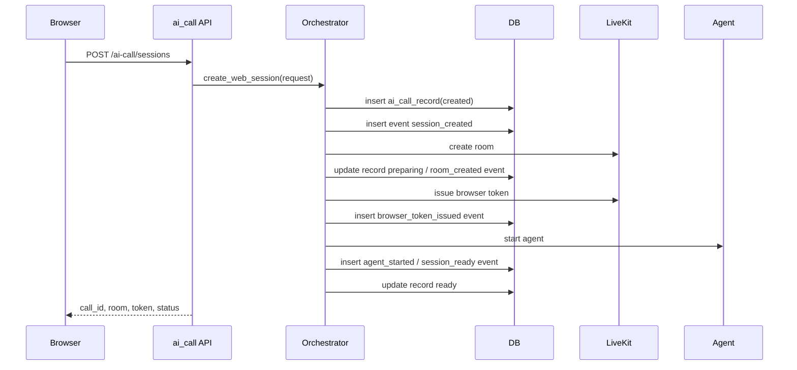
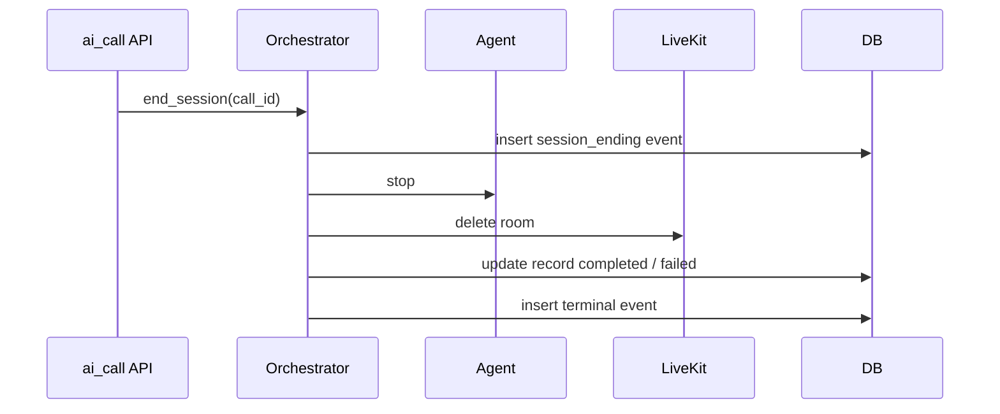

# Phase B1：记录与查询正式技术设计

最后更新：2026-06-15

## 1. 文档定位

本文档是 Phase B1 的正式技术设计，用于指导后续实现、测试和评审。

Phase B1 只解决一个问题：把 Phase A 已跑通的 Web 实时通话链路，补成每通会话可持久化、可查询、可复盘的最小商用闭环。

Phase B1 不改变实时主链路：

```text
Web 入口
  -> Call Session
  -> LiveKit Room
  -> Realtime Call Agent
  -> Qwen Omni Realtime
```

Phase B1 新增的是数据与查询闭环：

```text
Call Session
  -> Call Record
  -> Call Event
  -> Result Query API
```

实现前必须先读：

1. [../OUTLINE.md](../OUTLINE.md)
2. [phase-a-acceptance-report.md](phase-a-acceptance-report.md)
3. [phase-b-web-commercial-loop-pre-design.md](phase-b-web-commercial-loop-pre-design.md)
4. 当前代码中的 `app/api/v1/ai_call/`、`app/services/ai_call/`、`app/core/base_crud.py`、`app/core/dependencies.py`

## 2. 阶段结论

Phase A 补证项不阻塞 Phase B1 设计。

原因是 Phase A 待补证项主要证明实时链路体验，例如 5 分钟真实多轮通话、浏览器侧首包 p50/p90、误打断样本。Phase B1 的设计核心是持久化和查询闭环，这些补证项不会改变 B1 的表边界、接口边界和模块边界。

但 Phase A 补证项会影响 Phase B1 的实现和验收门禁：

1. B1 可以先设计。
2. B1 可以先实现记录、事件和查询的基础能力。
3. Phase A 补证未关闭时，B1 验收不能宣称“商用通话体验已达标”。
4. 如果补证前进入 B1 实现，验收报告必须把 Phase A 待补证项列为已知风险。

## 3. 目标、非目标、完成定义

### 3.1 目标

Phase B1 必须做到：

1. 创建 Web 会话时持久化通话记录。
2. 通话过程中持久化关键事件。
3. 会话结束或失败后，可以按 `call_id` 查询通话摘要和事件时间线。
4. 失败会话可以看到失败阶段、失败原因和最后关键事件。

### 3.2 非目标

Phase B1 不做：

1. 真实 SIP 外呼。
2. 批量外呼任务。
3. 录音文件生成、录音播放和 LiveKit Egress 接入。
4. 完整转人工和坐席工作台。
5. 复杂质检、摘要、评分、业务意图分析。
6. 多模型路由、模型切换、音色管理和后端音色白名单。
7. 并发压测和容量结论。
8. 旧数据兼容设计。本功能没有旧数据，不需要兼容旧字段或旧状态。

### 3.3 完成定义

Phase B1 完成必须同时满足：

1. 一通 Web 会话创建后，数据库中存在一条 `ai_call_record`。
2. 该通会话的关键状态事件、浏览器事件、模型错误、打断事件可按顺序查询。
3. 正常结束会话最终状态为 `completed`，失败会话最终状态为 `failed`。
4. 查询接口返回的 `bigint` 主键或业务 ID 均为字符串。
5. 自动化测试覆盖正常完成、失败、事件顺序、bigint 字符串输出和无物理外键。

## 4. 当前代码事实

Phase A 当前事实：

1. `call_id` 由 `call_` 加雪花 ID 组成，例如 `call_324827628607397888`。
2. 当前会话注册表是 `InMemorySessionRegistry`，不支持进程重启后的会话追溯。
3. 当前事件存储是 `InMemoryEventStore`，不承诺进程重启后的追溯。
4. 当前指标是 `CallMetrics` 内存快照，B1 不把它固化为业务表。
5. 当前 AI Call API 已有创建会话、重新签发 Token、查询会话、查询事件、上报浏览器事件和结束会话。
6. 当前 Python 仓库没有 `TenantEntity` 类名；现有模型使用 `MappedBase`。
7. 当前 `ai_call` 路由没有接入 `get_current_user`，B1 明确暂不强制登录态。

设计推论：

1. B1 不能继续只依赖内存态对象。
2. B1 的持久化层必须贴合现有 SQLAlchemy 2.0 `Mapped` / `mapped_column` 写法。
3. B1 先通过 `business_type + business_id` 关联上游业务，不提前引入租户字段。
4. B1 的 standalone 本地验证允许不传业务 ID，但该模式不能作为生产业务归属验收依据。

## 5. 表设计原则

Phase B1 表设计必须遵守：

1. 不使用 `jsonb` 等强数据库绑定类型。需要保存结构化快照时，统一使用 `Text` 或足够长度的 `String` 保存 JSON 字符串。
2. 不创建物理外键。业务关联通过 `business_type`、`business_id`、`call_id`、唯一约束、普通索引和代码查询校验保证。
3. 涉及 `BigInteger` 主键或雪花业务 ID 时，API 返回前端统一转为字符串，避免 JavaScript 数字精度丢失。
4. B1 不预置 `tenant_id`。如果未来 AI Call 服务自身承担多租户查询，再统一引入租户字段或租户实体。
5. 生产代码不得在各处散落业务关联校验；查询走统一 CRUD 或服务层封装。
6. 能用普通索引和业务唯一约束表达的关系，不通过数据库外键绑定。
7. 字段命名贴近业务含义，不为临时页面展示增加无稳定业务价值的冗余字段。
8. 本阶段没有旧数据，不做旧字段、旧状态和旧接口兼容。

## 6. 数据对象总览

Phase B1 只落以下 2 类对象：

| 对象 | 表 | 必要性 | 说明 |
|---|---|---|---|
| 通话记录 | `ai_call_record` | 必做 | 单通会话主记录，保存状态、入口、Room、开始结束时间和失败摘要 |
| 关键事件 | `ai_call_event` | 必做 | 保存可复盘的低频关键事件，不保存原始音频内容 |

Phase B1 不单独创建 `ai_call_result` 表。

原因：B1 的“通话结果”可以由 `ai_call_record` 和 `ai_call_event` 组合查询得到。单独建结果表会把状态、失败原因、最后事件等信息重复存储，短期只服务页面展示，不具备稳定业务价值。

## 7. 表结构设计

### 7.1 `ai_call_record`

用途：每通会话一条主记录。

| 字段 | 类型 | 必填 | 说明 |
|---|---|---|---|
| `id` | `bigint` | 是 | 雪花主键，API 返回为字符串 |
| `call_id` | `varchar(64)` | 是 | 通话业务 ID，例如 `call_324827628607397888` |
| `business_type` | `varchar(32)` | 否 | 上游业务类型，例如 `debt`、`task`、`customer`；B1 不枚举、不建配置表 |
| `business_id` | `varchar(64)` | 否 | 上游业务 ID，使用字符串保存，避免不同业务 ID 类型不一致 |
| `entry_type` | `varchar(20)` | 是 | 入口类型，B1 固定为 `web` |
| `room_name` | `varchar(128)` | 是 | LiveKit Room 名称 |
| `participant_identity` | `varchar(128)` | 是 | 用户侧 Participant identity；B1 Web 场景为浏览器身份，后续 SIP 场景可记录电话侧身份 |
| `status` | `varchar(32)` | 是 | 当前或最终会话状态 |
| `end_reason` | `varchar(64)` | 否 | 结束原因，例如 `web_user_end`、`local_hangup`、`remote_hangup`、`agent_start_failed`、`model_error` |
| `failure_stage` | `varchar(64)` | 否 | 失败阶段，例如 `room_create`、`agent_start`、`provider_connect`、`runtime` |
| `failure_message` | `varchar(500)` | 否 | 面向排障的失败摘要，不保存堆栈 |
| `started_at` | `timestamp` | 是 | 会话创建时间 |
| `answered_at` | `timestamp` | 否 | 用户侧接通或进入可通话状态时间；Web 场景为浏览器 ready，SIP 场景为被叫接听并进入媒体通话 |
| `ended_at` | `timestamp` | 否 | 会话进入终态的时间 |
| `duration_ms` | `integer` | 否 | 通话持续毫秒，优先按 `ended_at - answered_at` 计算；未接通时可按 `ended_at - started_at` 记录会话占用时长 |

约束和索引：

| 类型 | 字段 | 说明 |
|---|---|---|
| 主键 | `id` | 不自增，使用雪花 ID |
| 唯一约束 | `call_id` | 通话 ID 全局唯一 |
| 普通索引 | `status, started_at` | 列表按状态和时间查询 |
| 普通索引 | `entry_type, started_at` | 入口维度查询 |
| 普通索引 | `business_type, business_id` | 上游业务反查通话记录 |
| 普通索引 | `room_name` | 按 LiveKit Room 排障 |

不建物理外键。

### 7.2 `ai_call_event`

用途：保存可复盘的关键事件。

| 字段 | 类型 | 必填 | 说明 |
|---|---|---|---|
| `id` | `bigint` | 是 | 雪花主键，API 返回为字符串 |
| `call_id` | `varchar(64)` | 是 | 通话业务 ID |
| `event_id` | `varchar(64)` | 是 | 事件业务 ID，例如 `evt_324...`，用于前端增量查询 |
| `event_type` | `varchar(80)` | 是 | 事件类型 |
| `source` | `varchar(32)` | 是 | 事件来源，例如 `orchestrator`、`livekit`、`agent`、`provider`、`browser`、`sip` |
| `event_time` | `timestamp` | 是 | 事件发生时间 |
| `payload_json` | `text` | 否 | 已脱敏后的 JSON 字符串 |

约束和索引：

| 类型 | 字段 | 说明 |
|---|---|---|
| 主键 | `id` | 不自增，使用雪花 ID |
| 唯一约束 | `event_id` | 事件业务 ID 全局唯一 |
| 普通索引 | `call_id, id` | 按通话和写入顺序增量查询 |
| 普通索引 | `call_id, event_time` | 按通话和时间查询 |
| 普通索引 | `call_id, event_type` | 按通话和事件类型排障 |

事件查询默认按 `id` 升序返回，表示服务端写入顺序；`event_time` 表示事件实际发生时间，用于时间线展示和排障。

B1 推荐落库事件：

| 类型 | 是否落库 | 说明 |
|---|---|---|
| `session_created` | 是 | 会话创建 |
| `session_preparing` | 是 | 会话准备中 |
| `room_created` | 是 | Room 创建成功 |
| `browser_token_issued` | 是 | 浏览器 Token 签发，不保存 Token |
| `agent_started` | 是 | Agent 启动 |
| `session_ready` | 是 | 会话可连接 |
| `browser_ready` | 是 | 浏览器已连接并准备收发音频 |
| `opening_started` | 是 | 开场白触发 |
| `user_speech_started` | 是 | 用户开始说话，来自供应商事件 |
| `user_speech_stopped` | 是 | 用户停止说话，来自供应商事件 |
| `browser_user_speech_started` | 是 | 浏览器侧检测到用户开始说话 |
| `model_response_started` | 是 | 模型开始响应 |
| `model_response_done` | 是 | 模型响应完成 |
| `model_error` | 是 | 模型错误 |
| `interrupt_confirmed` | 是 | 打断已确认 |
| `interrupt_cleanup_failed` | 是 | 打断清理失败 |
| `agent_error` | 是 | Agent 运行错误 |
| `session_ending` | 是 | 会话结束中 |
| `session_completed` | 是 | 会话正常结束 |
| `session_failed` | 是 | 会话失败 |

说明：

1. 上表不是冻结枚举，只是 B1 推荐落库范围。
2. 后续真实线路接入时，可以继续扩展 `sip_invite_sent`、`sip_ringing`、`sip_answered`、`media_connected`、`sip_hangup`、`sip_failed` 等事件类型，不需要改表。
3. SIP、LiveKit、浏览器、模型和 Agent 的差异通过 `source + event_type + payload_json` 表达，不为未来线路提前增加专属列。

高频音频事件处理规则：

1. `model_audio_delta` 不逐条落库，可在必要时通过低频事件或日志辅助分析首包。
2. `ai_audio_published` 不逐帧落库，可在必要时通过低频事件或日志辅助分析发布延迟。
3. 若需要排查音频细节，优先查服务端日志和运行态 debug，不把高频音频帧写入业务事件表。
4. `payload_json` 必须脱敏，不能保存 prompt 原文、开场白原文、Token、API Key、完整音频 delta、完整手机号、身份证、银行卡或录音原文。

指标表延后说明：

1. B1 不创建 `ai_call_metric`。
2. B1 查询详情如需展示简单耗时，优先从 `ai_call_event` 时间线临时计算。
3. Phase C 并发压测或后续报表如果需要跨会话统计，再单独设计指标汇总表、指标样本表或时序指标方案。

## 8. 状态与结果定义

### 8.1 会话状态

B1 沿用 Phase A 状态，不新增旧状态兼容：

| 状态 | 说明 |
|---|---|
| `created` | 运行态会话对象已创建 |
| `preparing` | 正在创建 Room、签 Token、启动 Agent |
| `ready` | Room 和 Agent 准备完成，等待浏览器进入 |
| `connected` | 浏览器或模型会话已连接 |
| `user_speaking` | 用户正在说话 |
| `ai_thinking` | 用户说完，模型准备响应 |
| `ai_speaking` | AI 正在播报 |
| `interrupted` | AI 被用户打断 |
| `waiting` | 等待用户或外部状态 |
| `ending` | 结束处理中 |
| `completed` | 正常结束 |
| `failed` | 失败结束 |

终态只有：

1. `completed`
2. `failed`

### 8.2 结束原因

`end_reason` 用于描述为什么进入终态。

设计原则：

1. `status` 只表达这通会话是否被系统正常收口。
2. `end_reason` 表达结束原因和挂断来源。
3. 用户侧、平台侧或线路侧的正常挂断都归为 `completed`。
4. 系统能力失败、供应商失败或媒体链路异常才归为 `failed`。

| end_reason | 终态 | 说明 |
|---|---|---|
| `web_user_end` | `completed` | Web 用户点击结束按钮 |
| `browser_disconnect` | `completed` | 浏览器关闭、刷新、断网或 WebRTC 断开；B1 默认按用户侧断开收口 |
| `local_hangup` | `completed` | 平台、AI 或本系统主动挂断；后续真实线路适用 |
| `remote_hangup` | `completed` | 电话用户侧主动挂断；后续真实线路适用 |
| `no_answer` | `completed` | 外呼未接听；属于呼叫结果，不是系统失败 |
| `rejected` | `completed` | 被叫拒接；属于呼叫结果 |
| `busy` | `completed` | 被叫忙线；属于呼叫结果 |
| `cancelled` | `completed` | 平台主动取消未接通外呼，例如任务取消 |
| `normal_completed` | `completed` | 系统按业务流程正常完成通话 |
| `room_create_failed` | `failed` | LiveKit Room 创建失败 |
| `agent_start_failed` | `failed` | Agent 启动失败 |
| `provider_connect_failed` | `failed` | Qwen Realtime 连接失败 |
| `model_error` | `failed` | 模型返回错误 |
| `media_lost` | `failed` | WebRTC、SIP、RTP 等媒体链路异常丢失，且不是用户侧正常挂断 |
| `timeout` | `failed` | 系统内部超时；未接听超时应优先归为 `no_answer` |
| `unknown` | `failed` | 未分类异常 |

终态写入要求：

1. B1 不新增 `hangup_side` 字段，挂断来源统一由 `end_reason` 表达。
2. `session_completed` 和 `session_failed` 终态事件的 `payload_json` 必须包含 `endReason`。
3. 失败终态事件如果有明确阶段和摘要，应同时包含 `failureStage` 和 `failureMessage`。

## 9. API 设计

### 9.1 响应规则

除分页列表外，所有 `/ai-call` HTTP JSON API 保持小写三段式：

```json
{
  "code": 200,
  "msg": "查询成功",
  "data": {}
}
```

规则：

1. 响应体 `code` 只使用 `200` 和 `500`。
2. 失败时 `data` 为 `null`。
3. 错误展示文案放在 `msg`。
4. `id` 等 `bigint` 字段对前端输出为字符串。
5. `callId`、`eventId` 本身已经是字符串，保持字符串。
6. 分页列表接口使用现有 `TableResponse` 形态，`total` 和 `rows` 放在最外层。

分页列表成功响应：

```json
{
  "total": 1,
  "rows": [],
  "code": 200,
  "msg": "查询成功"
}
```

分页列表失败时仍走统一错误响应，返回 `code/msg/data`，且 `data=null`。

### 9.2 现有 Session API

现有 API 保留：

| 方法 | 路径 | B1 行为 |
|---|---|---|
| `POST` | `/ai-call/sessions` | 创建运行态会话，同时创建通话记录 |
| `POST` | `/ai-call/sessions/{callId}/token` | 重新签发浏览器 Token，同时写入关键事件 |
| `GET` | `/ai-call/sessions/{callId}` | 查询运行态状态；B1 可叠加持久化兜底 |
| `GET` | `/ai-call/sessions/{callId}/events` | 查询当前会话事件；B1 改为优先查持久化事件 |
| `POST` | `/ai-call/sessions/{callId}/browser-events` | 上报浏览器事件，同时写入关键事件 |
| `POST` | `/ai-call/sessions/{callId}/end` | 结束会话，同时更新记录终态 |

### 9.3 新增记录查询 API

#### 9.3.1 查询通话记录列表

```http
GET /ai-call/records
```

查询参数：

| 参数 | 类型 | 说明 |
|---|---|---|
| `callId` | string | 精确查询 |
| `businessType` | string | 上游业务类型过滤 |
| `businessId` | string | 上游业务 ID 过滤 |
| `status` | string | 状态过滤 |
| `entryType` | string | 入口类型，B1 只有 `web` |
| `startedAtBegin` | string | 开始时间起 |
| `startedAtEnd` | string | 开始时间止 |
| `pageNum` | int | 页码 |
| `pageSize` | int | 每页数量 |

返回 `TableResponse`：

```json
{
  "rows": [
    {
      "id": "324900000000000001",
      "callId": "call_324827628607397888",
      "businessType": "debt",
      "businessId": "324800000000000001",
      "entryType": "web",
      "status": "completed",
      "endReason": "web_user_end",
      "startedAt": "2026-06-15 10:00:00",
      "answeredAt": "2026-06-15 10:00:08",
      "endedAt": "2026-06-15 10:05:20",
      "durationMs": 320000
    }
  ],
  "total": 1,
  "code": 200,
  "msg": "查询成功"
}
```

#### 9.3.2 查询通话详情

```http
GET /ai-call/records/{callId}
```

返回 `data`：

```json
{
  "record": {
    "id": "324900000000000001",
    "callId": "call_324827628607397888",
    "businessType": "debt",
    "businessId": "324800000000000001",
    "entryType": "web",
    "roomName": "ai-call-call_324827628607397888",
    "participantIdentity": "browser-call_324827628607397888",
    "status": "completed",
    "endReason": "web_user_end",
    "failureStage": null,
    "failureMessage": null,
    "startedAt": "2026-06-15 10:00:00",
    "answeredAt": "2026-06-15 10:00:08",
    "endedAt": "2026-06-15 10:05:20",
    "durationMs": 320000
  },
  "lastEvent": {
    "id": "324900000000000099",
    "eventId": "evt_324827628607397999",
    "eventType": "session_completed",
    "source": "orchestrator",
    "eventTime": "2026-06-15 10:05:20",
    "payload": {
      "endReason": "web_user_end"
    }
  }
}
```

说明：

1. `record` 来自 `ai_call_record`。
2. `lastEvent` 来自 `ai_call_event` 的最后一条关键事件。

#### 9.3.3 查询通话事件

```http
GET /ai-call/records/{callId}/events
```

查询参数：

| 参数 | 类型 | 说明 |
|---|---|---|
| `limit` | int | 默认 200，最大 1000 |
| `afterEventId` | string | 从某事件之后增量查询 |
| `eventType` | string | 可选，事件类型过滤 |
| `source` | string | 可选，事件来源过滤 |

返回 `data`：

```json
{
  "rows": [
    {
      "id": "324900000000000002",
      "eventId": "evt_324827628607397889",
      "callId": "call_324827628607397888",
      "eventType": "session_created",
      "source": "orchestrator",
      "eventTime": "2026-06-15 10:00:00",
      "payload": {}
    }
  ],
  "total": 1
}
```

实现说明：

1. `/ai-call/records/{callId}/events` 是历史记录详情入口。
2. 现有 `/ai-call/sessions/{callId}/events` 可继续保留，但必须复用同一个事件查询服务，不能重复实现两套事件查询逻辑。

## 10. 模块设计

建议新增或调整：

```text
app/api/v1/ai_call/
  controller.py
  schema.py
  service.py
  model.py
  crud.py

app/services/ai_call/
  record_service.py
  persistent_event_store.py
```

职责：

| 模块 | 职责 |
|---|---|
| `model.py` | 定义 B1 两张表的 SQLAlchemy 模型 |
| `crud.py` | 封装记录和事件查询写入 |
| `schema.py` | 定义 B1 输入输出模型，并把 bigint 输出为字符串 |
| `controller.py` | 暴露 records 查询 API，不直接拼 SQL |
| `service.py` | 编排查询结果，保持统一响应 |
| `record_service.py` | 创建和更新通话记录、终态 |
| `persistent_event_store.py` | 在关键事件产生时写入 DB |

设计规则：

1. Controller 不直接操作数据库。
2. Provider 不直接写数据库。
3. Agent 只发出事件，不感知表结构。
4. Orchestrator 可以调用记录服务，但不能把表字段散落在实时链路里。
5. 查询必须统一经过 CRUD 或服务层封装，不能各处手写业务过滤和权限过滤。
6. B1 当前不强制登录态，不要直接套用强依赖 `AuthSchema` 的通用 `CRUDBase`；可以先使用 AI Call 专用 CRUD 或 Repository，等生产认证边界确认后再接统一权限能力。

## 11. 写入时序

### 11.1 创建会话



写入规则：

1. DB 记录创建失败时，不继续创建 Room 和 Agent。
2. Room 或 Agent 创建失败时，必须更新 `ai_call_record.status=failed`，并写入失败事件。
3. Token 不入库，只记录签发事件和过期秒数。

### 11.2 通话中事件

1. 状态类、错误类和低频业务关键事件写入 DB。
2. 高频音频帧事件不逐条写入 DB。
3. 终态和失败事件写入失败时必须记录服务端错误日志。
4. 普通通话中事件写入不能让实时音频链路长时间阻塞；实现时应控制短超时，必要时可后台补写。

### 11.3 结束会话



结束规则：

1. `ended_at` 只在进入终态时写入。
2. `duration_ms` 只在进入终态时计算。
3. 重复结束已完成会话时，不重复写终态事件。

## 12. 租户隔离设计

### 12.1 表级要求

B1 当前先不把租户隔离作为表设计前提。

原因是 B1 先作为通用外呼引擎的记录与查询闭环，上游业务归属通过 `business_type` 和 `business_id` 关联。租户、权限和业务归属如果由上游业务系统负责，AI Call 表不提前重复保存 `tenant_id`。

如果未来 AI Call 服务自身要直接面向多个租户提供查询，再统一引入租户隔离字段或租户实体，不在 B1 里提前硬塞。

### 12.2 写入要求

生产集成模式：

1. 上游业务系统创建通话时应传入稳定的 `business_type` 和 `business_id`。
2. AI Call 服务通过 `business_type + business_id` 关联业务，不反向承担上游业务权限判断。
3. B1 当前不接 `get_current_user`，不要求所有 Session API 强制登录，也不因为登录态额外保存审计字段。

standalone 本地验证模式：

1. 允许不传 `business_type` 和 `business_id`。
2. 该模式只用于本地延迟和链路验证。
3. 该模式不作为生产业务归属验收依据。

### 12.3 查询要求

查询接口必须做到：

1. `call_id` 全局唯一，详情和事件查询均以 `call_id` 为主。
2. 上游业务反查通话记录时，使用 `business_type + business_id`。
3. 如果未来引入租户隔离，不能在各处手写租户条件，应通过统一实体或查询封装处理。

## 13. BigInt 输出设计

所有 `BigInteger` 字段在 Python 内部可以保持 `int`，但 API 输出给前端时必须转为字符串。

时间字段统一按 UTC 语义保存和输出；如果项目后续统一 PostgreSQL `timestamptz`，实现时再映射为对应 SQLAlchemy 类型，不在 B1 文档中引入数据库专属字段类型。

需要转字符串的字段：

1. `id`

不需要转换的字段：

1. `callId`，本来就是字符串。
2. `eventId`，本来就是字符串。
3. `businessId`，按字符串保存和输出。
4. `durationMs` 不是 ID，可以继续返回数字。

Schema 建议：

1. 输出模型中将 ID 字段声明为 `str | None`。
2. 使用字段序列化器或 Service 层转换，避免前端收到裸 `bigint`。
3. 输入接口如果接收内部主键，也按字符串接收，再由后端转换和校验。

## 14. 安全与脱敏

Phase B1 数据库不能保存：

1. LiveKit API Secret。
2. DashScope API Key。
3. 浏览器 Room Token。
4. 完整 prompt 原文。
5. 完整开场白原文。
6. Qwen 原始音频 delta。
7. 录音原文或转写原文。
8. 完整手机号、身份证、银行卡等敏感业务字段。
9. Python 堆栈或供应商完整原始错误。

可以保存：

1. Token 过期秒数。
2. 已脱敏的事件 payload JSON 字符串。
3. 失败阶段和失败摘要。
4. 音频 delta 字节数等非内容排障信息。

## 15. 测试设计

### 15.1 自动化测试

必须新增测试覆盖：

1. 创建会话成功后创建 `ai_call_record`。
2. `session_created -> session_ready` 关键事件可按写入顺序查询。
3. Agent 启动失败时记录状态为 `failed`，写入 `agent_start_failed` 和 `session_failed`。
4. 浏览器上报事件后写入 `ai_call_event`。
5. 结束会话后记录 `ended_at`、`duration_ms`、`status=completed`。
6. Web 用户主动结束时记录 `completed + web_user_end`。
7. 浏览器断开时记录 `completed + browser_disconnect`。
8. 系统能力失败时记录 `failed` 和对应失败 `end_reason`。
9. 事件 payload 不包含 Token、prompt 原文、音频 delta。
10. `call_id` 全局唯一。
11. API 输出的 `BigInteger` ID 是字符串。
12. SQLAlchemy 模型不声明 `ForeignKey` 和 `relationship`。

### 15.2 手工验收

手工验收至少覆盖：

1. 创建一通 Web 会话。
2. 浏览器接入并触发开场白。
3. 用户说话并收到 AI 回复。
4. 用户打断一次 AI。
5. 结束会话。
6. 通过 `/ai-call/records/{callId}` 查询摘要。
7. 通过 `/ai-call/records/{callId}/events` 查询事件顺序。
8. 使用 `business_type + business_id` 反查该通会话。

## 16. 实施顺序

建议按以下顺序实现：

1. 新增 B1 SQLAlchemy 模型和 schema。
2. 新增 `ai_call` CRUD。
3. 在创建会话链路写入 `ai_call_record`。
4. 新增持久化事件写入封装，先覆盖低频关键事件。
5. 在结束和失败链路更新终态和结束原因。
6. 新增 `/ai-call/records` 查询接口。
7. 补齐 BigInt 字符串输出、业务反查和无外键测试。
8. 手工跑一通 Web 会话，更新 B1 验收记录。

## 17. 延后到 B2/B3 的内容

B1 只预留边界，不实现：

| 内容 | 延后原因 |
|---|---|
| LiveKit Egress 录音 | 需要单独定稿录音格式、触发时机、文件索引和 sys_oss 关系 |
| 录音播放 | 依赖录音闭环 |
| 转人工接管 | 需要决定是只做状态事件，还是允许人工 WebRTC 加入 Room |
| 坐席工作台 | 超出 B1 记录查询范围 |
| 通话摘要和质检 | 需要通话后转写或额外模型任务 |
| 并发容量统计 | 属于 Phase C |

## 18. 已确认结论

### 18.1 已确认

以下结论进入 B1 实现时直接按文档执行：

1. B1 当前不强制登录态，不接 `get_current_user`。
2. 分页列表使用现有 `TableResponse` 形态，其他接口使用经典 `code/msg/data` 三段式。
3. 结束原因按 8.2 的 `end_reason` 表执行，`browser_disconnect` 在 B1 默认归为 `completed`。
4. 上游业务接入时 `business_type` 由调用方直接传入，B1 不建枚举表、不建配置表。
5. 后端查询详情同时返回 `failure_stage` 和 `failure_message`；前端可按页面需要决定展示粒度，后端不裁掉排障字段。
