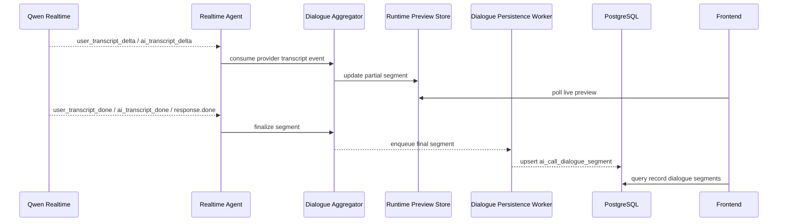

# Phase B2.5：对话文本闭环正式技术设计

最后更新：2026-06-16

## 1. 文档定位

本文档是 Phase B2.5 的正式设计稿，目标是在 B1 通话记录与事件、B2 录音闭环的基础上，补齐“通话中实时预览”和“通话后左右气泡复盘”的对话文本能力。

B2.5 不替代 B2。两者职责不同：

```text
B2：录音文件 -> OSS -> sys_oss -> 录音查询 / 播放
B2.5：实时转写事件 -> 对话段聚合 -> 对话查询 / 实时预览 / 左右气泡展示
```

前端最终可以在同一个通话详情入口里同时看到：

1. 通话摘要。
2. 对话气泡。
3. 录音播放器。
4. 关键事件时间线。

## 2. 问题本质

前端要展示的不是“录音文字”，而是“对话段”。

一条可用的对话段至少要回答：

1. 谁说的。
2. 说了什么。
3. 第几段。
4. 什么时候开始和结束。
5. 是否最终确认。
6. 是否被打断。
7. 后续是否可以和录音时间轴关联。

如果只拿 B2 的混音录音文件做事后转写，会遇到三个天然问题：

1. 混音后再判断谁说话需要说话人分离，打断和重叠说话时不稳定。
2. 通话未结束时无法实时展示。
3. 事后转写无法准确知道 AI 哪些文字已经实际播放给用户。

所以 B2.5 的主数据源必须是实时会话里的用户转写和 AI 转写事件。录音文件只作为证据和后续离线补偿来源。

## 3. 当前代码事实

当前代码已经具备部分基础：

1. Qwen Realtime 适配器已映射用户转写事件：`user_transcript_delta`、`user_transcript_done`、`user_transcript_failed`。
2. Qwen Realtime 适配器已映射 AI 音频转写事件：`ai_transcript_delta`、`ai_transcript_done`。
3. 会话配置已经开启中文输入转写：`input_audio_transcription.language=zh`。
4. Agent 当前会把供应商事件写入运行态 `InMemoryEventStore`。
5. Agent 当前已经用用户转写驱动打断确认和下一轮回复。
6. B1 的 `AiCallEventPersistenceWorker` 当前只持久化低频关键事件，不持久化完整用户转写和 AI 转写。
7. B1 文档明确 `ai_call_event` 不应该保存录音原文或转写原文。

设计推论：

1. B2.5 不能把完整转写原文塞进 `ai_call_event.payload_json`。
2. B2.5 应新增独立业务表保存对话段。
3. 实时预览可以读运行态聚合结果，通话后复盘必须读持久化对话段。
4. 对话段写库必须异步，只写必要归档段，不能让实时音频链路等待数据库。

## 4. 设计目标

B2.5 必须做到：

1. 通话中可以看到实时对话预览。
2. 通话结束后可以按 `call_id` 查询稳定对话段。
3. 前端可以按 `speaker_type` 渲染左右气泡。
4. 设计提前兼容后续转人工，不把说话方写死成 `user/ai` 两类。
5. AI 被打断时，对话段能表达 `interrupted`。
6. 对话段可以和录音时间轴做弱关联，支持后续点击气泡定位录音。
7. 不增加用户听到 AI 的实时首包延迟。
8. 表设计遵守当前项目规范：PostgreSQL 可用、不使用 `jsonb`、不建物理外键、BigInt 输出按字符串处理。

## 5. 非目标

B2.5 不做以下内容：

| 内容 | 不做原因 |
|---|---|
| 混音录音强制说话人分离 | 主链路已能拿到双方实时文本，混音分离成本高且不稳定 |
| 离线 ASR 全量重转写 | 可作为后续补偿，不是 B2.5 主路径 |
| 摘要、质检、意图识别 | 属于通话后分析阶段 |
| 完整坐席工作台 | 属于 B3 或后续坐席系统 |
| 人工坐席语音转写闭环 | B2.5 先预留 `human_agent` 角色，真正采集由 B3 定稿 |
| 逐字级时间戳 | 当前前端气泡不需要逐字定位，先做到段级时间 |
| 转写准确率兜底承诺 | B2.5 保存供应商实时转写结果，不承诺比供应商更高准确率 |
| 通过对话文本重放模型上下文 | 模型实时上下文仍由 Realtime 会话维护，文本复盘不反向改主链路 |

## 6. 总体方案

### 6.1 主方案

采用“运行态聚合 + 最终段异步持久化”的方案。



核心原则：

1. 供应商实时转写事件是主数据源。
2. 运行态预览优先服务通话中展示。
3. 持久化表服务通话后复盘。
4. 录音文件只做证据和补偿，不作为左右气泡的主来源。
5. 写库不进入实时音频热路径。

### 6.2 与 B2 录音的关系

B2.5 消费同一个 `call_id`，但不依赖录音文件生成成功。

| 场景 | B2 录音 | B2.5 对话文本 |
|---|---|---|
| 录音成功，转写成功 | 可播放录音 | 可展示气泡 |
| 录音失败，转写成功 | 无录音或录音失败提示 | 仍可展示气泡 |
| 录音成功，转写失败 | 可播放录音 | 展示转写失败或空对话 |
| 通话中未结束 | 录音可能还在生成中 | 可以实时预览 partial |

这两个闭环不能互相阻塞。

## 7. 数据来源设计

### 7.1 用户侧文本

主数据源：

1. `user_transcript_delta`
2. `user_transcript_done`
3. `user_transcript_failed`

当前 Qwen 事件中，`conversation.item.input_audio_transcription.delta` 可能使用 `text + stash` 表示当前预览文本，不能按传统增量字符串简单追加。

聚合规则：

1. `user_speech_started` 或第一条用户转写事件开启一个 `customer` 段。
2. `user_transcript_delta` 更新当前段的 `partial` 文本。
3. `user_speech_stopped` 只更新时间边界、音频偏移和打断判断，不确认最终文本。
4. `user_transcript_done` 后确认最终文本。
5. 没有有效文本的噪声段不生成正式对话段。
6. `user_transcript_failed` 只记录失败状态，不生成空气泡。

### 7.2 AI 侧文本

主数据源：

1. `ai_transcript_delta`
2. `ai_transcript_done`
3. `model_response_done`
4. `interrupt_confirmed`

聚合规则：

1. `model_response_started` 或第一条 AI 转写事件开启一个 `ai` 段。
2. `ai_transcript_delta` 更新当前 AI 段的 `partial` 文本。
3. `ai_transcript_done` 或 `model_response_done` 后确认最终文本。
4. 如果 AI 说话过程中被用户打断，当前 AI 段标记为 `interrupted`。
5. 被打断时，不能假设模型已经生成的完整文本都被用户听到；如果无法准确判断已播放范围，前端应展示“被打断”状态。

### 7.3 人工坐席文本

B2.5 只预留人工坐席的说话方表达，不实现完整坐席转写。

后续 B3 接入转人工后，可以通过以下方式写入 `human_agent` 段：

1. 坐席侧手动输入的备注或话术。
2. 坐席 WebRTC 音频接入后的独立 ASR。
3. 坐席系统回传的对话文本事件。

B2.5 表结构必须能保存 `human_agent`，但 B2.5 不要求现在就把人工坐席语音转写做完。

## 8. 表设计原则

B2.5 表设计必须遵守：

1. 不使用 `jsonb` 等强数据库绑定类型。
2. 不创建物理外键。
3. 主键统一使用 `id` 字段，类型为 `bigint`，雪花 ID。
4. BigInt 主键和业务 ID 输出给前端时转字符串。
5. 不预置 `tenant_id`。当前 AI Call 通过 `business_type + business_id` 关联上游业务。
6. 不把完整对话文本塞进 `ai_call_event.payload_json`。
7. 不保存前端展示专用字段，例如 `bubble_side`、`avatar_url`、`display_color`。
8. 字段命名贴近业务含义，避免临时页面字段。

## 9. 表结构设计

### 9.1 `ai_call_dialogue_segment`

用途：保存每通会话的对话段。

| 字段 | 类型 | 必填 | 说明 |
|---|---|---|---|
| `id` | `bigint` | 是 | 雪花主键，API 返回为字符串；运行态 partial 段未落库时可以没有 ID |
| `call_id` | `varchar(64)` | 是 | 通话业务 ID，对应 `ai_call_record.call_id`，不建物理外键 |
| `segment_no` | `integer` | 是 | 本通会话内递增序号，从 1 开始 |
| `speaker_type` | `varchar(32)` | 是 | 说话方类型，见 9.3 |
| `speaker_identity` | `varchar(128)` | 否 | 具体参与者身份，优先使用 LiveKit participant identity 或坐席系统身份；供应商未稳定返回时允许为空 |
| `source` | `varchar(32)` | 是 | 文本来源，见 9.4 |
| `source_segment_id` | `varchar(128)` | 是 | 来源侧文本段 ID；Qwen 使用 `item_id`，SIP/STT 线路使用 utterance id 或适配层生成的稳定段 ID；用于幂等落库和重复回调去重 |
| `segment_text` | `text` | 是 | 对话文本；避开 `text` 作为字段名带来的 SQL 语义歧义；允许保存用户和 AI 原话，因此访问必须受控 |
| `segment_status` | `varchar(32)` | 是 | 段状态，见 9.2 |
| `started_at` | `timestamp with time zone` | 否 | 段开始时间，优先使用 speech started 或 response started 时间；异常补偿段允许为空 |
| `ended_at` | `timestamp with time zone` | 否 | 段结束时间，final/interrupted/failed 时写入 |
| `duration_ms` | `integer` | 否 | 段持续毫秒 |
| `audio_start_ms` | `integer` | 否 | 相对录音开始的毫秒偏移，后续点击气泡定位录音使用 |
| `audio_end_ms` | `integer` | 否 | 相对录音开始的结束偏移 |
| `failure_stage` | `varchar(64)` | 否 | 失败阶段，例如 `transcript_failed`、`persist_failed` |
| `failure_message` | `varchar(500)` | 否 | 失败摘要，不保存堆栈和敏感配置 |

不增加的字段：

| 字段 | 不增加原因 |
|---|---|
| `tenant_id` | 当前 AI Call 不由本模块直接承担租户隔离 |
| `create_by/create_time/update_by/update_time/create_dept` | B2.5 不接登录态审计，时间用业务时间字段表达 |
| `bubble_side` | 左右位置是前端展示策略，由 `speaker_type` 推导 |
| `speaker_display_name` | 坐席名称、客户名称应由业务系统按身份查询或前端映射，不在通用引擎冗余 |
| `confidence` | 当前实时事件未稳定提供统一置信度，不提前造字段 |
| `raw_payload_json` | 原始供应商 payload 进入事件排障链路且需要脱敏，对话表只保存稳定业务文本 |
| `text` | `text` 容易与 PostgreSQL 类型名混淆，表字段使用 `segment_text`；API 可继续输出 `text` 方便前端展示 |
| `recording_id` | 可通过 `call_id` 找录音记录，不建冗余关系 |

### 9.2 段状态

| 状态 | 含义 | 是否建议持久化 |
|---|---|---|
| `partial` | 正在生成中的临时文本 | 否，只保存在运行态 |
| `final` | 已确认的最终对话段 | 是 |
| `interrupted` | AI 段被用户打断，文本可能未完整播放 | 是 |
| `failed` | 该段转写或聚合失败 | 可选，只有有排障价值时保存 |

默认策略：

1. 通话中实时预览读取运行态 `partial`。
2. 数据库主要保存 `final` 和 `interrupted`。
3. 必要时保存有排障价值的 `failed` 段。
4. `partial` 不落库；服务重启、进程退出或运行态丢失时，未完成的临时气泡允许丢失。

### 9.3 `speaker_type`

| 值 | 含义 | 前端默认展示 |
|---|---|---|
| `customer` | 客户、浏览器用户、真实电话被叫用户 | 右侧 |
| `ai` | AI 外呼助手 | 左侧 |
| `human_agent` | 人工坐席 | 左侧，和 AI 做视觉区分 |

说明：

1. 不使用 `user/assistant` 作为数据库值，因为后续真实电话和人工坐席会让语义变模糊。
2. 不把左右气泡方向写进数据库。
3. 系统事件、转人工事件、错误事件继续进 `ai_call_event`，不作为 `speaker_type=system` 的对话段。

### 9.4 `source`

| 值 | 含义 |
|---|---|
| `qwen_realtime` | Qwen Realtime 实时转写事件 |
| `human_agent` | 坐席系统或人工输入 |
| `offline_asr` | 后续通话后补偿转写 |

B2.5 默认只实现 `qwen_realtime`。

### 9.5 PostgreSQL DDL 草案

```sql
create table ai_call_dialogue_segment (
    id bigint not null,
    call_id varchar(64) not null,
    segment_no integer not null,
    speaker_type varchar(32) not null,
    speaker_identity varchar(128),
    source varchar(32) not null,
    source_segment_id varchar(128) not null,
    segment_text text not null,
    segment_status varchar(32) not null,
    started_at timestamp with time zone,
    ended_at timestamp with time zone,
    duration_ms integer,
    audio_start_ms integer,
    audio_end_ms integer,
    failure_stage varchar(64),
    failure_message varchar(500),
    constraint pk_ai_call_dialogue_segment primary key (id),
    constraint uk_ai_call_dialogue_call_no unique (call_id, segment_no),
    constraint uk_ai_call_dialogue_source_segment unique (call_id, speaker_type, source, source_segment_id)
);

create index idx_ai_call_dialogue_speaker
    on ai_call_dialogue_segment (call_id, speaker_type, segment_no);
```

说明：

1. 不建 `call_id -> ai_call_record.call_id` 物理外键。
2. `segment_no` 只在单通会话内递增。
3. `source_segment_id` 不依赖物理外键，表达的是来源侧文本段的业务幂等键；Qwen 实测可能在用户转写和 AI 响应中复用同一个 `item_id`，因此幂等唯一键必须包含 `speaker_type`，不能只用 `(call_id, source, source_segment_id)`。
4. `partial` 不写入该表，表中主要保存 `final`、`interrupted` 和必要的 `failed` 段。
5. `text` 使用 PostgreSQL `text` 类型，同时保持跨数据库迁移时的通用语义。
6. `(call_id, segment_no)` 已由唯一约束覆盖，不额外创建同字段普通索引，避免无意义写入成本。

## 10. 对话段生命周期

### 10.1 用户段

```text
user_speech_started
  -> open customer segment
user_transcript_delta
  -> update partial text
user_transcript_done
  -> final segment
```

边界：

1. `speech_started/stopped` 只用于时间边界、音频偏移和打断判断，不作为正式文本完成信号。
2. 如果只有 `speech_started/stopped`，没有有效文本，不生成正式段。
3. 如果通话结束时仍只有 partial 文本，可由会话结束兜底生成 final 段，但必须沿用同一个 `source_segment_id`，不能重复生成段。
4. 如果转写失败，记录 `user_transcript_failed` 事件即可；是否生成 failed 段由实现根据排障价值决定。
5. 用户打断 AI 时，用户段仍按正常 `customer` 段生成。
6. 对同一 `speaker_type + source_segment_id` 的重复 `transcript_done` 必须幂等 upsert；对极短时间内同一说话方、文本包含关系明显的碎片，聚合器可合并为同一语义发言段。

### 10.2 AI 段

```text
model_response_started
  -> open ai segment
ai_transcript_delta
  -> update partial text
ai_transcript_done 或 model_response_done
  -> final segment
interrupt_confirmed
  -> interrupted segment
```

边界：

1. AI 段的文本来自 `response.audio_transcript.*`，不是从播放音频反向识别。
2. 如果 AI 已生成文本但播放被打断，段状态应为 `interrupted`。
3. 如果无法准确截断到已播放文本，不要假装完整播放；前端用 `interrupted` 明确标记。
4. `response.done` 的 `status=cancelled/failed/incomplete` 不作为 AI final 文本完成信号，避免打断后供应商补发的完成事件形成幽灵气泡。
5. 打断后短时间内出现与上一条 `interrupted` AI 文本完全相同或明显包含关系的 AI 段，应视为同一响应的迟到回调并抑制展示。

### 10.3 人工坐席段

B2.5 只定义数据结构，不要求实现人工坐席段采集。

后续 B3 接入后，人工坐席段可以这样写入：

```text
human_agent_joined
  -> 后续坐席文本 source=human_agent
human_agent_audio_asr_done
  -> speaker_type=human_agent
```

关键点：

1. `speaker_identity` 保存坐席身份，例如 `seat_1001`。
2. 不建坐席表外键。
3. 坐席展示名称由前端或上游坐席系统根据身份查询。

## 11. 聚合器设计

新增 `AiCallDialogueAggregator`，职责如下：

| 职责 | 说明 |
|---|---|
| 运行态聚合 | 把 transcript delta 合成当前 partial 段 |
| 段号分配 | 按 `call_id` 分配递增 `segment_no` |
| 来源段 ID | Qwen 使用 `item_id`，无来源 ID 时由适配层生成稳定 ID |
| ID 分配 | 运行态 partial 不强制分配 DB ID；final/interrupted/failed 落库时生成雪花 `id` |
| 状态转换 | partial -> final / interrupted / failed |
| 队列投递 | final/interrupted 段进入后台持久化队列 |
| 查询快照 | 给通话中预览接口返回当前 rows |

实现要求：

1. 聚合器只做内存计算，不直接写 DB。
2. 持久化由 `AiCallDialoguePersistenceWorker` 或类似后台 worker 完成。
3. 队列满时允许丢弃 partial 更新，但 final/interrupted 段必须记录告警。
4. 不在 provider event 处理函数里等待数据库提交。

## 12. API 设计

### 12.1 通话中实时预览

新增：

```text
GET /ai-call/sessions/{callId}/dialogue-preview
```

查询参数：

| 参数 | 类型 | 必填 | 说明 |
|---|---|---|---|
| `afterSegmentNo` | `integer` | 否 | 只返回指定段号之后的段 |
| `includePartial` | `boolean` | 否 | 是否包含当前 partial 段，默认 `true` |

成功响应：

```json
{
  "code": 200,
  "msg": "操作成功",
  "data": {
    "rows": [
      {
        "id": "325200000000000001",
        "callId": "call_325100000000000000",
        "segmentNo": 1,
        "speakerType": "ai",
        "speakerIdentity": "ai-agent-call_325100000000000000",
        "source": "qwen_realtime",
        "text": "您好，我是凌晨智能助手。",
        "segmentStatus": "final",
        "startedAt": "2026-06-16T10:00:02Z",
        "endedAt": "2026-06-16T10:00:05Z",
        "durationMs": 3000,
        "audioStartMs": 1200,
        "audioEndMs": 4200
      },
      {
        "id": "325200000000000002",
        "callId": "call_325100000000000000",
        "segmentNo": 2,
        "speakerType": "customer",
        "speakerIdentity": "browser-call_325100000000000000",
        "source": "qwen_realtime",
        "text": "我想问一下",
        "segmentStatus": "partial",
        "startedAt": "2026-06-16T10:00:06Z",
        "endedAt": null,
        "durationMs": null,
        "audioStartMs": 5200,
        "audioEndMs": null
      }
    ],
    "total": 2
  }
}
```

说明：

1. 该接口服务通话中预览，优先读取运行态聚合结果。
2. 通话已结束且运行态不存在时，可以降级读取持久化对话段。
3. 该接口不是分页列表，不使用 `TableResponse`，仍使用经典 `code/msg/data`。

### 12.2 通话后对话段查询

新增：

```text
GET /ai-call/records/{callId}/dialogue-segments
```

查询参数：

| 参数 | 类型 | 必填 | 说明 |
|---|---|---|---|
| `afterSegmentNo` | `integer` | 否 | 增量查询 |
| `limit` | `integer` | 否 | 默认 200，最大 500 |

成功响应：

```json
{
  "code": 200,
  "msg": "操作成功",
  "data": {
    "rows": [
      {
        "id": "325200000000000001",
        "callId": "call_325100000000000000",
        "segmentNo": 1,
        "speakerType": "ai",
        "speakerIdentity": "ai-agent-call_325100000000000000",
        "source": "qwen_realtime",
        "text": "您好，我是凌晨智能助手。",
        "segmentStatus": "final",
        "startedAt": "2026-06-16T10:00:02Z",
        "endedAt": "2026-06-16T10:00:05Z",
        "durationMs": 3000,
        "audioStartMs": 1200,
        "audioEndMs": 4200,
        "failureStage": null,
        "failureMessage": null
      }
    ],
    "total": 1
  }
}
```

说明：

1. `id` 输出为字符串。
2. 排序固定按 `segment_no asc`。
3. 查询不到对话段时返回空数组，不返回 404。
4. 该接口不是分页列表，不使用 `TableResponse`。

### 12.3 通话详情扩展

`GET /ai-call/records/{callId}` 可以在 B2.5 增加轻量摘要：

```json
{
  "dialogue": {
    "segmentCount": 12,
    "lastSegmentAt": "2026-06-16T10:05:00Z",
    "hasInterruptedAi": true,
    "transcriptStatus": "completed"
  }
}
```

说明：

1. 详情接口只放摘要，不内嵌完整对话段。
2. 完整对话段通过 `/dialogue-segments` 懒加载。
3. 列表页不应为每条记录批量加载完整对话。

## 13. 前端改动设计

### 13.1 页面入口

B2 和 B2.5 都会影响前端入口，建议统一收敛到“通话详情”。

| 页面 | 改动 |
|---|---|
| 通话记录列表 | 增加详情入口；可展示录音状态和对话段状态的轻量标识 |
| 通话详情页或抽屉 | 新增 `对话`、`录音`、`事件` 三个视图 |
| 客户通话测试台 | 可增加轻量实时对话预览面板，用于调试，不作为正式运营台 |

不要为 B2 单独做一个“录音页面”，再为 B2.5 单独做一个“对话页面”。它们都属于单通通话详情。

### 13.2 详情页视图

建议详情页组织：

| 视图 | 数据来源 | 说明 |
|---|---|---|
| 对话 | `/records/{callId}/dialogue-segments` 或 `/sessions/{callId}/dialogue-preview` | 左右气泡、partial/final/interrupted |
| 录音 | `/records/{callId}/recording` | 音频播放器、录音状态、失败原因 |
| 事件 | `/records/{callId}/events` | B1 关键事件时间线，用于排障 |

对话视图是业务复盘主视图，事件视图是排障视图。不要让前端直接用 `ai_call_event` 渲染对话气泡。

### 13.3 气泡展示规则

前端按 `speaker_type` 映射展示：

| `speaker_type` | 默认位置 | 样式建议 |
|---|---|---|
| `customer` | 右侧 | 客户气泡 |
| `ai` | 左侧 | AI 气泡 |
| `human_agent` | 左侧 | 坐席气泡，与 AI 做视觉区分 |

状态展示：

| `segment_status` | 展示 |
|---|---|
| `partial` | 显示正在生成状态，可以覆盖更新同一个气泡 |
| `final` | 正常文本 |
| `interrupted` | 显示被打断标记 |
| `failed` | 显示转写失败或不展示气泡，按产品决定 |

前端不应根据 `source` 推断左右方向。`source=qwen_realtime` 既可能是用户，也可能是 AI。

### 13.4 实时预览

通话中页面可以轮询：

```text
GET /ai-call/sessions/{callId}/dialogue-preview?afterSegmentNo=0&includePartial=true
```

建议：

1. 轮询间隔 500ms 到 1000ms。
2. 同一个 `id` 的 partial 气泡用新文本覆盖，不新增气泡。
3. 收到 `final` 或 `interrupted` 后固定该气泡。
4. 后续如需要更丝滑体验，再评估 SSE 或 WebSocket，不在 B2.5 强行引入。

### 13.5 录音联动

如果 `audio_start_ms` 存在，前端可以支持：

1. 点击气泡定位录音播放器。
2. 播放录音时高亮当前对话段。

B2.5 不强制完成播放高亮。第一版只需要字段预留和不破坏后续联动。

### 13.6 空状态和失败状态

前端必须区分：

| 场景 | 展示 |
|---|---|
| 通话进行中但暂无转写 | 显示空对话，不报错 |
| partial 正在生成 | 显示实时气泡 |
| 通话结束但无对话段 | 显示无对话文本 |
| 转写失败 | 展示失败提示，可引导查看录音或事件 |
| 录音失败但对话存在 | 对话仍可展示，录音视图显示失败 |
| 对话失败但录音存在 | 录音仍可播放，对话视图显示失败或空 |

## 14. 延迟影响设计

### 14.1 结论

按推荐方案实现，B2.5 不应增加用户听到 AI 的实时首包延迟。

原因：

1. 转写事件本来就是 Qwen Realtime 会话返回的事件。
2. 聚合器只做内存字符串更新和状态转换。
3. 数据库写入由后台队列完成。
4. 前端实时预览通过查询运行态快照，不影响音频发布。

### 14.2 必须避免的错误做法

| 错误做法 | 风险 |
|---|---|
| 每个 transcript delta 同步写 DB | 高频 IO 拖慢事件循环 |
| 等转写 final 后才允许模型回复 | 直接增加用户等待 |
| 通话中额外启动独立 ASR 并让主链路等待 | 增加成本和延迟风险 |
| 从混音录音实时切片再转写 | 复杂、不稳定、延迟高 |
| 前端轮询事件明细再自己拼文本 | 业务逻辑外泄，重复实现 |

### 14.3 验收指标

B2.5 验收必须对比：

1. 开启对话聚合前后的模型首包。
2. 开启对话聚合前后的浏览器首包。
3. 转写事件到前端预览出现的延迟。
4. final 段落进入数据库的延迟。

其中 1 和 2 不应明显恶化；3 和 4 是文本体验指标，不应影响实时音频主链路。

## 15. 安全和访问控制

对话文本可能包含用户原话和敏感信息，敏感级别不低于录音。

要求：

1. 前端只能通过后端 API 查询对话段。
2. 不在对话段表保存 API Key、Token、完整错误堆栈。
3. 不把对话文本写入通用运行日志。
4. B2.5 不强制新增登录态，但真实客户通话进入生产前，必须由网关、上游业务系统或 AI Call 自身权限体系限制访问。
5. 如果未来引入租户隔离，不能在各处手写租户条件，应统一通过实体或查询封装处理。

## 16. 实现顺序

建议按以下顺序实现：

1. 新增 `ai_call_dialogue_segment` SQLAlchemy 模型、schema、CRUD。
2. 新增 `AiCallDialogueAggregator`，先支持 `customer` 和 `ai`。
3. 新增 `AiCallDialoguePersistenceWorker`，异步 upsert final/interrupted 段。
4. 在 Agent 里接入 `user_transcript_*` 和 `ai_transcript_*` 的聚合处理。
5. 增加 `/sessions/{callId}/dialogue-preview`。
6. 增加 `/records/{callId}/dialogue-segments`。
7. 通话详情增加对话摘要。
8. 前端通话详情增加 `对话` 视图。
9. Phase A 验证台增加轻量实时预览面板。
10. 增加测试和手工验收。

## 17. 测试设计

### 17.1 单元测试

至少覆盖：

1. `user_transcript_delta` 使用 `text + stash` 更新同一个 customer partial 段。
2. `user_speech_stopped` 不生成 final customer 段。
3. `user_transcript_done` 生成 final customer 段。
4. 同一 `source_segment_id` 的 `speech_stopped -> transcript_done` 不重复落库。
5. 极短时间内重复/包含型用户碎片会合并为同一语义发言段。
6. `ai_transcript_delta` 更新同一个 ai partial 段。
7. `ai_transcript_done` 或 `model_response_done` 生成 final ai 段。
8. `interrupt_confirmed` 把当前 ai 段标记为 interrupted。
9. 没有有效文本的噪声段不生成正式段。
10. `speaker_type=human_agent` 的 schema 和查询输出可用。
11. BigInt 字段输出为字符串。
12. SQLAlchemy 模型不声明 `ForeignKey` 和 `relationship`。
13. 不使用 `jsonb`。

### 17.2 接口测试

至少覆盖：

1. 通话中查询 `/sessions/{callId}/dialogue-preview` 返回 partial。
2. 通话结束后查询 `/records/{callId}/dialogue-segments` 返回 final/interrupted。
3. `afterSegmentNo` 增量查询正确。
4. 没有对话段时返回空数组。
5. 运行态不存在时，实时预览接口可降级读取持久化段。
6. 对话段写库失败不影响通话主流程。

### 17.3 前端验收

至少覆盖：

1. 通话中可以实时看到用户和 AI 文本。
2. 用户气泡在右侧，AI 气泡在左侧。
3. 后续模拟 `human_agent` 段时，前端能以坐席样式展示。
4. partial 气泡会更新，不重复刷出多条。
5. final 后气泡固定。
6. interrupted AI 段显示被打断状态。
7. 录音失败时，对话气泡仍可展示。
8. 对话失败时，录音仍可播放。

## 18. 验收完成定义

B2.5 完成必须同时满足：

1. `ai_call_dialogue_segment` 表存在且符合本文档字段设计。
2. 通话中可以查询实时 partial 对话段。
3. 通话结束后可以查询 final/interrupted 对话段。
4. 前端可以按 `speaker_type` 渲染左右气泡。
5. 表结构提前支持 `human_agent`。
6. 对话段写库不影响实时音频链路。
7. 单元测试和接口测试通过。
8. 手工跑一通 Web 会话，确认实时预览、最终归档、录音视图互不阻塞。

## 19. 后续阶段边界

| 阶段 | 可消费 B2.5 产物 | 不在 B2.5 内实现 |
|---|---|---|
| B3 转人工 | `human_agent` speaker 结构和历史上下文 | 完整坐席接管、坐席 ASR |
| C 并发压测 | 文本聚合和写库压力指标 | 容量报告本身 |
| D 生产加固 | 对话文本脱敏、审计、告警 | 完整权限体系 |
| 后续离线分析 | 对话段作为摘要、质检、意图识别输入 | 摘要、质检、意图模型 |
| 离线 ASR 补偿 | 用录音修正或补齐缺失对话 | 全量补偿任务 |

## 20. 已确认结论

以下结论进入 B2.5 实现时直接按文档执行：

1. 前端左右气泡主数据源是实时转写事件聚合结果，不是混音录音事后转写。
2. 新增 `ai_call_dialogue_segment` 表，不把完整转写原文塞进 `ai_call_event`。
3. `speaker_type` 使用 `customer`、`ai`、`human_agent`，提前兼容转人工。
4. `speaker_identity` 保存具体参与者身份，不建坐席或客户物理外键。
5. `partial` 只服务运行态预览，不落库；`final/interrupted` 服务持久化复盘。
6. 前端通话详情统一承载 B2 录音和 B2.5 对话，不拆成互相孤立的页面。
7. 数据库不使用 `jsonb`，不建物理外键，不预置 `tenant_id`。
8. BigInt 字段输出给前端统一按字符串。
9. 对话段写库失败不影响实时通话主流程。
10. B2.5 不实现完整转人工，只为 B3 预留正确数据结构。
