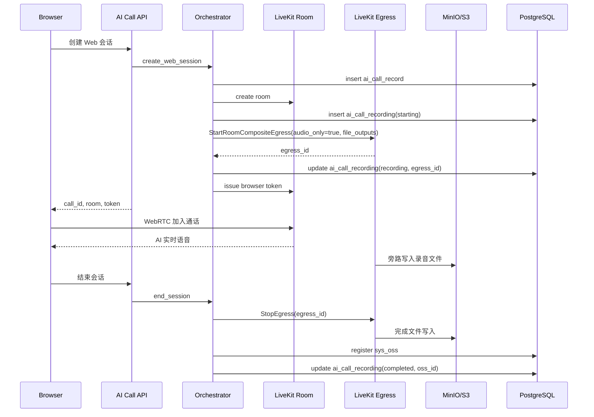

# Phase B2：录音闭环正式技术设计

最后更新：2026-06-16

## 1. 文档定位

本文档是 Phase B2 的正式设计稿，目标是把 Web 入口下的一通 AI Call 从“可查询记录和事件”推进到“可生成录音、可索引、可查询、可播放”。

本文档只设计录音闭环，不设计通话后转写、摘要、质检、转人工、坐席系统和并发压测。这些能力可以消费录音文件，但不属于 B2 的交付范围。

## 2. 问题本质

录音不是实时音频主链路的一部分。

实时通话的主链路仍然是：

```text
用户音频 -> LiveKit Room -> Realtime Call Agent -> Qwen Realtime -> LiveKit Room -> 用户听到 AI
```

B2 要解决的是旁路留证和复盘问题：

```text
LiveKit Room -> LiveKit Egress -> 对象存储 -> sys_oss -> ai_call_recording -> 查询/播放
```

所以正确设计目标不是“把录音上传塞进实时接口”，而是让录音作为旁路任务随通话生命周期启动和结束，并把文件索引回业务记录。

## 3. 当前代码事实

### 3.1 B1 事实

当前 B1 已形成以下基础：

1. `ai_call_record` 保存单通会话主状态。
2. `ai_call_event` 保存低频关键事件，后台最终一致落库。
3. 当前 AI Call 表不预置 `tenant_id`，上游业务通过 `business_type + business_id` 关联。
4. 当前 AI Call API 不强制登录态，B2 不在录音设计中额外引入强制登录态。
5. 当前 `call_id` 全局唯一，适合作为录音业务关联键。

### 3.2 OSS 事实

当前项目已有对象存储能力：

| 能力 | 当前代码 | 结论 |
|---|---|---|
| 上传接口 | `POST /system/oss/upload` | 已存在，适合小文件或后台工具上传 |
| 对象索引表 | `sys_oss` | 已存在，保存 `oss_id`、对象名、URL、后缀、扩展信息 |
| OSS 配置表 | `sys_oss_config` | 已存在，保存 MinIO/S3 类配置 |
| 上传实现 | `OssService.upload_service` + `MinioUtil.upload` | 会把文件内容读入服务端内存后上传 |
| 查询 URL | `GET /system/oss/url/{oss_id}` | 已存在，可作为播放地址来源 |

重要限制：

`/system/oss/upload` 当前实现会 `await file.read()` 读取完整文件，再上传到 MinIO。它可以证明 OSS 能力可用，但不适合作为长录音的主路径，否则会把录音文件流量和内存压力压到 FastAPI 进程上。

### 3.3 LiveKit 事实

1. 当前项目依赖 `livekit>=1.1,<2.0`。
2. 当前环境没有 `livekit.api` 模块。
3. 当前 `LiveKitRoomManager` 已通过 Twirp HTTP 手写调用 `RoomService`，没有依赖官方 Server SDK 的 Room API。
4. LiveKit 官方文档说明，音频场景可以用 RoomComposite Egress 设置 `audio_only=true` 导出单个混音文件。
5. LiveKit Egress 可以输出到文件，并支持 S3 类对象存储输出。
6. 自托管 LiveKit 时，Egress 是单独服务，不是 LiveKit Server 本体的一部分，需要单独部署和资源规划。
7. LiveKit Egress API 需要带有 `roomRecord` 权限的访问 Token，不能直接复用当前只包含 Room 管理权限的 Token。

参考：

1. LiveKit Egress overview: https://docs.livekit.io/transport/media/ingress-egress/egress/
2. LiveKit Egress outputs: https://docs.livekit.io/transport/media/ingress-egress/egress/outputs/
3. LiveKit RoomComposite audio-only: https://docs.livekit.io/transport/media/ingress-egress/egress/composite-recording/
4. LiveKit Egress API: https://docs.livekit.io/reference/other/egress/api/
5. LiveKit self-hosted Egress: https://docs.livekit.io/transport/self-hosting/egress/
6. LiveKit Tokens & grants: https://docs.livekit.io/frontends/reference/tokens-grants/

## 4. 设计目标

Phase B2 必须做到：

1. 每通 Web 会话可以生成一份混音录音文件。
2. 录音文件由 LiveKit Egress 旁路生成，不进入用户到模型的实时音频热路径。
3. 录音文件进入对象存储，并在 `sys_oss` 中形成对象索引。
4. AI Call 侧新增业务录音表，记录录音状态、Egress ID、对象名、`oss_id` 和失败原因。
5. 查询通话详情时能拿到录音状态和播放地址。
6. 录音启动或结束失败时，不影响用户和 AI 的实时通话闭环。
7. 表设计遵守当前项目规范：PostgreSQL 可用、不使用 `jsonb`、不建物理外键、BigInt 输出按字符串处理。
8. 可通过配置额外生成客户、AI、人工坐席的分参与方录音，用于后续通话后 ASR 和完整聊天记录合并。

## 5. 非目标

B2 不做以下内容：

| 内容 | 不做原因 |
|---|---|
| 转写文本 | 由 B2.5 对话文本闭环单独设计，不属于录音文件闭环 |
| 摘要和质检 | 依赖转写或离线分析，不属于录音闭环 |
| 分轨录音 | 当前只需要复盘一通会话，先做单文件混音录音 |
| 录音配置表 | 当前格式、路径、开关先固定在代码或环境配置中，不建业务配置表 |
| 录音回调投递表 | B2 内部消费 Egress 结果，不对外做 webhook 投递 |
| 浏览器上传录音 | 浏览器不应承担生产录音保存职责 |
| 录音保留策略 | 涉及合规和业务策略，后续单独设计 |
| 录音权限体系重构 | B2 不强制改登录态，但生产上线前必须由上游业务或网关控制访问 |

## 6. 总体方案

### 6.1 推荐方案

采用 LiveKit Egress 直接写入对象存储，后端只做控制和索引。



核心原则：

1. 录音由 Egress 作为独立参与方订阅 Room 音频。
2. Egress 写对象存储，不走 FastAPI 文件上传主路径。
3. `sys_oss` 只做对象存储索引。
4. `ai_call_recording` 只做 AI Call 录音业务状态。
5. 实现上必须保证“停止 Egress”发生在 LiveKit Room 删除之前；否则真实 Egress 接入后可能拿不到完整终止结果。

### 6.2 不采用 FastAPI 上传作为主路径

不把 `/system/oss/upload` 作为生产录音主路径，原因：

1. 它会一次性读取完整文件到 FastAPI 内存。
2. 长录音会放大 API 进程内存和网络压力。
3. 录音文件天然由 LiveKit Egress 生成，绕一圈传回业务服务没有必要。

保留用途：

1. 本地验证 OSS 配置是否可用。
2. 管理后台或工具类小文件上传。
3. 极短录音的临时兜底，不作为 B2 主路径。

## 7. 表设计原则

B2 表设计继续遵守 B1 已确认规则：

1. 不使用 `jsonb` 等强数据库绑定类型。
2. 不创建物理外键。
3. 主键统一使用 `id` 字段，类型为 `bigint`，雪花 ID。
4. BigInt 主键和业务 ID 输出给前端时转字符串。
5. 不预置 `tenant_id`。AI Call 当前通过 `business_type + business_id` 关联上游业务；如果未来 AI Call 自身承担多租户查询，再统一引入租户能力。
6. 不复制 OSS 表已有的对象属性，例如文件后缀、URL、文件大小、content type。
7. 字段命名必须表达稳定业务含义，不为临时页面展示加冗余字段。

## 8. 表结构设计

### 8.1 `ai_call_recording`

用途：每通会话一条录音业务记录。

| 字段 | 类型 | 必填 | 说明 |
|---|---|---|---|
| `id` | `bigint` | 是 | 雪花主键，API 返回为字符串 |
| `call_id` | `varchar(64)` | 是 | 通话业务 ID，对应 `ai_call_record.call_id`，不建物理外键 |
| `room_name` | `varchar(128)` | 是 | LiveKit Room 名称，便于 Egress 排障 |
| `status` | `varchar(32)` | 是 | 录音状态，见 8.2 |
| `egress_id` | `varchar(128)` | 否 | LiveKit Egress ID，启动成功后写入 |
| `oss_id` | `bigint` | 否 | `sys_oss.oss_id`，文件索引成功后写入，不建物理外键 |
| `object_name` | `varchar(255)` | 否 | 对象存储中的文件名或 key，例如 `ai-call/recordings/2026/06/16/call_xxx.mp3` |
| `started_at` | `timestamp with time zone` | 是 | 录音开始请求时间 |
| `ended_at` | `timestamp with time zone` | 否 | 录音终态时间 |
| `duration_ms` | `integer` | 否 | 录音持续毫秒，按 `ended_at - started_at` 计算 |
| `failure_stage` | `varchar(64)` | 否 | 失败阶段，例如 `egress_start`、`egress_stop`、`oss_register` |
| `failure_message` | `varchar(500)` | 否 | 失败摘要，不保存堆栈和敏感配置 |

不增加的字段：

| 字段 | 不增加原因 |
|---|---|
| `tenant_id` | B1/B2 当前不由 AI Call 直接承担租户隔离 |
| `create_by/create_time/update_by/update_time/create_dept` | B2 录音表不接登录态审计；时间用业务时间字段表达 |
| `file_suffix` | `sys_oss.file_suffix` 已保存 |
| `file_size` | 放在 `sys_oss.ext1` 或 OSS 元信息，不在录音表重复 |
| `content_type` | 放在 `sys_oss.ext1` 或由播放接口从 OSS 信息获取 |
| `play_url` | URL 可能会从永久 URL 演进为临时签名 URL，不落业务表 |
| `recording_type` | 主表只表示混音主录音；分参与方录音进入 `ai_call_recording_track` |
| `payload_json` | B2 不需要保存复杂供应商原始响应，失败摘要足够 |

### 8.2 `ai_call_recording_track`

用途：保存可选的分参与方录音明细。主混音录音仍在 `ai_call_recording`，分轨只作为后续 ASR、质检和说话方对齐的补充产物。

| 字段 | 类型 | 必填 | 说明 |
|---|---|---|---|
| `id` | `bigint` | 是 | 雪花主键，API 返回为字符串 |
| `call_id` | `varchar(64)` | 是 | 通话业务 ID，不建物理外键 |
| `room_name` | `varchar(128)` | 是 | LiveKit Room 名称 |
| `track_role` | `varchar(32)` | 是 | `customer`、`ai`、`human_agent` |
| `participant_identity` | `varchar(128)` | 是 | LiveKit Participant identity |
| `handoff_id` | `varchar(64)` | 否 | 人工坐席轨道关联的转人工 ID |
| `status` | `varchar(32)` | 是 | 同主录音状态 |
| `egress_id` | `varchar(128)` | 否 | LiveKit Participant Egress ID |
| `oss_id` | `bigint` | 否 | `sys_oss.oss_id`，不建物理外键 |
| `object_name` | `varchar(255)` | 否 | 分轨对象 key |
| `started_at` / `ended_at` / `duration_ms` | 时间/整数 | 是/否 | 分轨录音生命周期 |
| `failure_stage` / `failure_message` | 字符串 | 否 | 分轨失败摘要 |

### 8.3 状态枚举

| 状态 | 含义 | 是否终态 |
|---|---|---|
| `starting` | 已创建录音记录，正在请求 Egress 启动 | 否 |
| `recording` | Egress 启动成功，正在录音 | 否 |
| `stopping` | 已请求停止 Egress，等待文件完成和索引 | 否 |
| `completed` | 录音文件已生成，`sys_oss` 已登记，`oss_id` 已回写 | 是 |
| `failed` | 录音启动、停止或索引失败 | 是 |

### 8.3 PostgreSQL DDL 草案

```sql
create table ai_call_recording (
    id bigint not null,
    call_id varchar(64) not null,
    room_name varchar(128) not null,
    status varchar(32) not null,
    egress_id varchar(128),
    oss_id bigint,
    object_name varchar(255),
    started_at timestamp with time zone not null,
    ended_at timestamp with time zone,
    duration_ms integer,
    failure_stage varchar(64),
    failure_message varchar(500),
    constraint pk_ai_call_recording primary key (id),
    constraint uk_ai_call_recording_call_id unique (call_id)
);

create index idx_ai_call_recording_status_started
    on ai_call_recording (status, started_at);

create index idx_ai_call_recording_egress_id
    on ai_call_recording (egress_id);

create index idx_ai_call_recording_oss_id
    on ai_call_recording (oss_id);

create table ai_call_recording_track (
    id bigint not null,
    call_id varchar(64) not null,
    room_name varchar(128) not null,
    track_role varchar(32) not null,
    participant_identity varchar(128) not null,
    handoff_id varchar(64),
    status varchar(32) not null,
    egress_id varchar(128),
    oss_id bigint,
    object_name varchar(255),
    started_at timestamp with time zone not null,
    ended_at timestamp with time zone,
    duration_ms integer,
    failure_stage varchar(64),
    failure_message varchar(500),
    constraint pk_ai_call_recording_track primary key (id),
    constraint uk_ai_call_recording_track_participant
        unique (call_id, track_role, participant_identity)
);

create index idx_ai_call_recording_track_call_role
    on ai_call_recording_track (call_id, track_role);

create index idx_ai_call_recording_track_egress_id
    on ai_call_recording_track (egress_id);

create index idx_ai_call_recording_track_oss_id
    on ai_call_recording_track (oss_id);
```

说明：

1. 不建 `call_id -> ai_call_record.call_id` 物理外键。
2. 不建 `oss_id -> sys_oss.oss_id` 物理外键。
3. `call_id` 唯一，B2 默认一通会话只有一份混音录音。
4. 分参与方录音不调整主表唯一约束，单独通过 `call_id + track_role + participant_identity` 去重。

## 9. 文件格式和对象命名

### 9.1 文件格式

B2 默认使用 LiveKit RoomComposite Egress 的音频混音录音：

1. `audio_only=true`。
2. 不设置 `layout`。
3. 不设置 `custom_base_url`。
4. 只输出一个文件。

文件容器不暴露给前端选择。主混音录音和分参与方录音默认统一使用 `.mp3`，因为当前录音只服务回放、通话后 ASR、质检和人工复盘，不需要视频容器；MP3 在主流 ASR 兼容性、浏览器播放和文件体积之间更稳。此前已验证过 MP4 主混音播放链路；切换 MP3 后需要补一次真实 LiveKit Egress 落盘、播放和 Range 访问手工验收。

### 9.2 对象命名

主混音对象名默认固定为：

```text
ai-call/recordings/{call_id}.mp3
```

分参与方录音默认固定为：

```text
ai-call/recordings/tracks/{call_id}/{track_role}-{participant_identity}.mp3
```

示例：

```text
ai-call/recordings/call_325098906781036544.mp3
ai-call/recordings/tracks/call_325098906781036544/customer-browser-call_325098906781036544.mp3
```

如果后续录音量上来，需要按日期分目录，可以只调整 `AI_CALL_RECORDING_OBJECT_PREFIX` 或对象命名函数，不需要改表结构。

命名原则：

1. 以 `call_id` 作为文件名主体，便于排障。
2. 按日期分目录，避免单目录对象过多。
3. 不把手机号、身份证、客户姓名等敏感业务信息写入对象名。

## 10. OSS 集成设计

### 10.1 `sys_oss` 的职责

`sys_oss` 是对象存储索引表，不是录音业务状态表。

它负责：

1. 保存 `oss_id`。
2. 保存对象名 `file_name`。
3. 保存原始名 `original_name`。
4. 保存后缀 `file_suffix`。
5. 保存访问地址 `url`。
6. 保存扩展信息 `ext1`，例如文件大小和 content type。
7. 复用当前 OSS 配置和查询能力。

它不负责：

1. 录音状态。
2. Egress ID。
3. 录音失败阶段。
4. 通话业务关联。

### 10.2 新增注册能力

B2 需要给 `OssService` 增加一个“登记已存在对象”的服务方法。

建议方法：

```python
async def register_existing_object_service(
    auth: AuthSchema | None,
    *,
    object_name: str,
    original_name: str,
    file_suffix: str,
    url: str,
    file_size: int | None = None,
    content_type: str | None = None,
    service: str = "minio",
) -> int:
    ...
```

用途：

1. Egress 已经把文件写入对象存储。
2. 后端不再二次上传文件。
3. 后端只在 `sys_oss` 中补一条索引记录。

实现要求：

1. `oss_id` 使用雪花 ID。
2. `ext1` 使用普通字符串保存 JSON，例如 `{"fileSize":123,"contentType":"audio/mpeg"}`。
3. 不要求 B2 录音接口强制登录态；如果没有 `auth.user`，`create_by/create_dept` 可为空或沿用 OSS 模块默认逻辑。
4. 登记失败时，不删除对象存储文件，先把 `ai_call_recording` 标记为 `failed`，后续可人工补登。

## 11. LiveKit Egress 集成设计

### 11.1 新增适配器

新增 `LiveKitEgressManager`，职责只包含 Egress 控制：

| 方法 | 职责 |
|---|---|
| `start_room_audio_recording(room_name, object_name)` | 启动 RoomComposite Egress 音频录音 |
| `stop_recording(egress_id)` | 停止指定 Egress |

实现选择：

1. 如果项目引入官方可用的 Python Server SDK Egress API，优先使用官方 SDK。
2. 如果继续保持当前依赖，按 `LiveKitRoomManager` 现有风格手写 Twirp HTTP 调用 `livekit.Egress`。

当前环境没有 `livekit.api`，所以 B2 实现不能直接假设该模块可用。

权限要求：

1. Egress Manager 必须单独签发服务端 Token。
2. Token 的 `video` grant 至少包含 `roomRecord=true`。
3. 不要复用浏览器 Participant Token。
4. 不要复用当前 `LiveKitRoomManager._issue_room_admin_token()` 的实现，除非补齐 `roomRecord` 并确认不会影响 Room 管理调用。

### 11.2 启动 Egress

启动请求应包含：

| 参数 | 值 |
|---|---|
| `room_name` | 当前会话 Room |
| `audio_only` | `true` |
| `layout` | 不设置 |
| `custom_base_url` | 不设置 |
| `file_outputs` | 单个文件输出 |
| `filepath` | 9.2 定义的对象名 |
| `s3/minio` | 来自 `sys_oss_config` 的活跃配置 |

启动成功后写入：

1. `egress_id`。
2. `status=recording`。
3. `recording_started` 事件。

启动失败后写入：

1. `status=failed`。
2. `failure_stage=egress_start`。
3. `failure_message`。
4. `recording_failed` 事件。

录音启动失败不能让创建会话失败。用户和 AI 的实时通话必须继续。

### 11.3 停止 Egress

结束会话时，如果存在 `status=recording` 的录音记录：

1. 先写 `status=stopping`。
2. 调用 `StopEgress`。
3. 等 Egress 返回或通过查询确认完成。
4. 登记 `sys_oss`。
5. 回写 `oss_id`、`ended_at`、`duration_ms`、`status=completed`。

停止或登记失败时：

1. 写 `status=failed`。
2. 写 `failure_stage`。
3. 写 `failure_message`。
4. 保留 `egress_id` 和 `object_name`，便于人工排障和补偿。

## 12. 生命周期设计

### 12.1 创建会话

推荐顺序：

1. 创建 `ai_call_record`。
2. 创建 LiveKit Room。
3. 创建 `ai_call_recording(status=starting)`。
4. 启动 Egress。
5. Egress 启动成功后更新为 `recording`。
6. 签发浏览器 Token。
7. 启动 Agent。
8. 返回创建会话结果。

启动 Egress 应尽量前置到返回浏览器 Token 前，减少漏录开场音频的概率。但该步骤必须设置短超时，并且失败不阻断会话创建。超时或失败时写 `ai_call_recording.status=failed`，前端仍可进入通话。

这样做的边界是：录音可能增加少量创建会话接口耗时，但不进入用户入会后的实时音频热路径，不应增加用户听到 AI 的模型首包或浏览器首包延迟。

### 12.2 用户点结束按钮

用户在浏览器点击结束：

1. 前端调用结束会话 API。
2. Orchestrator 进入 `ENDING`。
3. 停止 Agent。
4. 停止 Egress。
5. 删除 LiveKit Room。
6. 更新 `ai_call_record` 为 `completed`。
7. 更新 `ai_call_recording` 为 `completed` 或 `failed`。

如果录音停止失败，通话仍可结束，录音状态独立失败。

### 12.3 浏览器断开

浏览器上报 `browser_disconnect` 时，B1 已按正常结束处理。

B2 沿用该规则：

1. 通话记录 `end_reason=browser_disconnect`。
2. 录音进入停止流程。
3. 能正常生成文件则 `ai_call_recording.status=completed`。
4. 无法生成文件则 `ai_call_recording.status=failed`。

### 12.4 真实线路主动挂断

后续接入 SIP 后，如果系统主动挂断：

1. `ai_call_record.end_reason=local_hangup`。
2. 录音进入停止流程。
3. 录音文件正常完成后记为 `completed`。

### 12.5 真实用户挂断

后续接入 SIP 后，如果被叫用户挂断：

1. `ai_call_record.end_reason=remote_hangup`。
2. 录音进入停止流程。
3. 录音文件正常完成后记为 `completed`。

B2 不需要为 Web 和 SIP 设计两套录音逻辑。只要入口最终进入同一个 LiveKit Room，录音都按 Room 维度旁路处理。

### 12.6 异常失败

| 场景 | 通话处理 | 录音处理 |
|---|---|---|
| Room 创建失败 | 会话失败 | 不创建录音记录 |
| Agent 启动失败 | 会话失败 | 如果已启动录音，则停止并标记失败或完成 |
| Egress 启动失败 | 通话继续 | 录音 `failed` |
| 模型运行中失败 | 通话失败或结束 | 尝试停止录音并索引 |
| Egress 停止失败 | 通话可结束 | 录音 `failed`，保留 `egress_id` |
| OSS 登记失败 | 通话可结束 | 录音 `failed`，保留 `object_name` |

## 13. API 设计

### 13.1 通话详情扩展

`GET /ai-call/records/{callId}` 在 B2 增加 `recording` 字段。

响应示例：

```json
{
  "code": 200,
  "msg": "操作成功",
  "data": {
    "record": {
      "id": "325100000000000001",
      "callId": "call_325100000000000000",
      "status": "completed"
    },
    "lastEvent": null,
    "recording": {
      "id": "325100000000000002",
      "callId": "call_325100000000000000",
      "status": "completed",
      "ossId": "325100000000000003",
      "playUrl": "https://oss.example.com/recov/ai-call/recordings/2026/06/16/call_325100000000000000.mp3",
      "startedAt": "2026-06-16T10:00:00Z",
      "endedAt": "2026-06-16T10:03:20Z",
      "durationMs": 200000,
      "failureStage": null,
      "failureMessage": null
    }
  }
}
```

说明：

1. `recording` 不存在时返回 `null`。
2. `id` 和 `ossId` 输出为字符串。
3. `playUrl` 来自服务端查询，不落 `ai_call_recording` 表。
4. 如果录音失败，`playUrl=null`，返回 `failureStage` 和 `failureMessage`。

### 13.2 单独查询录音

新增：

```text
GET /ai-call/records/{callId}/recording
```

用途：

1. 前端详情页懒加载录音状态。
2. 录音生成可能晚于通话结束，前端可以轮询。
3. 避免列表页为每条记录都查 OSS URL。

成功响应：

```json
{
  "code": 200,
  "msg": "操作成功",
  "data": {
    "recording": {
      "id": "325100000000000002",
      "callId": "call_325100000000000000",
      "status": "completed",
      "ossId": "325100000000000003",
      "playUrl": "https://oss.example.com/recov/ai-call/recordings/2026/06/16/call_325100000000000000.mp3",
      "startedAt": "2026-06-16T10:00:00Z",
      "endedAt": "2026-06-16T10:03:20Z",
      "durationMs": 200000,
      "failureStage": null,
      "failureMessage": null
    }
  }
}
```

未生成录音记录时：

```json
{
  "code": 200,
  "msg": "操作成功",
  "data": {
    "recording": null
  }
}
```

### 13.3 不对前端开放启动/停止录音接口

B2 不新增前端可直接调用的启动录音、停止录音接口。

原因：

1. 录音属于通话生命周期的一部分。
2. 前端不应该决定生产录音是否启动。
3. 避免出现通话已结束但前端忘记停录音的状态分裂。

### 13.4 前端改动设计

B2 需要前端增加录音查看能力，但不单独拆一个录音业务页面。

推荐统一进入“通话详情”：

| 页面 | B2 改动 |
|---|---|
| 通话记录列表 | 增加详情入口；可展示录音状态轻量标识，例如生成中、可播放、失败 |
| 通话详情页或抽屉 | 增加录音视图，展示录音状态、音频播放器、失败原因 |
| 客户通话测试台 | 可增加当前 call_id 的录音状态查询按钮，用于本地验收，不作为正式运营入口 |

录音视图状态：

| 状态 | 前端展示 |
|---|---|
| `recording=null` | 暂无录音 |
| `starting` / `recording` / `stopping` | 录音生成中或处理中，不显示播放器 |
| `completed` 且有 `playUrl` | 显示音频播放器 |
| `failed` | 显示失败摘要和排障入口 |

B2.5 生成后，通话详情建议统一为 `对话`、`录音`、`事件` 三个视图。B2 只实现录音视图，不阻塞 B2.5 的对话气泡视图。

## 14. 事件设计

B2 只新增低频关键事件，继续进入 `ai_call_event`。

| 事件 | source | 触发时机 |
|---|---|---|
| `recording_start_requested` | `orchestrator` | 已创建录音记录，准备启动 Egress |
| `recording_started` | `livekit` | Egress 返回 `egress_id` |
| `recording_stop_requested` | `orchestrator` | 通话结束，准备停止 Egress |
| `recording_completed` | `orchestrator` | 文件索引完成，`oss_id` 已回写 |
| `recording_failed` | `orchestrator` | 启动、停止或索引失败 |

事件 payload 要求：

1. 可以保存 `egressId`、`ossId`、`objectName`、`failureStage`。
2. 不保存模型密钥、OSS 密钥、完整错误堆栈。
3. 不保存录音原文、转写文本或敏感客户信息。

## 15. 延迟影响设计

### 15.1 结论

按推荐方案实现，录音不应增加用户入会后听到 AI 的实时首包延迟。

原因：

1. Egress 是 LiveKit Room 的旁路订阅和导出。
2. 用户音频到模型、模型音频到用户的实时路径不需要经过录音服务。
3. 后端只控制 Egress 启停和索引，不处理实时音频帧。

需要区分两个指标：

1. 创建会话接口耗时：B2 为了减少漏录开头，会尽量在返回浏览器 Token 前启动 Egress，可能带来少量控制面耗时。
2. 通话中首包延迟：用户入会后，音频仍走 LiveKit Room 和 Agent 主链路，不经过录音文件上传或业务服务处理。

### 15.2 可能的间接影响

录音仍可能通过资源竞争间接影响系统：

| 风险 | 说明 | 控制方式 |
|---|---|---|
| Egress 并发限制 | LiveKit Cloud 或自托管 Egress 都可能有并发限制 | 增加录音启动失败状态和告警，不阻塞通话 |
| CPU/内存压力 | 自托管 Egress 录制会消耗资源 | Egress 单独部署，限制并发 |
| 对象存储慢 | 文件完成和索引变慢 | 只影响录音完成时间，不影响实时通话 |
| Room 订阅策略误伤 | 服务端订阅管理如果错误处理 Egress Participant，可能影响录音 | 订阅逻辑跳过 `EGRESS` participant |

### 15.3 验收要求

B2 验收必须对比：

1. 不开启录音时的模型首包、浏览器首包。
2. 开启录音时的模型首包、浏览器首包。
3. 如果差异超过验收阈值，先看资源竞争和 Egress 部署，不把录音逻辑塞回实时链路。

## 16. 安全和访问控制

录音属于敏感数据。

B2 的设计原则：

1. 前端只拿播放地址，不拿 OSS 密钥。
2. `playUrl` 由后端返回，不直接把对象存储路径拼在前端。
3. 当前阶段可以复用 `sys_oss.url`，但接口契约不承诺它永远是永久 URL。
4. 如果后续对象存储改成私有桶，`playUrl` 可以改为后端签发的临时 URL，`ai_call_recording` 表不需要变化。
5. B2 不强制新增登录态，但真实客户录音进入生产前，必须由网关、上游业务系统或 AI Call 自身权限体系限制访问。

## 17. 配置设计

B2 不建 `ai_call_recording_config` 表。

先使用环境变量或代码常量：

| 配置 | 建议 |
|---|---|
| 是否开启录音 | 环境变量，例如 `AI_CALL_RECORDING_ENABLED=true` |
| 是否开启分参与方录音 | 环境变量，例如 `AI_CALL_PARTICIPANT_RECORDING_ENABLED=true`；默认开启，用于通话后 ASR 和完整聊天记录 |
| 对象前缀 | 固定 `ai-call/recordings`，必要时环境变量覆盖 |
| 主混音文件格式 | 默认 `.mp3`，统一服务回放和通话后 ASR |
| 分参与方文件格式 | 默认 `.mp3`，优先服务通话后 ASR |
| Egress 调用超时 | 环境变量或服务常量 |
| 录音停止等待时间 | 环境变量或服务常量 |

原因：

1. 当前没有多模型、多线路、多格式的真实运行需求。
2. 配置表会增加管理页面、校验、缓存和变更审计成本。
3. 固定策略更利于先验证录音质量、延迟影响和对象存储闭环。

## 18. 实现顺序

建议按以下顺序实现：

1. 新增 `ai_call_recording` SQLAlchemy 模型、schema、CRUD。
2. 新增 `AiCallRecordingService`，封装创建、启动成功、停止中、完成、失败。
3. 给 `OssService` 增加登记已存在对象的方法。
4. 新增 `LiveKitEgressManager`，先按 Twirp HTTP 风格实现。
5. 在创建会话链路中按短超时启动录音，尽量在返回浏览器 Token 前拿到 Egress ID。
6. 在 Orchestrator 结束会话时停止录音并登记 `sys_oss`。
7. 给通话详情和单独录音查询增加 API。
8. 增加单元测试和接口测试。
9. 手工跑一通 Web 会话，确认文件落 OSS、`sys_oss` 有记录、详情页能查询播放。
10. 对比开启录音前后的首包指标。

## 19. 测试设计

### 19.1 单元测试

至少覆盖：

1. 创建录音记录时写入 `starting`。
2. Egress 启动成功后写入 `recording + egress_id`。
3. Egress 启动失败后写入 `failed + failure_stage=egress_start`，创建会话不失败。
4. 结束会话时 `recording -> stopping -> completed`。
5. OSS 登记失败后写入 `failed + failure_stage=oss_register`。
6. BigInt 字段输出为字符串。
7. `recording=null` 时接口仍返回 `code=200`。
8. 不创建物理外键、不使用 `jsonb`。

### 19.2 集成测试

至少覆盖：

1. 使用 fake Egress manager 模拟启动和停止。
2. 使用 fake OSS service 模拟登记 `sys_oss`。
3. 创建 Web 会话后能查询录音状态。
4. 结束 Web 会话后能查询 `ossId` 和 `playUrl`。
5. 录音失败不影响 `ai_call_record` 的终态写入。

### 19.3 手工验收

手工验收至少覆盖：

1. 启动服务，确认 OSS 活跃配置存在。
2. 创建一通 Web 会话。
3. 浏览器加入 Room，完成一轮用户和 AI 对话。
4. 结束会话。
5. 查询 `/ai-call/records/{callId}/recording`。
6. 确认 `ai_call_recording.status=completed`。
7. 确认 `sys_oss` 中存在对应 `oss_id`。
8. 打开 `playUrl` 能播放录音。
9. 查看 B1 延迟指标，对比开启录音前后没有明显恶化。

## 20. 验收完成定义

B2 完成必须同时满足：

1. `ai_call_recording` 表存在且符合本文档字段设计。
2. 一通 Web 会话结束后，能生成一份录音文件。
3. 录音文件在对象存储中可访问。
4. `sys_oss` 中存在录音对象索引。
5. `ai_call_recording.oss_id` 正确回写。
6. 详情接口或录音接口能返回录音状态和播放地址。
7. Egress 启动失败、停止失败、OSS 登记失败都有明确状态和失败摘要。
8. 录音失败不影响通话主流程结束。
9. 单元测试和接口测试通过。
10. 开启录音前后的实时首包指标完成对比。

## 21. 后续阶段边界

| 阶段 | 可消费 B2 产物 | 不在 B2 内实现 |
|---|---|---|
| B2.5 对话文本闭环 | 录音可作为文本补偿和复盘证据 | 实时对话段聚合和左右气泡 |
| B3 转人工 | 录音可用于接管后复盘 | 坐席系统和人工接管录音分段 |
| C 并发压测 | 录音开启后的容量和成本评估 | 压测报告本身 |
| D 生产加固 | 录音失败告警、补偿、保留策略 | 完整运维体系 |
| E 真实 SIP | 同一 Room 录音逻辑复用 | SIP 线路接入和运营商挂机细节 |
| 后续离线分析 | 录音文件作为转写、摘要、质检输入 | ASR、摘要、质检任务 |

## 22. 已确认结论

以下结论进入 B2 实现时直接按文档执行：

1. B2 使用 LiveKit Egress 做旁路录音，不使用浏览器录音上传作为主路径。
2. B2 默认一通会话保留一份 MP3 混音录音，并额外开启 MP3 分参与方录音；完整聊天记录后续基于分轨录音做通话后 ASR。
3. B2 新增 `ai_call_recording` 和 `ai_call_recording_track` 表，不把录音业务状态塞进 `sys_oss`。
4. `sys_oss` 只做对象存储索引，AI Call 录音表只保存业务状态和关联 ID。
5. B2 不新增录音配置表。
6. B2 不引入 `tenant_id`、审计字段、物理外键、`jsonb`。
7. BigInt 字段输出给前端统一按字符串。
8. Egress 启动失败不影响通话创建和实时对话。
9. 录音停止或索引失败不影响通话结束。
10. 录音播放地址由后端返回，表中不保存 `play_url`。
