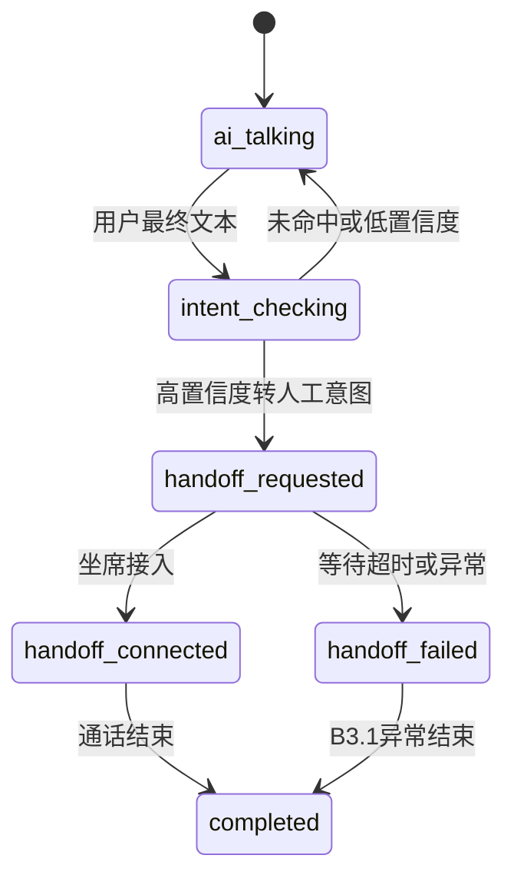

# Phase B3.2：转人工自动触发技术设计

最后更新：2026-06-17

## 1. 文档定位

B3 已完成最小转人工链路：主动发起转人工、坐席加入同一 LiveKit Room、AI 暂停、录音覆盖人工阶段。

B3.1 已完成转人工等待态收口：提示音、等待超时、异常结束、前端状态展示。

B3.2 聚焦一个问题：当用户在通话中明确表达“想转人工 / 找真人 / 不想继续和 AI 聊”时，系统应自动进入既有转人工流程，而不是依赖人工点击按钮。

本阶段不重做转人工链路，不新增坐席系统，不做人工作业阶段 ASR，也不把实时音频流塞进新的识别链路。

## 2. 第一性原理

转人工自动触发不是音频问题，而是业务控制问题。

它的输入不是每一帧音频，也不是浏览器本地音量候选，而是已经被模型或识别服务确认后的用户最终文本。只有这样，才能避免把噪声、AI 回声、半句话、浏览器候选误判成“用户要转人工”。

B3.2 的目标有三个：

1. 用户明确表达转人工意图时，自动进入现有 B3/B3.1 转人工流程。
2. 触发后状态必须锁定，后续用户再说其他内容，不能取消或覆盖转人工。
3. 不能增加实时对话音频热路径延迟，不能让数据库操作或额外模型调用阻塞音频播放。

## 3. 设计结论

B3.2 推荐采用“最终用户文本 + 独立意图判断 + 既有转人工服务”的方案。

核心结论：

- 不使用浏览器音量候选触发转人工。
- 不使用散落在代码里的关键词 if/else 作为主方案。
- 不让前端传入的 Prompt 决定转人工能力。
- 不新增数据库表。
- 不新增物理外键。
- 不引入人工作业阶段 ASR。
- 自动触发后复用 `ai_call_handoff` 和现有 handoff service。
- 所有自动触发都必须走同一套 handoff 状态机，避免出现“AI 以为转人工了，但业务表没有记录”的分裂状态。

## 4. 本阶段范围

### 4.1 必须实现

1. 用户语义触发转人工
   - 输入：用户最终文本。
   - 输出：是否触发转人工。
   - 场景：用户说“转人工”“我想找真人”“别让 AI 回了，帮我接人工”等。

2. 固定转人工能力约束
   - 服务端固定拼接。
   - 不受前端 Prompt 覆盖。
   - 只描述转人工能力和边界，不扩展成通用平台系统提示词。

3. 触发后状态锁定
   - 一旦进入 `requested` / `accepted` / `connected` 等转人工活跃状态，后续用户文本不再触发新的转人工。
   - 后续用户文本可以继续记录为对话内容，但不能取消、覆盖或重新创建 handoff。

4. 复用 B3/B3.1
   - 自动触发后仍走现有 `create_handoff`。
   - 仍播放 B3.1 的“正在转人工”提示。
   - 仍使用 B3.1 的等待超时和异常结束逻辑。
   - 坐席端仍通过现有可加入房间列表进入。

5. 前端状态中文化展示
   - 客户端页面展示“正在转人工 / 等待坐席 / 坐席已接入 / 转人工失败”等中文状态。
   - 事件列表继续保留技术事件，但用户可见状态必须可读。

### 4.2 明确不做

1. 不做人工作业阶段实时 ASR。
2. 不做坐席排班、技能组、在线坐席分配。
3. 不做商务系统策略触发。
4. 不做可视化规则引擎。
5. 不做数据库配置表。
6. 不做语音取消转人工。
7. 不把“人工智能”“人工审核”等普通文本误当成转人工。

## 5. 触发方式

B3.2 完成后，转人工触发方式分为三类：

| 触发方式 | source | B3.2 状态 | 说明 |
| --- | --- | --- | --- |
| 坐席或测试人员主动点击 | `operator` | 已有 | B3 已实现，继续保留 |
| 用户明确要求转人工 | `customer` | B3.2 新增 | 基于最终用户文本做语义判断 |
| 系统运行态规则触发 | `system` | B3.2 预留轻量入口 | 只保留代码入口和稳定事件，不做商务规则平台 |

### 5.1 用户语义触发

用户语义触发是 B3.2 的核心。

触发输入：

- `call_id`
- 用户最终文本
- 当前 handoff 状态
- 最近少量对话上下文

触发输出：

```json
{
  "matched": true,
  "confidence": 0.92,
  "reason": "customer_request",
  "summary": "用户明确要求转人工"
}
```

判断原则：

- 必须基于最终用户文本。
- 必须和当前通话绑定。
- 必须先检查是否已有活跃 handoff。
- 高置信度才触发。
- 低置信度只记录事件，不转人工。

### 5.2 为什么不能只做关键词匹配

只做关键词匹配会产生两个问题：

1. 误触发
   - “人工智能是什么意思？”
   - “这个要人工审核吗？”
   - “你是人工客服吗？”

2. 漏触发
   - “我想和真人聊。”
   - “能不能别让机器回了？”
   - “帮我接一下客服。”

所以 B3.2 的主判断应是独立语义意图判断，而不是在 AgentRunner 中散落枚举词。

允许保留极少量确定性快速路径，例如“转人工”“找人工客服”这种完全明确短句，但它也必须封装在统一的 handoff trigger service 内，不能分散在业务链路各处。

### 5.3 系统运行态规则触发

系统触发不是商务系统策略，也不是复杂规则平台。

B3.2 只保留轻量入口：

- 代码中允许以 `source=system` 调用同一套 `create_handoff`。
- 系统触发也必须先检查是否已有活跃 handoff。
- 系统触发也必须产生事件，方便排查。

第一版可支持的稳定系统规则：

| 规则 | 是否默认启用 | 说明 |
| --- | --- | --- |
| 连续语义弱转人工意图达到阈值 | 否 | 例如多次“你听不懂”“换个人说”但单次置信度不够 |
| 模型明确返回无法继续处理的稳定信号 | 否 | 只有当后续模型链路能产生稳定结构化信号时才启用 |

本阶段不建议默认启用系统规则。原因是当前最稳定、最可验证的触发源是用户明确表达，贸然启用模糊规则会增加误转人工概率。

## 6. 固定转人工能力约束

前端 Prompt 是业务话术参数，不应决定系统是否具备转人工能力。

B3.2 需要在服务端固定拼接一段最小约束：

```text
当用户明确要求转人工、真人、客服、人工坐席或不想继续与 AI 沟通时，
你应简短确认并等待系统发起转人工。
不要声称自己已经是人工客服。
不要声称人工已接通，除非系统状态已经进入坐席接入。
```

拼接原则：

1. 固定约束由服务端维护。
2. 固定约束优先级高于前端 Prompt。
3. 固定约束只覆盖转人工能力，不扩展为通用平台系统提示词。
4. 意图分类使用独立提示词，不复用前端 Prompt。

## 7. 状态机

B3.2 不新增 handoff 状态，只复用 B3 已有状态。



状态锁定规则：

| 当前状态 | 收到用户新文本 | 行为 |
| --- | --- | --- |
| 未转人工 | 做意图判断 | 可能触发 |
| `requested` | 不再创建新 handoff | 只记录文本 |
| `accepted` | 不再创建新 handoff | 只记录文本 |
| `connected` | 不再创建新 handoff | 只记录文本 |
| `failed` / `completed` | 不再触发 | 通话已结束或失败 |

## 8. 后端设计

### 8.1 新增服务

建议新增：

```text
AiCallHandoffTriggerService
```

职责：

- 接收最终用户文本。
- 判断是否需要转人工。
- 检查当前 handoff 活跃状态。
- 调用现有 handoff service 创建请求。
- 记录触发事件。

该服务不负责：

- 播放提示音。
- 创建 LiveKit Room。
- 坐席加入。
- 录音。
- 人工 ASR。

### 8.2 调用入口

推荐入口：

```text
user_transcript_done
```

原因：

- 它是最终用户文本。
- 已经脱离音频帧级热路径。
- 可以和 B2.5 对话文本落库保持一致。
- Web 和后续 SIP 线路都可以复用。

调用链建议：

```text
Realtime Provider
  -> user_transcript_done
  -> Dialogue Segment 记录
  -> HandoffTriggerService 异步判断
  -> create_handoff(source=customer)
  -> suspend_for_handoff
  -> B3.1 提示和等待逻辑
```

### 8.3 延迟边界

B3.2 不能把额外模型调用、数据库写入、规则判断放进音频播放热路径。

要求：

- 意图判断只在最终文本后触发。
- 触发判断异步执行。
- 意图判断设置短超时。
- 超时不阻断正常对话。
- 数据库写入只发生在确认触发之后。

建议配置：

| 配置项 | 默认值 | 说明 |
| --- | --- | --- |
| `AI_CALL_HANDOFF_AUTO_TRIGGER_ENABLED` | `true` | 是否启用自动触发 |
| `AI_CALL_HANDOFF_CUSTOMER_INTENT_ENABLED` | `true` | 是否启用用户语义触发 |
| `AI_CALL_HANDOFF_SYSTEM_RULE_ENABLED` | `false` | 是否启用系统规则触发 |
| `AI_CALL_HANDOFF_INTENT_THRESHOLD` | `0.80` | 语义触发置信度阈值 |
| `AI_CALL_HANDOFF_INTENT_TIMEOUT_SECONDS` | `1.0` | 意图判断最大等待时间 |

## 9. 数据设计

B3.2 不新增数据库表。

继续使用：

```text
ai_call_handoff
```

字段使用约定：

| 字段 | B3.2 用法 |
| --- | --- |
| `call_id` | 关联通话业务 ID |
| `request_source` | `customer` 或 `system` |
| `request_reason` | `customer_request` / `system_rule` |
| `request_message` | 触发摘要，截断保存 |
| `status` | 继续使用 B3 状态机 |
| `requested_at` | 自动触发时间 |

不新增表的原因：

- 自动触发只是 handoff 请求来源的扩展。
- 现有 handoff 表已经能表达请求、接管、失败、完成。
- 新增触发表会造成状态双写，增加一致性风险。

## 10. 事件设计

B3.2 推荐新增以下事件：

| event_type | source | 说明 |
| --- | --- | --- |
| `handoff_intent_detected` | `handoff` | 识别到高置信度转人工意图 |
| `handoff_intent_ignored` | `handoff` | 低置信度、已有活跃 handoff 或配置关闭 |
| `handoff_auto_triggered` | `handoff` | 已创建自动转人工请求 |
| `handoff_auto_trigger_failed` | `handoff` | 触发失败，用于排查 |

事件 payload 建议只保存必要信息：

```json
{
  "source": "customer",
  "reason": "customer_request",
  "confidence": 0.92,
  "transcript_preview": "帮我接一下人工客服"
}
```

不要在事件里保存大段上下文。

## 11. 前端设计

B3.2 不新增页面。

客户通话页需要体现：

- 自动触发后显示“正在转人工”。
- 等待期间显示“正在等待坐席接入”。
- 坐席接入后显示“坐席已接入”。
- 失败时显示“转人工失败，通话即将结束”。

坐席页继续使用当前能力：

- 查看可加入房间。
- 加入指定通话。
- 连接麦克风。
- 结束接管。

前端不负责判断用户是否要转人工。

## 12. Web 与 SIP 通用性

B3.2 的设计对 Web 和 SIP 是通用的。

原因：

- 触发输入是“最终用户文本”，不是浏览器 API。
- 触发结果是业务 handoff 请求，不依赖页面按钮。
- 录音继续由 LiveKit Egress 覆盖 Room。
- 坐席加入仍是加入同一个 Room。

后续 SIP 接入时，只要 SIP 链路能产生同样的最终用户文本事件，B3.2 不需要重做。

## 13. 测试方案

### 13.1 正向测试

用户说：

- “帮我转人工。”
- “我想找真人客服。”
- “别让 AI 回了，接人工吧。”

预期：

- 自动创建 handoff。
- 客户端显示正在转人工。
- 坐席端可看到可加入房间。
- 坐席加入后 AI 不再继续回复。
- `ai_call_handoff.request_source=customer`。
- 事件包含 `handoff_auto_triggered`。

### 13.2 误触发测试

用户说：

- “人工智能是什么意思？”
- “这个是不是需要人工审核？”
- “你是人工客服吗？”

预期：

- 不触发 handoff。
- AI 正常继续回复。
- 可记录 `handoff_intent_ignored`，但不创建 handoff。

### 13.3 状态锁定测试

步骤：

1. 用户说“帮我转人工”。
2. 进入等待坐席。
3. 用户继续说“算了，我问一下别的问题”。

预期：

- 不取消 handoff。
- 不创建第二条 handoff。
- 后续文本只作为对话内容记录。

### 13.4 超时测试

模拟意图判断服务超时。

预期：

- 不阻塞实时对话。
- 不创建 handoff。
- 记录忽略或失败事件。

## 14. 实现顺序

推荐按以下顺序实现：

1. 服务端固定拼接转人工能力约束。
2. 新增 `AiCallHandoffTriggerService`。
3. 在 `user_transcript_done` 后异步调用 trigger service。
4. 高置信度时调用现有 `create_handoff(source=customer)`。
5. 增加状态锁定和重复触发保护。
6. 补充事件。
7. 补充单元测试和最小手工测试。
8. 前端补充自动触发后的中文状态展示。

## 15. 验收标准

B3.2 通过验收需要满足：

- 用户明确表达转人工时，无需点击按钮即可进入转人工等待。
- 用户普通提到“人工”相关词时，不误触发。
- 自动触发后不会重复创建 handoff。
- 自动触发后后续用户文本不会取消转人工。
- 触发逻辑不依赖前端 Prompt。
- Web 测试页和坐席页能完成完整闭环。
- 不引入明显音频卡顿或首包延迟增加。

## 16. 风险与边界

### 16.1 语义判断误判

风险：

- 过于保守会漏触发。
- 过于激进会误触发。

控制方式：

- 设置置信度阈值。
- 只对最终文本判断。
- 记录 ignored 事件辅助调参。
- 第一版优先保证少误触发。

### 16.2 前端 Prompt 干扰

风险：

- 用户传入 Prompt 要求 AI 不允许转人工。

控制方式：

- 服务端固定拼接转人工能力约束。
- 意图分类使用独立固定提示词。

### 16.3 后续 SIP 差异

风险：

- SIP 链路的最终文本来源可能不同。

控制方式：

- B3.2 只依赖统一 `user_transcript_done` 语义事件。
- SIP 接入时只需要适配同名语义事件。

## 17. 实现状态

当前状态：已实现，并已在 2026-06-24 Web/LAN 真实通话中补充手工验收。用户说“转人工”后自动进入 handoff，后续无人接听、坐席接入、客户主动挂断和坐席主动断开样本均已收口；证据见 [phase-b3-handoff-live-closure-acceptance-report.md](phase-b3-handoff-live-closure-acceptance-report.md)。

本次落地范围：

- 新增 `AiCallHandoffTriggerService` 和后台 `AiCallHandoffTriggerWorker`。
- 默认监听 `user_transcript_done`，只基于最终用户文本触发。
- 用户明确转人工时自动调用既有 `create_handoff(source=customer)`。
- 已有活跃 handoff 时不重复创建。
- 低置信度或普通“人工”文本只记录忽略事件。
- 服务端默认拼接固定转人工能力约束。
- 新增事件持久化：`handoff_intent_detected`、`handoff_intent_ignored`、`handoff_auto_triggered`、`handoff_auto_trigger_failed`。
- 不新增数据库表，不新增 SQL。

已完成自动化验证：

```text
pytest -q tests/test_ai_call_phase_b1_records.py tests/test_ai_call_phase_a_core.py
```

验证结果：99 passed。

## 18. 结论

B3.2 已完成最小商业级实现。

当前落地范围：

- 做用户语义触发。
- 固定服务端转人工能力约束。
- 复用现有 handoff 表和状态机。
- 系统规则入口保留，但默认不启用复杂规则。
- 不做人工作业阶段 ASR。
- 不新增配置表、规则表或坐席分配系统。

这个范围能解决当前最核心的业务问题，同时不会把实时通话链路改复杂。
