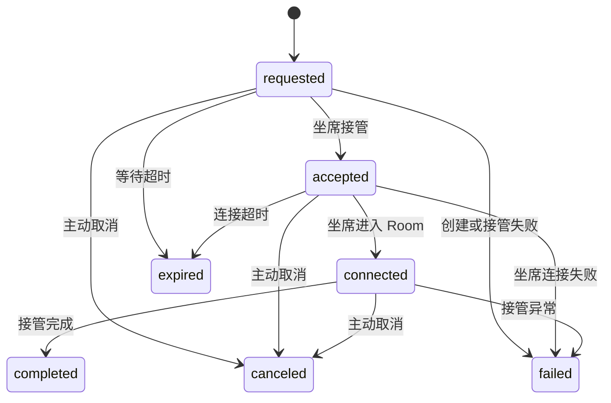

# Phase B3：最小转人工正式技术设计与收口基线

最后更新：2026-06-17

## 1. 文档定位

本文档是 Phase B3 的正式设计与实现收口基线，用于在 B1 记录与查询、B2 录音闭环、B2.5 对话文本闭环之后，定义“最小转人工”能力。

B3 当前已完成最小闭环实现和本地自动化验证。阶段验收结论见 [phase-b3-acceptance-report.md](phase-b3-acceptance-report.md)。

B3 只解决一个问题：

> 当通话需要人工接管时，系统能创建转人工请求、记录状态变化、让人工坐席以最小方式加入同一个 LiveKit Room，并让后续记录、事件、录音和对话复盘能解释这次接管。

B3 不是完整坐席系统，不做排队路由、坐席管理、技能组、质检、排班、权限平台和 CRM 工作台。

## 2. 第一性原理

转人工本质上不是一个“页面按钮”，而是一次实时通话控制权变化。

它至少包含三层：

1. 请求层：谁要求转人工，为什么转人工，当前请求是什么状态。
2. 媒体层：AI 是否停止说话，人工是否进入同一个 LiveKit Room。
3. 复盘层：通话后能按 `call_id` 查到转人工发生了什么，录音和对话文本能解释接管前后。

当前项目已经具备：

1. 每通会话一个 `call_id` 和 LiveKit Room。
2. 低频事件可进入 `ai_call_event`。
3. 录音由 LiveKit Egress 旁路生成。
4. 对话文本表已预留 `speaker_type=human_agent`。
5. Phase A 验证页可以继续作为 Web 验证入口。

所以 B3 不需要重建实时通话链路，只需要在现有 Room、事件、录音、文本之上补齐接管状态。

## 3. 设计结论

B3 采用“状态闭环 + 同 Room 坐席接入”的最小方案：

1. 新增一张 `ai_call_handoff` 表，保存每次转人工请求和处理状态。
2. 新增转人工接口：创建请求、查询当前请求、坐席接管、坐席已连接、完成、取消、失败。
3. 坐席接管时服务端签发短期 LiveKit Token，让人工以 `human_agent` 身份加入原通话 Room。
4. 请求转人工后，Agent 进入转人工挂起态：取消当前 AI 输出，清空播放队列，不再生成新的 AI 回复。
5. B3 不实现 AI 自动恢复。若转人工失败或超时，先记录失败或由上层流程结束通话；后续再设计“转人工失败后 AI 恢复”。
6. B3 不实现人工坐席语音 ASR。人工讲话由录音保留；若后续坐席系统有文本或 ASR，再写入 B2.5 的 `speaker_type=human_agent`。
7. Phase A 静态验证页增加“转人工闭环”区域，不新增完整坐席工作台。

这套方案比“只落事件不让人工进房间”多一步媒体接管验证，但仍然远小于完整坐席系统，是当前架构下最小且能落地的生产方向。

## 4. 范围

### 4.1 B3 必须做

1. 创建转人工请求。
2. 查询当前通话的转人工状态。
3. 坐席接管并拿到 LiveKit Room Token。
4. 坐席成功进入 Room 后上报 connected。
5. 完成、取消、失败、超时状态可记录。
6. 转人工全过程写入低频事件。
7. 通话记录详情能关联查询转人工记录。
8. Web 验证页能手工触发和验证最小接管链路。
9. 不影响现有 B1/B2/B2.5 查询、录音和对话文本。

### 4.2 B3 不做

1. 完整坐席账号、登录、排班、在线状态。
2. 技能组、队列、分配算法、坐席抢单。
3. 坐席工作台、IM、CRM 侧边栏。
4. 人工坐席语音实时 ASR。
5. 通话后质检、摘要、评分。
6. 真实 SIP 接入。
7. AI 自动判断所有“转人工”意图。
8. 转人工失败后 AI 自动恢复对话。
9. 多租户和数据权限平台能力。

## 5. 关键取舍

| 问题 | 推荐设计 | 原因 |
|---|---|---|
| 是否只记事件，不建表 | 不推荐 | 事件适合排障，转人工有稳定业务状态，应有独立表 |
| 是否接完整坐席系统 | 不做 | 当前阶段没有坐席域模型，强做会过度设计 |
| 是否让人工进同一个 Room | 推荐 | 这是验证真实接管能力的最小媒体闭环 |
| 是否在请求转人工时立即停 AI | 推荐 | 用户已经要求人工或系统策略要求接管，AI 继续说话会干扰 |
| 是否播放转人工提示音 | 推荐 | 优先由模型按当前通话音色播报固定提示词，不再播放固定人声音频兜底 |
| 是否支持 AI 恢复 | B3 不做 | 恢复涉及上下文、模型重启和话轮策略，复杂度高 |
| 是否自动识别“转人工”文本 | B3 不做 | 意图识别属于系统策略或后续意图识别能力，不应在通用引擎里硬编码关键词 |
| 是否落人工语音文本 | B3 不做自动 ASR | 录音先覆盖证据链，`human_agent` 文本入口留给后续坐席系统或 ASR |

## 6. 状态机

### 6.1 状态定义

| 状态 | 含义 | 是否终态 |
|---|---|---|
| `requested` | 已创建转人工请求，等待坐席接管 | 否 |
| `accepted` | 坐席已接管请求，服务端已签发坐席 Room Token | 否 |
| `connected` | 坐席已加入 Room 并上报连接成功 | 否 |
| `completed` | 转人工接管正常完成 | 是 |
| `canceled` | 转人工被取消 | 是 |
| `failed` | 转人工失败 | 是 |
| `expired` | 超过等待时间未接管或未连接 | 是 |

### 6.2 状态流转



### 6.3 与通话状态的关系

1. 转人工状态不替代 `ai_call_record.status`。
2. 通话仍然由 `ai_call_record.status` 表达整体终态，例如 `completed`、`failed`。
3. 转人工只是通话过程中的一个子状态，保存在 `ai_call_handoff`。
4. 通话结束时，如果仍有非终态转人工请求，应自动收敛为 `completed`、`canceled` 或 `failed`。
5. 用户挂机时，通话结束优先；转人工记录跟随通话结束写终态。

## 7. AI 行为

### 7.1 请求转人工后

创建转人工请求成功后，Agent 应进入 `handoff_pending` 逻辑态：

1. 立即把会话切到 `waiting`，阻断后续模型缓存音频继续发布。
2. 清空待播放音频队列。
3. 取消当前模型输出并清空模型输入缓存。
4. 不再请求模型播报转人工提示，也不再发起新的 AI 回复。
5. 进入等待声播放流程。
6. 继续保留 Room，等待人工坐席加入。
7. 写入 `handoff_requested`、`agent_suspended_for_handoff` 和等待声相关事件。

转人工后的用户反馈由等待声承载，不再依赖模型生成提示，避免出现文本已生成但音频未实际播出的复盘歧义。

### 7.2 坐席接入后

坐席接管成功后：

1. 坐席以 LiveKit Participant 身份进入原 Room。
2. AI 保持挂起，不再参与对话。
3. 录音继续由 LiveKit Egress 记录混音；如果开启分参与方录音，坐席轨道会按 `human-agent-{handoff_id}` 单独记录。
4. 通话结束仍走现有结束链路，释放 Room、Agent、录音和事件资源。

### 7.3 转人工失败后

B3 不自动恢复 AI。

原因：

1. 恢复 AI 需要重新定义上下文重放、用户等待提示和模型状态。
2. 若 AI 已被挂起后再恢复，容易出现话轮错乱。
3. 当前阶段先把接管状态做准，避免为了兜底引入复杂控制链路。

失败后可由上层业务决定：

1. 结束通话。
2. 重新发起转人工。
3. 后续阶段设计 AI 恢复。

## 8. 触发来源

B3 的转人工请求按业务触发主体只保留以下三类。第一版只要求验证页按钮触发可用；接口作为内部能力，后续 `system` 和 `customer` 也复用同一个创建接口。

| 来源 | `request_source` | B3 是否实现 |
|---|---|---|
| 验证页按钮 / 人工操作 | `operator` | 是 |
| 系统内部策略 | `system` | 预留 |
| 用户语音意图 | `customer` | 预留；不做关键词硬编码，后续由意图识别或策略层触发 |

不保留 `business` 和 `ai`：

1. `business` 当前和后续都没有明确触发场景，不提前预留。
2. `ai` 是技术实现方式，不是业务触发主体。未来如果通过模型工具调用发起转人工，应按真实原因归类为 `customer` 或 `system`。

注意：不要在 Agent 里写死“转人工”“人工客服”等关键词。通用引擎只提供请求接口和状态机，意图判断属于系统策略或后续意图识别能力。

## 9. 表设计

### 9.1 表名

`ai_call_handoff`

### 9.2 设计规范

1. 不使用 `jsonb`。
2. 不创建物理外键。
3. `bigint` 主键和业务 ID 返回前端统一转字符串。
4. 不预置 `tenant_id`。当前 AI Call 通过 `business_type + business_id` 关联上游业务。
5. 不使用审计字段 `create_by`、`create_time`、`update_by`、`update_time`、`create_dept`。
6. 不创建坐席表外键。
7. 一个通话允许存在多次转人工尝试，但同一时间只能有一个非终态请求；这个约束由服务层校验，不使用 PostgreSQL partial unique index。

### 9.3 字段

| 字段 | 类型 | 必填 | 说明 |
|---|---|---|---|
| `id` | `bigint` | 是 | 雪花主键 |
| `handoff_id` | `varchar(64)` | 是 | 转人工业务 ID，例如 `handoff_325...` |
| `call_id` | `varchar(64)` | 是 | 通话业务 ID，不建外键 |
| `room_name` | `varchar(128)` | 是 | LiveKit Room 名称 |
| `status` | `varchar(32)` | 是 | 转人工状态 |
| `request_source` | `varchar(32)` | 是 | 请求来源 |
| `request_reason` | `varchar(64)` | 否 | 请求原因 |
| `request_message` | `varchar(500)` | 否 | 请求摘要，不能保存大段原始隐私文本 |
| `human_agent_identity` | `varchar(128)` | 否 | 接管人工身份；B3 可用测试身份，不建坐席外键 |
| `requested_at` | `timestamp with time zone` | 是 | 请求创建时间 |
| `accepted_at` | `timestamp with time zone` | 否 | 坐席接管请求时间 |
| `connected_at` | `timestamp with time zone` | 否 | 坐席进入 Room 时间 |
| `ended_at` | `timestamp with time zone` | 否 | 转人工终态时间 |
| `expires_at` | `timestamp with time zone` | 否 | 等待或连接超时时间 |
| `end_reason` | `varchar(64)` | 否 | 终态原因 |
| `failure_stage` | `varchar(64)` | 否 | 失败阶段 |
| `failure_message` | `varchar(500)` | 否 | 失败摘要 |

字段取舍说明：

1. `accepted_at` 和 `connected_at` 都保留，因为“坐席拿到 Token”和“坐席真实进入 Room”是两个不同环节，B3 验证真实接管时需要区分。
2. `human_agent_identity` 只保存接管人工的稳定身份字符串，不表达坐席表、技能组或登录态。
3. `request_message` 只保存短摘要，不保存完整用户原文、录音内容或转写全文。

### 9.4 不增加的字段

| 字段 | 不增加原因 |
|---|---|
| `tenant_id` | 当前 AI Call 业务归属通过上游业务关联，不提前重复租户体系 |
| `requester_identity` | B3 没有稳定登录态或坐席域模型，请求来源用 `request_source` 表达即可 |
| `seat_id` | 当前没有坐席域模型，使用 `human_agent_identity` 保存稳定身份 |
| `seat_name` | 展示名应由上游坐席系统或前端映射 |
| `queue_id` / `skill_group_id` | 属于完整坐席系统 |
| `raw_payload_json` | B3 无稳定原始 payload；排障细节进入事件或日志 |
| `recording_id` | 可通过 `call_id` 找录音，不建冗余关系 |
| `dialogue_segment_id` | 对话文本通过 `call_id` 和时间线弱关联 |
| `handoff_config_id` | B3 不建配置表 |

### 9.5 PostgreSQL DDL 草案

```sql
create table if not exists ai_call_handoff (
    id bigint not null,
    handoff_id varchar(64) not null,
    call_id varchar(64) not null,
    room_name varchar(128) not null,
    status varchar(32) not null,
    request_source varchar(32) not null,
    request_reason varchar(64),
    request_message varchar(500),
    human_agent_identity varchar(128),
    requested_at timestamp with time zone not null,
    accepted_at timestamp with time zone,
    connected_at timestamp with time zone,
    ended_at timestamp with time zone,
    expires_at timestamp with time zone,
    end_reason varchar(64),
    failure_stage varchar(64),
    failure_message varchar(500),
    constraint pk_ai_call_handoff primary key (id),
    constraint uk_ai_call_handoff_handoff_id unique (handoff_id)
);

create index if not exists idx_ai_call_handoff_call_requested
    on ai_call_handoff (call_id, requested_at);

create index if not exists idx_ai_call_handoff_status_requested
    on ai_call_handoff (status, requested_at);
```

索引取舍：

1. `(call_id, requested_at)` 支撑通话详情页和复盘查询。
2. `(status, requested_at)` 支撑非终态请求查询、懒过期和排障。
3. B3 不建立 `human_agent_identity` 索引，因为当前没有坐席工作台、坐席历史列表或按人工聚合的查询需求；后续出现稳定查询再补普通索引。

## 10. 事件设计

B3 使用现有 `ai_call_event` 表保存低频关键事件。

| 事件类型 | source | 触发时机 |
|---|---|---|
| `handoff_requested` | `handoff` | 创建转人工请求 |
| `agent_suspended_for_handoff` | `agent` | Agent 停止 AI 输出并进入挂起态 |
| `handoff_accepted` | `handoff` | 坐席接管请求并拿到 Token |
| `handoff_connected` | `handoff` | 坐席已加入 Room |
| `handoff_completed` | `handoff` | 接管完成 |
| `handoff_canceled` | `handoff` | 接管取消 |
| `handoff_failed` | `handoff` | 接管失败 |
| `handoff_expired` | `handoff` | 接管超时 |

事件 payload 只保存排障必要字段，例如：

```json
{
  "handoffId": "handoff_325...",
  "status": "connected",
  "humanAgentIdentity": "agent-debug-001",
  "reason": "customer_request"
}
```

不要在事件中保存完整录音、完整转写或敏感业务信息。

## 11. 接口设计

接口继续使用现有顶层响应结构：`code/msg/data`。

除分页列表外，不使用 `TableResponse`。

### 11.1 创建转人工请求

```http
POST /ai-call/sessions/{callId}/handoffs
```

请求体：

```json
{
  "source": "operator",
  "reason": "customer_request",
  "requestMessage": "用户要求转人工"
}
```

响应：

```json
{
  "code": 200,
  "msg": "创建成功",
  "data": {
    "id": "325...",
    "handoffId": "handoff_325...",
    "callId": "call_325...",
    "roomName": "ai-call-call_325...",
    "status": "requested",
    "requestSource": "operator",
    "requestReason": "customer_request",
    "requestMessage": "用户要求转人工",
    "humanAgentIdentity": null,
    "requestedAt": "2026-06-16T10:00:00Z",
    "acceptedAt": null,
    "connectedAt": null,
    "endedAt": null,
    "expiresAt": "2026-06-16T10:02:00Z",
    "endReason": null,
    "failureStage": null,
    "failureMessage": null
  }
}
```

规则：

1. 只能对运行中的会话创建转人工请求。
2. 同一 `call_id` 如已有非终态转人工请求，默认返回已有请求，不重复创建。
3. 创建成功后 Agent 进入转人工挂起态。

### 11.2 查询当前转人工请求

```http
GET /ai-call/sessions/{callId}/handoff
```

返回当前非终态请求；没有则 `data=null`。

### 11.3 查询通话转人工记录

```http
GET /ai-call/records/{callId}/handoffs
```

返回该通话全部转人工记录：

```json
{
  "code": 200,
  "msg": "查询成功",
  "data": {
    "rows": [],
    "total": 0
  }
}
```

这是非分页列表，因此使用经典三段式响应。

### 11.4 坐席接管

```http
POST /ai-call/handoffs/{handoffId}/accept
```

请求体：

```json
{
  "humanAgentIdentity": "agent-debug-001"
}
```

响应：

```json
{
  "code": 200,
  "msg": "接管成功",
  "data": {
    "handoff": {},
    "seatToken": {
      "callId": "call_325...",
      "handoffId": "handoff_325...",
      "roomName": "ai-call-call_325...",
      "livekitUrl": "ws://127.0.0.1:7880",
      "participantToken": "xxx",
      "participantIdentity": "human-agent-handoff_325...",
      "expiresInSeconds": 600
    }
  }
}
```

规则：

1. 只允许接管 `requested` 状态。
2. `humanAgentIdentity` 第一版可由验证页手工输入。
3. 生产接入时必须由上游坐席系统或网关保证身份可信。
4. Token 只允许加入当前 Room，不暴露 LiveKit API Secret。

### 11.5 坐席已连接

```http
POST /ai-call/handoffs/{handoffId}/connected
```

坐席页面成功加入 LiveKit Room 后调用。

### 11.6 完成转人工

```http
POST /ai-call/handoffs/{handoffId}/complete
```

请求体：

```json
{
  "reason": "agent_completed"
}
```

### 11.7 取消转人工

```http
POST /ai-call/handoffs/{handoffId}/cancel
```

请求体：

```json
{
  "reason": "operator_cancelled"
}
```

### 11.8 标记失败

```http
POST /ai-call/handoffs/{handoffId}/fail
```

请求体：

```json
{
  "failureStage": "agent_join",
  "failureMessage": "坐席加入 Room 失败"
}
```

## 12. Schema 草案

### 12.1 请求对象

```python
class CreateHandoffRequest(AiCallBaseSchema):
    source: str = "operator"
    reason: str | None = None
    request_message: str | None = None


class AcceptHandoffRequest(AiCallBaseSchema):
    human_agent_identity: str


class FinishHandoffRequest(AiCallBaseSchema):
    reason: str | None = None


class FailHandoffRequest(AiCallBaseSchema):
    failure_stage: str
    failure_message: str | None = None
```

### 12.2 响应对象

```python
class HandoffOut(AiCallBaseSchema):
    id: str
    handoff_id: str
    call_id: str
    room_name: str
    status: str
    request_source: str
    request_reason: str | None = None
    request_message: str | None = None
    human_agent_identity: str | None = None
    requested_at: datetime
    accepted_at: datetime | None = None
    connected_at: datetime | None = None
    ended_at: datetime | None = None
    expires_at: datetime | None = None
    end_reason: str | None = None
    failure_stage: str | None = None
    failure_message: str | None = None


class HandoffTokenOut(AiCallBaseSchema):
    call_id: str
    handoff_id: str
    room_name: str
    livekit_url: str
    participant_token: str
    participant_identity: str
    expires_in_seconds: int


class HandoffAcceptOut(AiCallBaseSchema):
    handoff: HandoffOut
    seat_token: HandoffTokenOut


class HandoffListOut(AiCallBaseSchema):
    rows: list[HandoffOut]
    total: int
```

## 13. 模块设计

推荐新增：

```text
app/services/ai_call/handoff_service.py
```

扩展：

```text
app/api/v1/ai_call/model.py
app/api/v1/ai_call/crud.py
app/api/v1/ai_call/schema.py
app/api/v1/ai_call/service.py
app/api/v1/ai_call/controller.py
app/services/ai_call/orchestrator.py
app/services/ai_call/agent_runner.py
static/ai-call/customer.html
static/ai-call/customer.js
static/ai-call/ai-call.css
```

职责：

| 模块 | 职责 |
|---|---|
| `AiCallHandoffService` | 转人工表写入、状态流转、事件写入、Token 签发协调 |
| `AiCallRecordRepository` | 新增 handoff CRUD，不分散 SQL |
| `AiCallService` | 对外 API 编排 |
| `AiCallOrchestrator` | 校验运行态会话、签发坐席 Token、通知 Agent 挂起 |
| `AgentRunner` | 取消当前 AI 输出，播放固定转人工提示音，进入 handoff 挂起态 |
| 静态页 | 触发转人工、一键坐席接入、取消和状态展示 |

## 14. 坐席 Token 设计

坐席接管时签发短期 LiveKit Token。

建议身份：

```text
human-agent-{handoff_id}
```

Token 权限：

1. 只能加入当前 Room。
2. 可以发布音频。
3. 可以订阅音频。
4. TTL 复用 `LIVEKIT_BROWSER_TOKEN_TTL_SECONDS`，或新增 `AI_CALL_HANDOFF_TOKEN_TTL_SECONDS`，默认 600 秒。

B3 不做坐席登录鉴权。生产接入时，`accept` 接口必须放在上游网关、坐席系统或 AI Call 权限体系之后。

## 15. 与 B2 录音的关系

1. 转人工不新建录音任务。
2. 原 Room 的 LiveKit Egress 继续录制混音。
3. 接管前 AI、客户、接管后人工都进入同一通录音。
4. `AI_CALL_PARTICIPANT_RECORDING_ENABLED=true` 默认开启后，客户、AI、坐席会各自生成分参与方录音明细；这只服务通话后复盘和 ASR，不代表人工阶段启用实时 ASR。

## 16. 与 B2.5 对话文本的关系

1. AI 和客户文本继续按 B2.5 规则落库。
2. B3 不自动生成 `human_agent` 文本段。
3. 如果后续坐席系统回传文字或人工 ASR 完成，可以写入 `ai_call_dialogue_segment`：
   - `speaker_type=human_agent`
   - `speaker_identity=human_agent_identity`
   - `source=human_agent` 或 `source=human_agent_asr`
4. 前端对话气泡已经能按 `speaker_type=human_agent` 做样式预留。

## 17. 与真实 SIP 的关系

B3 方案对 SIP 通用。

原因：

1. SIP 用户最终也会进入 LiveKit Room。
2. 人工坐席仍然是另一个 LiveKit Participant。
3. 转人工表只依赖 `call_id`、`room_name` 和状态。
4. 录音、事件、对话文本仍按 `call_id` 复盘。

Phase E 接真实 SIP 后，不需要重建 B3 表结构；只需要把电话侧挂机、SIP 失败、坐席接管失败等事件映射到相同状态机。

## 18. 前端验证页改动

继续在 Phase A 静态验证页上扩展，不新增完整工作台。

新增“转人工闭环”区域：

| 控件 | 行为 |
|---|---|
| 发起转人工 | 调用创建转人工请求，页面显示 `requested`，用户听到固定转接提示音 |
| 一键坐席接入 | 内部依次执行 accept、坐席加入 Room、connected、complete |
| 取消接管 | 对非终态 handoff 调用 cancel |
| 刷新状态 | 查询当前 handoff 状态 |

说明：

1. 验证页不再暴露“坐席接管、坐席加入 Room、完成接管、标记失败”等多个技术按钮。
2. 后端仍保留 `requested -> accepted -> connected -> completed` 多段状态，方便排障和生产坐席系统对接。
3. 一键坐席接入只是验证页体验收敛，不改变后端接口和状态机。

展示字段：

1. `handoffId`
2. `status`
3. `requestSource`
4. `requestReason`
5. `humanAgentIdentity`
6. `requestedAt`
7. `acceptedAt`
8. `connectedAt`
9. `endedAt`
10. `failureMessage`

推荐实现方式：

1. 主验证页负责发起转人工和展示状态。
2. 一键坐席接入在同页用坐席 Token 加入同一个 LiveKit Room。
3. 不做坐席列表、技能组和排队 UI。

## 19. 超时策略

B3 不引入后台调度任务。

推荐：

1. 创建请求时写入 `expires_at`，默认当前时间 + 120 秒。
2. 查询、接管或状态变更时，如果当前时间超过 `expires_at`，服务层懒标记为 `expired`。
3. 通话结束时，所有非终态 handoff 收敛为终态。

这样可以避免为 B3 增加新的定时任务复杂度。

## 20. 权限与安全边界

B3 验证阶段允许无登录静态页触发，但生产前必须补齐访问控制。

安全要求：

1. 浏览器不能拿到 LiveKit API Secret。
2. 坐席 Token 必须由服务端签发。
3. Token 只允许加入指定 Room。
4. Token 有短 TTL。
5. `accept` 接口生产环境必须校验坐席身份。
6. `request_message` 不保存敏感完整原文。
7. 查询接口生产环境必须由网关、坐席系统或 AI Call 权限层限制访问。

## 21. 性能与延迟

B3 不在实时音频热路径里做数据库操作。

说明：

1. 创建转人工、接管、连接、完成都是低频人工操作。
2. 数据库写入发生在用户显式触发的状态变更上。
3. Agent 挂起只做状态切换、清队列、取消输出和固定提示音播放。
4. 坐席加入 Room 由 LiveKit 处理，不经过模型链路。
5. 固定提示音从本地 wav 文件读取并注入现有 LiveKit 音频轨道，不请求模型，也不走实时 TTS。

B3 可能影响的是“转人工接管耗时”，不是模型首包或普通问答延迟。

## 22. 失败处理

| 场景 | 处理 |
|---|---|
| 会话不存在 | 返回失败，`msg=通话会话不存在` |
| 会话已结束 | 不允许创建转人工 |
| 已有非终态 handoff | 返回已有请求，保持幂等 |
| 坐席接管已过期请求 | 标记 `expired` |
| Token 签发失败 | 标记 `failed`，`failure_stage=token_issue` |
| 坐席加入 Room 失败 | 调用 fail，`failure_stage=agent_join` |
| 用户挂机 | 通话结束，handoff 收敛终态 |
| 接管中服务异常 | 记录 `handoff_failed` 事件和失败摘要 |

## 23. 实施顺序

实际实现按以下顺序收口：

1. 新增 `ai_call_handoff` 模型、DDL、schema、CRUD。
2. 新增 `AiCallHandoffService`，完成状态流转和幂等校验。
3. 增加创建、查询、接管、连接、完成、取消、失败接口。
4. Orchestrator 增加坐席 Token 签发能力。
5. AgentRunner 增加 `handoff_pending` 挂起能力。
6. 静态页增加转人工闭环区域。
7. 自动化测试覆盖表结构、接口、状态机、BigInt 字符串、无外键、重复请求幂等。
8. 手工验证真实 Room 中人工坐席加入后，AI 不再继续说话，录音仍完成。

## 24. 自动化测试建议

至少覆盖：

1. `ai_call_handoff` 无物理外键。
2. `id`、`handoff_id` 输出为字符串。
3. 创建转人工请求成功。
4. 重复创建返回已有非终态请求。
5. 会话已结束时创建失败。
6. accept 签发坐席 Token。
7. connected、complete、cancel、fail 状态流转正确。
8. expired 懒标记正确。
9. 创建请求后写入 `handoff_requested` 事件。
10. accept 后写入 `handoff_accepted` 事件，并且响应返回短期坐席 Room Token。
11. Agent 挂起后不再生成新的 AI 回复。
12. 查询接口使用经典三段式响应，不使用 TableResponse。

## 25. 手工验收清单

1. 创建 Web 通话。
2. 发起转人工。
3. 页面显示 `requested`。
4. AI 当前回复停止，后续不再主动回复。
5. 输入坐席身份并点击“一键坐席接入”。
6. 服务端完成 accept、坐席加入 Room、connected 和 complete。
7. 页面显示 `completed`。
8. 人工坐席音频进入同一个 Room。
9. 通话录音继续生成。
10. 结束通话后，录音可查可播放。
11. 事件列表可看到转人工事件。
12. 通话后可以查询 handoff 记录。

## 26. 已确认设计决策

以下结论已确认，作为 B3 实现基线：

1. 请求转人工后，AI 立即挂起。
2. B3 第一版必须验证坐席真实加入同一个 LiveKit Room，因为这才是最小媒体接管闭环。
3. 转人工失败后，B3 不恢复 AI；恢复策略后续单独设计。
4. B3 不做“转人工”关键词硬编码；转人工由验证页按钮触发，后续可由系统策略或用户意图识别触发。
5. B3 不做人工坐席实时 ASR；录音层可保留 `human_agent` 分轨，供通话后 ASR 或坐席系统文本回填。
6. 请求转人工后优先由模型按当前音色播报固定提示词；不再播放固定人声兜底音频。
7. 验证页把坐席接管、加入 Room、完成接管收敛成一个“一键坐席接入”操作。
8. 生产前必须接登录态或坐席权限，但不阻塞 B3 验证页实现。

## 27. 完成定义

B3 完成必须同时满足：

1. `ai_call_handoff` 表存在且符合本文档字段设计。
2. 转人工请求、接管、连接、完成、取消、失败、超时状态可正确流转。
3. 坐席可以用服务端签发的短期 Token 加入同一 LiveKit Room。
4. 请求转人工后 AI 不再继续抢话。
5. 低频转人工事件能在 `ai_call_event` 查询到。
6. 通话录音不因转人工中断。
7. B2.5 对话文本查询不受影响，并保留 `human_agent` 承接能力。
8. 前端验证页能完成最小转人工闭环。
9. 自动化测试和一次按“单人自测方案”完成的手工 Web 验证通过。

## 28. 单人自测方案

B3 自测必须分层，不要把“状态闭环”“坐席加入 Room”和“真实双人自然对话体验”混成一个目标。

一个人可以完成前两类验证；真实自然对话体验最好用两个人，或者至少用两台设备近似。

### 28.1 状态闭环自测

一台电脑、一个浏览器即可完成。

步骤：

1. 打开 Phase A 验证页，创建通话并确认 AI 可正常说话。
2. 点击“发起转人工”。
3. 页面应显示 `requested`。
4. AI 当前输出应停止，后续不再主动回复。
5. 输入测试坐席身份，例如 `agent-debug-001`。
6. 点击“一键坐席接入”，服务端完成接管、加入 Room 和完成接管。
7. 页面显示 `completed`。
9. 结束通话。
10. 查询事件、录音、对话文本和 handoff 记录。

这一层不验证真实人工音频，只验证：

1. 表记录正确。
2. 状态流转正确。
3. 事件可复盘。
4. AI 会被挂起。
5. B1/B2/B2.5 不受影响。

### 28.2 同机双标签音频自测

一台电脑、一个人、两个浏览器标签页可以做近似音频验证。

推荐方式：

1. 标签 A 作为客户页，正常和 AI 通话。
2. 触发转人工并接管。
3. 标签 B 作为坐席页，用接管返回的坐席 Token 加入同一个 Room。
4. 标签 B 初始静音，确认加入成功后再按需打开麦克风。
5. 客户页和坐席页不要同时发布同一个物理麦克风。
6. 使用耳机，避免扬声器回采。
7. 轮流开麦测试：客户页开麦时坐席页静音；坐席页开麦时客户页静音。

这一层验证重点不是“像两个真人一样自然聊天”，而是：

1. 坐席 Participant 能进入同一个 Room。
2. AI 已经停止抢话。
3. 坐席音频可以进入 Room。
4. 客户端能听到坐席侧音频。
5. 录音不会因为坐席加入而中断。

如果两个标签都同时开同一个麦克风，会出现自己和自己说话、重复音频、回声或错误识别，这不是 B3 业务问题，而是单机音频自测的物理限制。

### 28.3 双设备自测

如果只有一个人但有手机或另一台电脑，这是更接近真实接管的方式。

推荐角色：

1. 电脑浏览器作为客户端。
2. 手机或另一台电脑作为坐席端。

注意：

1. 当前本地服务如果只监听 `127.0.0.1`，手机无法访问。
2. `LIVEKIT_URL` 如果是 `ws://127.0.0.1:7880`，手机也无法连接到电脑上的 LiveKit。
3. 双设备自测前，需要把服务地址和 LiveKit 地址切到局域网可访问地址，或者使用临时内网穿透。
4. 这个网络配置不属于 B3 业务设计本身，但属于手工联调准备工作。

双设备自测验证重点：

1. 客户端发起转人工。
2. 坐席端打开接管链接。
3. 坐席端加入同一个 Room。
4. AI 不再说话。
5. 客户端和坐席端可以真实双向语音。
6. 录音和 handoff 记录完整。

### 28.4 不建议的自测方式

1. 不建议用同一个标签页同时扮演客户和坐席。
2. 不建议同机两个标签同时开麦。
3. 不建议通过关键词“转人工”触发 B3 验收。
4. 不建议为了自测引入坐席系统、队列或登录态。

## 29. 结论

B3 已按“最小但真实”的转人工完成收口：

1. 一张 handoff 表。
2. 一组状态接口。
3. 一个坐席 Room Token。
4. 一个 Agent 挂起动作。
5. 一个静态页验证入口。

不做完整坐席系统，不做关键词补丁，不做 AI 恢复，不做人工 ASR。

这样能把当前 AI Call 从“AI 自助通话闭环”推进到“可人工接管的商用链路”，同时保持实现边界清楚、后续可扩展。

B3.1 如需继续推进，应只围绕转人工失败或超时后的异常闭环单独设计，例如等待回铃声、自动结束策略和最终结束原因落库；不要把人工 ASR、坐席排队、技能组、登录态工作台塞回 B3。
