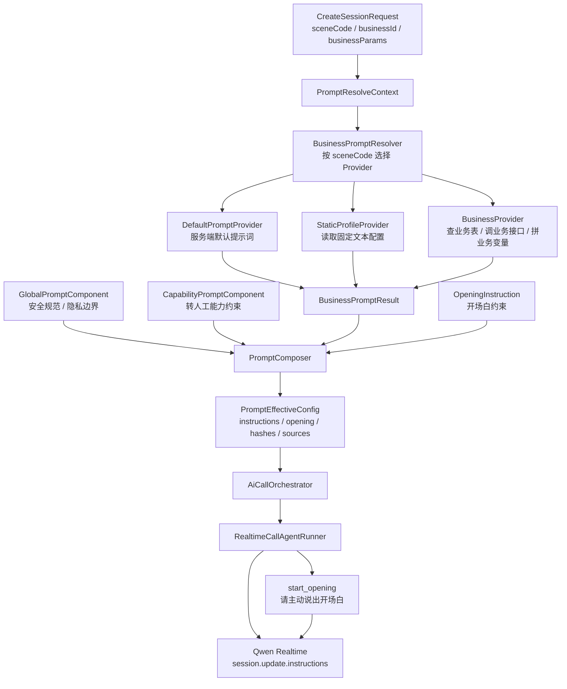

# Phase B4：业务提示词配置与组装设计

最后更新：2026-06-17

## 1. 文档定位

本文档定义 AI Call 在多业务接入场景下的提示词配置、公共提示词组装、业务提示词解析和前端配置页设计。

本阶段不是重新设计实时通话、转人工、录音或坐席链路。Phase B4 只解决一个问题：创建通话时，系统如何根据业务场景得到稳定、可配置、可审计的主对话提示词和开场白。

## 2. 第一性原理

提示词不是单纯的一段字符串，而是实时通话开始前的会话策略。

它至少包含四类内容：

1. 平台公共规则：安全规范、隐私边界、不能泄露系统提示词、不能编造系统状态。
2. 公共能力规则：转人工能力边界、通用通话控制要求。
3. 业务场景提示词：不同业务自己的目标、话术风格、字段解释和禁止事项。
4. 开场白约束：本通电话开始后 AI 应主动说出的第一句话。

这些内容的来源和生命周期不同，不能全部交给业务系统返回一整段最终提示词。业务系统只负责业务层内容；平台公共规则和公共能力规则由 AI Call 统一管理。

## 3. 设计结论

Phase B4 采用“业务 Provider + 公共组件 + 统一组装器”的轻量方案。

核心结论：

1. 创建通话请求只用 `sceneCode` 选择提示词配置。
2. `businessId` 和 `businessParams` 只作为业务上下文，供动态 Provider 查询业务数据时使用。
3. 每个业务可以实现自己的 `BusinessPromptProvider`，内部怎么查表、调接口、拼变量由业务 provider 自己负责。
4. 平台公共提示词不由业务 provider 返回，统一由 `PromptComposer` 组装。
5. 转人工能力约束属于公共能力规则，可以进入主对话 `instructions`，但转人工意图判断、提示音播放和 handoff 状态机仍走旁路服务。
6. 前端配置页只配置业务提示词 profile，不配置 SQL、表名、动态查询规则或模型密钥。
7. 运行态事件和响应中只返回 hash 和来源摘要，不反复暴露完整 prompt 和开场白原文。
8. 平台公共规则和公共能力规则 V1 不建表，先由代码或只读配置文件维护，前端只展示当前生效内容。
9. 开场白不做预生成音频、不做音色预热、不建音频缓存表；由同一个 Realtime 会话按 `instructions` 和开场白触发任务生成语音。

## 4. 范围

### 4.1 必须实现

1. 业务提示词 profile 管理。
2. 公共提示词组件只读展示入口。
3. 业务提示词 Provider 抽象和默认 Provider。
4. `PromptComposer` 统一组装最终 `instructions`。
5. 创建通话时按全局唯一 `sceneCode` 解析提示词。
6. 前端配置页支持列表、编辑和公共组件只读展示。
7. 后端预览接口保留，用于开发和问题排查，不放到业务配置页主界面。
8. 通话创建结果继续只返回 hash 和有效配置摘要。

### 4.2 明确不做

1. 不做可视化规则引擎。
2. 不允许前端配置 SQL。
3. 不做 Prompt 市场。
4. 不做 A/B 实验。
5. 不做复杂审批流。
6. 不做多模型路由。
7. 不做提示词版本回滚系统。
8. 不让业务提示词覆盖平台关键约束。
9. 不做开场白音频预生成、音频缓存、音色预热或缓存状态管理。

## 5. 总体架构



## 6. 主提示词与旁路能力边界

进入主对话 `instructions` 的内容：

1. 平台公共安全规则。
2. 转人工能力约束。
3. 业务场景提示词。
4. 开场白约束。

不进入主对话 `instructions` 的能力：

1. 转人工意图分类器的独立 system prompt。
2. `create_handoff` 状态机。
3. 转人工等待提示音。
4. 转人工失败或超时后的系统提示音。
5. 录音、事件持久化、对话文本持久化。

原因是主对话 prompt 只能影响模型怎么说，不能代替系统状态变更。真正的转人工仍必须由 handoff service 创建记录、暂停 AI、播放提示音并允许坐席加入。

## 7. 请求模型

创建会话请求建议扩展为：

```json
{
  "voice": "Tina",
  "businessId": "324800000000000001",
  "sceneCode": "debt_promise_repay_reminder",
  "businessParams": {
    "tenantId": "tenant_001",
    "customerId": "customer_001",
    "taskId": "task_001"
  }
}
```

字段说明：

| 字段 | 是否必填 | 说明 |
|---|---:|---|
| `businessId` | 否 | 上游业务 ID；用于通话记录反查 |
| `sceneCode` | 否 | 业务场景编码，全局唯一；为空时使用默认提示词 |
| `businessParams` | 否 | 业务上下文参数，只允许 JSON object |

约束：

1. `businessParams` 只能是上下文参数，不能包含 SQL、表名、查询路径或密钥。
2. 未传 `sceneCode` 时走默认 provider。
3. 已传 `sceneCode` 但配置不存在或解析失败时，应失败返回。

现有创建会话前端也必须同步改造。当前验证页只提交 `voice` 和调试 `prompt`，Phase B4 实现时需要增加 `sceneCode`、`businessId` 和 `businessParams` 输入，否则前端发起通话参数会和后端解析链路不一致。

### 7.1 调试兼容字段

`prompt` 只作为 Phase A 遗留调试字段保留，不进入正式业务接入模型。

规则：

1. 生产业务场景不使用 `prompt` 传完整提示词。
2. `sceneCode` 与 `prompt` 同时存在时，默认拒绝；只有显式开启 debug override 时才允许。
3. 前端发起通话页默认隐藏 `prompt`，只在调试模式下折叠展示。
4. 后续完成 B4 正式接入后，可以评估删除该兼容字段。

## 8. 核心对象

### 8.1 PromptResolveContext

```python
@dataclass(frozen=True, slots=True)
class PromptResolveContext:
    call_id: str
    business_id: str | None
    scene_code: str | None
    business_params: dict[str, Any]
    debug_prompt: str | None = None
```

### 8.2 BusinessPromptResult

```python
@dataclass(frozen=True, slots=True)
class BusinessPromptResult:
    prompt: str
    opening_message: str
    source_key: str
```

### 8.3 PromptEffectiveConfig

```python
@dataclass(frozen=True, slots=True)
class PromptEffectiveConfig:
    instructions: str
    prompt_hash: str
    opening_message: str
    opening_message_hash: str
    prompt_source_key: str
```

## 9. Provider 设计

统一接口：

```python
class BusinessPromptProvider(Protocol):
    async def resolve(self, ctx: PromptResolveContext) -> BusinessPromptResult:
        ...
```

第一版 provider：

| Provider | 用途 |
|---|---|
| `DefaultPromptProvider` | 无业务场景时返回服务端默认提示词和默认开场白 |
| `StaticProfilePromptProvider` | 从配置表读取固定 prompt 和固定开场白 |
| 业务自定义 provider | 由具体业务实现，查业务表或业务服务后返回统一结果 |

注册方式：

```python
registry.register("default", DefaultPromptProvider(...))
registry.register("static_profile", StaticProfilePromptProvider(...))
scene_provider_registry.register("intro_collection", CollectionProductIntroPromptProvider(...))
```

选择规则：

1. `providerKey` 只表达提示词来源模式：`static_profile` 表示固定配置，`business_query` 表示业务查询。
2. 未传 `sceneCode` 时，使用 `DefaultPromptProvider`。
3. 已传 `sceneCode` 但未命中 profile 时，返回配置缺失错误。
4. `providerKey=business_query` 时，系统按 `sceneCode` 选择具体业务 Provider，例如 `intro_collection` 对应催收产品介绍查询。
5. provider 异常时，返回明确错误，不使用默认提示词掩盖业务配置问题。

## 10. PromptComposer 设计

拼装顺序固定：

```text
平台公共安全规则

公共能力规则

业务场景提示词

开场白约束
```

示例：

```text
平台公共规则：
你必须遵守安全、隐私和合规边界...

公共能力规则：
当用户明确要求转人工、真人、客服或不想继续与 AI 沟通时...

业务话术：
你是某业务的电话外呼助手...

开场白：
通话开始后，系统会触发你主动开场。请先自然说出这句开场白：您好...
```

Composer 负责：

1. 固定拼装顺序。
2. 去除空段落。
3. 计算 hash。
4. 输出来源摘要。
5. 控制最大长度。
6. 不记录完整 prompt 到事件 payload。

## 11. 数据设计

V1 建议只新增一张业务配置表，不做版本历史表。公共提示词组件不进入这张表。

表名：`ai_call_prompt_profile`

| 字段 | 类型 | 必填 | 说明 |
|---|---|---:|---|
| `id` | bigint | 是 | 雪花主键 |
| `scene_code` | varchar(64) | 是 | 业务场景编码，全局唯一 |
| `name` | varchar(100) | 是 | 配置名称 |
| `provider_key` | varchar(64) | 是 | 提示词来源模式：`static_profile` 或 `business_query` |
| `prompt_text` | text | 否 | 固定提示词 |
| `opening_message` | varchar(1000) | 否 | 固定开场白 |
| `created_at` | timestamptz | 是 | 创建时间 |
| `updated_at` | timestamptz | 是 | 更新时间 |

唯一约束：

```text
uk_ai_call_prompt_profile_scene(scene_code)
```

V1 不建版本字段和历史表。`promptHash` 与 `openingMessageHash` 足够支撑第一版排查和复盘。若后续需要回滚、审批或版本对比，再新增 `revision` 和 `ai_call_prompt_profile_history`。

`scene_code` 不允许为空。默认提示词不写入 `ai_call_prompt_profile`，而是由 `DefaultPromptProvider` 从服务端默认配置返回。

业务外呼必须主动开场，因此 profile 不提供开场白启停字段。固定配置的 `opening_message` 必填；业务查询模式由业务 Provider 返回开场白，解析为空时创建通话失败。

### 11.1 公共提示词存放策略

平台公共规则和公共能力规则不放入 `ai_call_prompt_profile`。

V1 推荐：

1. 平台关键约束：代码常量或服务端只读配置文件，包含安全兜底和当前日期时间口径。
2. 转人工能力规则：代码常量或服务端只读配置文件。
3. 前端通过只读接口展示当前生效组件名称和内容。
4. 创建通话时由 `PromptComposer` 固定拼接，不允许业务 profile 关闭或覆盖。

不建议 V1 从前端直接写配置文件。技术上可以实现，但需要额外处理文件权限、并发写入、原子保存、热加载、审计、回滚、多实例同步和容器不可变文件系统等问题。只要允许管理端在线修改，文件方案的复杂度会接近甚至超过数据库配置。

如果后续确实要做文件写回，只能写外部运行时配置文件，例如 `data/ai-call/prompt-components.yaml`，不能直接改仓库源码文件或 `.env`。并且必须满足：

1. 只允许管理员操作。
2. 保存前做 schema 校验和长度校验。
3. 使用临时文件加原子 rename 保存。
4. 保存后重新加载到内存并记录审计事件。
5. 保存失败不影响当前运行中的配置。
6. 多实例部署时必须有共享配置或主动同步机制。

因此 Phase B4 V1 结论是：公共提示词先代码或只读配置维护，前端展示，不做在线写文件。

## 12. 接口设计

接口统一走现有响应壳：`code/msg/data`。

### 12.1 列表

```text
GET /ai-call/prompt-profiles
```

查询条件：

| 参数 | 说明 |
|---|---|
| `sceneCode` | 场景编码 |
| `pageNum` | 页码 |
| `pageSize` | 每页数量 |

### 12.2 详情

```text
GET /ai-call/prompt-profiles/{profileId}
```

### 12.3 创建

```text
POST /ai-call/prompt-profiles
```

### 12.4 修改

```text
PUT /ai-call/prompt-profiles/{profileId}
```

修改后更新 `updated_at`。

### 12.5 公共组件列表

```text
GET /ai-call/prompt-components
```

返回当前生效的公共提示词组件，只读展示。

示例：

```json
{
  "rows": [
    {
      "componentKey": "platform_constraints",
      "name": "平台关键约束",
      "content": "平台关键约束：..."
    },
    {
      "componentKey": "handoff_capability",
      "name": "转人工能力约束",
      "content": "当用户明确要求转人工、真人、客服时..."
    }
  ],
  "total": 2
}
```

### 12.6 预览

```text
POST /ai-call/prompt-profiles/preview
```

请求：

```json
{
  "businessId": "324800000000000001",
  "sceneCode": "debt_promise_repay_reminder",
  "businessParams": {
    "taskId": "task_001"
  }
}
```

响应：

```json
{
  "instructions": "平台公共规则...\n\n公共能力规则...\n\n业务话术...",
  "openingMessage": "您好，我是灵宸智能助手...",
  "promptHash": "sha256:xxxx",
  "openingMessageHash": "sha256:yyyy",
  "promptSourceKey": "debt_promise_repay_reminder"
}
```

预览接口可以返回完整 `instructions`，但只面向管理端。通话事件和客户侧会话接口不返回完整提示词。

## 13. 前端配置页

### 13.1 页面定位

前端页面是“提示词配置页”，不是调试通话页。

目标用户：

1. 运营或业务配置人员。
2. 开发测试人员。
3. 后台管理员。

### 13.2 页面结构

```text
提示词配置
  - 独立 HTML 页面
  - 列表页
  - 新增/编辑抽屉或页面
  - 公共组件只读区
```

V1 前端页面建议拆成两个入口：

1. 提示词配置页：新增独立静态 HTML，例如 `static/ai-call/prompt-config.html`，用于业务提示词 profile 管理和公共组件只读展示。
2. 发起通话页：继续使用现有客户/验证页，但创建会话参数必须从 `voice + prompt` 调整为 `voice + sceneCode + businessId + businessParams`。`prompt` 只作为调试兼容项展示，默认隐藏或折叠。

列表字段：

| 字段 | 说明 |
|---|---|
| 配置名称 | `name` |
| 场景编码 | `sceneCode` |
| 提示词来源 | 固定配置 / 业务查询 |
| 更新时间 | 最近更新时间 |

编辑区：

1. 基础信息：名称、场景编码。
2. 提示词来源：只选择固定配置或业务查询；业务查询的具体实现由 `sceneCode` 在后端路由。
3. 固定提示词编辑器：多行文本。
4. 固定开场白编辑器：单行或多行短文本。

公共组件只读区：

1. 展示平台关键约束。
2. 展示转人工能力约束。
3. 不展示 hash、来源、启停状态等工程字段。
4. 不提供编辑和关闭按钮。

### 13.3 交互约束

1. 页面不展示模型 API Key。
2. 页面不允许配置 SQL。
3. 固定提示词和开场白必须有长度限制。
4. 保存时只保存配置，不自动创建通话。
5. 公共组件只读展示，不从业务配置页修改。

### 13.4 发起通话页参数改造

现有创建会话页面需要同步调整，否则 B4 后端解析不到业务场景。

创建会话表单建议包含：

| 字段 | 控件 | 说明 |
|---|---|---|
| 音色 | 下拉框 | 继续透传 `voice` |
| 场景编码 | 输入框或下拉框 | 提交 `sceneCode` |
| 业务 ID | 输入框 | 提交 `businessId` |
| 业务参数 | JSON 文本框 | 提交 `businessParams` |
| 调试提示词 | 折叠文本框 | 仅本地调试使用，生产默认隐藏 |

创建会话 payload 示例：

```json
{
  "voice": "Tina",
  "sceneCode": "debt_promise_repay_reminder",
  "businessId": "324800000000000001",
  "businessParams": {
    "taskId": "task_001"
  }
}
```

前端提交前需要做最小校验：

1. `businessParams` 必须是合法 JSON object；为空时提交 `{}` 或不提交。
2. `prompt` 与 `sceneCode` 不应同时作为正式参数提交；调试模式下才允许传 `prompt`。
3. 创建成功后继续展示 `effectiveConfig.promptHash` 和 `openingMessageHash`，不展示完整 prompt。

## 14. 运行时链路

```text
create_session
  -> 创建 call_id
  -> 记录 businessId
  -> 构造 PromptResolveContext
  -> BusinessPromptResolver.resolve
  -> PromptComposer.compose
  -> 得到 PromptEffectiveConfig
  -> AiCallOrchestrator 创建 session
  -> AgentRunner 发 session.update.instructions
```

失败策略：

| 场景 | 策略 |
|---|---|
| 未传业务信息 | 使用默认提示词 |
| 传了业务信息但未找到配置 | 创建会话失败 |
| provider 超时或异常 | 创建会话失败 |
| 固定提示词为空 | 创建会话失败 |
| 开场白为空 | 创建会话失败 |

提示词解析必须设置短超时，避免动态业务查询长时间卡住创建通话。V1 建议增加配置：

| 配置项 | 默认值 | 说明 |
|---|---:|---|
| `AI_CALL_PROMPT_RESOLVE_TIMEOUT_SECONDS` | `2.0` | 业务提示词 provider 最大等待时间 |

超时后返回创建会话失败，错误信息放在响应体 `msg`，不回退默认提示词掩盖业务配置或业务查询问题。

## 15. 安全与审计

1. 业务配置表保存完整业务 prompt 原文，但事件 payload、客户侧响应和普通会话查询不返回完整原文。
2. `prompt/openingMessage/instructions` 继续作为敏感字段脱敏。
3. 创建会话时记录 `promptHash`、`openingMessageHash`、`promptSourceKey`。
4. 管理端预览接口需要登录和权限控制。
5. `businessParams` 需要限制大小，建议不超过 8 KB。
6. `businessParams` 中出现 `token/apiKey/password/secret` 等 key 时拒绝或脱敏。
7. 公共提示词组件只读展示时仍按管理端权限控制，避免普通客户侧接口看到完整系统约束。

## 16. 与现有阶段的关系

| 阶段 | 关系 |
|---|---|
| Phase A | 替换 Phase A 的临时 `prompt` 调试入口为正式业务解析链路 |
| Phase B1 | 通话记录继续保留已有查询能力；B4 发起接口不再新增 `businessType` 入参 |
| Phase B2/B2.5 | 录音和对话文本不受影响 |
| Phase B3/B3.1 | 转人工提示音仍走系统播报，不进入业务 provider |
| Phase B3.2 | 转人工能力约束进入公共能力组件；转人工意图分类仍是旁路服务 |
| Phase C | 压测时需要覆盖不同 prompt 长度和 provider 延迟 |

## 17. 实施顺序

建议按以下顺序实现：

1. 新增业务提示词 profile 数据表和 CRUD 接口。
2. 新增 `PromptResolveContext`、`BusinessPromptProvider`、`BusinessPromptResolver`。
3. 新增 `PromptComposer`，先支持平台关键约束和转人工能力规则。
4. 将现有 `HANDOFF_CAPABILITY_INSTRUCTIONS` 从 AgentRunner 挪到公共能力组件。
5. 改造创建会话链路，使用 `PromptEffectiveConfig`。
6. 新增公共组件只读列表接口。
7. 新增预览接口。
8. 新增独立前端提示词配置页。
9. 改造现有发起通话页的创建会话参数。
10. 补充自动化测试。

## 18. 测试要求

必须覆盖：

1. 无业务信息时使用默认提示词。
2. 固定 profile 能生成最终 `instructions`。
3. 公共安全规则优先于业务提示词。
4. 转人工能力规则不能被业务提示词覆盖。
5. 业务 provider 返回开场白后，开场白进入最终上下文。
6. 配置缺失时创建会话失败。
7. provider 异常或超时时创建会话失败。
8. 后端预览接口返回完整 instructions，创建会话接口只返回 hash。
9. 事件 payload 不包含完整 prompt 和开场白原文。
10. 前端保存、状态展示流程可用。
11. 前端可以只读展示当前公共提示词组件。
12. 发起通话页提交的新参数与后端请求模型一致。

## 19. 验收标准

Phase B4 完成时应满足：

1. 管理端可以配置至少一个业务场景提示词和开场白。
2. 创建通话时可按 `sceneCode` 选择对应配置。
3. 不同业务场景生成不同 `promptHash/openingMessageHash`。
4. 最终 `instructions` 由公共规则、公共能力规则、业务提示词和开场白约束按固定顺序组成。
5. 转人工自动触发仍由 B3.2 旁路服务执行，不依赖业务提示词。
6. 客户侧接口和通话事件不泄露完整 prompt。
7. 前端可以看到当前生效的公共提示词组件，但不能在 V1 修改公共组件。
8. 本地自动化测试通过。

## 20. 后续扩展

后续可按实际需要扩展：

1. profile 历史版本表。
2. 发布审批。
3. 多租户隔离。
4. provider 级缓存。
5. 业务字段模板渲染预校验。
6. 提示词效果评估和通话结果关联分析。

这些不进入 Phase B4 V1。
