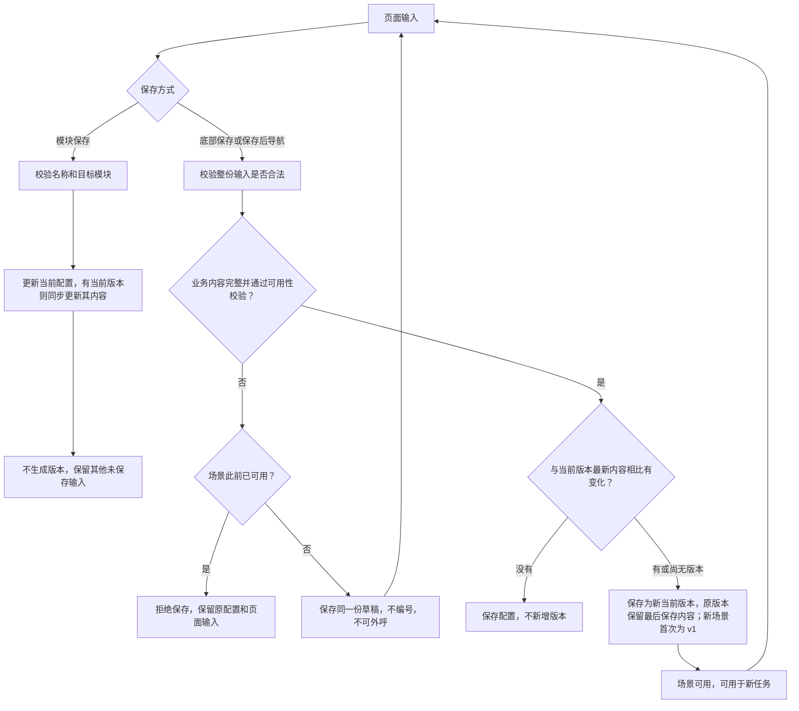

# REACH 提示词编辑器：模块保存、草稿、版本与场景删除设计

日期：2026-09-24

更新：2026-09-29

状态：本地实现、自动化验证及核心浏览器流程验收完成；2026-09-29 已部署线上并完成迁移、只读查询和资源核验。完整本地验收范围见第 19 节；本次生产结果和验收边界见 [发布记录](../production-deployed-20260929-all.md)。

适用页面：`/reach/prompt-config`。

涉及仓库：`ai-call`、`lingchen-platform-web`。

## 1. 目标与范围

让用户在同一个编辑页完成新建场景、按模块编辑、AI 优化、局部保存和整份配置保存；在长页面任意位置都能预览和保存，并准确知道内容是否已保存、是否生成版本、是否可用于外呼。

本设计以本次讨论最终规则为准。旧 B4 文档仍用于理解提示词组装边界；本次涉及的页面展示、保存和版本规则以本文为准。

范围包括前端交互、后端保存合同、版本快照、草稿持久化、场景删除与知识库关联展示、通话入口准入、历史兼容及验收。不修改平台安全约束内容、全局打断策略、通话控制、供应商媒体链路或真实业务提示词内容。

## 2. 已确认的产品规则

1. 页面不展示平台固定约束；后端仍强制执行这些约束。
2. 不展示独立的通用沟通规则模板编辑区。新场景第三节「沟通规则」初始化为通用规则，已有场景内容不自动覆盖。
3. 开场白、产品与服务总结、场景提示词各有保存按钮。模块保存真正写入后端，只保存本模块；已有当前版本时同步更新该版本对应内容，版本 ID 和编号不变。
4. 开场白和场景提示词的 AI 入口与邮件营销保持一致：星光图标、浅紫色按钮及指令输入栏；首次生成前就能输入指令。候选弹窗中的指令框也使用同一套样式。
5. AI 优化以本模块内容及用户指令为编辑依据，不额外注入隐藏的通用规则，也不额外抽取第三节作为另一份优化要求。
6. 底部常驻「预览」「保存配置」，原「保存场景配置」改名为「保存配置」。
7. 新建和编辑共用同一个表单，通过页面状态区分；不另建完整的新建抽屉或向导。
8. 场景编码由系统自动生成，已有编码保持稳定，业务编辑页不要求用户填写编码。
9. 切换场景、切换菜单、离开页面、新建及取消新建前，检查真实的未保存修改。
10. 导航确认只保留「保存并执行目标操作」「取消」两个按钮，例如「保存并切换」「保存并离开」「保存并新建」。
11. 整份保存包括底部保存和上述确认保存。新场景内容完整且通过可用性校验后，首次整份保存生成 v1；已有版本时，将本次全部输入与当前版本最新已保存内容比较，有实际变化才生成下一版本。全部修改已通过模块保存后再点击底部保存，不重复生成版本。
12. 每个新场景只保留一份草稿，不编号、不进入版本历史。内容不完整时，模块保存和整份保存都更新这份草稿；草稿只保留最近成功保存的内容，不提供草稿历史恢复。
13. 当前版本随模块保存更新，其他版本内容保持不变；产生下一版本时，上一版本保留当时最后保存的内容。模块保存前的旧内容不另存一份历史，任务和通话的已冻结快照保持不变。
14. 模块保存必须校验有效场景归属和非空场景名称。尚无数据库 ID 的新场景，通过首次模块保存创建场景草稿。
15. 场景名称在同一租户的未删除场景中唯一，草稿与可用场景共同判重。名称修改后在输入框失焦（`blur`）时校验，保存时后端再次检查；名称去除首尾空白后比较，编辑时排除当前场景自身，重名时提示修改。
16. 已保存草稿和可用场景共用「删除场景」入口，采用软删除；存在未结束的关联任务、正在执行的重呼或通话时拒绝删除。删除保留场景内容、版本和历史记录，不生成新版本。
17. 删除后知识库只显示仍有效的关联场景；没有其他关联时显示「未关联场景」。知识资料保留，历史提取与使用记录保留原场景名称并标记「已删除」；原场景删除后复用其名称创建的场景不继承旧关联。

## 3. 当前代码事实与实现影响

以下是 2026-09-24 方案制定前的代码基线。2026-09-26 的本地实施与验证记录见文末，不代表线上已经更新。

| 当前事实 | 对本次实现的影响 |
|---|---|
| `PromptProfileBaseRequest` 要求固定场景的开场白、提示词都非空 | 草稿保存需要独立的校验合同，不能简单删除所有入口的校验 |
| `create_prompt_profile`、`update_prompt_profile` 每次保存都会追加版本 | 必须区分模块保存与整份保存，增加无变化判断 |
| `ai_call_prompt_profile` 保存当前配置，`ai_call_prompt_profile_version` 保存快照 | 复用这两类数据，不新增一套独立的草稿内容表 |
| 前端只有整页 `sceneDirty` 标记，保存后调用 `applyProfile` 替换整份表单 | 需要按保存基准比较模块差异，局部成功不能清空其他模块的输入 |
| 配置页有切换场景确认和 `beforeunload`，页面内刷新直接重新加载 | 需要统一站内导航及刷新保护，不能仅拦截某个按钮 |
| AI 请求额外传递 `commonPrompt` | 优化入口须移除隐藏模板输入；模板只保留新场景初始化用途 |
| 新任务冻结配置表的实际内容，并附带 `versionId/versionNo` | 同一当前版本可能被多次模块保存修改，任务须保留当时的实际内容及修订，不能事后仅按版本号还原 |
| 任务创建和直接按场景发起通话均读取场景配置 | 草稿准入校验必须覆盖列表、任务创建和直接通话入口 |
| 当前页面和接口只提供历史版本删除 | 场景删除需补齐软删除字段、占用检查、接口及各入口过滤 |
| 知识资料通过 `prompt_profile_id` 关联场景，任务冻结提示词与知识快照 | 删除场景时只使关联失效，保留知识资料、原 ID 和历史快照；正常关联查询与历史追溯分开 |

主要代码入口：

- 后端：`app/api/v1/ai_call/{schema,controller,service,crud,model}.py`。
- 提示词解析与 AI：`app/services/ai_call/{prompt_config,prompt_optimization}.py`。
- 任务冻结与准入：`app/api/v1/ai_call/outbound/{rule_task_service,service,task_executor}.py`。
- 删除占用与关联：`app/api/v1/ai_call/outbound/exception_service.py`、`app/services/ai_call/{knowledge,follow_up_service}.py`、`app/api/v1/ai_call/knowledge_controller.py`；前端知识库关联、任务及历史展示入口同步检查。
- 前端页面：`src/modules/reach/pages/prompt/{index.tsx,index.css,VariableEditor.tsx}`。
- 页面当前实际导入的服务：`src/modules/reach/services/ai-call-lab.ts`。不要只修改未被该页面使用的同名服务实现。
- 任务、实验室入口：`src/modules/reach/pages/tasks/configService.ts`、`src/modules/reach/pages/tasks/create/index.tsx`、`src/modules/reach/pages/lab/customer/index.tsx`。
- AI 样式参考：`src/modules/reach/pages/email/ContentModal.tsx`、`ContentModal.module.css`。

## 4. 三类内容与两个独立状态

### 4.1 内容归属

| 对象 | 含义 | 持久化方式 |
|---|---|---|
| 页面编辑内容 | 用户此刻在表单中看到的内容，可能尚未保存 | 前端状态；不得声称已保存 |
| 当前配置 | 最近成功保存到服务器的各模块组合 | 原场景配置表；模块保存、整份保存均可更新 |
| 版本内容 | 每个版本最后保存的完整配置；当前版本与当前配置保持一致 | 原版本表；模块保存同步更新当前版本，其他版本保持不变 |

模块保存不是第二次确认之前的临时操作。服务端确认成功后，该模块内容在刷新、切换场景、重新打开页面后仍存在。

例如当前 v3 为 A＋X，开场白 A 改为 B 并保存后，当前配置和 v3 都变成 B＋X。之后整份保存 B＋Y 生成 v4，v3 保留 B＋X；本轮模块保存前的 A＋X 不再由 v3 提供恢复。任务中已经冻结的 A＋X 仍保留，用于该任务执行和追溯。

### 4.2 状态必须分开表达

- 保存状态：未保存、保存中、已保存、保存失败、保存结果未确认。
- 场景可用状态：`DRAFT`（草稿）、`READY`（可用）。

草稿显示「草稿」或「草稿已保存」，并列出待填写项；内容已补齐但仅做过模块保存时，提示「内容已补齐，保存配置后可用」。首次整份保存通过可用性校验后，显示「v1 · 可用」。已有版本的模块保存成功后显示「已保存至 vN」，并保留其他模块的未保存提示。草稿未生成版本不代表已保存内容会丢失。

删除使用独立的删除时间标记，保留删除前的可用状态和内容；已删除场景退出正常编辑与选择列表，仅在历史追溯中显示「已删除」。

### 4.3 外呼生效边界：工程补充约定

以下规则补全实际运行边界，供本设计稿一并评审：

1. 新场景最初为 `DRAFT`。模块保存可以补齐内容，但首次完成一次整份保存并通过可用性校验后，才转为 `READY`。
2. 不完整的新场景执行整份保存，仍为 `DRAFT`，只更新同一份草稿，不生成版本；草稿可以在配置页继续维护，不出现在新任务可选场景中。
3. 已为 `READY` 的场景，模块保存成功后，修改对随后读取当前配置的新任务、直接通话生效；不必再次保存一个版本才生效。
4. 为避免已可用场景因编辑被意外停用，`READY` 场景的模块及整份保存必须保持业务必填项有效；清空必填项时拒绝写入，不自动降级成草稿。本次不引入“在线配置与另一份修改草稿并行”的发布流程。
5. 已创建任务继续使用任务创建时冻结的内容，不被后续模块保存、版本生成或历史恢复改写；普通编辑不重新判定既有任务快照。场景删除另按第 6.3 节检查业务占用：未结束任务阻止删除，删除后禁止新发起重呼或回拨，历史查看保持可用。

## 5. 页面布局与操作

### 5.1 布局

从上到下为：场景选择和新建入口、场景名称、开场白、产品与服务总结、场景提示词、现有历史版本区域。底部操作栏独立于正文滚动。

- 删除顶部平台固定约束和独立通用模板区域的展示。
- 三个编辑模块的标题、间距、状态和保存按钮位置统一；移除产品总结前无对应步骤的数字“4”。
- 保留现有历史版本功能；本轮不额外迁移为抽屉，不增加另一套导航体系。
- 保留场景名称输入；场景编码在后端及内部请求中使用，不在业务编辑区展示。
- 「新建场景」旁增加「更多」，其中提供红色「删除场景」操作；删除入口不放入底部主要操作栏。
- 底部栏只覆盖右侧内容区域；随侧边栏折叠和窗口宽度变化。正文及焦点滚动预留底部空间，最后一行不能被遮挡。
- 窄屏按钮允许换行，状态与操作不重叠；键盘可访问所有按钮，焦点始终可见。

### 5.2 按钮合同

| 按钮 | 保存范围 | 版本行为 | 何时禁用 |
|---|---|---|---|
| 保存开场白 | 开场白、允许打断及本模块必要变量 | 有当前版本则同步更新该版本；无版本则只更新草稿，不新增版本 | 本模块无变化，或有保存请求正在处理 |
| 保存产品与服务 | 产品总结及对应来源校验信息、必要变量 | 同上 | 同上 |
| 保存场景提示词 | 整份场景提示词及本模块必要变量 | 同上 | 同上 |
| 底部保存配置 | 名称及三个模块的全部当前输入 | 内容不完整的新场景只保存草稿；完整且通过校验后首次生成 v1，已有版本时按差异新增 | 初始加载、保存中；不能仅因没有页面脏数据而禁用 |
| 预览 | 当前页面全部输入，包括未保存内容 | 不写入、不生成版本 | 预览请求中 |
| 保存并切换／离开／新建 | 与底部保存相同 | 与底部保存相同 | 请求处理中 |
| 更多 → 删除场景 | 软删除当前已保存场景，放弃其未保存输入 | 不生成版本，保留既有快照 | 无服务端 ID 时不提供；保存或删除处理中不可重复执行，占用时展示具体原因 |

模块按钮为次级按钮，底部保存为主要操作。AI 操作使用浅紫色，不与主要保存使用同样的实心强调样式。

本页所有保存按钮统一添加防抖和 loading，覆盖三个模块保存、底部「保存配置」及导航确认中的「保存并……」等保存入口：

- 首次点击立即响应，300ms 内重复触发忽略，不延迟首次提交、不在间隔结束后补发。请求未结束时持续拦截重复提交，不能只靠这段防抖间隔。
- 触发保存的按钮立即显示 loading，覆盖校验及请求过程；同一场景的其他保存入口暂时禁用，避免交叉提交。鼠标点击和键盘提交遵循同一规则；重复操作不排队。
- 成功、校验失败及明确请求失败后结束 loading、解除请求锁，按各按钮原有条件恢复操作，保留错误反馈与未保存输入。超时或断网也结束 loading，但显示「保存结果未确认」，核对服务端结果后才允许再次写入，不能一直转圈或直接重复提交。
- 保存期间仍可继续编辑；新输入不计入本次成功保存，按未保存修改保留。导航确认中的保存成功后才执行目标导航。

名称修改后，输入框失焦（`blur`）即校验；点击保存也校验，不能依赖用户是否先移开焦点。已有场景的名称修改由整份保存提交，局部保存不顺带提交名称修改。

- 失焦时先检查去除首尾空白后的名称是否为空、长度是否合法；不合法则在字段下提示，不发送判重请求。首次展示不主动标红未填写字段。
- 名称合法时调用后端名称校验接口，覆盖同一租户全部未删除场景，包含草稿；编辑时排除当前场景自身。不能只依据已加载列表或当前页判断名称可用。
- 检查中在名称字段显示校验状态；重名时标红并显示「场景名称已存在，请使用其他名称」，输入保留。重新修改名称后清除旧名称的判重结果，在下次失焦时重新检查，不对每次按键发请求。
- 判重请求绑定场景 ID／新建标识和本次名称；快速改名或切换场景后，迟到结果不得覆盖当前字段状态。检查失败显示「暂时无法检查名称，请重试」，不能标记为名称可用。
- 点击实际提交名称的保存操作时，后端仍以相同规则判重并由唯一约束防止并发重名。即使失焦检查未触发、仍在进行或曾失败，保存接口也执行完整校验；更早的失焦回包不能覆盖保存结果。保存发现重名时定位并聚焦名称，导航确认中的保存留在当前页面。

名称校验只检查是否可用，不创建场景、不保存名称、不生成版本；失焦校验通过后，名称修改仍属于未保存输入。

### 5.3 预览

预览读取当前表单，不读取另一份已保存旧内容，不发生保存。弹窗标明「当前编辑内容预览」，保留平台规则不在业务预览中展示的说明。

草稿允许预览已填写部分，空模块标记「未填写」。预览专用校验与真实通话的可用性校验分开；未定义变量等非法输入仍需定位提示。平台规则虽然不在编辑页展示，真实通话仍统一组装执行。

## 6. 新建、草稿与场景删除

### 6.1 同页新建

点击新建后仍使用原表单，顶部明确显示「新建场景」，名称输入获得焦点，提供「取消新建」。进入前按第 9 节检查原场景未保存修改。

| 字段 | 初始内容 |
|---|---|
| 场景名称 | 空，用户填写；必填，同一租户内唯一，修改后失焦校验，草稿也参与判重 |
| 场景编码 | 服务端自动分配稳定的内部编码 |
| 开场白 | 空 |
| 允许打断 | 开启；运行时仍服从全局打断开关 |
| 产品与服务总结 | 空 |
| 场景提示词 | 六节结构，第三节一次性填入通用沟通规则，其余章节为待填写内容 |

填写引导使用编辑器提示，不保存为业务话术。只保存章节标题和通用规则不算业务目标已填写。模板初始化仅发生一次；重新读取草稿、切换回来或应用历史内容时，不再次自动补写、改写用户内容。

通用规则沿用已有模板来源。初始化失败明确显示“默认沟通规则加载失败”并允许重试；不得悄悄使用另一份隐藏模板。已有场景不随模板更新而变化。

### 6.2 首次保存

- 用户只输入但未点击任何保存，尚无服务端场景。此时不自动插入空记录。
- 首次模块保存：名称通过校验后，创建同一份场景草稿，只保存选定模块及创建必需元数据，返回稳定 `id`、`sceneCode`，不生成版本。
- 新建时未编辑过的章节骨架和第三节默认规则可作为创建默认值一次固定；用户对其他模块已经做出的修改不能夹带保存。后续局部保存不重新初始化默认值。
- 首次整份保存：尚未落库时创建场景，已有草稿时继续更新同一记录。必需业务内容不完整则保留草稿、不生成版本；完整且通过可用性校验才生成 v1 并转为可用。
- 首次保存回包后必须保留其他未提交模块的页面输入；不能直接用服务端整份对象覆盖编辑器。
- 草稿持久化后立即出现在当前租户配置列表，名称旁显示「草稿」。切换、刷新、退出编辑不删除草稿。
- 新建模式持有稳定创建标识；超时重试不能重复创建场景。返回既有草稿 ID 后应继续更新它。

草稿第一次落库后，页面进入这个草稿的编辑状态；退出编辑保留草稿，需要移除时使用「更多 → 删除场景」。尚未落库的新场景继续使用「取消新建」。

后续每次保存都更新同一份草稿，不另建草稿记录或保存草稿历史。模块保存只更新目标模块，其他已保存模块保留；整份保存更新全部当前输入。草稿的当前版本为空，历史版本数为 0。仅通过模块保存补齐内容时仍为草稿，下一次整份保存通过可用性校验后才生成 v1。

### 6.3 场景删除

已保存草稿和可用场景共用同一操作。点击后读取删除检查结果：当前已保存名称、关联知识资料数量、阻止删除的业务占用及当前编辑修订。未通过权限检查时不返回越权数据；检查失败保留页面并允许重试。

| 当前情况 | 删除行为 |
|---|---|
| 已保存草稿，或没有未结束业务占用的可用场景 | 允许确认删除 |
| 有待执行、进行中、暂停等未结束关联任务 | 拒绝删除，展示占用任务及有权访问的跳转入口 |
| 有排队／执行中的重呼或进行中的通话 | 拒绝删除；不能仅凭父任务已完成判断无占用 |
| 只有已结束的任务、通话及使用记录 | 允许删除，保留历史引用和内容 |

仍会使用该场景发起通话的未结束跟进任务也计入占用。后端按实际业务状态检查，不以页面是否显示“进行中”代替真实判定。

允许删除时仅出现一次确认，标题使用服务端已保存名称：

> 确认删除场景「GEO 产品介绍」？
>
> 删除后，该场景将从列表移除，不能再用于新任务、测试或发起重呼。已有任务、通话记录和知识资料会保留。
>
> 该场景关联了 X 条知识资料，删除后这些关联将失效，知识资料会保留。

关联数量为 0 时省略数量段；存在未保存修改时追加「当前未保存的修改将一并放弃」。按钮仅为「取消」「删除场景」，后者使用危险操作样式。取消不改变任何内容；确认删除不先保存、不触发「保存并离开」，不因未保存名称为空或重复而阻止删除已存在的场景。

- 删除请求成功后，才移除列表项、清除该场景页面输入并关闭相关候选弹窗，切换到剩余列表首项；没有场景时显示「暂无场景」和「新建场景」。这一次成功后的切换不再次触发未保存提醒。
- 删除失败保留输入和当前选择。请求超时显示「删除结果未确认」，通过删除检查接口核对目标 ID；未确认前不清空页面、不报告成功。
- 场景内容、版本、任务、通话和知识使用审计保留，删除不创建或删除版本快照，当前版本保护不妨碍整场景软删除。
- 名称可重新使用；新场景必须获得新 ID 和新编码，旧编码和创建幂等标识不复用，不将旧场景引用转到同名新场景。

### 6.4 删除后的知识库展示

知识库列表、详情和关联编辑只展示有效关联，关联数量也按有效关联计算：

| 删除前 | 删除场景 A 后 |
|---|---|
| 关联场景 A、场景 B | 仅显示场景 B，关联数量为 1 |
| 仅关联场景 A | 显示「未关联场景」，关联数量为 0，可重新选择场景 |

关联下拉中移除已删除场景。知识资料正文、文件、解析状态和版本保持不变；删除场景本身不触发资料删除或重新解析。只有原场景已删除且没有其他未删除场景占用名称时，才能复用原名称创建新场景；新场景仍需通过名称校验并由用户重新关联知识资料。

后端以场景未删除作为绑定生效条件，原绑定行无需为此逐条物理删除；绑定查询、计数、提取和新绑定写入统一执行这个条件。历史提取、使用记录通过原 ID／编码与已保留内容展示原场景名称及「已删除」，不把历史记录显示成当前有效关联，也不通过名称查找同名新场景替代原引用。

## 7. 模块保存与版本规则

### 7.1 模块隔离

开场白保存包含允许打断开关。每个模块提交自己引用的新变量定义；服务端与已保存变量集合合并，拒绝同 key 不同定义或不同 key 同中文名称的冲突。局部保存不删除仍被其他已保存模块引用的变量。

产品总结的知识来源快照校验只随对应内容提交。保存开场白不能因另一模块尚未提交的知识草稿过期而失败；保存产品总结时仍必须校验其来源。

保存期间用户可以继续输入，但同一场景同一时刻只执行一次保存，处理中重复触发直接忽略，不排队补交。回包只确认请求发送时的那份内容；请求后新增的输入继续标记未保存，不被旧回包覆盖。

有当前版本时，模块保存把同一份模块合并结果原子写入配置表和当前版本的 `snapshot_json`，不新增版本记录、不改版本编号；其他模块沿用服务端已保存值，不能夹带页面未提交内容。当前版本的创建时间和创建人仍表示该版本最初创建信息，保存时间由配置的最新更新时间反馈。

### 7.2 当前版本与内容比较

`current_version_id` 指向当前版本，界面显示「当前版本 vN」。有当前版本时，其业务内容必须与服务端当前配置一致；模块保存同步更新两者，页面仍可存在其他未保存修改。

对比字段包括：名称、稳定编码、provider、开场白、允许打断、产品总结、场景提示词和变量定义。保存时间、编辑修订号、版本名称、列表顺序等元数据不构成内容变化。

比较必须基于统一规范化后的结构化内容：统一换行和字段已有的首尾空白规则，变量按 key 规范排序；保留正文内部空格、段落、大小写和变量标记，不做可能改变话术意义的文本压缩。允许用稳定序列化及 hash 辅助比较，但前后端须共享同一业务语义。

- 新场景内容不完整：整份保存只更新同一份草稿，不生成版本，当前版本保持为空。
- 新场景尚无版本且内容完整：整份保存通过可用性校验后生成 v1，并转为可用；即使全部内容已通过模块保存，也需要完成这次整份确认。
- 已有当前版本，本次全部输入与其最新已保存内容不同：整份保存生成下一个版本，版本号按该场景历史最大值加一，含软删除版本，不复用编号；原版本保留切换前最后保存的内容。
- 与当前版本最新内容相同：不新增版本，反馈“内容未变化，未新增版本”。即使本轮已经做过多次模块保存，也不再为这些已入当前版本的内容生成重复版本。
- 用户修改后又改回最近已保存内容：不新增版本。若修改已做过模块保存，再编辑回更早内容，则相对当前版本仍是实际变化。
- 全部模块都已保存：直接导航不生成版本；底部无新内容时也不生成版本。只有无版本且已补齐的新场景仍需整份保存生成 v1。
- 不对所有历史内容做全局去重；例如从 A 改成 B，再整份保存回 A，仍是一次新版本。明确“应用历史版本”则沿用既有恢复操作，不伪造新版本。

### 7.3 示例

| 场景 | 操作 | 当前配置 | 当前版本及其他版本 |
|---|---|---|---|
| 新场景 | 只保存开场白 | 已持久化草稿 | 无版本 |
| 同上 | 再保存场景提示词 | 更新同一草稿 | 无版本 |
| 同上 | 底部保存，内容完整 | 可用于新任务 | v1，可用 |
| 同上 | 再次点击底部保存 | 不变 | 仍为 v1 |
| 新场景 | 内容不完整，首次或多次点击底部保存 | 创建或更新同一份草稿 | 无版本 |
| 新场景 | 只保存开场白后，执行有待保存修改的「保存并离开」 | 持久化全部当前输入，仍不完整；返回可继续编辑 | 无版本 |
| 已保存草稿 | 补齐并单独保存场景提示词 | 当前配置已补齐，仍待整份确认 | 无版本 |
| 同上 | 底部保存，或有未保存修改时选择「保存并离开」 | 整份校验通过，转为可用 | v1，可用 |
| 已可用 v3 | 开场白 A 改 B 并局部保存，提示词 X 改 Y 未保存 | 服务端为 B＋X，页面为 B＋Y | 当前 v3 更新为 B＋X，其他版本不变 |
| 同上 | 保存并切换 | 服务端为 B＋Y | 新当前版本 v4 为 B＋Y，v3 保留 B＋X |
| 另一条操作路径：当前 v3 为 B＋X | 将提示词 Y 也单独保存 | 服务端和页面均为 B＋Y | 当前 v3 更新为 B＋Y，未生成 v4 |
| 同上 | 再点击底部保存，没有新修改 | 不变 | 仍为 v3：B＋Y，不生成重复版本 |

### 7.4 历史操作

- 版本列表展示各版本最后保存的内容，并明确标记当前版本；当前版本详情在模块保存后同步刷新。草稿通过当前场景继续编辑，不提供草稿历史查看、对比或恢复。
- 「应用此版本」保留现有切换当前版本的行为及应用记录：有未保存修改时，同一个确认框提供「保存并应用 vN」「取消」；先整份保存，成功后再应用历史版本。保存失败不应用；保存成功而应用失败时保留已保存内容及新版本，提示应用失败。无未保存修改时直接确认应用。实际内容及名称校验通过后，将所选版本写入当前配置并更新 `current_version_id`，应用本身不新增版本。
- 应用历史 v1 后，v1 成为当前版本；之后模块保存更新 v1，其他版本不变。确认弹窗明确说明「应用后 v1 将成为当前版本，后续模块保存会更新该版本内容；已创建任务不受影响」。非当前版本不能直接编辑正文，必须先明确应用。
- 应用操作按锁内最新修订核对目标内容；当前配置与当前版本一致时，重复应用当前版本不写入、不新增应用记录。当前配置与指向版本不一致属于需核查的数据异常，不能仅凭 ID 相同报告成功。
- 新场景没有历史时显示「暂无版本」，不显示虚构的 v0／v1。
- 版本重命名只改元数据，不修改正文。当前版本沿用不可删除保护；模块保存、历史应用及版本修改共用并发校验，目标内容在确认期间有变化时保留输入并提示重新确认。

## 8. AI 生成与优化

### 8.1 页面与候选弹窗

复用邮件营销的星光图标、浅紫色按钮、带操作按钮的指令栏。提取最小共享视觉组件即可，不把邮件任务、轮询或内容保存逻辑引入提示词页面。

- 空内容显示「AI 一键生成」，已有实际内容显示「AI 优化」。仅章节骨架和默认规则的新场景仍按待生成处理。
- 第一次请求前可以输入指令；空指令可用默认生成／优化入口。
- 指令栏内有「生成／优化」按钮；生成期间显示处理中并防止重复请求。
- 候选弹窗保留原内容、候选内容对比。底部指令栏可多行展开，栏内执行「重新优化」；弹窗操作为「取消」「采用内容」。
- 连续优化以当前候选为基础，原内容对照固定为本轮操作开始时的模块内容。
- 采用内容只更新目标模块的页面输入，不自动保存或生成版本。

### 8.2 输入范围与边界

优化已有内容：业务编辑依据为本模块完整内容和用户指令；不额外传入全局通用模板，不单独抽取第三节作为另一份规则，也不隐式修改其他模块。场景提示词本来包含第三节，按用户指令对这份完整内容进行编辑即可。

空白生成：允许使用页面可见的场景名称、产品与服务事实和用户指令，且只生成目标模块；事实不足时要求补充必要信息，不用通用规则替代产品事实。

变量白名单、平台安全校验、动作承诺校验保留，属于系统边界，不是另一份业务模板。候选不能删改既有变量或引入未定义变量。

用户指令只要求修改某一节时，其他章节应保持原样。模型请求明确要求保留未指定修改的内容；候选对比展示所有实际变化，不能只展示目标章节而隐藏其他变化。对任意自然语言指令不声称已完成确定性的范围校验，不为此增加一套指令解析器；用户在完整对比后确认采用。

请求须绑定场景 ID／新建标识、目标模块及内容修订。请求期间切换场景、编辑原内容或关闭操作后，迟到候选不得覆盖新内容。失败保留指令和已有候选，显示具体原因，恢复原生成／优化按钮供用户再次发起；不增加自动重试或轮询。

## 9. 导航与未保存保护

### 9.1 判断基准

页面未保存状态比较「当前输入」和「后端最近确认保存的当前配置」。有当前版本时，该配置与当前版本业务内容一致；模块保存成功即已存入该版本，展示「已保存至 vN」。

两份内容只保存在当前页面的 React 状态中，不写入 localStorage 或本地文件。页面加载时从服务器初始化，输入只更新编辑内容；保存成功后用服务器确认的结果更新保存基准。比较在浏览器内完成，不因每次输入请求服务器。刷新后重新从服务器读取，未保存输入由离开保护提醒。

初始化默认值、读取数据、重新渲染不算用户修改。改回已保存原值后取消未保存状态。模块保存仅消除已确认保存部分的差异；仍在途的保存不提前清除差异。

### 9.2 站内操作

| 操作 | 无未保存输入 | 有未保存输入 |
|---|---|---|
| 切换场景、切换菜单、站内前进后退 | 直接执行，不生成版本 | 「保存并切换／离开」「取消」 |
| 新建场景 | 进入同页新建 | 「保存并新建」「取消」 |
| 取消尚未落库的新建 | 回原场景 | 「保存并返回」「取消」；前者内容不完整时保存草稿，完整且通过校验时生成 v1 后返回 |
| 页面内刷新 | 重新读取 | 「保存并刷新」「取消」 |

确认保存全部走与底部按钮相同的整份保存流程：新场景内容不完整时保存同一份草稿，完整且通过校验时首次生成 v1；已有版本的场景按差异生成版本，统一处理校验、冲突及错误。统一提示为“当前场景有未保存的修改，保存后继续？”；提示中显示目标场景或目标页面，避免跳错目标。

保存成功才执行目标操作；失败、结果未知、冲突均留在原页面。连续点击其他菜单不叠加确认框；确认期间锁定本次目标，取消后才能选择其他目标。

模块都已保存后属于无未保存输入，直接离开，不新增版本、不弹丢失提示。已有版本的修改已经存入当前版本；新场景若仍为草稿，回来后可继续编辑并在内容完整时整份保存生成 v1。

主动删除场景使用第 6.3 节的独立确认；只有删除成功后的目标切换免除这次未保存提醒，其他导航仍遵循本节规则。

### 9.3 浏览器刷新与关闭

原生刷新、关闭标签页、离开站点使用 `beforeunload`，在有未保存输入或保存／删除结果尚未确认时注册／触发原生提示。浏览器决定提示文案，不能保证显示自定义的「保存并离开」按钮。

不要在卸载时发起异步保存、删除或新增版本。用户强制离开可能丢失未保存输入，已确认的服务端结果保持有效；保存或删除结果未知时仍保留离开保护。

## 10. 校验、提示与错误处理

### 10.1 两层校验

**保存合法性校验**适用于草稿与可用配置：名称去除首尾空白后非空，且在同一租户的未删除场景中唯一；字段类型和长度合法、变量定义及引用合法、租户和权限正确、ID 对应正确场景。草稿可以缺少尚未填写的业务模块，不能包含不合法输入。

名称判重覆盖首次模块保存创建草稿、新场景整份保存、已有场景重命名及包含名称变更的历史应用。按去除首尾空白后的完整名称比较，不折叠内部空格或改写大小写；更新时排除当前场景 ID，跨租户的同名场景互不影响。已有场景的模块保存沿用服务端当前名称，不夹带页面尚未提交的名称修改。

**可用性校验**决定是否可用于新外呼：固定场景需有效开场白、实际业务提示词及可解析变量。新场景只有章节标题和通用沟通规则时不算可用，至少角色与任务必须有真实业务内容。产品总结允许为空，不为本次改版增加新的强制产品事实字段。

新模板有结构标识时按章节检查业务内容；已有非六节格式的合法提示词按原合同兼容，不通过关键词或字数阈值擅自判为不可用。AI 优化服务是否配置不影响手动编辑和保存。

### 10.2 页面反馈

| 情况 | 提示与行为 |
|---|---|
| 名称为空或全空格 | 名称字段标红「请填写场景名称」，提交保存时定位并聚焦；不创建记录 |
| 名称失焦检查中或检查失败 | 字段显示校验状态；失败时提示「暂时无法检查名称，请重试」，保留输入；不得把失败当作名称可用 |
| 名称与其他草稿或可用场景重复 | 名称字段标红「场景名称已存在，请使用其他名称」；保存时拒绝写入，不创建场景或版本，保留输入并阻止待执行导航 |
| 点击保存空开场白／空场景提示词模块 | 对应模块提示必填，不写入；整份草稿保存可保留这些未填写项 |
| 产品总结清空 | 允许保存，保留合法的业务边界；来源标记按手工修改处理 |
| 新草稿整份保存不完整 | 保存成功，显示「草稿已保存」和待填写项；不显示版本号，不展示成保存失败 |
| 草稿内容补齐，仅保存模块 | 显示「草稿已保存」及「内容已补齐，保存配置后可用」，不生成版本 |
| 草稿内容完整并完成整份保存 | 校验通过后显示「已保存 v1 · 可用」，后续无变化保存不增加版本 |
| 已可用场景试图清空业务必填项 | 字段错误，拒绝写入，不停用原配置 |
| 业务校验失败 | 使用字段级错误并定位；其他输入不丢失 |
| 知识资料已变化 | 产品模块显示“知识资料已变化，请重新提取后保存”；保留草稿与来源信息 |
| 网络中断、请求超时 | 显示“保存结果未确认”，不声称服务端未写入，先查询核对 |
| 服务端明确拒绝或失败 | 持续显示具体原因及重试入口，不只使用瞬时 toast |
| 其他用户或标签页已更新 | 提示版本冲突，保留本地输入，展示服务端差异后由用户决定重载或重新提交 |
| 身份失效或权限不足 | 不清空输入，不伪报保存成功；按现有登录／权限流程处理，不把业务内容放入 URL |
| 删除时存在业务占用 | 提示「该场景仍有未结束任务或通话，暂时无法删除」，展示有权查看的占用项；不自动停止任务或挂断通话 |
| 删除期间配置被其他用户修改 | 返回修订冲突，保留输入，刷新删除检查信息后由用户重新确认 |
| 当前编辑的场景已被其他用户删除 | 显示「该场景已删除」，保留本地输入供查看；拒绝保存、应用历史或继续使用，不自动重新创建 |

草稿平时用「待填写」表达完整性，不在首次进入时把所有空字段标红。所有保存入口按第 5.2 节统一防抖、显示 loading 并恢复状态；结果未确认时先核对，不以解除 loading 代表可以重复写入。本文不增加存储敏感业务内容的浏览器本地持久化。

## 11. 后端数据设计

复用当前配置表和版本表，增加完成上述规则所需的字段；不新建一套草稿内容副本。

| 位置 | 字段／语义 | 用途 |
|---|---|---|
| 场景配置表 | 原名称字段及租户内唯一约束／索引 | 对未删除记录的规范化名称判重，覆盖草稿和可用场景，防止并发创建或重命名产生重名 |
| 场景配置表 | `lifecycle_status`：`DRAFT/READY` | 区分可编辑草稿与可用于业务的配置 |
| 场景配置表 | `deleted_at`、`deleted_by`：可空 | 记录场景删除时间与操作人；正常业务查询过滤 `deleted_at is null`，保留正文、版本与引用 |
| 场景配置表 | `edit_revision`：单调递增整数 | 乐观并发控制；字段、状态或当前版本指针实际变化时递增，与版本号分开 |
| 场景配置表 | `creation_key`：可空、不透明字符串 | 同一租户内的新建幂等标识；旧数据允许为空，新增唯一约束或等价索引 |
| 场景配置表 | 原 `current_version_id` | 指向当前版本，模块保存时编号不变；新场景草稿为空，首次完整整份保存后指向 v1，历史应用时指向所选版本 |
| 版本表 | 原 `snapshot_json` | 保存该版本最后确认的完整配置，当前版本随模块保存更新；继续使用结构化 JSON 字符串，不改成数据库专属类型 |

ID 对外按字符串返回。编辑修订号是并发令牌，不展示为业务版本号。草稿内容实际变化时也递增编辑修订，用于并发控制，版本表不写入草稿内容。场景编码建议用稳定唯一 ID 派生的 `scene_...` 值，后端生成且保持租户唯一约束；不随名称修改，不重写现有编码。

### 11.1 事务与重复提交

- 读取并锁定目标场景，校验 `expectedRevision`，完成字段合并、来源校验和完整性判断。模块保存原子更新当前配置与当前版本正文；整份保存先比较最新已保存内容，再按需创建新版本并切换指针，不能先把新输入覆盖原版本再比较。内容不完整的新场景只更新草稿；已可用场景缺少必填内容时拒绝写入。
- 新建或写入名称前执行租户内判重，数据库唯一约束或等价唯一索引作为并发兜底；命中名称唯一冲突时回滚整个事务，返回名称字段错误，不覆盖已有同名场景。历史应用写入名称时遵循同一规则。
- 整份保存不能循环调用三个模块保存接口；否则会产生半成功、并发穿插和错误的版本快照。
- 版本号分配复用场景行锁和现有唯一约束，同一时刻只对同一场景串行写入。
- 首次创建使用稳定 `creationKey`。重试遇到相同 key 返回同一记录，不再次创建，不重放覆盖其后续编辑；前端再核对目标内容。
- 更新超时后先查询当前配置及当前版本。两者内容与本次目标一致时可确认“目标内容已保存”；不一致且修订变化时进入冲突流程，不能猜测上次请求成功或自动重放旧内容。任一写入失败均回滚，不能出现配置更新而当前版本仍为旧内容的半成功。
- 对相同 `expectedRevision` 的重复提交，服务端不能在冲突后不经核对再次追加版本。没有内容变化的重复保存不增加修订或版本。
- 删除与保存、新任务／重呼／回拨接纳及知识绑定写入使用同一场景行的事务锁或项目已有等价机制；锁内重新检查删除状态和业务占用。先接纳业务则删除被占用检查拒绝，先删除则后续业务接纳失败，不能只做一次无锁查询后分别写入。
- 删除锁内校验 `expectedRevision`，写入删除标记及操作人、递增编辑修订后统一提交，不改写版本快照。名称唯一索引只覆盖未删除记录；编码与创建幂等标识继续保持原有唯一性。
- 已授权租户对同一已删除 ID 重复删除返回已删除成功，不重复写入；不存在或不属于当前租户的 ID 返回 404。首次创建重试若原 `creationKey` 对应记录已删除，返回明确的已删除结果，不恢复旧记录或重新创建。

## 12. 接口合同

以下为待实现合同。路径以已有 Python `/ai-call` 路由为基准；前端继续经项目现有 Gateway 与请求封装访问，不新增浏览器直连通道。

| 接口 | 行为 |
|---|---|
| `GET /prompt-profiles` | 返回场景摘要、状态、编辑修订和当前版本；默认只返回未删除的可用场景，编辑入口显式传 `includeDrafts=true`；始终排除已删除场景，服务端按权限允许并在分页计数前过滤 |
| `GET /prompt-profiles/check-name`（新增） | 接收 `name` 和可选 `excludeProfileId`，按保存时相同的规范化、租户、未删除范围检查，返回 `available`；只读，不创建草稿或版本 |
| `GET /prompt-profiles/{id}` | 读取当前配置，供编辑、重入、冲突与保存结果核对；当前租户已删除目标返回明确的已删除错误 |
| `GET /prompt-profiles/{id}/deletion-check`（新增） | 返回删除状态、已保存名称、编辑修订、关联资料数量及业务占用摘要；供确认弹窗和删除超时后核对，最终许可在删除事务内重新检查 |
| `DELETE /prompt-profiles/{id}`（新增） | 携带 `expectedRevision`，校验权限、删除状态及业务占用后软删除；重复删除幂等，不生成版本 |
| `POST /prompt-profiles/drafts`（新增） | 首次模块保存时创建草稿；接收名称、创建标识、目标模块及其字段，无版本 |
| `PATCH /prompt-profiles/{id}`（新增） | 保存指定模块；`module` 白名单控制允许字段，带 `expectedRevision`；有当前版本时同步更新其正文，无版本时仅更新配置，不增加版本 |
| `POST /prompt-profiles`（调整） | 新场景整份保存；合法但不完整时创建无版本草稿，完整且通过可用性校验时生成 v1 并转为可用 |
| `PUT /prompt-profiles/{id}`（调整） | 整份保存，带 `expectedRevision`；不完整草稿更新同一记录，草稿完整且通过校验后生成 v1 并转为可用，已有版本的场景按差异生成版本或返回无变化 |
| `POST /prompt-profiles/preview`（调整） | 预览页面草稿，允许缺失模块并返回待填写项，不写入 |
| `POST /prompt-profiles/ai-optimize`（调整） | 明确生成／优化的输入边界，不注入隐藏通用模板 |
| 原版本列表、详情、应用、重命名、删除接口 | 保留权限、租户与版本保护；草稿的历史列表为空，应用操作增加修订冲突及内容可用性校验。场景已删除时拒绝版本写操作；经原历史入口按权限只读追溯仍可用 |

`check-name` 静态路由注册在 `/{id}` 路由之前。名称检查与创建／重命名复用同一判重逻辑；`excludeProfileId` 仅允许当前租户内有编辑权限的场景，不信任客户端传入的排除范围。合法检查返回 `available: true/false`，不返回其他场景详情；输入、权限或网络错误按错误处理，不能转换为名称可用。检查结果不预占名称，保存时必须重新判重。

模块更新示例：

```json
{
  "module": "opening",
  "expectedRevision": 8,
  "openingMessage": "您好，请问现在方便简单沟通吗？",
  "openingBargeInEnabled": true,
  "variables": []
}
```

`module` 为 `opening/productInfo/scenePrompt`。禁止提交越过该模块范围的正文。`variables` 在局部接口表示本次目标内容必要的定义，不表示删除服务器上其他模块的定义。名称非空的页面校验和服务端当前名称合法性都保留。

首次创建草稿必须有非空且未重复的名称；由服务端生成编码，不接收任意覆盖既有编码。新建接口初始化默认规则后只合并本次目标模块；前端收到默认内容有变化时展示实际值，不能悄悄覆盖已编辑内容。

### 12.1 响应字段

保留当前配置业务字段及现有 `versionNo/versionCount`。`versionNo` 表示当前版本编号，无版本时为 `null`，不能用历史最大编号冒充当前版本；版本列表另按历史编号排序。新场景草稿的 `versionNo = null`、`versionCount = 0`。新增：

| 字段 | 含义 |
|---|---|
| `lifecycleStatus` | 当前场景是否可用于新业务 |
| `editRevision` | 下次写入的并发令牌 |
| `currentVersionId` | 当前版本 ID，无版本时为 `null`；与 `versionNo` 一起表示模块保存实际更新的版本 |
| `missingFields` | 可用性缺失项，用于“待填写”提示，不等于请求失败 |
| `versionCreated` | 本次整份保存是否新建版本；模块保存及不完整草稿的整份保存恒为 `false` |
| `savedAt` | 服务端确认的保存时间，用于持续反馈 |

保存结果是同步事务成功响应，不是异步任务受理，不新增轮询。字段错误使用现有响应包装携带字段信息；非法输入为 400/422，名称重复、修订或来源变化为 409，未授权为 401/403，场景不存在为 404。名称重复返回可识别的业务错误码和 `name` 字段，前端展示名称错误，不误显示为编辑修订冲突；按实际请求封装解析，不依赖消息文本猜错误类型。

删除占用返回 409 及可识别的业务错误码和占用摘要，编辑入口访问当前租户已删除场景返回 410；跨租户仍返回 404，不泄露删除状态。删除检查接口在权限范围内允许返回已删除标记，用于核对结果。历史只读响应携带场景删除标记，正常编辑接口不因此开放已删除配置。模块／整份保存、AI、预览、知识提取与新关联请求携带已删除 ID 时均拒绝，不能借旧页面恢复配置。

### 12.2 AI 合同调整

复用现有 `targetType/currentContent/instruction`，新页面明确传 `operation: generate/optimize`，服务端按该字段执行对应输入边界。仅为兼容旧调用方，未传时沿用非空内容为优化、空内容为生成的规则；新页面不依赖此推断。

优化请求只允许本模块内容、用户指令及变量定义参与业务编辑。生成请求可增加可见的名称和产品事实。服务端停止将旧 `commonPrompt` 注入 AI 负载；现有 schema 可兼容接收但忽略该字段，新页面不再发送，不新增控制此行为的配置项。

现有长度约束、模型响应校验和超时错误继续保留。新增交互不意味着跳过模型变量、动作承诺或平台边界校验。

## 13. 外呼准入与快照可追溯性

1. 编辑场景列表可包含未删除草稿；任务创建、线路／浏览器实验室的业务场景列表仅提供未删除的 `READY`。
2. 后端任务验证、任务创建、直接 Web/SIP 会话解析均校验场景可用状态和删除标记。重呼、跟进回拨及旧页面提交也必须检查删除标记，不能只靠下拉过滤阻止使用草稿或已删除场景。
3. 任务创建在一致读取下冻结当前配置和变量。保存进度与任务创建并发时，冻结的必须是完整的一次配置状态，不能混用两个修订的字段。
4. 保留实际冻结内容及其 hash，并记录 `configRevision` 与创建任务时的 `versionId/versionNo`。任务快照不可变；同一个版本号可对应不同保存时刻的内容，不能通过现在的版本正文替换旧任务快照。
5. 历史详情展示「创建任务时的 vN 配置」，正文来自任务冻结内容。版本后续被模块保存修改时，旧任务仍保留原内容、修订和 hash；当前版本详情展示其最新已保存内容，两者不混用。
6. 已有任务中冻结的原字段、原版本信息及开场白打断设置保持可读取；不因新增字段缺失而修改旧快照，不再为新草稿伪造 `versionNo = 1`。
7. 新任务不能选草稿；已有合法任务仍按冻结内容执行，普通模块保存不改变任务快照。删除前阻止仍有业务占用的场景，删除后不再接纳新的重呼、回拨或任务启动；历史查看不受影响。

`resolve_static_prompt_snapshot` 当前使用 `scene@vN` 作为来源摘要。新任务和直接通话须以版本号及实际配置修订／hash 共同标识内容，不能继续仅用同一个 `scene@vN` 表示不同正文。旧快照按原有字段解析，不据当前版本内容反向改写。

## 14. 前端状态实现约束

仅维护本页需要的数据：编辑输入、服务端保存基准、当前版本元数据、当前请求和待执行导航目标。复用原页面、编辑器、请求封装及 Modal，不增加通用表单引擎或新的全局状态库。

- 按模块比较输入与保存基准，得到模块脏状态及整页脏状态。
- 所有保存入口复用保存处理函数，在异步校验前同步检查并设置请求锁，防止同一轮事件中的重复提交；防抖无延后补发。复用现有按钮 `loading`、Modal `confirmLoading` 和防抖能力，不新增依赖；统一在 `finally` 清理请求忙碌状态，结果未确认的写入限制单独保持至核对完成。
- 请求捕获发送时的内容。成功后更新服务端基准，只对未继续编辑的已提交字段同步规范化结果，其他模块和请求期间新输入保留。
- 服务端回包更新版本号、可用状态和修订令牌，不以此替换整份页面草稿。
- 模块保存成功同步刷新当前版本详情及已打开的对比内容，反馈「已保存至 vN」；其他版本保持原内容。草稿仍显示「草稿已保存」。
- 请求绑定场景标识，晚到的读取、保存及 AI 回包不能改写后来选中的场景。
- 局部保存失败不回滚其他已成功保存模块；整份保存失败不报告部分成功。
- 统一处理所有站内导航，而非只监听侧边栏点击。依据项目实际 Umi 路由能力接入，实施时核对安装版本支持的拦截 API。
- 标签页关闭使用原生保护；不引入只能覆盖鼠标点击的伪拦截。
- 删除与保存互斥；删除成功后使原场景的 AI、读取和提取回包失效，防止晚到结果恢复已删除内容。删除结果未确认时保留输入和离开保护。

## 15. 兼容、迁移与交付边界

1. 先只读盘点现有配置、版本、当前版本指针及任务引用，区分固定场景与动态业务 provider。不能把所有 `current_version_id = null` 的旧配置直接判成新草稿。
2. 对现有合法业务配置回填 `READY` 和编辑修订；动态 provider 保留其既有校验与调用规则，不因本次固定场景页面改版而转为静态模式。
3. 已有版本保留编号、内容、名称、创建人与时间；按原 provider 合同核验历史内容，应用时执行可用性校验。无法判定的数据列入迁移检查报告，不自动应用或删除。
4. 旧配置内容与指向版本一致时保留指针；无有效指针时可关联内容相同的既有版本。无法建立一致对应关系的旧配置保留实际生效内容、清除不一致的版本指针并列入迁移报告，不覆盖既有历史。其模块保存暂只更新配置，下一次完整整份保存按历史最大编号加一建立当前版本；历史为空时从 v1 开始。
5. 现有编码、场景 ID、知识库关联和任务快照保持不变。自动编码仅用于新建。
6. 保留原整份保存接口及业务字段，统一执行内容去重和完整性规则；所有更新型 HTTP 请求必须携带读取时取得的 `expectedRevision`，缺少时拒绝写入，旧调用方需同步补充该字段。新的模块 API 不被整份 schema 的默认值清空其他字段。
7. 前后端及准入校验需协同上线。尚未完成所有入口草稿与删除状态识别之前，不能开放草稿创建或场景删除到真实环境。
8. 回退应用前，先处理草稿与已删除场景的业务可见性；不能直接回滚到无过滤逻辑，使草稿或已删除场景重新可用。迁移及回退脚本在实施阶段编写、演练，不在本设计轮执行。
9. 建立名称唯一约束前，按租户与去除首尾空白后的名称盘点存量重复项，形成具体清单并在迁移前完成名称确认与处理；不自动合并、删除场景或改写历史版本名称。重复项处理完后才能启用唯一约束。
10. 旧场景的删除字段初始化为空，迁移不主动删除任何记录或知识绑定。知识库正常关联查询过滤删除状态，历史查询按原引用保留名称与删除标记，不影响任务、通话及知识使用审计权限。

2026-09-26 已按用户确认完成本地实施与隔离测试，并按后续授权复制线上提示词到本地、迁移本地数据库和切换本地接口，详见第 19.3 节。线上配置和数据库未改动；未提交、部署或真实外呼。工作区已有其他任务修改，实施以当前文件为准，不覆盖无关变更。

## 16. 验收用例

复用现有测试，新增能证明数据隔离和版本语义的回归；UI 必须在真实浏览器检查滚动、导航与状态，不以单元测试代替界面验收。

| 编号 | 场景 | 必须满足的结果 |
|---|---|---|
| A01 | 顶部、中部、页尾及窄屏 | 预览和底部保存始终可达；正文和焦点不被遮挡 |
| A02 | 平台与通用模板区域移除 | 页面不显示；真实组装仍有平台约束，已有场景第三节不改写 |
| A03 | 新建初始化与取消 | 同页表单；编码自动生成；未输入不产生空记录；取消受保护 |
| A04 | 新建只保存开场白 | 创建一份持久化草稿，无版本，不夹带其他模块已编辑内容 |
| A05 | 草稿切换、刷新、重新打开 | 读到同一份草稿最近成功保存的内容，无版本号和草稿历史，不自动填充覆盖旧内容 |
| A06 | 内容不完整，首次及多次整份保存 | 始终更新同一份草稿，无版本、无重复场景；明确待填写项，不能用于新外呼 |
| A07 | 补齐草稿，先模块保存再整份保存 | 模块保存后仍为草稿且无版本；整份保存通过校验后首次生成 v1 并转为可用 |
| A08 | 三模块都有输入，只保存开场白 | 仅目标模块及必要变量写入配置与当前版本，版本 ID／编号不变，其他版本不变；其他页面输入及脏状态保持 |
| A09 | 保存过程中继续输入 | 旧回包不覆盖新输入，仍提示尚未保存 |
| A10 | 模块保存后点击底部保存 | 新场景完整且通过校验后首次生成 v1；已有版本无新修改时保持编号，有未保存修改才新增版本，上一版本保留最后已保存内容 |
| A11 | 已有版本后重复点击、空白规范化、修改又还原 | 按规范化比较，无实际差异不增版本 |
| A12 | 所有模块已保存后直接导航 | 不弹丢失提示、不生成版本；已有版本保留模块修改，无版本草稿继续保留 |
| A13 | 有未保存输入时切换、新建、刷新、菜单与前进后退 | 两按钮确认；保存成功后才执行目标；取消保留输入 |
| A14 | 在导航确认中保存新场景 | 内容不完整时只保存同一草稿后导航，返回可继续编辑；内容完整且通过校验时首次生成 v1 后导航 |
| A15 | 空名称、空模块、非法变量、长度超限 | 按保存类型正确校验并定位；不清空其他输入 |
| A16 | 网络超时与首次创建重试 | 结果未知有明确状态，不重复创建、不重复生成版本 |
| A17 | 两个标签页同时保存 | 过期修订返回冲突，不覆盖另一个标签页内容 |
| A18 | 知识资料变化 | 仅对应产品保存做来源校验；不影响无关模块保存 |
| A19 | AI 首轮指令、再次优化、采用和取消 | 样式一致；优化范围正确；采用只改页面目标模块 |
| A20 | AI 隐藏模板、变量及迟到结果 | 不注入隐藏业务模板，系统校验保留，旧结果不覆盖新场景 |
| A21 | 应用历史版本及应用后模块保存 | 应用切换当前版本，不新增版本；后续模块保存更新所选当前版本，其他版本及旧任务快照不变；同名冲突拒绝，重复应用当前内容不重复记操作 |
| A22 | 任务创建、直接 Web/SIP 和实验室入口 | 服务端拒绝草稿；旧合法任务按自身快照继续执行 |
| A23 | 同一当前版本模块保存前后分别创建任务 | 两个任务版本号相同但修订、hash 和冻结内容不同；旧任务内容不被版本更新覆盖，新任务使用最新保存内容 |
| A24 | 旧配置、动态 provider、旧任务与旧版本迁移 | 不改 ID／编码／历史，不误判草稿，不改变旧任务内容 |
| A25 | 原生刷新或关闭，含保存结果未知 | 原生提醒；不依赖卸载请求写入，不虚报已保存 |
| A26 | 历史版本应用后再次整份保存，含已软删除的高编号版本 | 相同内容不增版本；后续有未保存变化时使用历史最大编号加一，所应用版本保留其最后保存内容 |
| A27 | 已可用场景清空必填内容 | 拒绝保存，原可用配置保持；不自动降级或停用 |
| A28 | 请求或加载失败后重试、无权限 | 忙碌状态解除，输入保留，权限和租户边界不绕过 |
| A29 | 新建、首次模块保存创建草稿、重命名及导航保存时名称重复 | 草稿与可用场景共同判重，首尾空白不绕过；字段提示并保留输入，不写入、不增版本、不导航；自身原名可保存，跨租户同名允许 |
| A30 | 并发新建／重命名为同一名称及存量重名迁移 | 同租户并发请求最多一个成功，另一请求得到名称字段错误；唯一约束建立前完成存量重名核查与处理 |
| A31 | 删除已保存草稿或无占用可用场景，包括最后一个场景 | 单次确认后软删除，不生成版本；成功后切换到剩余场景或显示空状态，历史内容保留 |
| A32 | 待执行／暂停任务、跟进占用、进行中通话及已完成任务仍在重呼 | 拒绝删除并给出占用项；不停止任务、不挂断通话，不能仅靠父任务终态放行 |
| A33 | 知识资料关联多个场景或仅关联被删除场景 | 删除后仅显示有效关联并更新数量；无剩余关联显示「未关联场景」；知识正文、文件、解析及版本不变 |
| A34 | 删除后新建同名场景 | 名称可用，新 ID／编码不复用；不继承旧知识绑定、版本、任务、权限范围或历史引用 |
| A35 | 有未保存输入时删除、取消、失败或超时 | 不先保存、不生成版本；成功才清空并免除本次切换提醒；取消、失败、未确认保留输入，超时按原 ID 核对 |
| A36 | 删除与新建任务、重呼／回拨、保存、知识关联并发及重复删除 | 同一事务协调接纳与删除，不能出现已删除场景被新业务占用；重复删除幂等，删除记录的创建重试不复活 |
| A37 | 旧页面、直接接口或跨租户访问已删除场景 | 拒绝编辑、版本写入、新关联、提取和新通话，前端不靠隐藏按钮代替校验；跨租户不泄露信息 |
| A38 | 删除后的任务、通话和知识提取／使用历史 | 原引用、快照、名称保留，场景标记「已删除」；权限不扩大，不按同名新场景替换历史 |
| A39 | 模块保存过程中当前版本写入失败 | 配置与版本正文一起回滚，不报告部分成功；页面输入及其他已成功保存内容保留 |
| A40 | 新建／编辑场景名称后失焦，包含空名称、重名、原名及已删除名称 | 失焦立即给出字段反馈，草稿参与判重，编辑排除自身；合法名称调用后端检查且不落库，已删除名称无其他占用时可复用 |
| A41 | 名称快速修改、切换场景、检查失败及检查通过后并发占名 | 旧回包不覆盖新字段或保存结果；检查失败不显示可用，直接保存仍执行服务端判重；最终冲突保留输入，不产生场景或版本 |
| A42 | 所有保存按钮快速连点、鼠标与键盘同时提交、模块与整份保存交叉触发 | 首次立即 loading，300ms 内及请求处理中的重复操作不再提交；同场景其他保存入口禁用，无排队补发、重复场景或重复版本 |
| A43 | 保存成功、校验失败、请求失败及超时后的按钮状态 | loading 均结束，输入及字段反馈正确保留；已确认结果按条件恢复操作，未知结果核对后才允许再次写入；导航仅在保存成功后执行 |

优先回归入口：

- `tests/test_ai_call_phase_b4_prompt_config.py`：草稿、模块隔离、比较、版本、历史应用与 AI 合同。
- `tests/test_ai_call_outbound_rule_task.py`：场景准入、任务冻结内容、创建时版本与实际修订。
- 前端 `src/modules/reach/pages/prompt/index.test.tsx`：脏状态、保存响应合并、AI、导航确认。
- 前端任务创建及实验室已有测试：草稿过滤和来源展示。
- 场景删除、异常重呼／跟进和知识库已有测试：占用检查、软删除过滤、有效关联及历史展示。
- PostgreSQL 集成验证：租户约束、并发修订、唯一名称、唯一编码、版本编号及事务回滚。

实现交付需附上实际运行的测试、类型检查与浏览器结果。真实通话验收如涉及运行态变更，另按授权范围执行；文档与模拟结果不能宣称通话链路已验收。

## 17. 设计图



草稿的模块保存不改变可用状态；内容补齐后仍需整份保存才生成 v1。图中写入均在相应校验通过后执行，配置、版本及可用状态在同一事务中提交；非法输入拒绝写入。已可用场景保存必须继续满足业务必填条件，失败时保持原配置。

## 18. 评审重点

产品交互与版本生成规则已按本次讨论收敛。以下工程约束贯穿实现与验收，本地验证范围见第 19 节：

1. 可用场景模块保存对后续新任务立即生效；新场景需整份保存确认后可用，旧任务不变。
2. 已可用场景保存必须保持业务必填项有效，缺失时拒绝写入并保持原可用状态。
3. 当前版本随模块保存更新，同一版本号的实际通话内容由创建任务时的配置修订、hash 和冻结快照共同追溯；历史应用后所选版本成为可更新的当前版本。
4. 多入口准入、场景删除与知识库展示、旧数据回填和回退约束与前端一起交付，不能只完成页面样式后开放草稿或删除功能。

## 19. 本地实施与验证记录（2026-09-26）

后端复用配置表与版本表，新增生命周期、编辑修订、创建幂等键和软删除字段。独立模块 API 仅接受目标字段；规范化比较包含完整变量定义。整份保存保留原路径和业务字段；模块、整份更新、删除及历史写操作的 HTTP 请求均必须携带修订令牌，不能省略令牌绕过并发保护。历史版本详情及任务、通话返回删除标记；任务执行内容仍来自创建时的快照。

前端保存基准和输入保存在 React 内存状态，未写入 localStorage。保存回包按提交时内容合并，保存期间的新输入保留。第一次创建超时后使用 creationKey 核对；旧请求迟到生成的记录不会覆盖重试时新编辑的输入。页面保存锁、防连点、持续错误提示和离开确认共用本页状态。

自动化验证使用隔离 SQLite、临时 PostgreSQL 16 和 Jest；AI 供应商、身份认证和外呼媒体在单元测试中隔离，不代表实际模型效果或真实通话验收。用户恢复登录后，另完成第 19.3 节的本地真实接口与浏览器验证。

### 19.1 迁移与回退操作约束

迁移入口为 `tools/migrate_prompt_editor.py`，配套 SQL 为 `docs/livekit-ai-outbound/sql/phase-b4-prompt-editor-postgres.sql`。连接串通过已有的环境变量传入，文档不存储凭据。默认执行完整事务后回滚，只有 `--apply` 提交：

```bash
.venv/bin/python tools/migrate_prompt_editor.py --dsn-env PROMPT_EDITOR_MIGRATION_DSN
.venv/bin/python tools/migrate_prompt_editor.py --dsn-env PROMPT_EDITOR_MIGRATION_DSN --apply
.venv/bin/python tools/migrate_prompt_editor.py --dsn-env PROMPT_EDITOR_MIGRATION_DSN --check-rollback
```

生产执行前需要进入维护窗口、保留数据库备份，先演练并审阅报告，再协调后端、worker 与前端版本上线。脚本锁定配置表，在同一事务增加字段、检查名称和核对版本指针；遇到空名称、规范化后重名或非法历史数据时中止，不能自动合并或删除。报告记录修复指针、无匹配版本和旧配置不完整的场景 ID；版本快照、任务快照、编码与知识资料不改写。

`--check-rollback` 为只读检查。存在草稿或已删除场景时返回拒绝，禁止直接回退到不识别这些状态的旧应用。回退应保留带准入过滤的兼容后端和新增列；不能通过删除草稿、清空删除标记或回写历史快照强行满足检查。脚本不提供破坏性降级 SQL。

临时 PostgreSQL 验证命令会创建独立 Docker 项目和数据卷，结束后清理：

```bash
UV_NO_SYNC=1 tools/run_ai_call_runtime_postgres_tests.sh tests/postgres/test_ai_call_prompt_editor_postgres.py -q
```

已在临时 PostgreSQL 验证迁移重复运行、仅关联内容一致的历史、回退拦截、相同创建键幂等、并发重名唯一性、同修订模块保存仅一个成功，以及删除与新通话接纳的事务协调。此轮自动化测试没有连接或改动已有业务库。

### 19.2 最终自动化验证结果

| 验证范围 | 结果 |
| --- | --- |
| 后端提示词编辑、版本、通话记录、任务执行、跟进、知识库和运行入口回归 | 566 项通过，4 条警告 |
| 临时 PostgreSQL：迁移、并发保存／创建／删除、异常重呼及知识关联 | 7 项通过，2 条警告；临时项目与数据卷已清理 |
| 前端提示词页面、状态比较、接口合同、知识关联、任务详情和通话记录 | 7 个测试集、137 项通过 |
| 前端全量 TypeScript、目标文件 Biome、Antd lint | 通过 |
| 后端目标文件 Ruff、两个仓库差异空白检查 | 通过 |

后端回归命令：

```bash
.venv/bin/python -m pytest tests/test_ai_call_prompt_editor.py tests/test_ai_call_phase_b4_prompt_config.py tests/test_ai_call_phase_b1_records.py tests/test_ai_call_outbound_rule_task.py tests/test_ai_call_outbound_task_executor.py tests/test_ai_call_follow_up.py tests/test_ai_call_follow_up_data_api.py tests/test_ai_call_post_call_follow_up.py tests/test_ai_call_knowledge.py tests/test_ai_call_runtime_entry_start_service.py tests/test_ai_call_runtime_command_repository.py -q --disable-warnings --show-capture=no --tb=short --maxfail=2
UV_NO_SYNC=1 tools/run_ai_call_runtime_postgres_tests.sh tests/postgres/test_ai_call_prompt_editor_postgres.py tests/postgres/test_ai_call_outbound_exception_postgres.py tests/postgres/test_ai_call_knowledge_postgres.py -q --disable-warnings --show-capture=no --tb=short --maxfail=2
```

前端在 `lingchen-platform-web` 仓库运行：

```bash
npm test -- --runInBand src/modules/reach/pages/prompt src/modules/reach/pages/knowledge/index.test.tsx src/modules/reach/pages/tasks/detail/index.test.tsx src/modules/reach/pages/records/index.test.tsx
npx tsc --noEmit
```

独立复核已覆盖模块字段隔离、版本规则、业务入口准入和异步响应竞争。自动化结果与下述真实浏览器结果分别记录，均不代表真实通话验收或线上部署完成。

### 19.3 本地数据同步与浏览器验收

用户授权将线上提示词放入本地，随后明确选择复用线上当前文本模型配置。现场确认链路为 `8012 → 本地 Gateway 8080 → 当前工作区 API 19013 → 本机 PostgreSQL`。仅重启 REACH 前端与本地 API；本地真实供应商外呼、SIP 外呼及任务执行开关保持关闭。

- 从线上只读导出 5 个场景、3 个历史版本。按当前本地登录租户 `960001` 创建独立副本，重新分配场景和版本 ID，保持场景编码、名称、正文、变量及版本编号，重映射当前版本指针。
- 原本地租户数据保留；同步前已保存数据库备份并验证归档可读。最终逐字段核对原本地 10 行记录与备份一致，新增副本 8 行与线上源一致；验收结束再次读取线上，提示词导出摘要与操作前一致。
- 本地模型缺失曾导致配置接口返回 400；按用户确认补齐文本模型配置后，场景列表、默认规则和版本接口恢复 200。密钥仅保存在本地受限配置，不进入 Git 或本文。
- 同步副本未复制线上客户、任务、通话、知识资料或其绑定。原始导出、备份、映射及核对结果位于本机 `storage/prompt-editor-local-20260926/`，该目录已加入本地 Git 排除规则。

浏览器使用独立场景「本地验收_提示词_20260926_1310」，逐步操作并查询本地数据库核实：

| 实际操作 | 观察结果 |
| --- | --- |
| 长页面滚动到底部 | 预览与保存配置仍在底部可见 |
| 名称为空时保存开场白；名称重复时失焦 | 分别提示填写名称、名称已存在，不写入 |
| 第一次保存开场白 | 创建同一份无编号草稿，修订 1、历史 0 条 |
| 产品总结仍未保存时，单独保存场景提示词 | 修订 2；数据库产品总结仍为空，页面产品输入保留 |
| 单独保存产品总结，再点击底部保存 | 模块保存仍为草稿；首次整份保存变为 READY、v1、修订 4 |
| 关闭允许打断，再改回原值 | 先显示未保存，再自动恢复已保存 |
| 修改开场白并模块保存，再点击底部保存 | 当前 v1 正文同步更新，修订 5，历史仍为 1 条 |
| 修改产品总结，尝试新建及切换菜单 | 出现保存并操作／取消确认；取消保留输入及当前页面 |
| 对新的整页修改点击底部保存 | 生成 v2、修订 6，历史 2 条 |
| 输入指令进行一次真实 AI 优化并采用 | 模型接口与本地 API 返回 200；采用只改开场白输入，数据库仍为修订 6／v2 |
| 打开删除入口 | 占用检查返回 200；确认框展示场景名、关联数量、未保存内容与不可恢复提示；取消后输入保留 |

验收场景保留为 v2，未执行最终删除；AI 候选输入已改回最后保存的内容，页面无未保存修改。多标签冲突、断网和并发删除仍以自动化与 PostgreSQL 测试为证据，本轮未在浏览器逐项制造故障；知识提取与删除后的知识库显示需要有关联资料的本地数据另行验收。未发起真实外呼，线上数据和服务均未修改。
