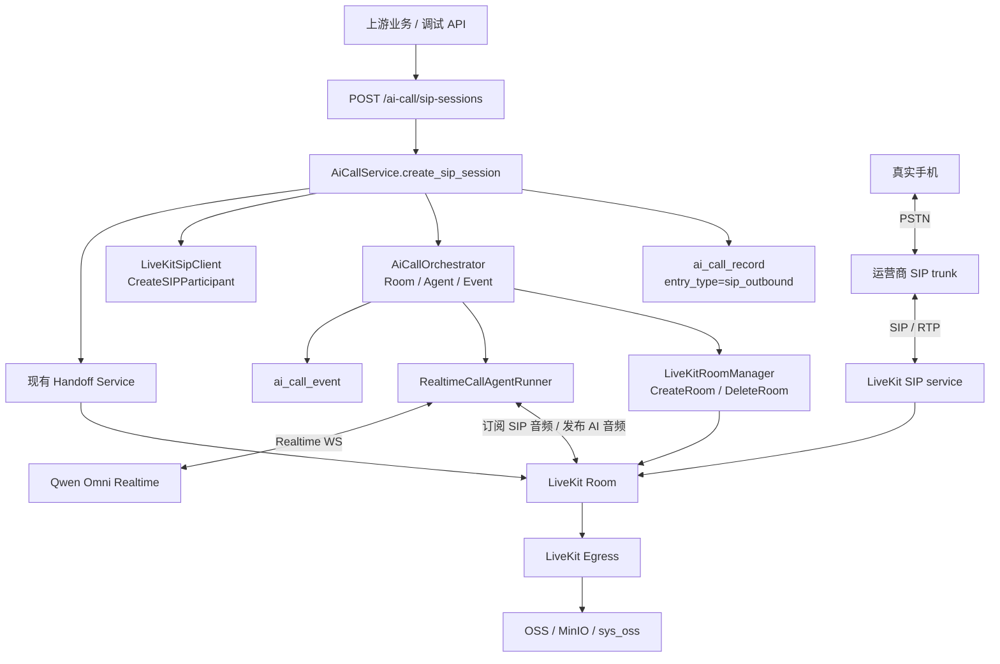

# Phase E：SIP 真实线路最小接入设计

最后更新：2026-06-25

## 1. 文档定位

本文档是 Phase E 的最小技术设计，用于定义“真实电话用户如何通过 LiveKit SIP 进入现有 AI Call Room”。

Phase E 只解决一个问题：

> 在不改动现有 AI 通话主链路的前提下，新增真实 SIP 电话入口，让被叫手机作为 LiveKit Room 里的 SIP Participant 接入同一个 Room，从而复用现有 Agent、录音、对话文本、转人工和通话记录能力。

Phase E 不是重新设计 AI Agent，不切换实时模型，不修改 `intro_geo` 提示词，不做 ASR 字符串硬替换，也不建设完整外呼任务、名单调度、CRM 回写或坐席平台。

实现前必须先读：

1. [../OUTLINE.md](../OUTLINE.md)
2. [phase-a-interrupt-dialogue-display-acceptance-report.md](phase-a-interrupt-dialogue-display-acceptance-report.md)
3. [phase-b3-handoff-live-closure-acceptance-report.md](phase-b3-handoff-live-closure-acceptance-report.md)
4. [phase-b-business-semantics-asr-followup.md](phase-b-business-semantics-asr-followup.md)
5. 当前代码中的 `app/api/v1/ai_call/`、`app/services/ai_call/orchestrator.py`、`app/services/ai_call/livekit_room.py`、`deploy/livekit-egress/`

## 2. 当前代码事实

本节只记录当前 checkout 已核对事实，不能直接推断为真实电话已验收。

当前已具备：

1. Web 会话入口：`POST /ai-call/sessions`。
2. 会话服务：`AiCallService.create_web_session(...)`。
3. Room 编排：`AiCallOrchestrator.create_web_session(...)`。
4. Web 用户身份：`participant_identity = f"browser-{call_id}"`。
5. SIP 会话入口：`POST /ai-call/sip-sessions`。
6. SIP 会话服务：`AiCallService.create_sip_session(...)`。
7. SIP Room 编排：`AiCallOrchestrator.create_sip_session(...)`。
8. SIP 用户身份：`participant_identity = f"sip-{call_id}"`，不使用完整手机号。
9. `LiveKitSipClient` 已封装外呼预检和 LiveKit `CreateSIPParticipant` 调用，优先使用官方 `livekit-api` / `livekit.protocol.sip`。
10. SIP 外呼配置项已补齐真实外呼开关、号码前缀、trunk、认证、主叫显号、振铃超时、公网 IP/NAT 和 RTP 范围。
11. `deploy/livekit-egress/docker-compose.yml` 已补 `livekit-sip` service，`sip.yaml.example` 已给出自托管模板。
12. LiveKit Room 封装：`LiveKitRoomManager` 仍只包含 `CreateRoom`、`DeleteRoom` 和浏览器/坐席 Token 签发；SIP 调用由 `LiveKitSipClient` 单独承担。
13. 录音闭环：`AiCallRecordingService` 以 `call_id`、`room_name`、用户 participant identity 和 `agent-{call_id}` 启动录音。
14. 对话文本闭环：已有实时对话段和通话后查询能力。
15. 转人工闭环：坐席以 `human-agent-{handoff_id}` 加入同一个 Room，AI 挂起，handoff 状态闭环已通过 Web/LAN 验收。

当前缺口：

1. 尚未启动并验证本地/自托管 LiveKit SIP service。
2. 尚未执行真实手机 smoke，不能宣称真实电话已拨通。
3. 尚未补 guarded smoke 脚本；真实拨号仍必须通过显式确认参数保护。
4. 尚未覆盖无人接听、忙线、拒接、号码错误、trunk 鉴权失败、RTP/media 失败等真实失败样本。
5. 尚未接入 SIP hangup/ringing/failed 等运行期回调或事件 reconciliation；当前只完成创建阶段事件和失败映射地基。
6. 尚未把动态主叫显号按业务上下文解析；当前主叫显号仍来自服务端 SIP 配置。

设计推论：

1. Phase E 不能直接宣称“已具备真实 SIP 电话验收能力”。
2. 当前已经完成“新增入口和 SIP client”的代码地基，Web 主链路保持不动。
3. 当前实现已经新增 `livekit-api` 依赖，并只在 `LiveKitSipClient` 内部使用官方 `SipService`；如果 SDK 不可用或与当前自托管 LiveKit Server 不兼容，再降级到手写 Twirp，且不能静默降级。

## 3. LiveKit SIP 官方能力核对

LiveKit 官方外呼模型是：创建 SIP Participant，将被叫号码接入指定 Room。

官方文档当前结论：

1. 外呼通过 `CreateSIPParticipant` 创建 SIP participant。
2. LiveKit 使用 outbound trunk 拨打 `sip_call_to`，并把被叫接入 `room_name` 指定的 Room。
3. trunk 可通过已创建的 `sip_trunk_id` 引用，也可以在请求里传 inline `trunk` 配置；inline trunk 需要同时传 `sip_number`。
4. `CreateSIPParticipant` 需要 SIP `call` grant。
5. self-hosted SIP server 需要和 LiveKit Server 连接同一个 Redis。
6. self-hosted SIP server 的 SIP signaling 端口和 RTP 端口范围必须能被公网访问；官方示例默认 `sip_port: 5060`、`rtp_port: 10000-20000`、`use_external_ip: true`。
7. SIP participant 可通过 participant `kind == SIP` 和 attributes 识别，常见 attributes 包括 `sip.callID`、`sip.callIDFull`、`sip.callStatus`、`sip.phoneNumber`、`sip.trunkID`、`sip.trunkPhoneNumber`。
8. 排障时应先分层确认：`INVITE` 是否到达、SIP response code 是什么、`200 OK/ACK` 后 RTP/media 是否真实流动。

这证明方向是成熟的，但不证明本仓库当前已经接好了 SIP。

## 4. 第一性原理

SIP 外呼的本质不是“从网页拨号”，而是新增一个电话入口。

当前系统的稳定资产在 Room 内：

1. AI Agent 作为 Participant 订阅用户音频、发布 AI 音频。
2. 录音从 Room/Egress 旁路产生。
3. 对话文本来自实时模型事件和事件持久化。
4. 转人工让人工坐席加入同一个 Room。
5. 通话记录以 `call_id` 复盘状态和事件。

所以 Phase E 的正确边界是：

```text
真实手机
  -> 运营商 / SIP trunk
  -> LiveKit SIP service
  -> LiveKit Room 的 SIP Participant
  -> 现有 Realtime Call Agent
  -> Qwen Omni Realtime
```

不要自己手写 SIP/RTP 媒体桥，也不要把 SIP 逻辑塞进 `customer.html`。浏览器仍是测试、管理和坐席入口，真实电话媒体入口应由 LiveKit SIP service 承担。

## 5. 设计结论

Phase E 采用“薄 SIP 入口 + 同 Room 复用”的最小方案。

核心结论：

1. 新增 `create_sip_session`，创建 `entry_type=sip_outbound` 的通话。
2. SIP 用户 identity 使用 `sip-{call_id}`，不把完整手机号放进 participant identity。
3. 继续由现有 Orchestrator 创建 Room、启动 Agent、记录事件和结束会话。
4. 新增 `LiveKitSipClient`，只负责调用 LiveKit SIPService 的 `CreateSIPParticipant`。
5. `LiveKitSipClient` 不做业务策略、不写数据库、不控制 Agent。
6. 通话记录继续使用 `ai_call_record`，P1-min 不新增 SIP 专表；SIP call id、trunk id、SIP response、participant attributes 进入 `ai_call_event.payload_json`。
7. 失败分层进入现有 `status/end_reason/failure_stage/failure_message`，不要把 SIP 呼叫结果全都当系统失败。
8. 自托管部署补 LiveKit SIP service，并与 LiveKit Server/Egress 共用 Redis。
9. 真实外呼必须有显式环境开关和测试号码保护，避免误拨真实号码。

## 6. 范围

### 6.1 Phase E P1-min 必须做

1. 新增 SIP 会话创建入口。
2. 复用现有 Room、Agent、录音、对话文本、转人工和事件持久化。
3. 新增 `LiveKitSipClient` 调用 `CreateSIPParticipant`。
4. 补齐 SIP outbound 配置项。
5. 本地自托管模板新增 LiveKit SIP service。
6. 新增 SIP 事件口径和失败映射。
7. 新增真实电话 smoke 验收清单。
8. 失败时能定位在 SIP、LiveKit、Agent、Qwen 或业务状态机哪一层。

### 6.2 Phase E P1-min 不做

1. 不做批量外呼任务。
2. 不做名单导入、调度、重拨、时间窗、退订和黑名单。
3. 不做完整 CRM 回写。
4. 不做完整坐席平台。
5. 不做 inbound SIP。
6. 不做 TransferSIPParticipant。
7. 不切换实时模型。
8. 不改 `intro_geo` 提示词。
9. 不做 ASR 字符串硬替换。
10. 不把完整手机号、SIP 密码、Token、录音原文写入事件 payload。

## 7. 总体架构



关键点：

1. Web 用户从 `browser-{call_id}` 变成 SIP 用户 `sip-{call_id}`，但 Room、Agent 和下游能力保持一致。
2. 坐席仍通过 WebRTC 加入同一个 Room，SIP 用户可直接听到人工坐席。
3. 录音继续按 Room/Egress 工作；分参与方录音中用户侧 participant identity 从 `browser-{call_id}` 变为 `sip-{call_id}`。

## 8. 会话创建流程

### 8.1 推荐顺序

Phase E 外呼创建建议采用以下顺序：

1. 生成 `call_id`、`room_name=ai-call-{call_id}`、`participant_identity=sip-{call_id}`。
2. 创建 `ai_call_record`，`entry_type=sip_outbound`，`participant_identity=sip-{call_id}`。
3. 前置 SIP preflight，校验真实外呼开关、目标号码、trunk/caller 配置、公网/NAT 和 RTP 范围；失败时写 `sip_preflight_failed`，不创建 Room，不启动 Agent，不调用 `CreateSIPParticipant`。
4. 解析 `sceneCode/businessId/businessParams`，得到现有 `PromptEffectiveConfig`。
5. 创建 LiveKit Room。
6. 启动 Realtime Agent，让 Agent 先准备好订阅 Room。
7. 写入 `sip_invite_sent`。
8. 调用 `LiveKitSipClient.create_participant(...)` 发起 `CreateSIPParticipant`。
9. 根据 LiveKit SIP 返回、participant attributes、webhook 或轮询事件写入 `sip_answered`、`media_connected`、`sip_failed`；后续再补 `sip_ringing`、`sip_hangup` 的运行期事件来源。
10. 启动录音，用户侧 participant identity 使用 `sip-{call_id}`。
11. 通话结束时沿用现有 `end_session` 和记录终态逻辑。

先启动 Agent 再拨号的原因：

1. 被叫接听后应尽快听到 AI，而不是等待 Agent 冷启动。
2. 如果 Agent/Qwen 启动失败，应在拨号前失败，避免真实用户接通后听不到 AI。
3. 如果 `CreateSIPParticipant` 失败，可以释放已创建 Room 和 Agent。

### 8.2 CreateSIPParticipant 返回不确定性

`CreateSIPParticipant` 报错时不要武断记录“肯定没拨出去”。

更稳妥的状态口径：

| 状态 | 含义 |
|---|---|
| `not_sent` | 本地校验失败，未调用 LiveKit SIPService |
| `sent` | LiveKit SIPService 已接受创建请求或返回 participant |
| `answered` | SIP participant 进入 active，或已观察到媒体连接 |
| `failed` | LiveKit/SIP/provider 明确返回失败 |
| `unknown` | 调用异常、中途超时或证据不足，无法判断 provider 是否已接收 |

这样排障时不会把网络超时、HTTP client 异常、provider 已接收但响应丢失混成同一种结果。

## 9. API 设计

### 9.1 新增创建 SIP 会话

建议新增独立路径，避免和现有 `/ai-call/sessions/{callId}` 路由产生歧义：

```http
POST /ai-call/sip-sessions
```

请求体：

```json
{
  "calleePhoneNumber": "+8613800000000",
  "voice": "Tina",
  "businessId": "geo_task_001",
  "sceneCode": "intro_geo",
  "businessParams": {
    "customerId": "customer_001",
    "taskId": "task_001"
  },
  "ringingTimeoutSeconds": 45
}
```

字段说明：

| 字段 | 是否必填 | 说明 |
|---|---:|---|
| `calleePhoneNumber` | 是 | 被叫号码；服务端必须校验格式并脱敏记录 |
| `voice` | 否 | 继续复用现有 Qwen voice 参数 |
| `businessId` | 否 | 上游业务 ID |
| `sceneCode` | 是 | 业务场景编码 |
| `businessParams` | 否 | 业务上下文参数，只允许 JSON object |
| `ringingTimeoutSeconds` | 否 | 被叫接听等待时间，不能超过 LiveKit 上限 |

号码边界：

1. `calleePhoneNumber` 是被叫客户号码，属于业务动态外呼目标，V1 可以在请求体里接收，但必须做格式校验、前缀白名单、防误拨开关和脱敏记录。
2. `callerNumber` / `caller_id` 是主叫显号，通常必须是供应商允许或已报备号码，V1 不建议前端任意传入。
3. trunk、认证、主叫显号应来自服务端配置，或由服务端按 `sceneCode`、`businessId`、租户/业务线等上下文解析。
4. V1 不建议在请求体里接收 SIP 密码、inline trunk auth 或任意 SIP host，避免把真实线路能力暴露给前端。

返回体沿用现有响应壳：

```json
{
  "code": 200,
  "msg": "创建成功",
  "data": {
    "callId": "call_328200000000000001",
    "roomName": "ai-call-call_328200000000000001",
    "participantIdentity": "sip-call_328200000000000001",
    "status": "ready",
    "sipCallId": "short-call-id",
    "sipTrunkId": "trunk_123",
    "sipCallStatus": "active",
    "effectiveConfig": {
      "model": "qwen3.5-omni-plus-realtime",
      "voice": "Tina",
      "promptHash": "...",
      "openingMessageHash": "...",
      "promptSourceKey": "intro_geo",
      "vadType": "server_vad",
      "vadThreshold": 0.5,
      "vadSilenceDurationMs": 800
    }
  }
}
```

说明：

1. SIP 创建接口不返回浏览器 `participantToken`，因为真实手机不通过浏览器加入 Room。
2. SIP 创建接口不返回 `livekitUrl`、完整被叫号码、`sipCallIdFull`、trunk host、SIP 账号或密码。
3. 调试页如需观察状态，继续用记录和事件查询接口。
4. 坐席接管仍走现有 handoff API。

### 9.2 保留现有接口

现有接口不改语义：

| 方法 | 路径 | Phase E 行为 |
|---|---|---|
| `POST` | `/ai-call/sessions` | 继续创建 Web 会话 |
| `GET` | `/ai-call/records` | 可按 `entryType=sip_outbound` 查询 SIP 通话 |
| `GET` | `/ai-call/records/{callId}` | 查询通话详情 |
| `GET` | `/ai-call/records/{callId}/events` | 查询 SIP/LiveKit/Agent/Qwen/业务事件 |
| `POST` | `/ai-call/sessions/{callId}/handoff` | 继续创建转人工请求 |
| `POST` | `/ai-call/handoffs/{handoffId}/accept` | 坐席继续以 WebRTC 加入同一个 Room |

## 10. LiveKitSipClient 设计

建议新增：

```text
app/services/ai_call/livekit_sip.py
```

职责：

1. 创建 `CreateSIPParticipant` 请求。
2. 准备包含 SIP `call` 权限的服务端调用上下文。
3. 调用 LiveKit SIPService。
4. 把 LiveKit/SIP 异常归一为 `AiCallError`。
5. 返回 `sipCallId`、`sipTrunkId`、`sipCallStatus` 等最小诊断摘要；完整号码和密钥不得进入 API 响应。

不负责：

1. 不生成 `call_id`。
2. 不创建 Room。
3. 不启动 Agent。
4. 不写数据库。
5. 不判断业务场景。
6. 不处理转人工。

第一版实现策略与当前状态：

1. 当前已引入官方 `livekit-api` 包，并只在 `LiveKitSipClient` 内部使用。
2. 当前 `LiveKitSipClient` 优先通过官方 SDK 调用 `create_sip_participant`，请求类型来自 `livekit.protocol.sip`。
3. 如果 SDK 模块不可用、版本不兼容或自托管 LiveKit Server 响应不匹配，再降级到手写 Twirp，调用 `/twirp/livekit.SIP/CreateSIPParticipant`。
4. Twirp 兜底不能静默启用；实现阶段如果需要走手写 Twirp，必须先说明 SDK 不可用的证据、降级影响和验证方案。
5. 不把 SDK/Twirp 细节泄露到 `AiCallService`，外层只依赖 `LiveKitSipClient.create_participant(...)`。

依赖状态：

1. 当前已在 `pyproject.toml` 新增 `livekit-api>=1.0,<2.0`。
2. 具体解析版本以 `uv.lock` 为准；真实兼容性仍需通过本地自托管 SIP service 和真实手机 smoke 验证。
3. 不为引入 `livekit-api` 同步迁移 `LiveKitRoomManager`、`LiveKitEgressManager`、Token 签发或 Web 会话主链路。

### 10.1 `livekit-api` 后续评估记录

当前 Web 通话链路已经通过手写 Twirp 和 JWT 完成 Room、Token、Egress 与分参与方录音：

1. `LiveKitRoomManager` 手写调用 `/twirp/livekit.RoomService/CreateRoom` 和 `/twirp/livekit.RoomService/DeleteRoom`。
2. 浏览器、坐席和 Agent Token 由项目直接用 `pyjwt` 签发。
3. `LiveKitEgressManager` 手写调用 `/twirp/livekit.Egress/StartRoomCompositeEgress`、`StartTrackEgress`、`StopEgress`，并通过 `/twirp/livekit.RoomService/GetParticipant` 查询音轨。
4. 当前已安装的 `livekit` Python 包只提供 `livekit.rtc`，用于 Agent/音频侧作为 Participant 连接 Room；它不是 Server API SDK。

Phase E P1-min 不把这些已验证链路迁移到 `livekit-api`。

原因：

1. Room、Token、Egress 已经被 Web/LAN 验收链路验证过，重构会扩大风险面。
2. SIP 接入的核心目标是新增电话入口，不是统一 LiveKit SDK 封装。
3. `livekit-api` 第一阶段只解决 `CreateSIPParticipant`，外层服务不感知 SDK/Twirp 差异。

后续只有在以下条件满足时，再评估是否统一迁移 Room、Token、Egress 到 `livekit-api`：

1. Phase E SIP P1-min 真实手机 smoke 已通过。
2. `livekit-api` 在当前 Python 版本和自托管 LiveKit Server 版本下稳定可用。
3. 能用现有单测覆盖 Room 创建、Token grant、Egress 启停、participant track 查询和 SIP participant 创建。
4. 迁移后不改变现有 API 响应、事件口径、录音对象路径和转人工行为。

返回对象建议：

```python
@dataclass(frozen=True, slots=True)
class CreateSipParticipantResult:
    room_name: str
    participant_identity: str
    sip_call_id: str | None
    sip_call_id_full: str | None
    sip_trunk_id: str | None
    sip_call_status: str | None
    raw_status: str
```

## 11. 配置设计

当前粗粒度配置不足以支撑真实外呼。Phase E 建议补齐以下配置。

### 11.1 应用侧配置

| 配置项 | 说明 |
|---|---|
| `AI_CALL_SIP_OUTBOUND_ENABLED` | 是否允许真实 SIP 外呼 |
| `AI_CALL_SIP_ALLOWED_CALLEE_PREFIXES` | 允许拨打的号码前缀，开发环境用于防误拨 |
| `AI_CALL_SIP_DEFAULT_RINGING_TIMEOUT_SECONDS` | 默认接听等待时间 |
| `AI_CALL_SIP_MAX_RINGING_TIMEOUT_SECONDS` | 接听等待时间上限 |
| `AI_CALL_SIP_MAX_CALL_DURATION_SECONDS` | 单通最长通话时长 |
| `LIVEKIT_SIP_OUTBOUND_TRUNK_ID` | 已创建的 LiveKit outbound trunk id |
| `LIVEKIT_SIP_OUTBOUND_TRUNK_HOSTNAME` | inline trunk 或自托管 provider hostname |
| `LIVEKIT_SIP_OUTBOUND_DESTINATION_COUNTRY` | 目的国家/区域，用于 provider 路由与合规 |
| `LIVEKIT_SIP_AUTH_USERNAME` | 账号密码型 SIP trunk 的认证用户名；IP 白名单 trunk 可为空或仅作为线路身份字段 |
| `LIVEKIT_SIP_AUTH_PASSWORD` | 账号密码型 SIP trunk 的认证密码；IP 白名单 trunk 可为空 |
| `SIP_CALLER_NUMBER` | 主叫号码 |
| `SIP_SIGNALING_PORT` | 自托管 SIP signaling 端口 |
| `SIP_RTP_RANGE` | 自托管 SIP RTP 端口范围 |
| `SIP_PUBLIC_IP` | 自托管公网 IP 或外部可路由地址 |
| `SIP_USE_EXTERNAL_IP` | 是否让 SIP service 使用公网地址进入 SDP |

配置规则：

1. `LIVEKIT_SIP_OUTBOUND_TRUNK_ID` 和 inline trunk 配置二选一。
2. 生产优先使用已创建 trunk id；inline trunk 仅适合开发、测试或多租户服务端解析后的内部使用。
3. 如果复用此前真实线路，默认按 IP 白名单 trunk 处理；`LIVEKIT_SIP_AUTH_PASSWORD` 允许为空，真实可拨号能力由公网 IP 白名单、trunk host、主叫显号和 provider 线路状态共同决定。
4. 真实手机号、认证密码和完整 trunk 配置不得写入文档、日志或前端响应。
5. 开发环境默认关闭 `AI_CALL_SIP_OUTBOUND_ENABLED`。

### 11.2 既有 SIP 线路复用边界

Phase E 默认优先复用此前真实线路验证中已经跑通过的 SIP 线路资源，但只复用线路资源和验证经验，不复用 FreeSWITCH 主链路。

写入本文档和代码仓库的是：

1. 需要哪些配置项。
2. 每个配置项的用途。
3. preflight 应校验哪些条件。
4. SIP/RTP、codec、公网可达性和失败码的验收口径。

不写入本文档和代码仓库的是：

1. 真实 SIP proxy 地址。
2. 真实主叫号码。
3. 真实被叫号码。
4. 供应商白名单公网 IP。
5. trunk 账号、密码、Token、密钥或可用于真实拨号的完整配置。

这些真实值应由部署环境、服务器本地 `.env`、Secret 管理系统或运维私有 Runbook 注入。实现和验收时通过 preflight 检查这些配置是否存在、是否可达、是否与供应商侧一致。

参考原则：

1. 历史真实线路证明“这条 SIP 资源可用过”，不证明当前 LiveKit SIP service 已接通。
2. Phase E 实现仍以 LiveKit SIP service 和 `CreateSIPParticipant` 为准。
3. 如果 SIP provider 仍要求固定公网白名单、主叫显号、PCMA/8000、`ptime=20ms` 或特定 RTP 端口范围，这些约束应进入 preflight 和 smoke 验收，而不是散落在代码里。

### 11.3 自托管 SIP service 配置

`deploy/livekit-egress/` 当前只有 LiveKit Server、Redis 和 Egress。Phase E 实现时应新增：

```text
deploy/livekit-egress/sip.yaml.example
```

核心配置：

```yaml
api_key: CHANGE_ME_LIVEKIT_API_KEY
api_secret: CHANGE_ME_LIVEKIT_API_SECRET
ws_url: ws://livekit:7880
redis:
  address: redis:6379
sip_port: 5060
rtp_port: 10000-20000
use_external_ip: true
logging:
  level: info
```

Compose 侧新增 `sip` service，并和 `livekit`、`egress` 使用同一个 Redis。

公网要求：

1. SIP signaling 端口必须能被 SIP trunk provider 访问。
2. RTP UDP 端口范围必须能被公网访问。
3. NAT 后必须正确配置 `use_external_ip` 或显式公网 IP，否则容易出现单向音频。
4. 本地 LAN WebRTC 验收通过不等于公网 SIP/RTP 通过。

## 12. 数据与事件设计

### 12.1 通话记录

P1-min 复用 `ai_call_record`：

| 字段 | Phase E 写入 |
|---|---|
| `entry_type` | `sip_outbound` |
| `room_name` | `ai-call-{call_id}` |
| `participant_identity` | `sip-{call_id}` |
| `answered_at` | SIP answered 或 media connected 后写入 |
| `end_reason` | `remote_hangup`、`no_answer`、`busy`、`rejected`、`invalid_number`、`media_lost` 等 |
| `failure_stage` | `sip_preflight`、`sip_invite`、`sip_auth`、`sip_provider`、`sip_media`、`agent_start`、`provider_connect` 等 |

不新增 `phone_number` 字段。目标号码只可在必要的内部日志里按安全策略脱敏输出；持久化事件只保存 masked number 或 hash。

### 12.2 事件口径

Phase E 推荐新增以下事件类型：

| 事件 | source | 说明 |
|---|---|---|
| `sip_preflight_passed` | `sip` | 外呼开关、号码、trunk、caller、LiveKit 配置校验通过 |
| `sip_preflight_failed` | `sip` | 本地校验失败，未拨号 |
| `sip_invite_sent` | `sip` | 已调用 `CreateSIPParticipant`，或 LiveKit 已返回 participant |
| `sip_ringing` | `sip` | 观察到 dialing/ringing 状态；如果当前 provider/事件源不可见，可缺省 |
| `sip_answered` | `sip` | SIP participant active 或 `wait_until_answered` 返回已接听 |
| `media_connected` | `livekit` | Room 内观察到 SIP participant 音频媒体可用 |
| `sip_failed` | `sip` | SIP/provider 明确失败 |
| `sip_hangup` | `sip` | SIP participant 结束或远端挂断 |

事件 payload 建议字段：

```json
{
  "participantIdentity": "sip-call_328200000000000001",
  "sipCallId": "SCL_xxx",
  "sipCallStatus": "active",
  "sipTrunkId": "ST_xxx",
  "calleeMasked": "+86138****0000",
  "calleeHash": "sha256:...",
  "sipResponseCode": 486,
  "failureStage": "sip_provider",
  "failureMessage": "destination busy",
  "realCallStatus": "failed"
}
```

不得进入 payload：

1. 完整手机号。
2. SIP auth username/password。
3. LiveKit API Secret。
4. Room Token。
5. 模型 API Key。
6. 录音原文。

## 13. 失败状态映射

| 场景 | call status | end_reason | failure_stage | 说明 |
|---|---|---|---|---|
| 本地号码或开关校验失败 | `failed` | `sip_preflight_failed` | `sip_preflight` | 未拨号 |
| 无人接听 | `completed` | `no_answer` | 空 | 呼叫结果，不是系统失败 |
| 忙线 | `completed` | `busy` | 空 | 常见 SIP `486` 或 provider busy |
| 拒接 | `completed` | `rejected` | 空 | 被叫主动拒绝 |
| 号码错误 | `completed` | `invalid_number` | 空 | provider 明确号码不存在或不可达 |
| SIP trunk 鉴权失败 | `failed` | `sip_trunk_auth_failed` | `sip_auth` | 常见 `403` 或认证错误 |
| trunk id 不存在 | `failed` | `sip_trunk_not_found` | `sip_trunk` | LiveKit/trunk 配置错误 |
| SIP provider 不可用 | `failed` | `sip_provider_unavailable` | `sip_provider` | 常见 `503` 或 provider 连接失败 |
| RTP/media 无音频或单向音频 | `failed` | `media_lost` | `sip_media` | `200 OK/ACK` 不代表媒体通 |
| Agent 启动失败 | `failed` | `agent_start_failed` | `agent_start` | 复用现有失败 |
| Qwen 连接失败 | `failed` | `provider_connect_failed` | `provider_connect` | 复用现有失败 |
| 模型运行错误 | `failed` | `model_error` | `runtime` | 复用现有失败 |
| 客户主动挂断 | `completed` | `remote_hangup` | 空 | 正常通话结果 |
| 平台主动取消 | `completed` | `cancelled` | 空 | 调度或人工取消 |

注意：

1. 呼叫结果类失败不等于系统失败，例如无人接听、忙线、拒接、号码错误。
2. 能证明是系统配置、LiveKit、SIP service、Agent 或 Qwen 问题时，才进入 `failed`。
3. 如果证据不足，事件 payload 使用 `realCallStatus=unknown`，不要强行归因。

## 14. 转人工复用边界

SIP 用户进入同一个 Room 后，转人工不需要重做。

复用路径：

1. 用户在电话里说“转人工”。
2. 现有 Qwen/事件/意图触发链路创建 handoff。
3. `AiCallHandoffService` 创建请求。
4. `AiCallOrchestrator.suspend_for_handoff(...)` 挂起 AI。
5. 坐席页调用 accept，拿到 `human-agent-{handoff_id}` 的 WebRTC Token。
6. 坐席加入同一个 Room。
7. 电话用户与 Web 坐席直接通话。
8. handoff 状态、通话结束和录音继续复用现有闭环。

需要额外验证：

1. SIP 用户能听到等待音。
2. SIP 用户能听到 Web 坐席声音。
3. Web 坐席能听到 SIP 用户声音。
4. `handoff_connected` 后 AI 不再抢话。
5. SIP 用户主动挂断时，handoff 和 call 都能闭环。

暂不处理：

1. 把 SIP 电话转接到另一个 PSTN 坐席号码。
2. SIP REFER / `TransferSIPParticipant`。
3. 人工通话实时 ASR。

## 15. 最小真实电话验收

Phase E P1-min 验收必须使用真实手机，不以 Web/LAN 结果替代。

### 15.1 前置检查

1. `AI_CALL_SIP_OUTBOUND_ENABLED=true` 且只允许测试号码段。
2. LiveKit Server 可访问。
3. LiveKit SIP service 已启动，并连接同一个 Redis。
4. SIP signaling 端口公网可达。
5. SIP RTP UDP 端口范围公网可达。
6. outbound trunk id 或 inline trunk 配置已由部署环境注入，且不依赖仓库文档里的真实值。
7. 主叫号码已由部署环境注入，且供应商侧允许该显号外呼目标号码。
8. 供应商白名单公网 IP、SIP proxy、认证方式和 RTP 策略已在运维私有配置中确认。
9. Qwen Realtime API Key 可用。
10. 录音配置可用。
11. 坐席页可加入 handoff。

### 15.2 必须通过的 smoke

1. 能拨通真实手机。
2. 客户接听后能听到 AI 开场白。
3. 客户说话后 AI 能回答。
4. 客户能打断 AI。
5. 客户主动挂断后，call 以 `remote_hangup` 或等价结束原因闭环。
6. 客户说“转人工”后仍能触发 handoff。
7. 坐席接入后，客户和坐席能双向听见。
8. 通话文本能落库。
9. 录音能生成、查询和播放。
10. 失败样本能定位在 SIP、LiveKit、Agent、Qwen 或业务状态机哪一层。

### 15.3 失败样本必须覆盖

1. 无人接听。
2. 忙线或拒接。
3. 号码错误。
4. trunk 鉴权失败。
5. SIP service 未启动。
6. RTP/media 不通或单向音频。
7. Agent/Qwen 启动失败。

## 16. 实施拆分建议

Phase E 已完成的代码地基：

1. 新增配置与前置 preflight，不拨真实电话。
2. 新增 `LiveKitSipClient` 单测，使用 fake SDK client。
3. 新增 `create_sip_session` 服务层 happy path 和失败路径单测，fake Room、Agent、SIP client、recording。
4. 新增 `POST /ai-call/sip-sessions` API schema/controller 单测。
5. 新增 deploy SIP service 模板，不写真实密钥。
6. 新增 guarded smoke 脚本 `tools/ai_call_sip_smoke.py`，默认 dry-run 或缺少确认参数时不拨真实电话。

Phase E 下一步仍需完成：

1. 启动并验证自托管 LiveKit SIP service。
2. 做第一通真实手机 smoke。
3. 补真实电话验收报告，记录 call_id、事件、失败样本和剩余风险。
4. 根据真实事件来源补 `sip_ringing`、`sip_hangup` 和 provider 失败码映射。

不得在第一步就把 SIP 接入 Web 页面主按钮，避免误拨真实电话。

guarded smoke 脚本用法：

```bash
uv run python tools/ai_call_sip_smoke.py \
  --base-url http://127.0.0.1:19011 \
  --callee-phone-number '<真实被叫号码>' \
  --scene-code intro_geo \
  --dry-run
```

真实拨号必须显式追加：

```bash
uv run python tools/ai_call_sip_smoke.py \
  --base-url http://127.0.0.1:19011 \
  --callee-phone-number '<真实被叫号码>' \
  --scene-code intro_geo \
  --business-id '<业务ID>' \
  --ringing-timeout-seconds 30 \
  --confirm-real-call
```

脚本只把被叫号码放进 HTTP 请求体，终端输出会脱敏；不要在命令行里传 SIP trunk host、SIP 账号、SIP 密码、LiveKit API Secret 或模型 API Key。

## 17. 商用前补证

Phase E P1-min 通过后，商用前仍需补证：

1. 多通连续样本成功率。
2. 不同运营商号码接通率。
3. 弱网、外放、耳机、嘈杂环境听感。
4. RTP 丢包、jitter、单向音频和无音频排障流程。
5. SIP provider 计费与失败码账单核对。
6. 真实号码隐私脱敏与审计。
7. 呼叫频控、黑名单、退订、合规话术。
8. 与业务任务、CRM 回写和质检摘要的边界。

## 18. 参考资料

1. LiveKit outbound calls: https://docs.livekit.io/telephony/making-calls/outbound-calls/
2. LiveKit SIP API: https://docs.livekit.io/reference/telephony/sip-api/
3. LiveKit SIP participant: https://docs.livekit.io/reference/telephony/sip-participant/
4. LiveKit self-hosted SIP server: https://docs.livekit.io/transport/self-hosting/sip-server/
5. LiveKit SIP troubleshooting: https://docs.livekit.io/reference/telephony/troubleshooting/
