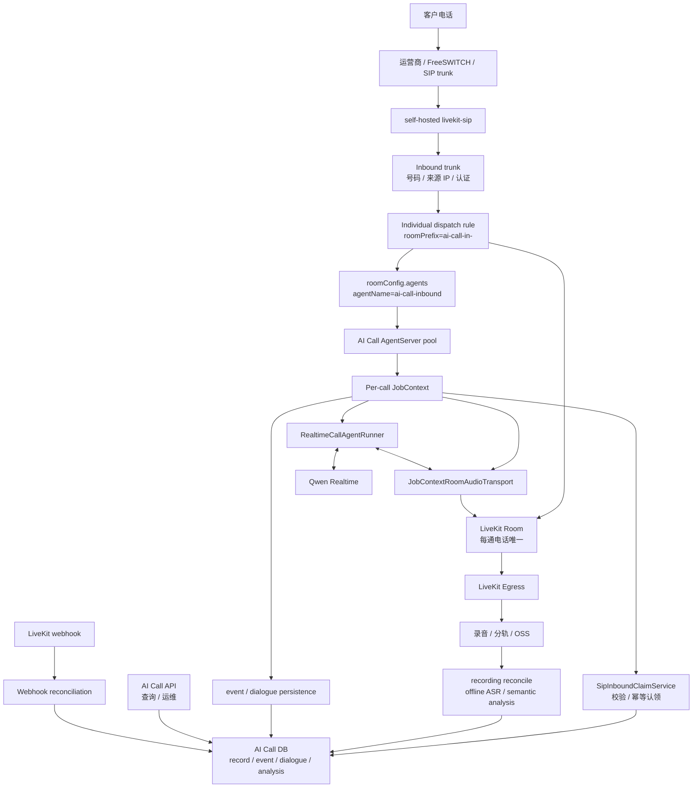
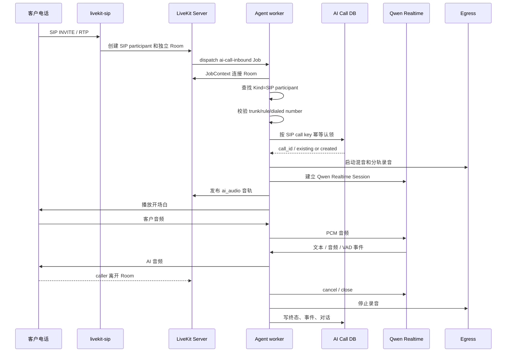

# Phase F：SIP 呼入 Dispatch-driven Worker 正式设计

最后更新：2026-07-15

## 1. 文档定位

本文档定义 AI Call 正式 SIP 呼入能力的目标架构、运行边界、数据契约、失败补偿和验收标准。

Phase F 只解决一个问题：

> 当客户拨打公司公开号码时，self-hosted LiveKit SIP 能把每通来电送入独立 Room，并通过 dispatch-driven Agent worker 启动现有 Qwen Realtime AI 接待能力，最终形成 P1 打断、混音录音、客户/AI 分轨、对话、事件和通话后语义分析闭环。

Phase F 的产品边界是 **AI-only 呼入接待**：本阶段不转人工，不建设排队、技能组、坐席分配或完整坐席中心。

Phase F 采用正式生产目标设计，不先建设一套由 webhook 在 API 进程内临时启动 Agent 的过渡运行链路。

本文档是设计基线，不代表当前代码已经实现 SIP 呼入，也不代表 trunk、dispatch rule、Agent worker 或真实号码已经验收。

实现前必须先读：

1. [phase-a-e2e-core-engine.md](phase-a-e2e-core-engine.md)
2. [phase-e-sip-minimal-entry-design.md](phase-e-sip-minimal-entry-design.md)
3. [phase-e-sip-barge-in-p1-design.md](phase-e-sip-barge-in-p1-design.md)
4. 当前代码中的 `app/api/v1/ai_call/`、`app/services/ai_call/` 和 `deploy/livekit-egress/`

## 2. 目标、约束和成功标准

### 2.1 目标

1. 支持真实号码呼入，并为每通电话创建独立 LiveKit Room。
2. 通过 LiveKit explicit agent dispatch 将每通呼入分配给可用 Agent worker。
3. 每通通话由独立 Job 持有 Room、Qwen 和实时媒体生命周期。
4. 复用现有 `RealtimeCallAgentRunner`、Qwen Realtime、SIP P1、录音、对话和通话结束能力。
5. 支持多个 worker、并发通话、优雅发布和单通故障隔离。
6. 保证来电认领、webhook、worker 重启、录音后处理和语义分析具有幂等性。
7. 呼入初始定位为“公司综合接待”；首版只识别和记录客户关注主题，不因主题变化切换 prompt、知识权限、Room 或 Qwen Session。

### 2.2 已知约束

1. 当前项目使用 self-hosted LiveKit，不以 LiveKit Cloud 为前提。
2. 当前依赖只有 `livekit` 和 `livekit-api`，尚未引入 `livekit-agents`。
3. 当前实时运行链由 API 进程内的 `AiCallOrchestrator` 主动创建和持有。
4. 当前 `InMemorySessionRegistry`、`InMemoryEventStore` 和 Runner 内部任务均为进程内状态，不能直接作为多 worker 的跨进程事实源。
5. 当前 `LiveKitRoomAudioTransport` 会自行签 Token、连接 Room 和断开 Room，不能直接用于已经由 `JobContext` 持有的 Room。
6. 当前 event/dialogue listener 主要在 API 进程绑定；呼入 worker 化后必须在 worker 侧建立独立持久化边界。
7. Qwen Realtime Session 无法在 worker 崩溃后原样恢复，正式设计不能承诺模型会话无感续接。

### 2.3 成功标准

1. 一次真实呼入只生成一条 `entry_type=sip_inbound` 通话记录。
2. 客户接通后能听到开场白，并与 Qwen 完成双向语音对话。
3. AI 播放期间客户插话时，现有 SIP P1 打断策略不退化。
4. 录音、分轨、对话文本、关键事件和通话后语义分析可按 `call_id` 查询。
5. 混音录音、客户分轨和 AI 分轨均能最终关闭并可查询，语义分析产出可回溯原始对话证据的回访信息。
6. 客户挂机、AI 主动结束、worker 失败和 Room 结束都能进入明确终态。
7. 重复 webhook、Job 重派、录音补偿和语义分析重试不产生重复记录或重复副作用；Job 重派首版只保证故障收口，不保证继续原对话。
8. 双 worker 部署和滚动发布不主动中断已有通话。

## 3. 当前代码事实

本节只记录当前 checkout 已核对事实，不把设计目标写成已实现能力。

### 3.1 当前运行链

当前实时主链是：

```text
AiCallService
  -> AiCallOrchestrator
  -> RealtimeCallAgentRunner
  -> LiveKitRoomAudioTransport
  -> Qwen Realtime
```

其中：

1. `AiCallOrchestrator.create_web_session(...)` 创建 Web Room 和 Agent。
2. `AiCallOrchestrator.create_sip_session(...)` 创建 SIP 外呼 Room 和 Agent。
3. `LiveKitSipClient.create_participant(...)` 只负责外呼 `CreateSIPParticipant`。
4. `LiveKitRoomAudioTransport.start(...)` 在连接 Room 前记录目标 participant identity，并只接收该 identity 的音轨。
5. `RealtimeCallAgentRunner` 已包含 Qwen 连接、音频桥、播放、P1 打断和结束判断能力。
6. `CallSession` 当前未携带 `entry_type`，SIP 特性仍存在 identity 约定依赖。

### 3.2 当前持久化能力

当前已具备：

1. `ai_call_record`：保存 `call_id`、`entry_type`、Room、用户 participant identity、状态和终态。
2. `ai_call_event`：保存低频关键事件，`event_id` 唯一。
3. `ai_call_recording` 和 `ai_call_recording_track`：保存混音与分参与方录音。
4. 对话文本和语义分析相关表及服务。
5. 录音 reconciliation worker，以及语义分析进程内队列 worker 和数据库状态/重试地基。

当前缺口：

1. `ai_call_record` 只有 SIP 外呼被叫号码字段，没有呼入主叫号码和被叫号码语义字段。
2. 没有 SIP 呼入幂等键、trunk ID、dispatch rule ID 的稳定字段。
3. 没有完整的语义分析 reconciliation 扫描器，无法自动发现队列丢失、进程重启或长时间 `running` 造成的漏跑。
4. worker 进程内产生的事件和对话不能依赖 API 进程中的内存 listener 自动持久化。

### 3.3 当前 webhook

当前 `/ai-call/livekit-webhook` 已完成 LiveKit webhook 签名验证和异步调度，但业务处理主要覆盖 `participant_left`。

Phase F 需要扩展到：

1. `participant_joined`：记录 SIP caller 已进入 Room，并参与幂等认领。
2. `participant_left`：识别远端挂机并补充终态。
3. `room_finished`：在 worker 未完成清理时执行最终 reconciliation。

webhook 不是音频通道，也不是 Phase F 正常启动 Agent 的入口。

## 4. LiveKit 官方模型和采用方式

LiveKit SIP 呼入由三个边界组成：

1. inbound trunk：定义哪些号码和 SIP 来源可以进入 LiveKit SIP。
2. dispatch rule：决定 caller 进入哪个 Room。
3. agent dispatch：决定哪个 Agent worker 接管该 Room。

Phase F 采用：

1. `SIPDispatchRuleIndividual`：每通 caller 创建独立 Room。
2. `roomConfig.agents`：显式派发名为 `ai-call-inbound` 的 Agent。
3. `JobContext`：向每个 Job 提供 Room、job metadata 和生命周期。
4. raw track processing：只使用 LiveKit Agents 的 dispatch/job/Room 能力，不强制迁移到 STT -> LLM -> TTS 三段式 `AgentSession`。

官方参考：

1. [Inbound trunk](https://docs.livekit.io/telephony/accepting-calls/inbound-trunk/)
2. [Dispatch rule](https://docs.livekit.io/telephony/accepting-calls/dispatch-rule/)
3. [Agent dispatch](https://docs.livekit.io/agents/server/agent-dispatch/)
4. [Agent server lifecycle](https://docs.livekit.io/agents/server/lifecycle/)
5. [Job lifecycle](https://docs.livekit.io/agents/server/job/)
6. [Self-hosting](https://docs.livekit.io/transport/self-hosting/)

`JobContext` 只负责 Job 和 Room 边界，不替代项目现有的 P1、录音、事件、语义分析和业务状态机。

## 5. 第一性原理与设计结论

SIP 呼入的本质不是“增加一个创建会话 API”，而是处理一个已经由外部电话网络发起、已经进入 LiveKit Room 的实时会话。

因此调用时序与外呼相反：

```text
SIP 外呼：应用先创建 call_id / Room / Agent，再创建 SIP participant

SIP 呼入：SIP caller 先触发 Room / Agent Job，worker 再认领 call_id 和业务记录
```

Phase F 的核心结论：

1. 呼入不复用 `POST /ai-call/sip-sessions`，该接口继续只表示 SIP 外呼。
2. 呼入正常启动由 dispatch rule + AgentServer 完成，不由 webhook 启动。
3. worker 使用 `JobContext` 持有 Room，不再由 API 进程持有呼入实时任务。
4. Qwen、P1、播放、打断和通话结束继续由现有 Runner 负责。
5. API 继续负责通话、录音、对话和语义分析查询，但不直接访问呼入 Runner 内存。
6. webhook 负责外部事实、孤儿通话发现和终态补偿。
7. trunk 和 dispatch rule 由部署或运维显式创建；应用只读校验，不自动创建、更新或删除电话基础设施。

## 6. 范围

### 6.1 Phase F 必须做

1. self-hosted inbound trunk 和 individual dispatch rule 配置基线。
2. `roomConfig.agents` 显式派发 Agent worker。
3. 独立 AgentServer 进程和 JobContext entrypoint。
4. 入站 SIP participant 识别、allowlist 校验和幂等认领。
5. `entry_type=sip_inbound` 通话记录和号码脱敏字段。
6. 复用现有 Qwen Realtime Runner 和 SIP P1。
7. 复用现有混音录音、客户/AI 分轨、对话、事件和通话后分析。
8. 录音 reconciliation、offline ASR 和语义分析 reconciliation 闭环。
9. `participant_joined`、`participant_left`、`room_finished` webhook reconciliation。
10. 多 worker、重启、重复事件和故障场景验收。

### 6.2 Phase F 不做

1. 不把 Web 会话迁到 LiveKit Agents worker。
2. 不把 SIP 外呼立即迁到 LiveKit Agents worker。
3. 不重写 Qwen Realtime provider。
4. 不迁移到 STT -> LLM -> TTS 三段式模型。
5. 不做完整 IVR、按键导航和多级菜单。
6. 不做转人工、排队、技能组、坐席分配和完整坐席中心。
7. 不做多租户 trunk/rule 动态管理。
8. 不做 SIP REFER 或运营商级呼叫转移。
9. 不让应用自动创建、修改或删除 trunk / dispatch rule。
10. 不承诺 worker 崩溃后 Qwen Session 无感恢复。
11. 不在本阶段承诺 50 CPS 或万级并发；只完成可量化的首版并发基线和水平扩展验证。

## 7. 总体架构



## 8. 组件职责

| 组件 | 负责 | 不负责 |
|---|---|---|
| inbound trunk | 号码、SIP 来源、认证、安全边界 | 业务场景、Qwen、数据库 |
| dispatch rule | 为 caller 选 Room、触发指定 Agent | 启动业务记录、处理 P1 |
| AgentServer | worker 注册、Job 分配、进程隔离、优雅退出 | 业务状态、录音、语义分析 |
| JobContext entrypoint | 连接 Room、识别 caller、组织单通生命周期 | 全局 trunk 管理、批处理 |
| SipInboundClaimService | 校验 attributes、生成幂等键、创建或返回 call record | 创建 trunk/rule |
| JobContextRoomAudioTransport | 绑定 `ctx.room`、订阅 caller、发布 AI 音轨 | 签发独立 Room Token |
| RealtimeCallAgentRunner | Qwen、播放、P1、话轮、结束 | 管理 trunk/rule |
| 通话后处理 worker | 录音对账、offline ASR、语义分析和漏跑补偿 | 持有实时 Qwen Session |
| AI Call API | 通话、录音、对话、语义分析查询和运维入口 | 直接持有呼入 Runner |
| webhook reconciler | 外部事实、异常补偿、终态对账 | 正常启动 Agent |

## 9. Trunk 和 Dispatch Rule 设计

### 9.1 Inbound trunk

示例配置仅用于表达字段，真实号码、IP 和认证由运营商资料决定：

```json
{
  "trunk": {
    "name": "ai-call-inbound-prod",
    "numbers": ["+<company-number>"],
    "allowedAddresses": ["<provider-egress-cidr>"]
  }
}
```

规则：

1. `numbers` 只配置运营商实际路由到该 trunk 的公司号码。
2. 供应商有固定 SIP 出口 IP 时，正式环境必须配置 `allowedAddresses`。
3. `allowedAddresses` 是 SIP 来源服务器 IP/CIDR 白名单，不是客户手机号白名单。
4. 供应商没有固定出口 IP 时，必须补 SIP 认证、防火墙、精确号码和应用层 attributes 校验，不能直接把公网 SIP 入口完全放开。

### 9.2 Individual dispatch rule

```json
{
  "dispatch_rule": {
    "name": "ai-call-inbound-prod-rule",
    "trunk_ids": ["ST_<inbound-trunk-id>"],
    "rule": {
      "dispatchRuleIndividual": {
        "roomPrefix": "ai-call-in-"
      }
    },
    "roomConfig": {
      "agents": [{
        "agentName": "ai-call-inbound",
        "metadata": "{\"schemaVersion\":1,\"entryType\":\"sip_inbound\",\"routeKey\":\"company_reception\"}"
      }]
    }
  }
}
```

规则：

1. rule 必须显式绑定允许的 inbound trunk，不能省略 `trunk_ids` 形成全 trunk 通配。
2. 每通电话使用独立 Room，不把不同客户放入共享 Room。
3. `agentName` 必须和 worker 注册名完全一致。
4. metadata 只传 schema、入口和稳定路由键，不传手机号、客户资料、Token 或密钥。
5. `roomPrefix` 只用于排障和识别，不能从 Room 名反推出业务 `call_id`。
6. JSON 字段以实际部署版本的 LiveKit CLI/API schema 为准，部署前必须执行只读 list 校验。

### 9.3 运维显式配置、应用只读校验

部署流程负责：

1. 创建和更新 inbound trunk。
2. 创建和更新 dispatch rule。
3. 保存实际 `trunk_id` 和 `rule_id` 到环境配置或 Secret 管理系统。
4. 变更运营商号码、来源 IP、认证和路由。

应用只负责：

1. 启动时读取允许的 `trunk_id`、`rule_id` 和被叫号码。
2. 通过 SDK/API list 检查资源是否存在。
3. 检查 rule 是否为 individual、是否绑定正确 trunk、是否派发正确 `agentName`。
4. 运行时校验 SIP participant attributes 是否和允许配置一致。
5. 校验失败时拒绝处理并告警，不自动修正远端资源。

## 10. 呼入时序

### 10.1 正常流程



### 10.2 详细步骤

1. SIP caller 通过 trunk 和 dispatch rule 进入独立 Room。
2. LiveKit 将 `ai-call-inbound` Job 派发给一个可用 worker。
3. worker 解析 job metadata，并校验 `schemaVersion`、`entryType` 和 `routeKey`。
4. worker 注册 Room 事件监听，再连接 Room，避免漏掉已经存在或紧接着发布的音轨。
5. worker 在当前 remote participants 中查找 `Participant.Kind == SIP`；如果尚未出现，则等待到超时。
6. worker 读取 `sip.callIDFull`、`sip.callID`、`sip.trunkID`、`sip.ruleID`、`sip.phoneNumber`、`sip.trunkPhoneNumber` 等 attributes。
7. worker 执行 trunk、rule 和被叫号码 allowlist 校验。
8. worker 调用统一认领服务，创建或取得原有 `call_id`。
9. worker 根据 `routeKey=company_reception` 解析综合接待提示词和开场白。
10. worker 创建单 Job 内的 session registry、event store、dialogue runtime store 和持久化 listener。
11. worker 启动 Egress 录音，并记录实际 SIP participant identity 和实际 Agent identity。
12. worker 启动 Qwen Runner 和 JobContext Room transport。
13. caller 音轨和 AI 音轨准备完成后，worker 播放开场白。
14. 通话中沿用现有 Qwen、P1 和结束状态机。
15. caller 离开后，worker 先收敛实时任务，再停止录音并写通话终态。
16. webhook 对 `participant_left` 和 `room_finished` 做最终补偿。

## 11. SIP Participant 识别与安全校验

### 11.1 边界识别

在 LiveKit 系统边界使用：

1. `Participant.Kind == SIP`。
2. `sip.*` attributes。
3. dispatch rule 的 job metadata。

进入内部 `CallSession` 后使用：

```text
entry_type in {sip_inbound, sip_outbound}
```

不要把 `participant_identity.startswith("sip-")` 作为呼入长期判定依据。呼入 participant identity 由 LiveKit SIP 实际创建，不能假设沿用外呼命名规则。

### 11.2 Allowlist 校验

必须校验：

1. `sip.trunkID` 属于允许的 inbound trunk。
2. `sip.ruleID` 属于允许的 dispatch rule。
3. `sip.trunkPhoneNumber` 或等价被叫号码属于允许的公司号码。
4. Room 名符合预期前缀，但 Room 前缀只作为辅助证据。
5. Room 中只能认领一个初始 SIP caller；额外 SIP participant 作为异常事件记录。

校验失败时：

1. 不连接 Qwen。
2. 不播放业务提示词。
3. 写 `sip_inbound_rejected` 和明确 `failure_stage`。
4. 结束当前 Job / Room，并触发安全告警。

### 11.3 号码和敏感字段

1. 主叫号码只保存 hash 和 masked 值。
2. 被叫公司号码只保存 hash 和 masked 值。
3. `sip.callIDFull` 不直接写普通日志；幂等使用规范化后的 hash。
4. webhook payload 进入事件前必须做 attributes allowlist 和脱敏。
5. dispatch metadata 中禁止放手机号和客户资料。

## 12. 幂等认领设计

### 12.1 为什么必须认领

以下情况都可能同时观察到同一通电话：

1. Agent Job 正常启动。
2. `participant_joined` webhook 到达。
3. worker 崩溃后 Job 被重新派发。
4. webhook 重试或乱序。

因此不能由“谁先收到事件”简单创建记录，必须通过稳定键认领。

### 12.2 Canonical SIP call key

按以下顺序构造原始 canonical key：

1. `sip.callIDFull` 存在：`full:<sip.callIDFull>`。
2. 否则使用：`trunk:<sip.trunkID>|call:<sip.callID>`。
3. attributes 不完整时，`room:<room_name>|participant:<identity>` 仅作为诊断关联键，不作为正式通话幂等键。

数据库只保存 canonical key 的稳定 hash，不保存完整原文。

弱关联键必须写 `sip_idempotency_weak` 告警。webhook 不使用弱关联键创建正式通话记录；worker 缺少关键 SIP attributes 时按安全校验失败处理。正式验收中如果出现弱关联键，应先修复 SIP attributes，再扩大流量。

### 12.3 认领事务

`SipInboundClaimService.claim(...)` 的语义：

1. 根据 `sip_call_key_hash` 查询已有记录。
2. 不存在时生成新的业务 `call_id` 并插入 `sip_inbound` 记录。
3. 唯一约束冲突时重新读取并返回已存在记录。
4. 已终态记录收到新 Job 时，不直接复活；写异常事件并结束该 Job。
5. 活跃记录收到重派 Job 时，写入包含新 `job_id/worker_id` 的重派事件，不创建第二条记录。

worker 和 webhook 都可以调用认领服务，但只有 worker 可以启动 Runner。

## 13. 通话状态设计

Phase F 复用现有 `CallSessionStatus`，不为 SIP 呼入另建一套通话状态机。

| 状态 | 呼入含义 |
|---|---|
| `created` | 已按 SIP call key 创建或认领记录 |
| `preparing` | 正在校验、解析提示词、启动录音和 Qwen |
| `ready` | worker 和实时能力已准备，等待 caller 音轨或开场白 |
| `connected` | caller 音轨可用，已经进入可对话状态 |
| `user_speaking` | 客户说话 |
| `ai_thinking` | Qwen 正在处理 |
| `ai_speaking` | AI 正在播放 |
| `interrupted` | AI 输出被确认打断 |
| `waiting` | 保留现有枚举兼容；AI-only 呼入正常流程不进入该状态 |
| `ending` | 正在关闭 Qwen、音轨、录音和任务 |
| `completed` | 正常终态 |
| `failed` | 技术或策略失败终态 |

时间字段口径：

1. `started_at`：系统首次观察并认领来电的时间。
2. `answered_at`：SIP caller 已进入 Room 且电话侧已处于可通话状态的时间。
3. `ended_at`：终态写入时间。
4. `duration_ms`：优先按 `answered_at -> ended_at` 计算。

## 14. 数据模型

### 14.1 扩展 `ai_call_record`

保留现有字段，新增：

| 字段 | 类型 | 必填 | 说明 |
|---|---|---:|---|
| `sip_call_key_hash` | `varchar(80)` | 否 | 呼入幂等键 hash，唯一 |
| `sip_trunk_id` | `varchar(64)` | 否 | 实际 inbound trunk ID |
| `sip_rule_id` | `varchar(64)` | 否 | 实际 dispatch rule ID |
| `caller_phone_number_hash` | `varchar(80)` | 否 | 呼入主叫号码指纹 |
| `caller_phone_number_masked` | `varchar(32)` | 否 | 呼入主叫号码脱敏展示 |
| `dialed_phone_number_hash` | `varchar(80)` | 否 | 客户拨打的公司号码指纹 |
| `dialed_phone_number_masked` | `varchar(32)` | 否 | 客户拨打的公司号码脱敏展示 |
| `dialogue_persistence_status` | `varchar(16)` | 否 | `complete` 或 `uncertain`；呼入 Job 的对话持久化完整性 |

索引：

1. `sip_call_key_hash` 唯一索引。
2. `entry_type + started_at` 沿用现有索引。
3. `sip_trunk_id + started_at` 普通索引，用于线路排障。
4. 第一版不新增 SIP 呼入专表。

### 14.2 不新增运行态主表

LiveKit 已经负责 Job 分配和 worker ownership，Phase F 第一版不再复制一套完整 worker ownership 表。

`job_id`、`worker_id` 和 Agent identity 先进入事件及指标。LiveKit 负责 worker 注册和 Job ownership；只有后续证明业务查询或控制确实需要稳定运行态表时，再单独设计。

## 15. Agent Worker 设计

### 15.1 AgentServer 与 JobContext entrypoint

| 概念 | 生命周期 | 责任 |
|---|---|---|
| `AgentServer` | 服务启动后长期运行 | 向 LiveKit 注册 `agent_name`、等待派单、上报负载、接受 Job、管理优雅摘流和 Job 进程 |
| `JobContext entrypoint` | 每个被接受的 Job 执行一次 | 获得当前 `ctx.room` 和 job metadata，编排一通呼入从连接到 cleanup 的完整生命周期 |

`AgentServer` 不是每通电话单独部署的服务。一个 AgentServer 实例可以持续接收多个 Job，但每通电话仍由独立 Job 执行 entrypoint，避免单通失败直接污染其他通话。

`JobContext` 是 LiveKit 交给单通 Job 的运行上下文，主要使用：

1. `ctx.room`：当前呼入已分配的 LiveKit Room。
2. `ctx.job.metadata`：dispatch rule 传入的 schema、`entryType` 和 `routeKey`。
3. `ctx.worker_id` / Job 标识：日志、事件和故障关联。
4. `ctx.connect()` / participant 等待能力：连接 Room 并找到真实 SIP caller。

Phase F 只使用 LiveKit Agents 的 dispatch、Job 隔离、Room 和生命周期能力，不强制创建标准 `AgentSession`，不改写现有 Qwen Realtime 端到端音频链路。

### 15.2 进程模型

新增独立启动入口，例如：

```text
app/workers/ai_call_inbound_agent.py
```

该进程：

1. 以 `agent_name=ai-call-inbound` 注册到 self-hosted LiveKit Server。
2. 等待 explicit dispatch。
3. 每个 Job 只处理一通 Room。
4. 不暴露公网业务 API。
5. 使用独立健康检查和结构化日志。

API 服务和 Agent worker 可以使用同一代码仓库与镜像，但必须是两个独立进程/Deployment，不能在 FastAPI startup 中顺带启动 AgentServer。

### 15.3 JobContext entrypoint

entrypoint 只做单通编排：

1. 解析 metadata。
2. 连接 Room。
3. 找到并校验 SIP caller。
4. 幂等认领通话。
5. 创建单 Job runtime 依赖。
6. 启动录音、Qwen、transport 和 opening。
7. 等待 caller 离开或 AI 本地结束。
8. 执行幂等 cleanup。

不要把全局 trunk 管理、坐席队列或批处理塞入 Job entrypoint。

结构伪代码：

```python
server = AgentServer()


@server.rtc_session(agent_name="ai-call-inbound")
async def inbound_call_entrypoint(ctx: JobContext):
    register_room_listeners(ctx.room)
    await ctx.connect()
    sip_participant = await wait_for_verified_sip_participant(ctx)
    call = await claim_sip_inbound_call(ctx, sip_participant)

    runtime = build_inbound_runtime(
        ctx=ctx,
        call=call,
        sip_participant=sip_participant,
    )
    await runtime.run_until_call_ends()
```

伪代码只表达 ownership 和时序；具体 API 以 F0 锁定的 `livekit-agents` 版本为准。

### 15.4 Runtime factory

当前 Runner 构造逻辑集中在 `AiCallOrchestrator._build_default_agent_runner()`。

Phase F 应抽取一个最小 runtime factory，用于统一构造：

1. `AliyunQwenRealtimeProvider`
2. `RealtimeCallAgentRunner`
3. SIP P1 参数
4. call-end policy
5. event/dialogue persistence listener

现有 Web/外呼 Orchestrator 和呼入 worker 共用该 factory。factory 不负责 Room 创建、trunk、dispatch 或数据库认领。

### 15.5 单 Job 内存态

Runner 现有字典以 `call_id` 为键。每个 Job 独立进程后，可以继续使用：

1. 单 Job `InMemorySessionRegistry`
2. 单 Job `InMemoryEventStore`
3. 单 Job metrics 和音频任务

但内存态只能作为当前 Job 的执行状态，数据库事件和记录才是跨进程可查询事实。

## 16. JobContext Room Audio Transport

### 16.1 新 transport 的必要性

当前 `LiveKitRoomAudioTransport` 会：

1. 创建自己的 `rtc.Room()`。
2. 自行签发 `agent-{call_id}` Token。
3. 自行 `room.connect(...)`。
4. `close()` 时自行断开 Room。

JobContext 已经拥有 Room 生命周期，不能再次连接同一个 Agent participant。因此新增 `JobContextRoomAudioTransport`，实现现有 `RoomAudioTransportProtocol`，但使用 `ctx.room`。

### 16.2 生命周期规则

1. transport 不签 Token。
2. transport 不创建第二个 Room。
3. transport 不删除 Room。
4. Room connect/shutdown 由 JobContext entrypoint 控制。
5. transport 只创建并发布 `ai_audio` track、接收 caller 音轨和清理自身 stream/source。

### 16.3 精确订阅

worker 在启动 Runner 前必须得到真实 inbound SIP identity，并写入 `CallSession.participant_identity`。

transport 只接收该 identity 的音轨：

```text
target identity = 实际 inbound SIP participant identity
```

必须同时覆盖：

1. transport 注册前音轨已经存在。
2. transport 注册后 caller 才发布音轨。
3. Room 后续加入未知非 SIP participant。
4. Room 出现额外 SIP participant。

非目标 participant 音轨不能被错误发送给 Qwen。

### 16.4 Agent identity

录音和事件不能继续无条件假设 Agent identity 等于 `agent-{call_id}`。

优先策略：

1. SDK 支持时显式设置稳定 Agent identity。
2. 无法显式设置时，从 `ctx.room.local_participant.identity` 读取实际 identity。
3. 录音、分轨和事件统一使用实际 identity。

## 17. Qwen 与业务路由

### 17.1 Qwen 接入

Phase F 不改 Qwen Realtime provider 协议：

1. caller PCM 继续送入 Qwen Realtime WebSocket。
2. Qwen 音频继续由现有 audio bridge 发布到 Room。
3. `server_vad`、P1 和通话结束策略继续由现有 Runner 处理。
4. LiveKit Agents 只承担 dispatch/job/Room 生命周期，不接管模型推理。

### 17.2 公司综合接待

dispatch metadata 使用：

```text
routeKey=company_reception
```

它表示呼入初始角色是公司综合接待，不表示每个号码固定绑定某一个 `intro_*` 业务主题。

设计口径：

1. 同一个 `call_id`。
2. 同一个 LiveKit Room。
3. 同一个 Qwen Realtime Session。
4. 综合接待提示词只提供允许范围内的业务介绍，不在通话中动态替换完整 `intro_*` prompt、知识权限或工具集合。
5. 实时识别结果写 `business_topic_detected` 事件，仅作为提示性证据；最终关注主题由通话后语义分析确认。
6. `ai_call_record.scene_code` 记录入口提示词配置，不承担逐轮主题历史。

正式实现前需要新增或确认 `company_reception` prompt profile；在该 profile 可查询且 preview 通过之前，不把任意 `intro_*` 场景硬编码为呼入默认值。

## 18. SIP P1 打断

Phase F 不重写 SIP P1。

改造边界：

1. `CallSession` 增加 `entry_type`。
2. 系统边界通过 `Participant.Kind == SIP` 和 attributes 确认 SIP caller。
3. 进入 Runner 后通过 `entry_type in {sip_inbound, sip_outbound}` 启用 SIP P1。
4. 保留现有 candidate、pre-stop、confirm、reject、recovery 和相关事件。
5. inbound 必须重新执行真实电话 P1 样本验收，不能以 outbound 结果直接推断 inbound 一定等价。

## 19. 事件和对话持久化

### 19.1 跨进程边界

当前 event/dialogue listener 主要在 API 进程配置。呼入 Runner 位于独立 Job 进程后，API 进程不会自动收到 worker 的内存事件。

每个 Job 必须将本地 event/dialogue store 显式绑定到持久化 sink：

1. event persistence listener
2. dialogue persistence listener

listener 按 Job 绑定，sink 可以由 worker 进程共享并批量写入数据库，不必为每通电话创建独立数据库连接池。

Job 结束前应在有限超时内 drain 持久化队列；超时写 cleanup failure，但不能无限阻塞 Job 退出。

首版不建设通用事件溯源或消息平台，但必须保存最小完整性状态：

1. 正常 drain 完成：`dialogue_persistence_status=complete`。
2. Job 异常重派、drain 超时或无法确认写入完整：`dialogue_persistence_status=uncertain`。
3. `uncertain` 必须进入通话后分析准入判断，不能默认对话证据完整。

### 19.2 新增事件建议

| 事件 | 来源 | 说明 |
|---|---|---|
| `sip_inbound_observed` | worker/webhook | 首次观察到 caller |
| `sip_inbound_claimed` | claim service | 已取得唯一 `call_id` |
| `sip_inbound_rejected` | worker | attributes 或 allowlist 不通过 |
| `agent_job_started` | worker | Job entrypoint 启动 |
| `agent_job_restarted` | worker | 活跃通话发生 Job 重派 |
| `sip_media_connected` | transport | caller 音轨已可消费 |
| `opening_started` | runner | 开场白开始发布 |
| `recording_started` | recording service | 混音和两条分轨已启动 |
| `post_call_processing_ready` | worker/reconciler | 实时通话已结束，可进入后处理 |
| `semantic_analysis_reconciled` | semantic reconciler | 发现并补做了漏跑分析 |
| `agent_job_ended` | worker | Job cleanup 完成 |
| `webhook_reconciled` | webhook | webhook 执行了状态补偿 |

事件 payload 不保存原始手机号、完整 SIP headers、Token、API Key 或未脱敏异常对象。

## 20. AI-only 运行控制边界

呼入 Runner 在 Agent Job 进程，API 中的 `AiCallOrchestrator.registry` 无法访问该 Runner。但本阶段没有转人工、挂起或恢复命令，因此不新增通用命令表、Redis 命令通道、Data Packet ACK 或 handoff reconciler。

正常结束只由当前 Job 内的实时事实触发：

1. caller 离开 Room。
2. 现有 call-end policy 或 Qwen tool 决定结束。
3. Qwen、媒体或安全校验失败后按策略结束。
4. JobContext 进入 shutdown。

如运维人员需要强制结束异常通话，API 直接调用 LiveKit RoomService 删除目标 Room。worker 和 webhook 按 `room_finished` / participant 离开进入幂等 cleanup，不为该单一操作建设通用跨进程命令系统。

## 21. 录音与通话后处理

### 21.1 录音启动

worker 认领通话并得到实际 participant identities 后启动：

1. Room composite egress。
2. SIP caller participant egress。
3. Agent participant egress。

录音服务必须使用实际 identity，不能依赖呼入 identity 前缀或固定 Agent identity。

三份产物均属于 Phase F 必须验收范围：混音用于人工回听，客户分轨用于 offline ASR 和客户表达复核，AI 分轨用于核对当场实际播放内容。

### 21.2 录音失败策略

Phase F 首版采用受控 fail-open：录音启动或产物失败时记录高优先级事件和明确的完整性状态，继续公司综合接待，但通话后分析必须按证据情况降级为人工复核或证据不足，不能静默忽略失败，也不能输出不受证据支持的强业务结论。

连续或批量录音失败先通过告警和人工摘流处理，不在首版建设动态熔断平台。若后续进入依法必须全程录音的业务，再按具体场景单独设计 fail-closed。

### 21.3 通话后处理

1. worker 完成实时终态和录音停止请求。
2. API 侧 recording reconciler 继续核对 Egress 产物。
3. 客户分轨关闭后进入现有 offline ASR；AI 分轨作为播放审计证据，AI 文本优先使用 realtime dialogue。
4. 只有通话已终态、录音已进入明确终态、offline ASR 已成功或明确失败/超时、对话持久化状态已明确时，快速路径才将 `call_id` 提交给现有 semantic analysis worker。
5. 新增专用 semantic analysis reconciler，分批扫描“通话已终态 + 录音/ASR 已就绪 + 分析缺失、pending、可重试 failed 或超时 running”的记录并幂等补做。
6. 语义分析继续使用 transcript snapshot/hash 做幂等判断；hash 未变化不重复分析，晚到证据导致 hash 变化时允许补做。
7. 证据完整时输出正常结果；offline ASR 失败但 realtime dialogue 可用，或对话完整性为 `uncertain` 时进入人工复核；两类证据都不足时输出证据不足，不生成强业务结论。
8. 正常结果必须包含来电目的、核心诉求、已解决/未解决事项、是否需回访、回访原因、时间要求和可回溯证据。具体状态值优先复用现有语义分析枚举，不为 Phase F 新建平行状态体系。

## 22. Webhook 设计

### 22.1 角色

webhook 负责：

1. 记录 LiveKit 观察到的 participant/Room 外部事实。
2. 在具备强 SIP 幂等键时，可以调用同一 claim service 创建 `status=created` 的最小观察记录；运行态只能由 worker 推进。
3. 发现没有 Agent Job 的孤儿来电。
4. worker 未写终态时补充 `remote_hangup`、`room_finished` 或 `runtime_failed`。
5. 触发录音和通话后分析的最终 reconciliation。

webhook 创建的最小记录不得写 `answered_at`，也不得推进 `preparing`、`ready` 或 `connected`。超过 dispatch 宽限时间仍没有 `agent_job_started` / worker 认领证据时，由 reconciler 收口为 `agent_dispatch_timeout`。

webhook 不负责：

1. 正常启动 Runner。
2. 持有 Qwen Session。
3. 订阅音频。
4. 直接修改 trunk 或 dispatch rule。

### 22.2 幂等和乱序

1. 优先使用 LiveKit webhook event id 作为 `ai_call_event.event_id`。
2. 找不到 record 时，使用 SIP call key 认领，而不是按 Room 名随意创建第二条记录。
3. `participant_left` 早于 worker cleanup 时只记录观察事实，不强行覆盖正在执行的 `ending`。
4. 已终态记录只允许补充事件和缺失字段，不允许回退到运行态。
5. `room_finished` 到达后仍无 worker 终态时，reconciler 才执行终态补偿。

## 23. 失败处理与恢复

| 故障 | 检测位置 | 处理 |
|---|---|---|
| trunk/rule 不匹配 | worker preflight | 拒绝、记录、结束 Room |
| SIP participant 超时 | Job entrypoint | `participant_timeout`，结束 Job |
| SIP attributes 缺失 | claim/preflight | 只生成弱诊断关联和告警；关键校验缺失则拒绝，不创建正式记录 |
| 没有可用 worker | webhook/reconciler | 超过 dispatch grace period 后标记 `agent_dispatch_timeout`，告警，不由 webhook 临时启动 Agent |
| 数据库不可用 | worker claim | 不启动 Qwen；最小本地音频发布能力可用时播放固定故障提示，否则直接结束 |
| prompt 解析失败 | worker preparing | 记录 `prompt_resolve_failed`，不使用任意默认业务提示词 |
| Qwen 连接失败 | Runner | 播放本地故障提示后结束 |
| caller 无音轨 | transport timeout | `media_timeout`，结束或提示后结束 |
| 录音失败 | recording service | 首版受控 fail-open，记录完整性、降级后处理并告警 |
| worker 中途崩溃 | LiveKit AgentServer | Job 重派，幂等认领原记录 |
| 语义分析入队丢失或进程重启 | semantic reconciler | 从数据库发现未完成记录并幂等补做 |
| webhook 重复/乱序 | reconciler | event id + 状态条件更新 |
| cleanup 超时 | worker | 写 cleanup failure，释放 Job，后续 reconciler 补偿 |

### 23.1 Worker 重派

新 Job 观察到已有活跃记录时：

1. 不创建新 `call_id`。
2. 写包含新 `job_id/worker_id` 的 `agent_job_restarted` 事件。
3. 将 `dialogue_persistence_status` 标记为 `uncertain`，停止把该记录视为正常连续对话。
4. 首版不重新建立 Qwen Session，不恢复原话轮，也不继续业务对话。
5. 最小本地音频发布能力可用时播放固定故障提示，然后结束 Room；播放失败时直接结束。
6. worker/webhook/reconciler 继续补齐录音、终态和后处理状态。

首版只保证幂等认领、故障终止和证据补偿。基于已持久化摘要继续对话属于后续增强，不是 Phase F 验收项。

## 24. 配置设计

第一版只增加必要配置：

```text
AI_CALL_SIP_INBOUND_ENABLED
AI_CALL_SIP_INBOUND_AGENT_NAME
AI_CALL_SIP_INBOUND_ALLOWED_TRUNK_IDS
AI_CALL_SIP_INBOUND_ALLOWED_RULE_IDS
AI_CALL_SIP_INBOUND_ALLOWED_DIALED_NUMBERS
AI_CALL_SIP_INBOUND_ROUTE_KEY
AI_CALL_SIP_INBOUND_AGENT_DISPATCH_TIMEOUT_SECONDS
AI_CALL_SIP_INBOUND_PARTICIPANT_TIMEOUT_SECONDS
AI_CALL_SIP_INBOUND_MEDIA_TIMEOUT_SECONDS
```

默认原则：

1. `AI_CALL_SIP_INBOUND_ENABLED=false`，没有显式开启时 worker 不接正式呼入。
2. 正式环境 allowlist 不能为空。
3. Agent name 默认建议 `ai-call-inbound`，但必须和 dispatch rule 一致。
4. route key 默认建议 `company_reception`，前提是对应 prompt profile 已存在并验收。
5. `AGENT_DISPATCH_TIMEOUT_SECONDS` 是 webhook/reconciler 判断孤儿来电的宽限时间，不能用单次 webhook 到达就立即判失败。
6. 不新增“自动创建 trunk/rule”开关。
7. 不在普通配置文件保存 SIP 密码、LiveKit secret 或 DashScope key。

## 25. 部署设计

### 25.1 服务组成

正式环境至少包括：

1. LiveKit Server。
2. LiveKit 共用 Redis。
3. `livekit-sip`。
4. `livekit-egress`。
5. AI Call API。
6. `ai-call-inbound` AgentServer worker pool。
7. 业务数据库。

### 25.2 网络

1. SIP signaling 和 RTP 端口按 `livekit-sip` 要求对运营商开放。
2. LiveKit API/Twirp endpoint、Redis 和数据库优先走国内内网/VPC。
3. Agent worker 只需要主动连接 LiveKit、数据库和 DashScope，不暴露公网业务端口。
4. Twirp 是 HTTP 控制面，不承载 SIP/RTP 音频；国内风险主要来自跨境网络和公网媒体端口，而不是 Twirp 协议本身。
5. 项目继续优先使用官方 SDK；只有 SDK 不可用或版本不兼容时才使用显式、可观测的 Twirp fallback。

### 25.3 Worker 容量和发布

1. 正式环境至少部署两个 worker 实例。
2. worker readiness 必须包含 LiveKit 注册状态和必要配置校验。
3. 发布时使用 AgentServer graceful drain，不接受新 Job，等待存量通话结束。
4. 单 Job 崩溃不能导致同 worker 上其他通话一起失败。
5. F0 先完成 1～2 路真实同时呼入；Phase F 首版验收基线为 10 路稳定并发。
6. 本阶段不验收 50 CPS；但必须记录单 Job CPU、内存、带宽和 Qwen 连接占用，为后续扩容保留实测基线。

## 26. 可观测性

### 26.1 关联字段

所有结构化日志和指标至少携带：

1. `call_id`
2. `room_name`
3. `job_id`
4. `worker_id`
5. `entry_type=sip_inbound`
6. `sip_call_key_hash`
7. `sip_trunk_id`
8. `sip_rule_id`

不携带原始手机号和完整 SIP Call-ID。

### 26.2 核心指标

1. `sip_inbound_received_total`
2. `sip_inbound_rejected_total`
3. `agent_dispatch_timeout_total`
4. `agent_job_restart_total`
5. `dispatch_to_job_started_ms`
6. `job_started_to_media_connected_ms`
7. `media_connected_to_opening_audio_ms`
8. `qwen_connect_ms`
9. `recording_start_failed_total`
10. `recording_tracks_completed_total`
11. `semantic_analysis_pending_total`
12. `semantic_analysis_reconcile_total`
13. `semantic_analysis_failed_total`
14. `webhook_reconcile_total`
15. `sip_inbound_terminal_reason_total`

P95/P99 阈值和目标并发必须在真实 PoC 基线后写入上线清单；本设计不虚构尚未测量的延迟目标。

## 27. 安全设计

1. trunk 优先配置 `allowedAddresses` 或 SIP 认证。
2. dispatch rule 显式绑定 trunk，不使用全 trunk 通配。
3. worker 运行时再次校验 trunk/rule/dialed number。
4. LiveKit API Key 按 API、SIP、Egress、Agent worker 的权限需求分离。
5. 控制面使用内网或 TLS，禁止将 Redis 和数据库暴露到公网。
6. caller/dialed number 只保存 hash 和 masked 值。
7. webhook 必须继续验证 LiveKit 签名。
8. 日志和事件不保存 SIP auth、JWT、DashScope key、完整 headers 和原始客户隐私数据。
9. 录音、分轨、对话 snapshot 和语义分析结果必须纳入访问控制、保留周期和删除策略。

## 28. 实施分期

### 28.1 F0：兼容性 Spike

目标：证明当前 self-hosted LiveKit 可以运行 Agent dispatch 和 raw track Job。

必须验证：

1. 当前 LiveKit Server 版本支持 AgentServer 注册和 explicit dispatch。
2. `livekit-agents` 与现有 `livekit` / `livekit-api` 依赖可以锁定兼容版本。
3. JobContext 可以获得 inbound SIP participant 和 attributes。
4. Job 可以订阅 SIP 音轨并发布测试音频。
5. worker graceful drain 可观察。

F0 不接现有 Qwen 和业务记录。

### 28.2 F1：Worker Runtime 适配

目标：让现有 Runner 在 JobContext Room 中工作。

必须完成：

1. runtime factory。
2. `JobContextRoomAudioTransport`。
3. `CallSession.entry_type`。
4. worker-local event/dialogue persistence。
5. Qwen 双向音频和开场白。
6. 不依赖数据库、Qwen 和 OSS 的最小固定故障音频发布能力。

### 28.3 F2：SIP 呼入记录闭环

目标：真实电话呼入可追踪、可录音、可结束。

必须完成：

1. trunk/rule 只读 preflight。
2. SIP participant 校验。
3. canonical SIP call key 和幂等认领。
4. `sip_inbound` 数据字段。
5. 录音和终态。
6. webhook joined/left/room finished reconciliation。

### 28.4 F3：录音与通话后分析闭环

目标：每通呼入都能留下可回听、可复核、可用于后续回访的完整证据。

必须完成：

1. 混音录音、客户分轨和 AI 分轨完整关闭。
2. recording reconciler 可发现 Egress 延迟、失败和缺失产物。
3. 客户分轨 offline ASR 和 realtime dialogue 合并。
4. 语义分析快速入队与数据库 reconciliation 补偿。
5. 最小分析准入：通话终态、录音/ASR 明确终态、对话完整性状态和 transcript hash 幂等。
6. 回访结果字段、transcript snapshot/hash 和原始证据关联。

### 28.5 F4：生产加固

目标：满足公开号码上线条件。

必须完成：

1. 双 worker 与滚动发布。
2. Job 崩溃和重派测试。
3. webhook 重复、乱序和丢失测试。
4. LiveKit Redis、数据库、Qwen、Egress 故障演练。
5. 10 路稳定并发验收和容量基线记录。
6. 告警、runbook、回滚路径和运营商联调记录。

## 29. 验收矩阵

### 29.1 功能验收

1. 测试号码拨入后生成唯一 `sip_inbound` 记录。
2. caller/dialed number 只以 hash/masked 形式出现。
3. 开场白、客户讲话、AI 回复均可听见。
4. AI 播放期间客户插话，SIP P1 正常。
5. 同一通话保持综合接待 prompt，能够识别和记录一个或多个客户关注主题，不动态切换 prompt、知识权限或 Qwen Session。
6. 客户挂机后记录、混音、客户/AI 分轨、对话和语义分析闭环。
7. 语义分析输出来电目的、核心诉求、未解决事项、是否需回访、回访原因和证据。
8. 10 路同时呼入不串 Room、不串音轨、不串记录和分析结果。

### 29.2 幂等验收

1. 同一 `participant_joined` webhook 重放多次仍只有一条记录。
2. worker 和 webhook 同时认领仍只有一个 `call_id`。
3. worker 重派不创建第二条记录。
4. 重复录音关闭通知不创建重复后处理任务。
5. 语义分析快速入队和 reconciler 同时触发时只有一个执行者取得 claim。
6. 已终态记录不会被晚到 webhook 改回运行态。

### 29.3 故障验收

1. 无可用 worker。
2. trunk/rule 校验失败。
3. SIP participant attributes 缺失。
4. caller 音轨未出现。
5. Qwen 连接失败或中途断开。
6. Egress 启动或停止失败。
7. 语义分析入队后 API/worker 进程立即重启。
8. 语义分析长时间停留 `running` 或模型调用失败。
9. 数据库短暂不可用。
10. worker 通话中崩溃。
11. API 和 worker 分别滚动发布。

worker 通话中崩溃的首版通过标准是：同一来电仍只有一个 `call_id`，新 Job 能标记证据不确定、结束 Room 并完成终态补偿；不要求继续原对话。

### 29.4 证据要求

每个验收样本至少保存：

1. `call_id`
2. Room 和实际 participant identities
3. SIP call key hash、trunk ID、rule ID
4. Job/worker 标识
5. 关键事件时间线
6. 录音与分轨
7. 对话文本
8. P1 summary
9. 语义分析结果、transcript snapshot/hash 和证据关联
10. 最终状态和结束原因

## 30. 上线和回滚

### 30.1 上线顺序

1. 部署并验证 Agent worker，不绑定公开号码。
2. 使用隔离测试 trunk/rule 和测试号码完成 F0-F3。
3. 双 worker 完成 F4 故障与发布演练。
4. 将一个 canary 号码绑定正式 rule。
5. 观察呼入成功率、开场延迟、P1、录音和终态。
6. 达到上线门槛后再切换公开号码。

### 30.2 回滚

回滚不能只停止 Agent worker，否则 caller 可能进入 Room 后无人响应。

正确回滚顺序：

1. 先在运营商或 dispatch 配置层停止新呼入进入该 Agent rule，或切回已验证的备用路由。
2. Agent worker 进入 drain，不再接新 Job。
3. 等待存量通话结束。
4. 再回滚 worker/API 版本。

trunk/rule 变更必须由运维显式执行并记录，不由应用在启动或回滚时自动修改。

## 31. 上线前待确认项

以下问题不阻塞设计，但必须在生产实现完成前给出明确答案：

1. 真实运营商/SBC 是否提供固定 SIP 出口 IP 或 SIP 认证。
2. 公司公开号码和测试号码分别是什么。
3. `company_reception` prompt profile 的正式内容、开场白和允许业务主题。
4. 受控 fail-open 是否满足当前综合接待业务与合规要求；依法必须全程录音的后续场景另行确认 fail-closed。
5. 录音、分轨、对话和语义分析的保留周期、访问权限和删除策略。
6. 语义分析回访字段的正式 schema 和业务解释。
7. 首版 10 路稳定并发、可接受的开场延迟和可用性目标。
8. 后续阶段是否需要基于已持久化对话做有限上下文恢复；该能力不属于 Phase F 首版。
9. 公开号码回滚时的运营商备用路由。

## 32. 最终结论

Phase F 的正式目标形态是：

```text
self-hosted livekit-sip
  -> inbound trunk
  -> individual dispatch rule
  -> roomConfig.agents explicit dispatch
  -> AgentServer / JobContext per-call worker
  -> existing Qwen Realtime Runner
  -> existing P1 / recording / dialogue
  -> recording reconcile / offline ASR / semantic closure
```

这不是对现有 AI 通话业务能力的重写，而是把 SIP 呼入的实时运行 ownership 从 API 进程迁到专用 Job worker。

Phase F 最大的工程风险不是 Qwen 兼容性，而是以下三个可靠性边界：

1. worker 内事件和对话必须独立持久化。
2. 录音、offline ASR 和语义分析必须通过数据库状态和 reconciler 最终闭环。
3. worker/webhook/Job 重派必须通过 SIP call key 幂等认领同一 `call_id`。

只有这三个边界通过故障和并发验收，才能把公开号码呼入称为正式生产能力。
